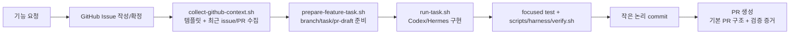

# GJLearn 작업 자동화 하네스

## 목적

이 하네스는 금정야학 백엔드에서 반복되는 기능 구현, 모니터링, 동기화, 문서화 작업을 `issue -> branch -> implementation -> commit -> PR` 흐름으로 고정하고, LLM 실행의 프롬프트와 결과를 artifact로 남기기 위한 repo-local 계약이다.

LLM Wiki의 `Codex Harness Engineering`, `Codex 기반 Agent Harness Engineering 리서치`, `SW Maestro Harness Research`를 기준으로 한다. 핵심은 역할형 subagent tree가 아니라 다음 네 단위다.

```text
task  = 한 이슈 또는 PR에 대응하는 작업 계약
turn  = Codex/Hermes 실행 단위
check = 검증 명령과 결과 판정 단위
retry = 실패 로그를 먹인 복구 loop
```

## 역할 분리

| 역할 | 책임 | 금지/주의 |
| --- | --- | --- |
| Hermes | 위키/프로젝트 맥락 검색, issue/branch/PR lifecycle, 최종 검증, 사용자 보고 | Codex self-report만 믿고 완료 처리하지 않음 |
| Codex | repo-local 구현/리뷰/수정 제안, bounded diff 생성 | secrets, deploy, destructive command 직접 실행 금지 |
| Harness scripts | prompt/result capture, 검증 실행, diff summary, artifact 정리 | 자동 merge/deploy 금지 |
| Human reviewer | 범위 승인, PR review, 배포 승인 | 검증 로그 없이 approve하지 않음 |

## 표준 플로우

1. 이슈 생성
   - GitHub issue에 배경, 요구사항, 수용 기준, 범위 밖을 적는다.
   - 이슈 번호는 branch/task/run artifact에 포함한다.
2. 브랜치 생성
   - `feature/<issue-number>-<short-topic>` 형식을 사용한다.
   - 기존 dirty tree는 먼저 `git diff --stat`으로 확인한다.
3. Task packet 작성
   - `harness/tasks/*.template.md`를 복사해 작업별 task file을 만든다.
   - Read first, Modify, Constraints, Acceptance, Verification을 반드시 채운다.
4. 실행
   - `scripts/harness/run-task.sh <task-file>`로 Codex one-shot turn을 실행한다.
   - Codex가 없거나 실행 전 점검만 할 때는 `scripts/harness/run-task.sh --dry-run <task-file>`을 쓴다.
5. Hook 모니터링
   - runner는 prompt 생성, Codex 결과, 검증 결과, diff summary 생성 시점마다 `scripts/harness/monitor-hook.sh`를 호출한다.
   - hook은 `harness/runs/<run-id>/monitor.jsonl`에 파일 경로, 크기, sha256, status를 남긴다.
6. 검증
   - `scripts/harness/verify.sh`가 `git diff --check`, shell syntax, JSON schema parse, Gradle test를 실행한다.
   - 실패하면 실패 로그를 artifact에 남기고 retry turn에 넣는다.
7. Commit
   - 변경을 작은 논리 단위로 stage한다.
   - 커밋 본문에는 무엇을 바꿨는지, 왜 묶었는지, 검증 결과를 적는다.
8. PR
   - PR 본문에는 issue link, 변경 요약, 검증 증거, 남은 blocker를 포함한다.
   - PR 생성 후 URL과 실제 검증 명령 결과를 보고한다.

## 기능 요청 자동화 플로우

기능 요청이 들어오면 기존 issue/PR 양식을 먼저 수집하고, 그 결과를 task prompt에 넣어 구현/PR 문체가 저장소 관행에서 벗어나지 않게 한다.



권장 명령:

```bash
# 기존 GitHub issue를 기준으로 branch/task/pr draft 준비
scripts/harness/prepare-feature-task.sh --issue 161

# Codex 실행 전 prompt와 GitHub context artifact만 확인
scripts/harness/run-task.sh --dry-run harness/tasks/issue-161-feature-task.md

# PR 본문 초안만 재생성
scripts/harness/draft-pr-body.sh 161 > /tmp/pr-161.md
```

시동어는 `harness/startup-words.md`를 따른다. `/plan`은 issue 수준 요구사항 구체화만 수행하고, `implement /goal ...` 또는 `implement --issue <number>`는 issue 확인, branch/task 준비, 구현, 검증, PR handoff까지 진행하는 구현 모드다.

자동화 원칙:

- issue 본문은 `.github/ISSUE_TEMPLATE`와 최근 issue를 참고해 기존 `기능 설명`, `배경`, `상세 요구사항`, `참고 자료`, `추가 정보` 구조를 유지한다.
- PR 본문은 최근 PR 관행에 맞춰 `개요`, `변경 유형`, `변경 내용`, `관련 이슈`, `스크린샷 (선택)`, `체크리스트`, `리뷰어에게`, `검증` 기본 구조를 유지한다.
- API/domain/data 흐름이 바뀌면 Mermaid `sequenceDiagram`, `erDiagram`, `classDiagram`, `flowchart` 중 필요한 것만 실제 변경 이름으로 추가한다.
- 구현 agent는 먼저 유사 controller/service/repository/DTO/test를 찾고, 기존 예외/권한/transaction convention을 따른다.
- commit/push/PR 생성은 실제 `git`/`gh` 출력으로 확인한다. 자동 merge/deploy는 하네스 범위 밖이다.

## Artifact 구조

`harness/runs/`는 `.gitignore` 대상이다. 실행 결과는 재현/리뷰용 로컬 evidence이며 secrets를 넣지 않는다.

하네스 설계 문서는 `harness/v1/{yyyy-mm-dd}/`, `harness/v2/{yyyy-mm-dd}/`처럼 버전 폴더 아래 날짜별로 누적한다. 현재 active baseline은 `harness/v1/2026-06-28/`이다. prompt recipe, workflow, folder structure, monitoring contract가 의미 있게 바뀌면 기존 문서를 덮어쓰지 말고 `harness/v2/{yyyy-mm-dd}/`를 추가한다.

```text
harness/
├── README.md
├── startup-words.md
├── v1/
│   └── 2026-06-28/
│       ├── README.md
│       ├── folder-structure.md
│       ├── workflow.md
│       ├── guide.md
│       ├── prompt-monitoring.md
│       └── prompts/
│           └── issue-branch-commit-pr.md
├── v2/
│   └── {yyyy-mm-dd}/
│       └── ...
├── prompts/
│   └── issue-branch-commit-pr.md
├── schemas/
│   └── task-result.schema.json
├── tasks/
│   └── monitoring-sync-docs-task.template.md
│   └── issue-<number>-feature-task.md
└── runs/
    └── <run-id>/
        ├── prompt.txt
        ├── events.jsonl
        ├── result.json
        ├── verify.log
        ├── verify-summary.txt
        ├── diff-summary.md
        └── monitor.jsonl
```

## Result envelope

Codex final output은 `harness/schemas/task-result.schema.json`을 따라야 한다. 최소 필드는 다음이다.

- `status`: `success`, `partial`, `blocked`, `failed`
- `summary`: 변경 요약
- `files_changed`: 변경 파일 목록
- `verification`: 실행한 검증 명령과 exit code
- `blockers`: 완료를 막는 문제
- `risks`: 리뷰어가 볼 위험
- `next_steps`: 후속 작업

## Hook 이벤트

| 이벤트 | 파일 | 의미 |
| --- | --- | --- |
| `task.input` | task file 또는 `user-input.md` | 사용자/태스크 입력 수집 상태 기록 |
| `prompt.rendered` | `prompt.txt` | task packet과 repo 규칙으로 실행 프롬프트 생성 |
| `github.context` | `github-context.md` | 로컬 템플릿과 최근 issue/PR 양식 수집 |
| `issue.snapshot` | `issue-<number>.json` | 구현 기준이 되는 GitHub issue 원문 저장 |
| `task.prepared` | `harness/tasks/issue-<number>-feature-task.md` | issue 기반 구현 task packet 생성 |
| `pr.drafted` | `pr-draft.md` | PR body 초안 생성 |
| `codex.finished` | `result.json` | Codex structured result 생성 |
| `verify.finished` | `verify-summary.txt` | runner 검증 결과 요약 |
| `diff.summarized` | `diff-summary.md` | PR handoff용 diff summary 생성 |

## 모니터링/동기화/문서화 작업 규칙

- `infra/monitoring` 변경은 홈랩 운영 경로 `/home/min/Infra/monitoring`와의 sync command를 문서에 함께 남긴다.
- 로그 정책 변경 시 로컬 파일 보관 레벨과 Cloud Logging/Alert 필터 레벨을 분리해서 설명한다.
- deploy script 변경 시 `bash -n`과 dry-run 가능한 경로를 우선 검증한다.
- GCE, Tailscale, GitHub secrets, 홈랩 서버 변경은 별도 승인 lane으로 둔다.
- PR에는 실제 실행한 검증 명령과 exit code를 적는다.

## 빠른 명령

```bash
# task prompt만 렌더링하고 hook artifact 생성
scripts/harness/run-task.sh --dry-run harness/tasks/monitoring-sync-docs-task.template.md

# 사용자 입력까지 로컬 artifact로 복사해서 수집
HARNESS_CAPTURE_INPUT=full scripts/harness/run-task.sh --dry-run harness/tasks/monitoring-sync-docs-task.template.md

# repo 검증
scripts/harness/verify.sh

# 현재 diff 요약
scripts/harness/summarize-diff.sh
```
