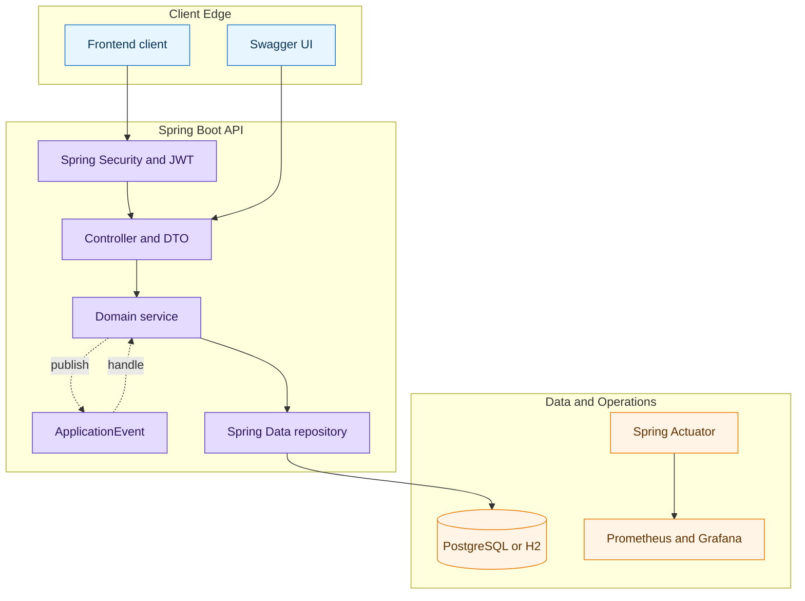
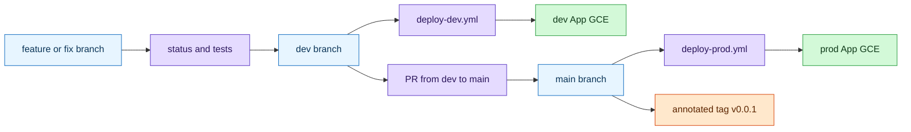

# 금정야학 API

금정열린배움터 교육 봉사 관리 시스템 백엔드 API입니다. 수업 일정, 출석, 요청 처리, 자료/게시글, 사용자 권한을 Spring Boot 기반으로 제공합니다.

## Quick Start

```bash
cp .env-example .env
./gradlew test
./gradlew bootRun
```

- Java 21+
- 로컬 테스트 DB: H2
- dev/prod DB: PostgreSQL
- Swagger UI: `http://localhost:8080/swagger-ui.html`

로컬에서 앱과 PostgreSQL을 함께 띄울 때:

```bash
make up-local
make logs-local
make down-local
```

## Architecture



```text
src/main/java/geumjeongyahak/
├── common/          # advice, config, event, exception, security, validation
└── domain/          # auth, users, classroom, student, subject, lesson, request...
```

도메인 간 직접 호출은 피하고 Spring `ApplicationEvent`로 통신합니다.

## Docs

- [Docs index](docs/README.md)
- [PRD](docs/prd.md)
- [Tech spec](docs/tech_spec.md)
- [Data model](docs/data_model.md)
- [API docs](docs/api/README.md)
- [API guide](docs/api-spec/api_spec.md)
- [Error codes](docs/error_codes.md)
- [Deployment runbook](docs/deployment/deploy.md)

## Deployment

dev/prod 배포는 GCE App VM + DB VM 구성입니다. App VM은 Spring Boot `bootJar` + systemd, DB VM은 apt PostgreSQL + systemd를 사용합니다. 운영 상세 절차는 [deploy runbook](docs/deployment/deploy.md)을 기준으로 합니다.



v0.0.1 릴리스 흐름:

```bash
git status --short
./gradlew test
git push origin dev
# open PR: dev -> main, merge after review
git checkout main
git pull --ff-only
git tag -a v0.0.1 -m "v0.0.1"
git push origin v0.0.1
```

문서만 바뀐 PR은 `./gradlew test`를 명시적으로 생략할 수 있습니다. 링크/참조 확인은 아래 명령을 사용합니다.
삭제된 legacy 문서, root 배포 문서, harness 경로를 가리키는 링크가 남지 않았는지 확인합니다.
