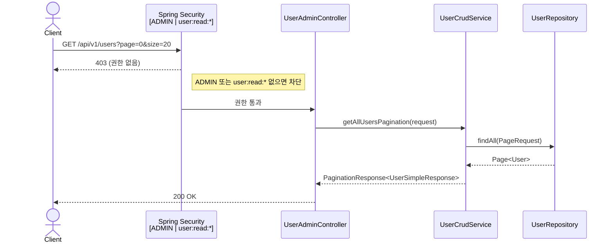
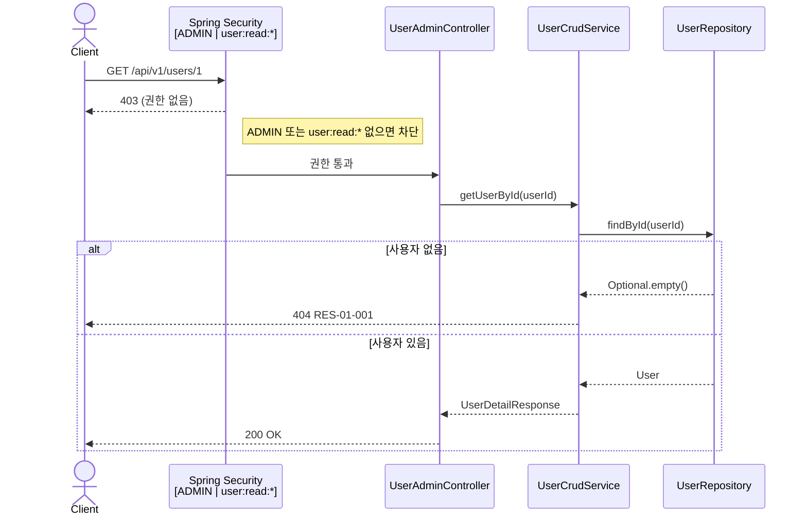
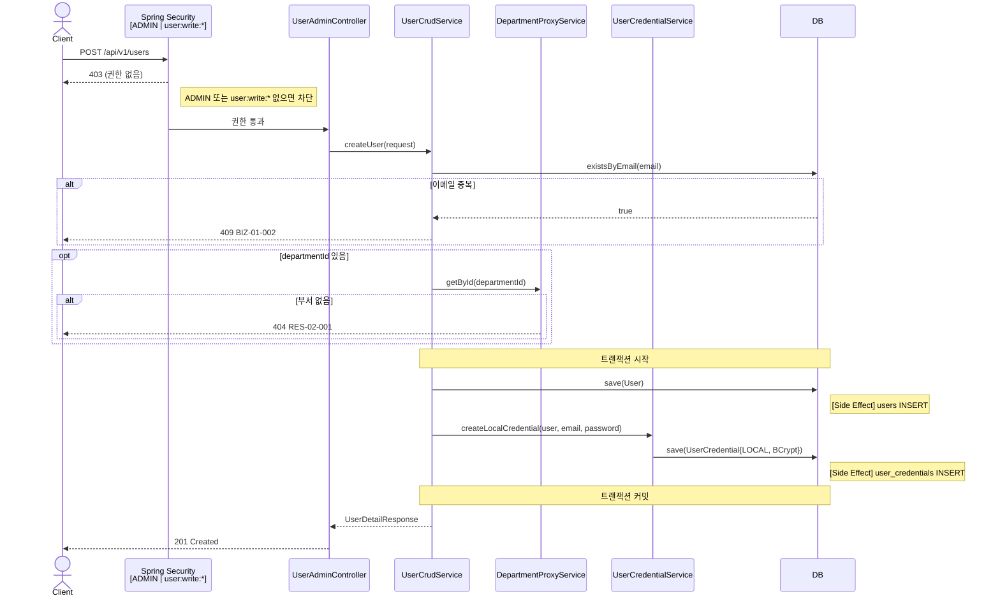
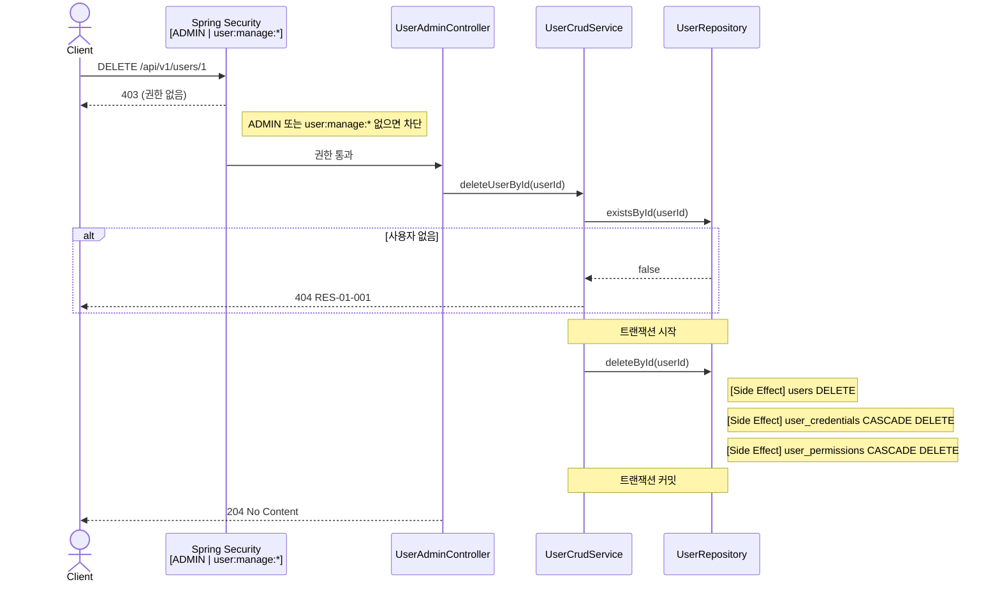
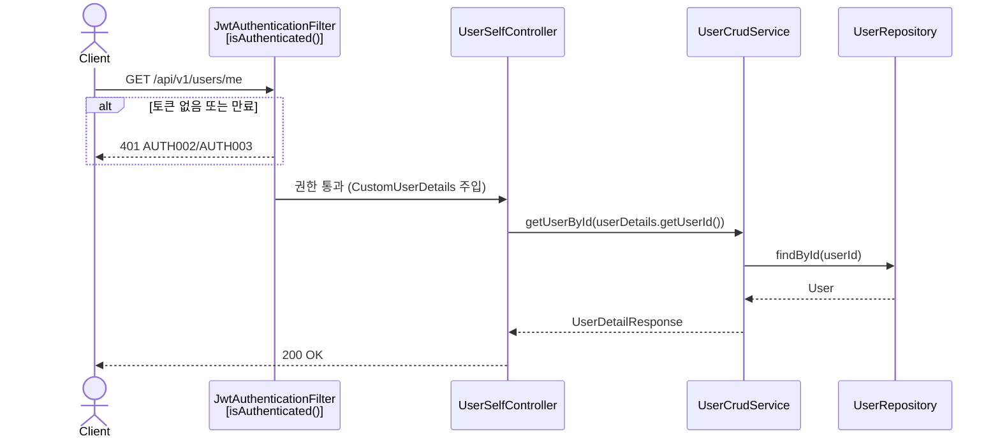
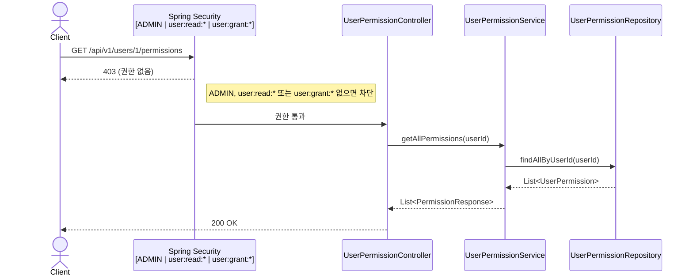
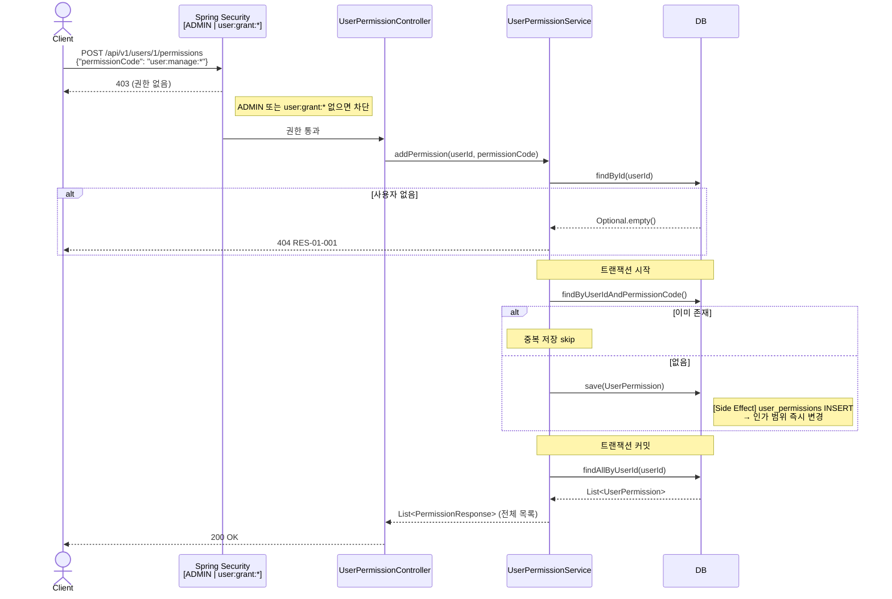
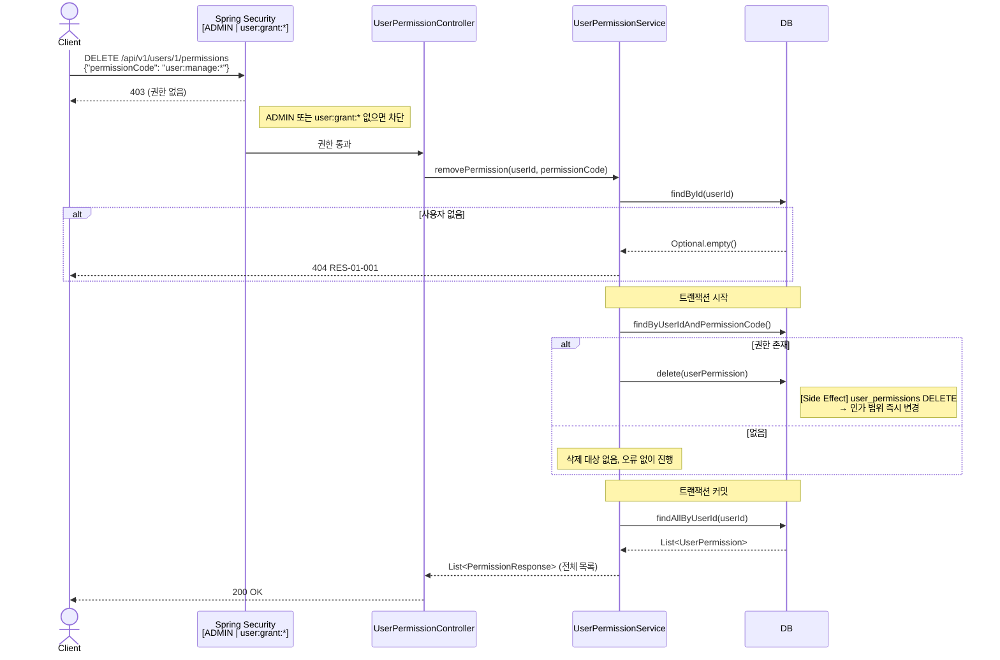

# User Domain 개요

> 세부 스키마: [API.md](./API.md) · [Permissions.md](./Permissions.md)

---

## 전체 API 목록

| # | Method | URL | 권한 | 응답 코드 |
|---|--------|-----|------|---------|
| 1 | GET | `/api/v1/users` | `ADMIN` \| `user:read:*` | 200 |
| 2 | GET | `/api/v1/users/{userId}` | `ADMIN` \| `user:read:*` | 200 |
| 3 | POST | `/api/v1/users` | `ADMIN` \| `user:write:*` | 201 |
| 4 | PATCH | `/api/v1/users/{userId}` | `ADMIN` \| `user:manage:*` | 200 |
| 5 | DELETE | `/api/v1/users/{userId}` | `ADMIN` \| `user:manage:*` | 204 |
| 6 | GET | `/api/v1/users/me` | 인증만 | 200 |
| 7 | PATCH | `/api/v1/users/me` | 인증만 | 200 |
| 8 | GET | `/api/v1/users/{userId}/permissions` | `ADMIN` \| `user:read:*` \| `user:grant:*` | 200 |
| 9 | POST | `/api/v1/users/{userId}/permissions` | `ADMIN` \| `user:grant:*` | 200 |
| 10 | DELETE | `/api/v1/users/{userId}/permissions` | `ADMIN` \| `user:grant:*` | 200 |

---

## 1. 사용자 목록 조회 `GET /api/v1/users`

**권한** `ADMIN` | `user:read:*`  
**특이점** `UserSimpleResponse` 반환 — `permissions`, `createdAt`, `updatedAt` 미포함

#### Request — Query Parameters

| 필드 | 타입 | 필수 | 기본값 | 제약 | 설명 |
|------|------|:----:|--------|------|------|
| `page` | integer | N | `0` | ≥ 0 | 페이지 번호 (0-based) |
| `size` | integer | N | `10` | 1 ~ 100 | 페이지당 항목 수 |

#### Response `200 OK` — `PaginationResponse<UserSimpleResponse>`

| 필드 | 타입 | Nullable | 설명 |
|------|------|:--------:|------|
| `content` | `UserSimpleResponse[]` | N | 사용자 목록 |
| `totalElements` | integer | N | 전체 항목 수 |
| `totalPages` | integer | N | 전체 페이지 수 |
| `size` | integer | N | 요청한 페이지 크기 |
| `number` | integer | N | 현재 페이지 번호 |

**UserSimpleResponse**

| 필드 | 타입 | Nullable | 설명 |
|------|------|:--------:|------|
| `id` | Long | N | 사용자 ID |
| `name` | string | N | 이름 |
| `email` | string | N | 기본 이메일 |
| `phoneNumber` | string | Y | 전화번호 |
| `role` | string | N | 기본 역할 (`ADMIN` \| `MANAGER` \| `VOLUNTEER` \| `GUEST`) |
| `departmentId` | Long | Y | 소속 부서 ID |



---

## 2. 사용자 상세 조회 `GET /api/v1/users/{userId}`

**권한** `ADMIN` | `user:read:*`  
**특이점** 직접 권한(`MANUAL`)과 부서 직책 권한(`MEMBER`, `MANAGER`)을 합산한 `permissions` 포함

#### Request — Path Parameters

| 필드 | 타입 | 필수 | 설명 |
|------|------|:----:|------|
| `userId` | Long | **Y** | 사용자 ID |

#### Response `200 OK` — `UserDetailResponse`

| 필드 | 타입 | Nullable | 설명 |
|------|------|:--------:|------|
| `id` | Long | N | 사용자 ID |
| `name` | string | N | 이름 |
| `email` | string | N | 기본 이메일 |
| `phoneNumber` | string | Y | 전화번호 |
| `role` | string | N | 기본 역할 |
| `department` | `DepartmentSimpleResponse` | Y | 소속 부서. 없거나 교원 해제 상태이면 null |
| `classroom` | `ClassroomSummaryResponse` | Y | 배정 분반. 없거나 교원 해제 상태이면 null |
| `teacherStartAt` | date | Y | 교원 활동 시작일 |
| `teacherEndAt` | date | Y | 교원 활동 종료일. 교원 해제 시 처리일로 설정 |
| `permissions` | `PermissionResponse[]` | N | 직접 권한과 부서 직책 권한 목록 |
| `createdAt` | datetime | N | 계정 생성 일시 (ISO 8601) |
| `updatedAt` | datetime | N | 마지막 수정 일시 (ISO 8601) |

**PermissionResponse**

| 필드 | 타입 | Nullable | 설명 |
|------|------|:--------:|------|
| `name` | string | N | 권한 표시명 (현재 code와 동일) |
| `code` | string | N | 권한 코드 (예: `user:manage:*`) |
| `source` | string | Y | 권한 출처 (`MANUAL`, `MEMBER`, `MANAGER`) |



---

## 3. 사용자 생성 `POST /api/v1/users`

**권한** `ADMIN` | `user:write:*`
**특이점** `users` 저장과 `user_credentials(LOCAL)` 생성이 단일 트랜잭션

#### Request — Body

| 필드 | 타입 | 필수 | 제약 | 설명 |
|------|------|:----:|------|------|
| `email` | string | **Y** | 이메일 형식, 중복 불가 | 로그인용 이메일 |
| `name` | string | **Y** | 최대 50자 | 실명 또는 관리용 이름 |
| `password` | string | **Y** | 최소 8자 | 초기 로그인 비밀번호 |
| `phoneNumber` | string | N | 전화번호 형식 | 연락처 |
| `role` | string | N | `ADMIN` \| `MANAGER` \| `VOLUNTEER` \| `GUEST` | 기본 역할. 미입력 시 `VOLUNTEER` |
| `departmentId` | Long | N | 존재하는 부서 ID | 초기 소속 부서 |

#### Response `201 Created` — `UserDetailResponse`

2번 상세 조회 응답과 동일한 구조



---

## 4. 사용자 수정 (관리자) `PATCH /api/v1/users/{userId}`

**권한** `ADMIN` | `user:manage:*`  
**특이점** 전달한 필드만 반영. `email`/`password` 변경 시 `user_credentials`도 함께 갱신. `role` 변경은 다음 토큰 발급 시점부터 반영
`role`을 `GUEST`로 변경하면 교원 해제로 처리하며 소속 부서, 배정 분반, 직접 권한을 함께 정리

#### Request — Path Parameters

| 필드 | 타입 | 필수 | 설명 |
|------|------|:----:|------|
| `userId` | Long | **Y** | 사용자 ID |

#### Request — Body (모든 필드 선택, 전달한 필드만 반영)

| 필드 | 타입 | 필수 | 제약 | 설명 |
|------|------|:----:|------|------|
| `name` | string | N | 최대 50자 | 이름 |
| `phoneNumber` | string | N | 전화번호 형식 | 연락처 |
| `email` | string | N | 이메일 형식, 중복 불가 | 로그인 이메일. 변경 시 credential도 갱신 |
| `password` | string | N | 최소 8자 | 비밀번호. 변경 시 BCrypt 해시 갱신 |
| `role` | string | N | `ADMIN` \| `MANAGER` \| `VOLUNTEER` \| `GUEST` | 기본 역할 |
| `departmentId` | Long | N | 존재하는 부서 ID | 소속 부서 |

> `role=GUEST`는 교원 해제 동작입니다. 소속 부서와 배정 분반을 비우고, `teacherEndAt`을 처리일로 설정하며, `user_permissions`의 직접 권한을 모두 삭제합니다.
> 같은 요청에 `departmentId`나 `classroomId`가 포함되어도 교원 해제 시에는 소속/분반을 다시 설정하지 않습니다.

#### Response `200 OK` — `UserDetailResponse`

2번 상세 조회 응답과 동일한 구조

```mermaid
sequenceDiagram
    actor Client
    participant Security as Spring Security<br/>[ADMIN | user:manage:*]
    participant Controller as UserAdminController
    participant Service as UserCrudService
    participant CredSvc as UserCredentialService
    participant DB as DB

    Client->>Security: PATCH /api/v1/users/1
    Security-->>Client: 403 (권한 없음)
    note right of Security: ADMIN 또는 user:manage:* 없으면 차단

    Security->>Controller: 권한 통과
    Controller->>Service: updateUser(userId, request)
    Service->>DB: findById(userId)
    alt 사용자 없음
        DB-->>Service: Optional.empty()
        Service-->>Client: 404 RES-01-001
    end

    note over Service,DB: 트랜잭션 시작

        Service->>DB: existsByEmail(newEmail)
        alt 중복
            Service-->>Client: 409 BIZ-01-001
        end
        Service->>Service: user.setEmail()
    end

    opt email 변경
        Service->>DB: existsByEmail(newEmail)
        alt 중복
            Service-->>Client: 409 BIZ-01-002
        end
        Service->>Service: user.setEmail()
        Service->>CredSvc: updateLocalCredentialEmail(user, newEmail)
        note right of DB: [Side Effect] user_credentials.credential_email 변경
    end

    opt password 변경
        Service->>CredSvc: updateLocalPassword(user, BCrypt(pw))
        note right of DB: [Side Effect] user_credentials.password_hash 변경
    end

    opt role 변경
        Service->>Service: user.setRole()
        note right of Service: 인가 범위 변경 (다음 토큰 발급부터 반영)
    end

    opt role=GUEST 변경
        Service->>Service: releaseTeacherProfile(today)
        Service->>DB: user_permissions 전체 삭제
        note right of Service: [Side Effect] 소속 부서/분반 제거<br/>teacherEndAt 처리일 설정<br/>직접 권한 전체 회수
    end

    opt departmentId 변경
        Service->>Service: user.setDepartment()
        note right of Service: 부서 권한 세트 변경
    end

    note right of DB: [Side Effect] users UPDATE (Dirty Checking)
    note over Service,DB: 트랜잭션 커밋

    Service-->>Controller: UserDetailResponse
    Controller-->>Client: 200 OK
```

---

## 5. 사용자 삭제 `DELETE /api/v1/users/{userId}`

**권한** `ADMIN` | `user:manage:*`  
**특이점** 하드 삭제. CASCADE로 `user_credentials`, `user_permissions` 함께 삭제되며 복구 불가

#### Request — Path Parameters

| 필드 | 타입 | 필수 | 설명 |
|------|------|:----:|------|
| `userId` | Long | **Y** | 사용자 ID |

#### Response `204 No Content`

응답 바디 없음



---

## 6. 본인 조회 `GET /api/v1/users/me`

**권한** 인증만 (`isAuthenticated()`) — permission code 불필요  
**특이점** JWT에서 추출한 userId로 조회. `user:read:*` 없어도 본인 정보는 항상 접근 가능

#### Request

요청 바디 없음. JWT에서 사용자 식별

#### Response `200 OK` — `UserDetailResponse`

2번 상세 조회 응답과 동일한 구조



---

## 7. 본인 수정 `PATCH /api/v1/users/me`

**권한** 인증만 (`isAuthenticated()`)  
**특이점** `role`, `departmentId`는 `UpdateSelfRequest` 타입에 필드 자체가 없어 변경 불가

#### Request — Body (모든 필드 선택, 전달한 필드만 반영)

| 필드 | 타입 | 필수 | 제약 | 설명 |
|------|------|:----:|------|------|
| `name` | string | N | 최대 50자 | 이름 |
| `phoneNumber` | string | N | 전화번호 형식 | 연락처 |
| `email` | string | N | 이메일 형식, 중복 불가 | 로그인 이메일. 변경 시 credential도 갱신 |
| `password` | string | N | 최소 8자 | 비밀번호. 변경 시 BCrypt 해시 갱신 |

> `role`, `departmentId`는 본인 수정에서 제공되지 않습니다.

#### Response `200 OK` — `UserDetailResponse`

2번 상세 조회 응답과 동일한 구조

```mermaid
sequenceDiagram
    actor Client
    participant JWT as JwtAuthenticationFilter<br/>[isAuthenticated()]
    participant Controller as UserSelfController
    participant Service as UserCrudService
    participant CredSvc as UserCredentialService
    participant DB as DB

    Client->>JWT: PATCH /api/v1/users/me
    alt 토큰 없음 또는 만료
        JWT-->>Client: 401 AUTH002/AUTH003
    end

    JWT->>Controller: 권한 통과 (CustomUserDetails 주입)
    Controller->>Service: updateUser(userId, UpdateSelfRequest)
    note over Service: role=empty, departmentId=empty 고정<br/>(UpdateSelfRequest 타입으로 변경 차단)

    Service->>DB: findById(userId)
    DB-->>Service: User

    note over Service,DB: 트랜잭션 시작

        Service->>DB: existsByEmail()
        alt 중복
            Service-->>Client: 409 BIZ-01-001
        end
    end

    opt email 변경
        Service->>DB: existsByEmail()
        alt 중복
            Service-->>Client: 409 BIZ-01-002
        end
        Service->>CredSvc: updateLocalCredentialEmail()
        note right of DB: [Side Effect] user_credentials.credential_email 변경
    end

    opt password 변경
        Service->>CredSvc: updateLocalPassword()
        note right of DB: [Side Effect] user_credentials.password_hash 변경
    end

    note right of DB: [Side Effect] users UPDATE (Dirty Checking)
    note over Service,DB: 트랜잭션 커밋

    Service-->>Controller: UserDetailResponse
    Controller-->>Client: 200 OK
```

---

## 8. 사용자 권한 목록 조회 `GET /api/v1/users/{userId}/permissions`

**권한** `ADMIN` | `user:read:*` | `user:grant:*`
**특이점** `user_permissions`에 저장된 직접 권한만 반환. role 기반 권한(`ROLE_ADMIN` 등)과 부서 직책 권한은 미포함

#### Request — Path Parameters

| 필드 | 타입 | 필수 | 설명 |
|------|------|:----:|------|
| `userId` | Long | **Y** | 사용자 ID |

#### Response `200 OK` — `List<PermissionResponse>`

| 필드 | 타입 | Nullable | 설명 |
|------|------|:--------:|------|
| `name` | string | N | 권한 표시명 (현재 code와 동일) |
| `code` | string | N | 권한 코드 (예: `user:manage:*`) |
| `source` | string | N | 직접 권한 출처 (`MANUAL`) |



---

## 9. 사용자 권한 추가 `POST /api/v1/users/{userId}/permissions`

**권한** `ADMIN` | `user:grant:*`
**특이점** 동일 코드 이미 존재 시 저장 없이 현재 목록 반환 (멱등). 추가 후 **갱신된 전체 목록** 반환

#### Request — Path Parameters

| 필드 | 타입 | 필수 | 설명 |
|------|------|:----:|------|
| `userId` | Long | **Y** | 사용자 ID |

#### Request — Body

| 필드 | 타입 | 필수 | 제약 | 설명 |
|------|------|:----:|------|------|
| `permissionCode` | string | **Y** | PermissionRegistry 허용 형식 | 추가할 권한 코드 (예: `user:manage:*`) |

#### Response `200 OK` — `List<PermissionResponse>`

8번 권한 목록 조회 응답과 동일한 구조 (갱신된 전체 목록)



---

## 10. 사용자 권한 제거 `DELETE /api/v1/users/{userId}/permissions`

**권한** `ADMIN` | `user:grant:*`
**특이점** 존재하지 않는 코드 제거는 오류 없이 무시 (멱등). `DELETE`임에도 `@RequestBody`로 permissionCode 수신

#### Request — Path Parameters

| 필드 | 타입 | 필수 | 설명 |
|------|------|:----:|------|
| `userId` | Long | **Y** | 사용자 ID |

#### Request — Body

| 필드 | 타입 | 필수 | 제약 | 설명 |
|------|------|:----:|------|------|
| `permissionCode` | string | **Y** | PermissionRegistry 허용 형식 | 제거할 권한 코드 (예: `user:manage:*`) |

#### Response `200 OK` — `List<PermissionResponse>`

8번 권한 목록 조회 응답과 동일한 구조 (갱신된 전체 목록)


