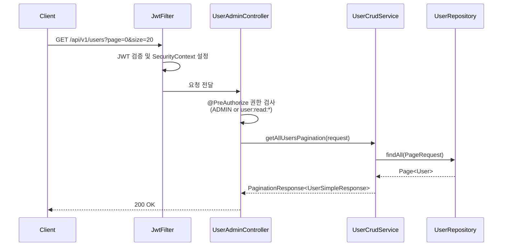
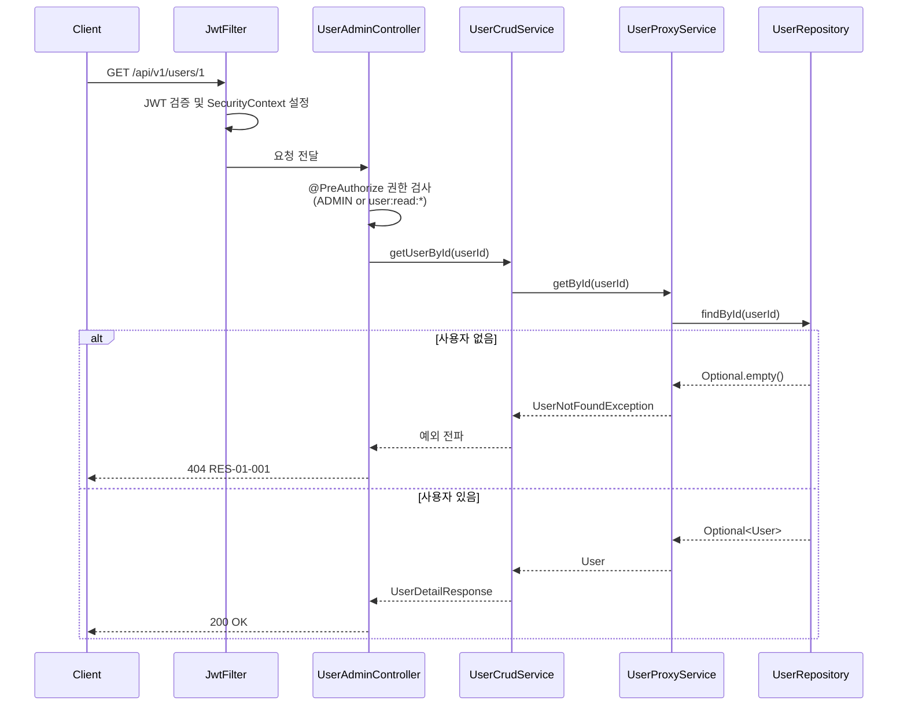
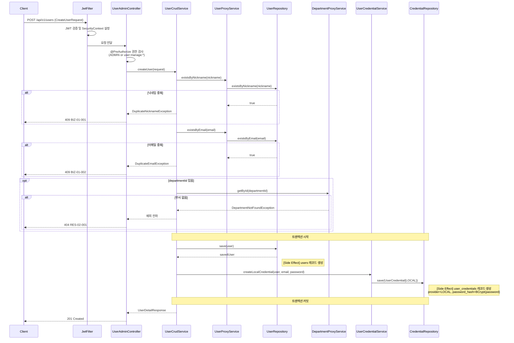
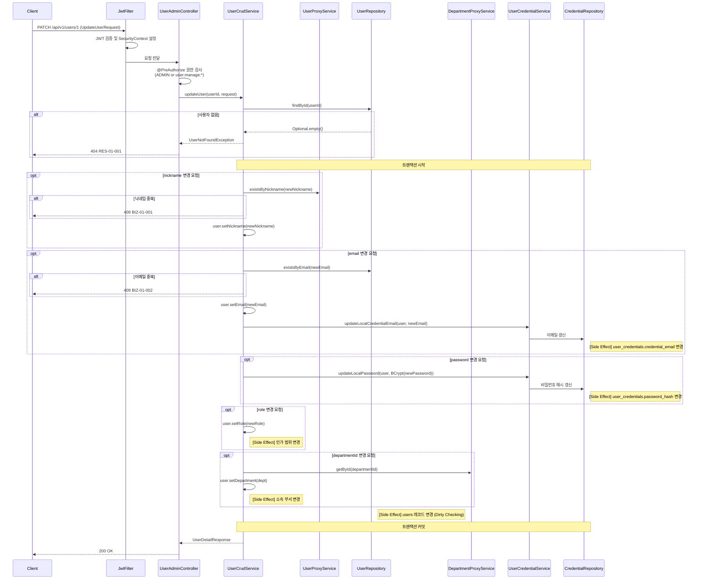
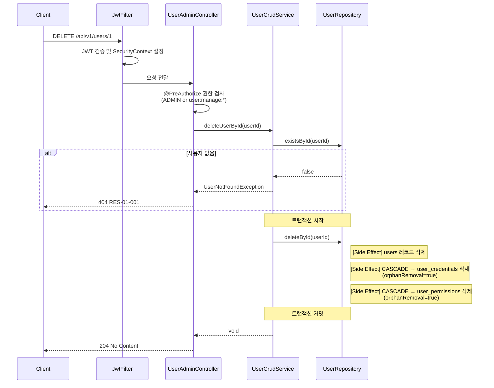
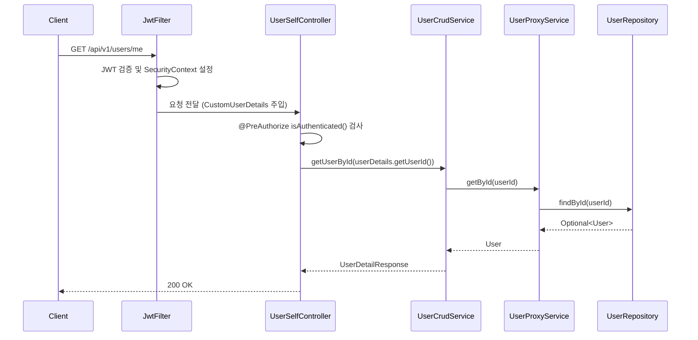
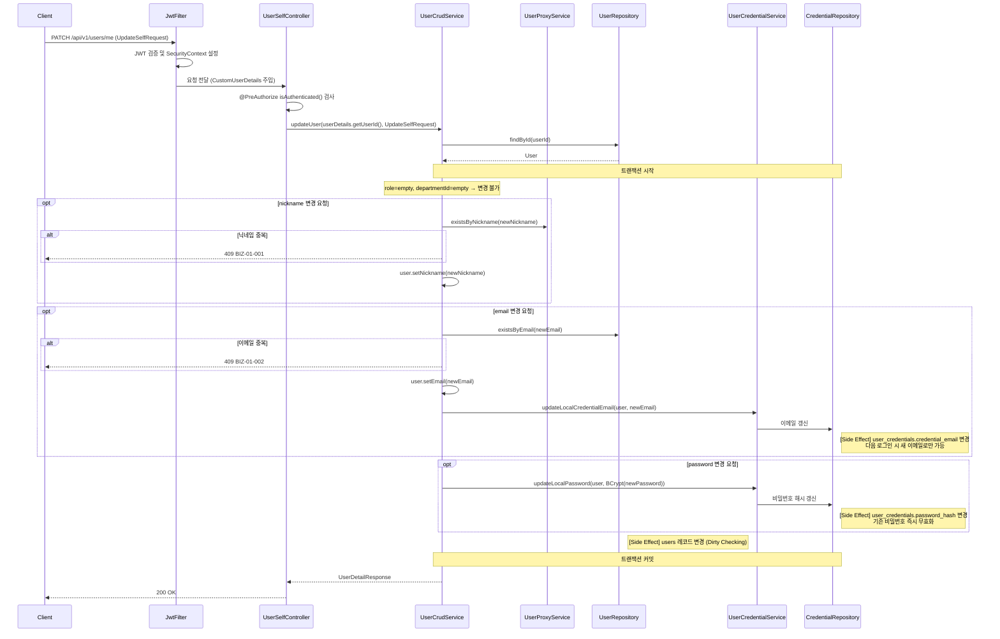
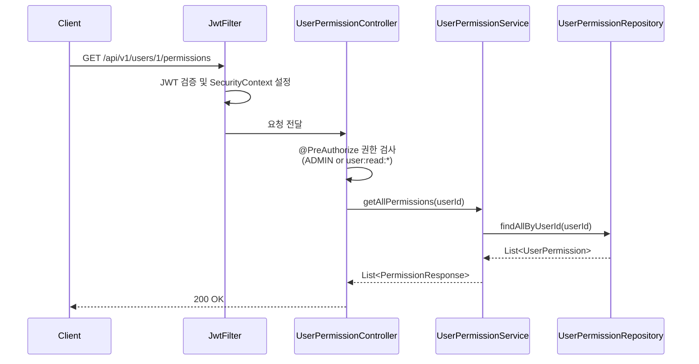
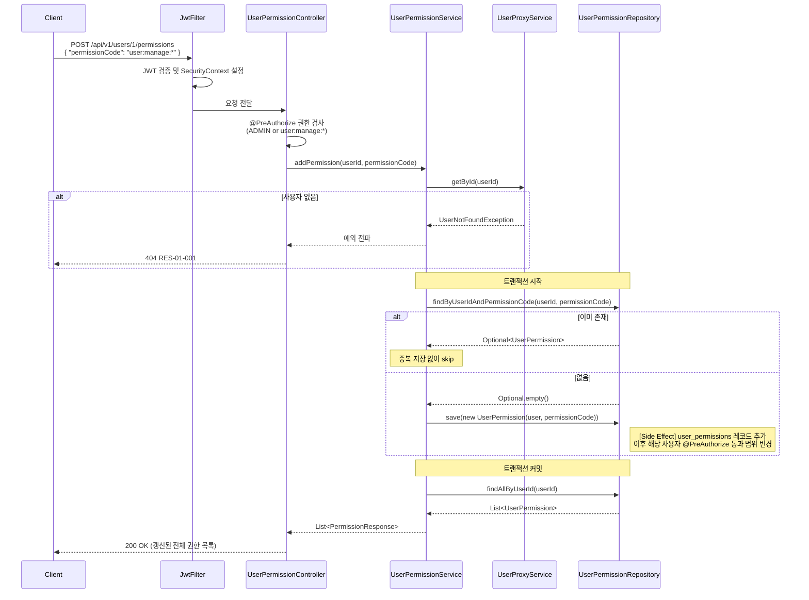
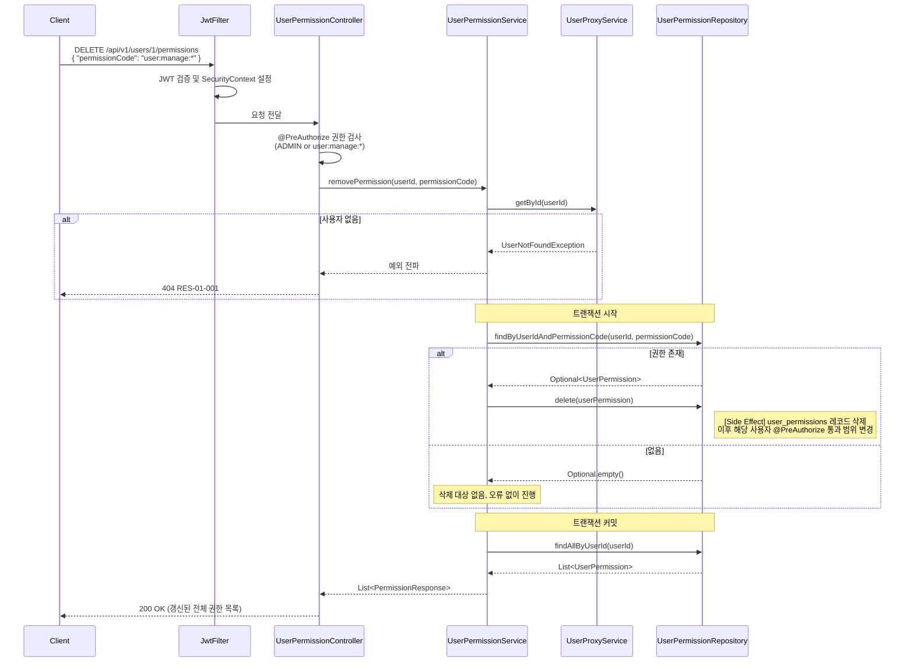

# User Domain Sequence Diagrams

각 API의 처리 흐름과 side effect를 포함한 시퀀스 다이어그램입니다.

---

## 1. 사용자 목록 조회 `GET /api/v1/users`

읽기 전용. DB 변경 없음.

---

## 2. 사용자 상세 조회 `GET /api/v1/users/{userId}`

읽기 전용. DB 변경 없음.

---

## 3. 사용자 생성 `POST /api/v1/users`

**Side Effect**: `users` 저장 + `user_credentials` (LOCAL) 생성

---

## 4. 사용자 수정 - 관리자 `PATCH /api/v1/users/{userId}`

**Side Effect**: `users` 변경, 이메일/비밀번호 변경 시 `user_credentials` 함께 갱신

---

## 5. 사용자 삭제 `DELETE /api/v1/users/{userId}`

**Side Effect**: `users` 삭제 + CASCADE로 `user_credentials`, `user_permissions` 삭제

---

## 6. 본인 조회 `GET /api/v1/users/me`

읽기 전용. DB 변경 없음.

---

## 7. 본인 수정 `PATCH /api/v1/users/me`

**Side Effect**: `users` 변경, 이메일/비밀번호 변경 시 `user_credentials` 함께 갱신  
`role`, `departmentId`는 변경 불가 (UpdateSelfRequest에서 제외됨)

---

## 8. 권한 목록 조회 `GET /api/v1/users/{userId}/permissions`

읽기 전용. DB 변경 없음.

---

## 9. 권한 추가 `POST /api/v1/users/{userId}/permissions`

**Side Effect**: `user_permissions` 레코드 추가 (이미 존재하면 무시)  
이후 해당 사용자의 인가 결과에 즉시 영향

---

## 10. 권한 제거 `DELETE /api/v1/users/{userId}/permissions`

**Side Effect**: `user_permissions` 레코드 삭제 (없으면 무시)  
이후 해당 사용자의 인가 결과에 즉시 영향

