# Docs Guide

금정야학 백엔드 문서의 단일 목차입니다.

```mermaid
flowchart TB
    Docs["Docs Guide"] --> Product["Product and design"]
    Docs --> Api["API reference"]
    Docs --> Ops["Operations and deployment"]
    Docs --> Records["Conventions and records"]

    Product --> PRD["prd.md"]
    Product --> Tech["tech_spec.md"]
    Product --> Data["data_model.md"]

    Api --> ApiGuide["api-spec/api_spec.md"]
    Api --> ApiDocs["api/*.md"]
    Api --> Errors["error_codes.md"]

    Ops --> Deploy["deployment/deploy.md"]
    Ops --> Gcloud["deployment/gcloud-provisioning.md"]
    Ops --> Tailscale["deployment/tailscale-observability-deploy.md"]
    Ops --> Flyway["deployment/gce-postgres-flyway.md"]

    Records --> Convention["convention/convention.md"]
    Records --> Issue["issue/"]

    classDef root fill:#e7f5ff,stroke:#1971c2,color:#0b3558
    classDef group fill:#e5dbff,stroke:#5f3dc4,color:#2b165c
    classDef doc fill:#f8f9fa,stroke:#868e96,color:#212529
    class Docs root
    class Product,Api,Ops,Records group
    class PRD,Tech,Data,ApiGuide,ApiDocs,Errors,Deploy,Gcloud,Tailscale,Flyway,Convention,Issue doc
```

## 제품/설계

- [PRD](./prd.md): 제품 요구사항과 기능 우선순위
- [기술 명세서](./tech_spec.md): 아키텍처, 기술 스택, 구현 방향
- [데이터 모델](./data_model.md): 엔티티와 관계, DB 구조

## API

- [API 안내 문서](./api-spec/api_spec.md): 공통 응답 규칙과 참조 순서
- [도메인별 API 문서](./api/README.md): 엔드포인트, 권한, side effect, 실패 케이스
- [Error Codes](./error_codes.md): 공통/인증/도메인 에러 코드

## 운영/배포

- [배포 runbook](./deployment/deploy.md): GCE dev/prod 배포, GitHub Actions, v0.0.1 릴리스 흐름
- [GCP 인프라 구성](./deployment/gcloud-provisioning.md): gcloud 기반 App/DB/GCS 구성
- [Tailscale 관측성 연동](./deployment/tailscale-observability-deploy.md): 홈서버 Prometheus/Grafana 연동
- [GCE PostgreSQL/Flyway](./deployment/gce-postgres-flyway.md): DB 마이그레이션 운영 메모
- [E2E Testing Pipeline](./e2e-testing-pipeline.md): 테스트 파이프라인 설계 및 운영 메모

## 컨벤션/기록

- [Convention](./convention/convention.md): 개발 컨벤션
- [Issue 문서](./issue/): 개별 이슈 관련 메모

## 문서 원칙

- `docs/api-spec/api_spec.md`는 API 안내와 공통 규칙만 다룹니다.
- `docs/api/*.md`는 도메인별 REST 엔드포인트와 운영 규칙을 다룹니다.
- 에러 코드는 `docs/error_codes.md`를 단일 기준 문서로 사용합니다.
- 배포와 운영은 `docs/deployment/deploy.md`를 최상위 runbook으로 사용합니다.
- PR/Issue 문서는 제품 명세 문서 대신 작업 기록으로만 사용합니다.
