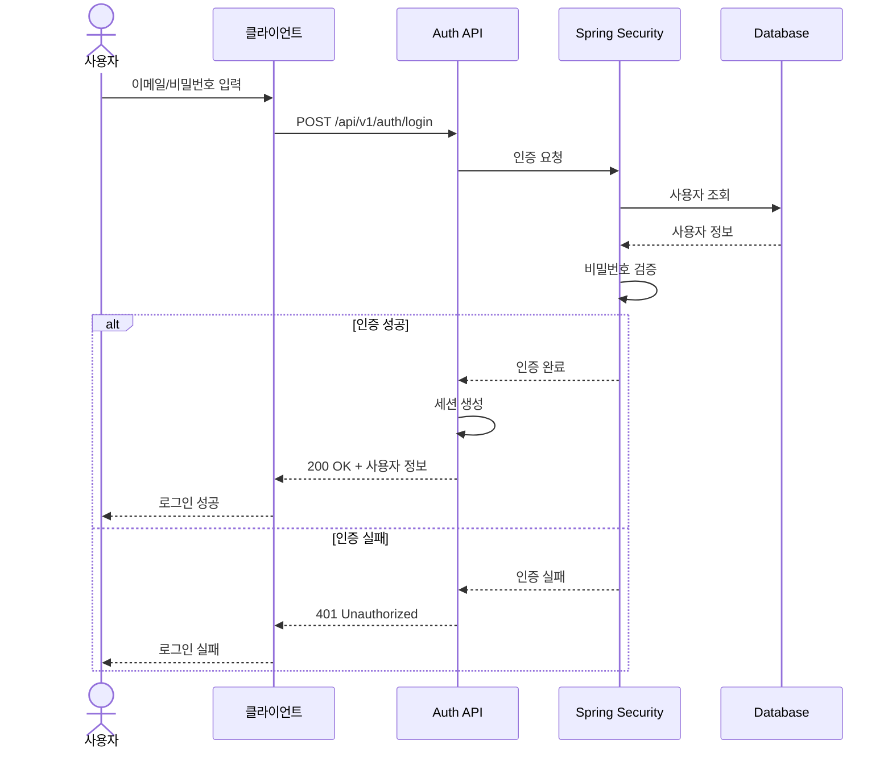
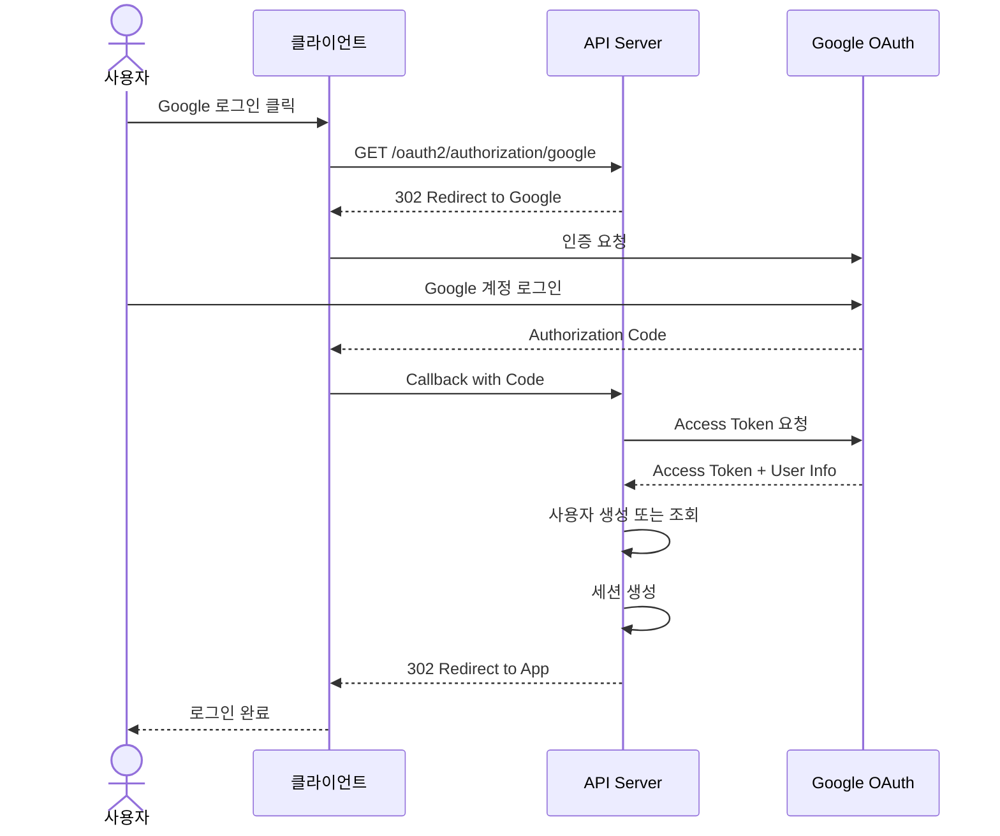
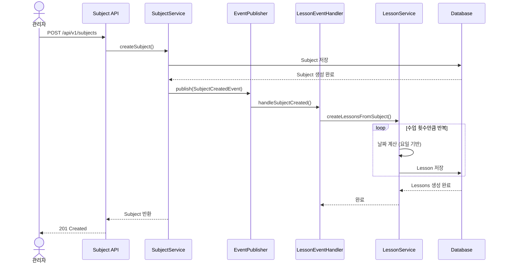
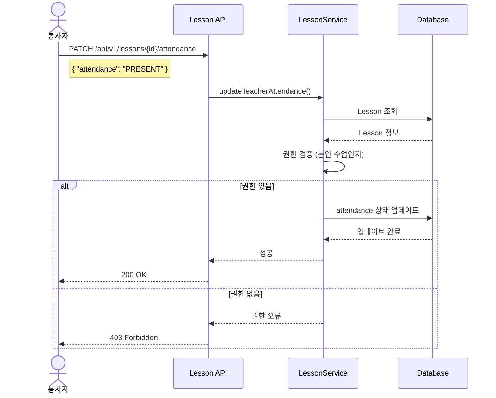
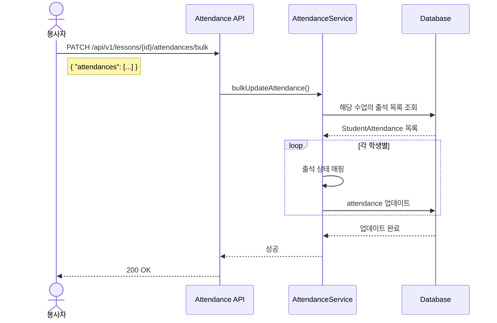
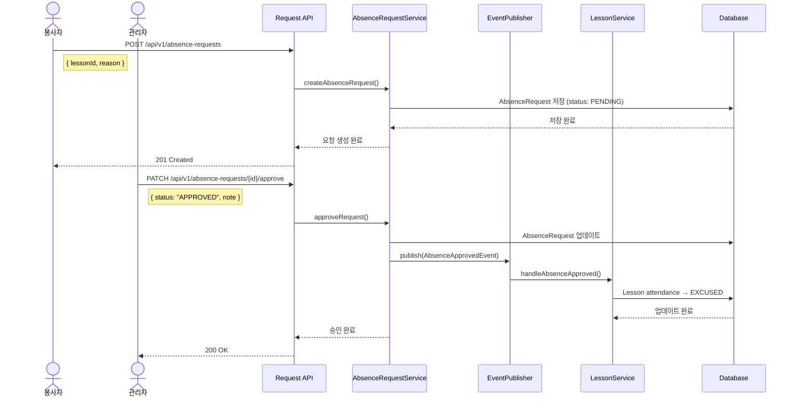
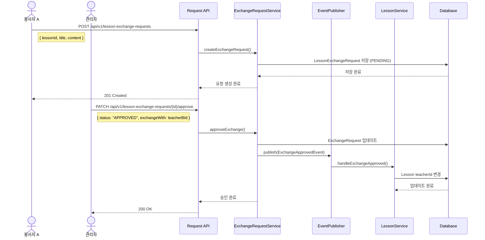
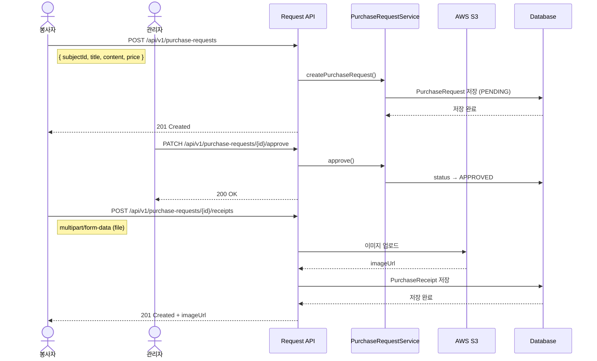
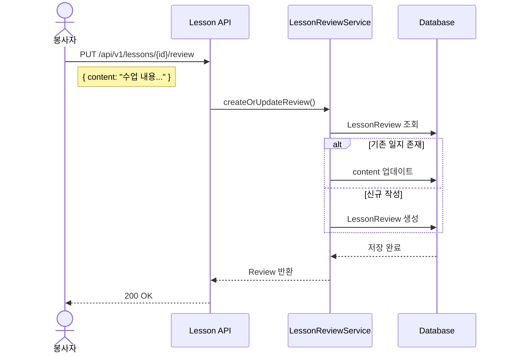

# 손모음 플랫폼 API 명세서

## 1. 개요

### 1.1 기본 정보

| 항목 | 값 |
|------|-----|
| Base URL | `/api/v1` |
| 인증 방식 | Session-based (Cookie) |
| Content-Type | `application/json` |
| API 문서 | Swagger UI (`/swagger-ui.html`) |

> **Note:** 상세 API 스펙(Request/Response, 파라미터 등)은 Swagger UI를 참조하세요.
> 이 문서는 도메인별 비즈니스 흐름을 시퀀스 다이어그램으로 설명합니다.

### 1.2 참조 문서

- [PRD](./prd.md)
- [기술 명세서](./tech_spec.md)
- [데이터 모델](./data_model.md)

---

## 2. 공통 규칙

### 2.1 응답 형식

```json
// 성공
{ "success": true, "data": { ... }, "error": null }

// 실패
{ "success": false, "data": null, "error": { "code": "ERROR_CODE", "message": "..." } }
```

### 2.2 인증 필요 API

- 대부분의 API는 로그인 세션 필요
- 미인증 시 `401 Unauthorized` 반환
- 권한 부족 시 `403 Forbidden` 반환

---

## 3. 도메인별 시퀀스 다이어그램

### 3.1 인증 (Authentication)

#### 로그인 플로우



#### OAuth2 소셜 로그인



---

### 3.2 과목/수업 생성 (Subject & Lesson)

#### 과목 생성 시 수업 자동 생성



---

### 3.3 출석 관리 (Attendance)

#### 교사 출석 체크



#### 학생 출석 일괄 체크



---

### 3.4 결석 요청 (Absence Request)

#### 결석 요청 및 승인 플로우



---

### 3.5 수업 교환 요청 (Lesson Exchange)

#### 수업 교환 요청 플로우



---

### 3.6 기자재 구입 요청 (Purchase Request)

#### 구입 요청 및 영수증 업로드



---

### 3.7 수업 일지 (Lesson Review)

#### 수업 일지 작성



---

## 4. API 엔드포인트 요약

> 상세 스펙은 Swagger UI (`/swagger-ui.html`) 참조

### 4.1 인증

| Method | Endpoint | 설명 |
|--------|----------|------|
| POST | `/api/v1/auth/login` | 로그인 |
| POST | `/api/v1/auth/logout` | 로그아웃 |
| GET | `/api/v1/auth/me` | 현재 사용자 조회 |

### 4.2 사용자

| Method | Endpoint | 설명 |
|--------|----------|------|
| GET | `/api/v1/users` | 목록 조회 (Admin) |
| GET | `/api/v1/users/{id}` | 상세 조회 |
| POST | `/api/v1/users` | 생성 (Admin) |
| PUT | `/api/v1/users/{id}` | 수정 |
| DELETE | `/api/v1/users/{id}` | 삭제 (Admin) |

### 4.3 분반/학생/과목

| Method | Endpoint | 설명 |
|--------|----------|------|
| CRUD | `/api/v1/classrooms/**` | 분반 관리 |
| CRUD | `/api/v1/students/**` | 학생 관리 |
| CRUD | `/api/v1/subjects/**` | 과목 관리 |

### 4.4 수업

| Method | Endpoint | 설명 |
|--------|----------|------|
| GET | `/api/v1/lessons` | 수업 목록 |
| GET | `/api/v1/lessons/my` | 내 수업 (캘린더) |
| GET | `/api/v1/lessons/{id}` | 수업 상세 |
| PATCH | `/api/v1/lessons/{id}/attendance` | 교사 출석 |
| GET | `/api/v1/lessons/{id}/attendances` | 학생 출석 목록 |
| PATCH | `/api/v1/lessons/{id}/attendances/bulk` | 학생 출석 일괄 |
| PUT | `/api/v1/lessons/{id}/review` | 수업 일지 |

### 4.5 요청

| Method | Endpoint | 설명 |
|--------|----------|------|
| CRUD | `/api/v1/absence-requests/**` | 결석 요청 |
| CRUD | `/api/v1/lesson-exchange-requests/**` | 수업 교환 요청 |
| CRUD | `/api/v1/subject-exchange-requests/**` | 과목 교환 요청 |
| CRUD | `/api/v1/purchase-requests/**` | 기자재 구입 요청 |
| POST | `/api/v1/purchase-requests/{id}/receipts` | 영수증 업로드 |
