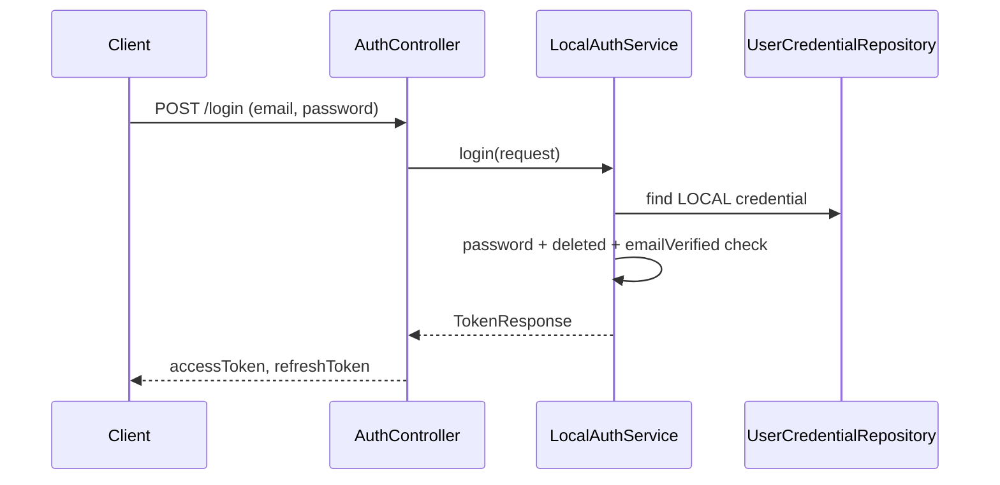

# Auth API

## 1. 로그인
- **URL**: `/api/v1/auth/login`
- **Method**: `POST`
- **Description**: 이메일과 비밀번호로 로그인합니다.
- **Account Policy**:
  - 비활성화된 사용자는 로컬 및 관리자 로그인을 할 수 없습니다.
  - 이메일 인증을 완료하지 않은 Local 사용자는 `403 AUTH013`을 반환합니다.
  - 사용자 존재 여부가 노출되지 않도록 일반 자격 증명 오류와 동일하게 `401 AUTH005`를 반환합니다.
- **Request Body**:
    ```json
    {
      "email": "user@example.com",
      "password": "password"
    }
    ```
- **Response**: `TokenResponse`

### Login Flow


## 2. 회원가입 및 이메일 인증

### 2.1 Local 회원가입
- **URL**: `/api/v1/auth/signup`
- **Method**: `POST`
- **Description**: Local 계정을 생성하고 6자리 이메일 인증번호를 발송합니다.
- **Breaking Change**: 가입 직후 Access/Refresh Token을 발급하지 않습니다.
- **Response**: `201 Created`
    ```json
    {
      "message": "회원가입이 완료되었습니다. 이메일 인증 후 로그인해 주세요."
    }
    ```

### 2.2 이메일 인증 확정
- **URL**: `/api/v1/auth/email-verification/confirm`
- **Method**: `POST`
- **Request Body**:
    ```json
    {
      "email": "user@example.com",
      "verificationCode": "123456"
    }
    ```
- **Success Response**:
    ```json
    {
      "message": "이메일 인증이 완료되었습니다. 로그인해 주세요."
    }
    ```
- **Failure**:
  - `AUTH014`: 인증번호가 없거나 일치하지 않습니다.
  - `AUTH015`: 인증번호가 만료되었습니다.
  - 인증번호를 5회 연속 잘못 입력하면 현재 인증번호가 폐기되며, 새 인증번호를 재발송해야 합니다.

### 2.3 이메일 인증 재발송
- **URL**: `/api/v1/auth/email-verification/resend`
- **Method**: `POST`
- **Description**: 미인증 Local 계정에 새 인증번호를 발송합니다. 계정 존재 여부는 노출하지 않고 동일한 성공 응답을 반환합니다.
- **Rate Limit**: 같은 계정의 인증번호 재발송은 마지막 발송 후 60초가 지나야 가능합니다.
- **Request Body**:
    ```json
    {
      "email": "user@example.com"
    }
    ```
- **Response**:
    ```json
    {
      "message": "인증 메일이 발송되었습니다. 메일이 도착하지 않으면 입력한 이메일을 확인해 주세요."
    }
    ```

## 3. 비밀번호 재설정

### 3.1 재설정 인증번호 요청
- **URL**: `/api/v1/auth/password-reset/request`
- **Method**: `POST`
- **Description**: Local 계정에 6자리 비밀번호 재설정 인증번호를 발송합니다. 계정 존재 여부는 노출하지 않고 동일한 성공 응답을 반환합니다.
- **Rate Limit**: 같은 계정의 재설정 인증번호 요청은 마지막 요청 후 60초가 지나야 가능합니다.
- **Request Body**:
    ```json
    {
      "email": "user@example.com"
    }
    ```
- **Response**:
    ```json
    {
      "message": "비밀번호 재설정 안내 메일이 발송되었습니다. 메일이 도착하지 않으면 입력한 이메일을 확인해 주세요."
    }
    ```

### 3.2 재설정 확정
- **URL**: `/api/v1/auth/password-reset/confirm`
- **Method**: `POST`
- **Description**: 이메일, 인증번호, 새 비밀번호로 Local 비밀번호를 변경합니다.
- **Policy**: 인증번호를 5회 연속 잘못 입력하면 현재 인증번호가 폐기되며, 새 인증번호를 요청해야 합니다.
- **Request Body**:
    ```json
    {
      "email": "user@example.com",
      "resetCode": "123456",
      "newPassword": "new-password"
    }
    ```
- **Response**:
    ```json
    {
      "message": "비밀번호가 재설정되었습니다. 새 비밀번호로 로그인해 주세요."
    }
    ```

## 4. 로그아웃
- **URL**: `/api/v1/auth/logout`
- **Method**: `POST`
- **Description**: 현재 세션을 종료합니다.
- **Response**: `AuthMessageResponse`

## 5. 토큰 재발급
- **URL**: `/api/v1/auth/refresh`
- **Method**: `POST`
- **Description**: 저장된 Refresh Token으로 Access Token과 Refresh Token을 재발급합니다.
- **Account Policy**:
  - 사용자 비활성화 시 해당 사용자의 Refresh Token은 즉시 폐기됩니다.
  - 비활성 사용자 또는 폐기된 Refresh Token의 재발급 요청은 `401`을 반환합니다.
  - 비활성화 전에 발급된 Access Token도 이후 API 요청 인증 단계에서 거부됩니다.

## 6. Google 인증
- 기존 Google 로그인, Local 계정 연결, Google 회원가입 과정에서 연결 대상 사용자가 비활성 상태이면 인증을 거부합니다.
- Google ID Token의 `email_verified` 값이 `false`이면 콜백 처리를 거부합니다.
- Google 자격 증명은 Google이 인증한 이메일로 간주해 `email_verified=true`로 저장합니다.
- 비활성 계정과 동일한 이메일로 새 계정을 만들거나 Google 자격 증명을 추가할 수 없습니다.

## 7. 내 정보 조회
- **URL**: `/api/v1/users/me`
- **Method**: `GET`
- **Description**: 현재 로그인된 사용자의 정보를 조회합니다.
- **Response**: `UserDetailResponse`
