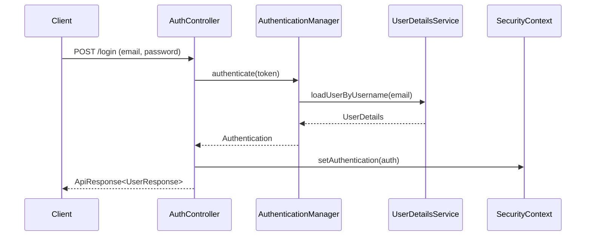

# Auth API

## 1. 로그인
- **URL**: `/api/v1/auth/login`
- **Method**: `POST`
- **Description**: 이메일과 비밀번호로 로그인합니다.
- **Account Policy**:
  - 비활성화된 사용자는 로컬 및 관리자 로그인을 할 수 없습니다.
  - 사용자 존재 여부가 노출되지 않도록 일반 자격 증명 오류와 동일하게 `401`을 반환합니다.
- **Request Body**:
    ```json
    {
      "email": "user@example.com",
      "password": "password"
    }
    ```
- **Response**: `ApiResponse<UserResponse>`

### Login Flow


## 2. 로그아웃
- **URL**: `/api/v1/auth/logout`
- **Method**: `POST`
- **Description**: 현재 세션을 종료합니다.
- **Response**: `ApiResponse<Void>`

## 3. 토큰 재발급
- **URL**: `/api/v1/auth/refresh`
- **Method**: `POST`
- **Description**: 저장된 Refresh Token으로 Access Token과 Refresh Token을 재발급합니다.
- **Account Policy**:
  - 사용자 비활성화 시 해당 사용자의 Refresh Token은 즉시 폐기됩니다.
  - 비활성 사용자 또는 폐기된 Refresh Token의 재발급 요청은 `401`을 반환합니다.
  - 비활성화 전에 발급된 Access Token도 이후 API 요청 인증 단계에서 거부됩니다.

## 4. Google 인증
- 기존 Google 로그인, Local 계정 연결, Google 회원가입 과정에서 연결 대상 사용자가 비활성 상태이면 인증을 거부합니다.
- 비활성 계정과 동일한 이메일로 새 계정을 만들거나 Google 자격 증명을 추가할 수 없습니다.

## 5. 내 정보 조회
- **URL**: `/api/v1/auth/me`
- **Method**: `GET`
- **Description**: 현재 로그인된 사용자의 정보를 조회합니다.
- **Response**: `ApiResponse<UserResponse>`
