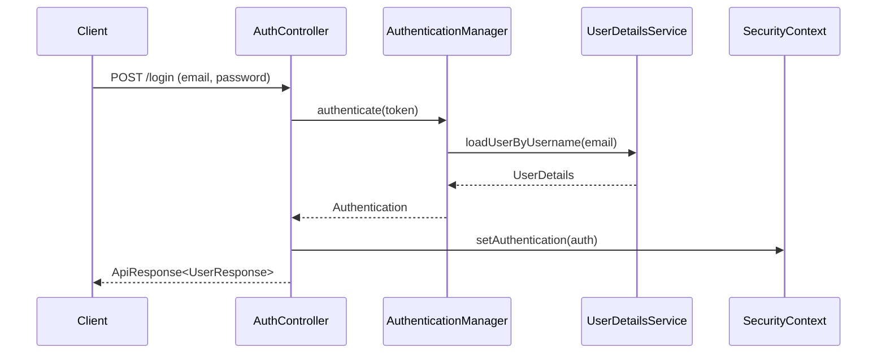

# Auth API

## 1. 로그인
- **URL**: `/api/v1/auth/login`
- **Method**: `POST`
- **Description**: 이메일과 비밀번호로 로그인합니다.
- **Request Body**:
    ```json
    {
      "email": "user@example.com",
      "password": "password"
    }
    ```
- **Response**: `ApiResponse<UserResponse>`

### Login Flow


## 2. 로그아웃
- **URL**: `/api/v1/auth/logout`
- **Method**: `POST`
- **Description**: 현재 세션을 종료합니다.
- **Response**: `ApiResponse<Void>`

## 3. 내 정보 조회
- **URL**: `/api/v1/auth/me`
- **Method**: `GET`
- **Description**: 현재 로그인된 사용자의 정보를 조회합니다.
- **Response**: `ApiResponse<UserResponse>`
