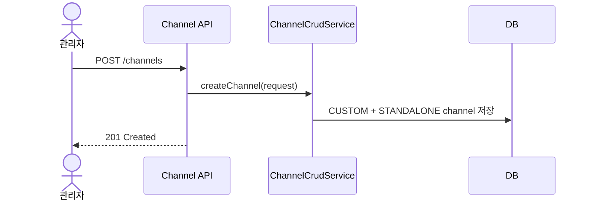
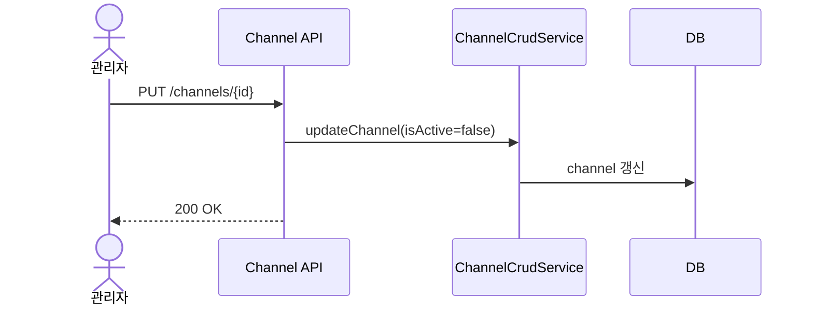
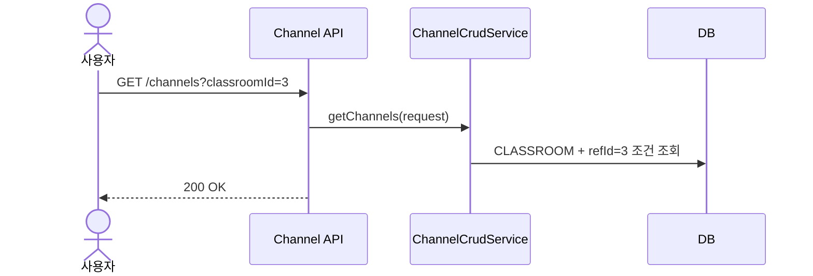

# Channel API

채널은 게시글이 소속되는 컨테이너입니다.  
이 문서는 변경안 기준으로 `NOTICE / EVENT / RESOURCE / CLASSROOM / DEPARTMENT / GUIDE / CUSTOM`, 접근 수준 기반 권한, 연동형 채널 구분, `PUT` 기반 숨김 처리를 반영한 API 설계 문서입니다.

## 1. 역할과 범위

- 게시글이 소속될 채널 생성/조회/수정/삭제
- 공지/이벤트/자료실 기본 채널과 분반/부서 연동 채널 구분
- 접근 수준과 기본 채널 여부 관리

## 2. 핵심 규칙

### 2.1 `channelType`

| 값 | 의미 |
|---|---|
| `NOTICE` | 공지 게시판 |
| `EVENT` | 이벤트 게시판 |
| `RESOURCE` | 자료실 게시판 |
| `CLASSROOM` | 특정 분반 게시판 |
| `DEPARTMENT` | 특정 부서 게시판 |
| `GUIDE` | 교칙, 신청 안내 등 고정 안내문 게시판 |
| `CUSTOM` | 일반 커스텀 게시판 |

### 2.2 채널 연동 구분 (`ChannelBindingType`)

| 값 | 의미 |
|---|---|
| `STANDALONE` | 독립 게시판. 관리자가 직접 생성하거나 시스템 시드 채널(공지 등) |
| `DOMAIN_LINKED` | 다른 도메인 엔티티(분반/부서)와 연결된 게시판 |

운영 기준:

- `NOTICE`, `EVENT`, `RESOURCE`, `GUIDE`, `CUSTOM` -> `STANDALONE`
- `CLASSROOM`, `DEPARTMENT` -> `DOMAIN_LINKED`

### 2.3 접근 수준

| 값 | 의미 |
|---|---|
| `CLOSED` | 일반 접근 불가 |
| `READ_ONLY` | 읽기만 허용 |
| `READ_COMMENT` | 읽기 + 댓글 허용 |
| `READ_WRITE` | 읽기 + 댓글 + 글쓰기 허용 |

메모:

- 공지/이벤트/자료실은 기본적으로 `READ_ONLY`
- 실제 작성 권한은 permission으로 추가 허용 가능

### 2.4 기본 채널 정책

- 공지사항, 이벤트, 자료실은 seed 기반 기본 채널로 운영
- 분반/부서 채널은 연동 도메인에서 보장
- 교칙, 교사 신청 안내 등 고정 안내문 채널은 `GUIDE`
- 기본 안내 채널은 `교칙`, `교사 신청 안내` 이름으로 seed 생성
- 일반 운영자가 만드는 채널은 `CUSTOM`

### 2.5 기본 목록 정책

- `GET /api/v1/channels`는 기본적으로 삭제되지 않은 채널만 조회
- 숨김 채널까지 제외할지 여부는 `isActive` 조건으로 명시 조회
- 관리자 목록은 `isActive=true/false` 필터로 운영 점검 가능

## 3. 권한 정책

| API | 권한 |
|---|---|
| 생성/수정/삭제 | 우선 `ADMIN` |
| 목록/단건 조회 | 인증 사용자 |

메모:

- 채널 생성 권한은 향후 permission으로 확장 가능
- 현재 검토 기준은 `ADMIN` 고정

## 4. 엔드포인트

## 4.1 채널 생성

- **URL**: `/api/v1/channels`
- **Method**: `POST`

### Request Body 예시

```json
{
  "name": "운영 자료 공유",
  "description": "운영팀 내부 자료 공유 게시판",
  "channelType": "RESOURCE",
  "isDefault": false,
  "isActive": true,
  "accessLevel": "READ_WRITE"
}
```

### 동작 규칙

- 이 API는 독립 채널 생성용
- `channelType`은 `NOTICE`, `EVENT`, `RESOURCE`, `GUIDE`, `CUSTOM`만 허용
- `channelType` 생략 시 `CUSTOM`으로 생성
- 생성 결과는:
  - `channelType=요청값 또는 CUSTOM`
  - `bindingType=STANDALONE`
  - `refId=null`

### Side Effects

- `channels` 저장

## 4.2 채널 목록 조회

- **URL**: `/api/v1/channels`
- **Method**: `GET`

### Query Parameters

| 파라미터 | 설명 |
|---|---|
| `name` | 채널 이름 부분 검색 |
| `channelType` | `NOTICE`, `EVENT`, `RESOURCE`, `CLASSROOM`, `DEPARTMENT`, `GUIDE`, `CUSTOM` |
| `bindingType` | `STANDALONE`, `DOMAIN_LINKED` |
| `isActive` | 활성 여부 |
| `isDefault` | 기본 채널 여부 |
| `classroomId` | 특정 분반 채널 조회 |
| `departmentId` | 특정 부서 채널 조회 |
| `sort` | `필드명,방향` 형식 |

### 구현 기준 동작

- `classroomId`가 있으면 `CLASSROOM + refId=classroomId`
- `departmentId`가 있으면 `DEPARTMENT + refId=departmentId`
- 삭제된 채널은 제외

## 4.3 채널 단건 조회

- **URL**: `/api/v1/channels/{id}`
- **Method**: `GET`

## 4.4 채널 수정

- **URL**: `/api/v1/channels/{id}`
- **Method**: `PUT`

### Request Body 예시

```json
{
  "name": "운영 자료실",
  "description": "운영팀 자료실",
  "isDefault": true,
  "isActive": false,
  "accessLevel": "READ_ONLY"
}
```

### 동작 규칙

- 전달한 필드만 반영
- 숨김/보이기는 별도 API 없이 `isActive`로 처리

## 4.5 채널 삭제

- **URL**: `/api/v1/channels/{id}`
- **Method**: `DELETE`

### Side Effects

- soft delete
- `isDeleted=true`, `isActive=false`

## 5. 대표 시퀀스

### 5.1 커스텀 채널 생성



### 5.2 채널 숨김



### 5.3 분반/부서 연동 채널 조회


