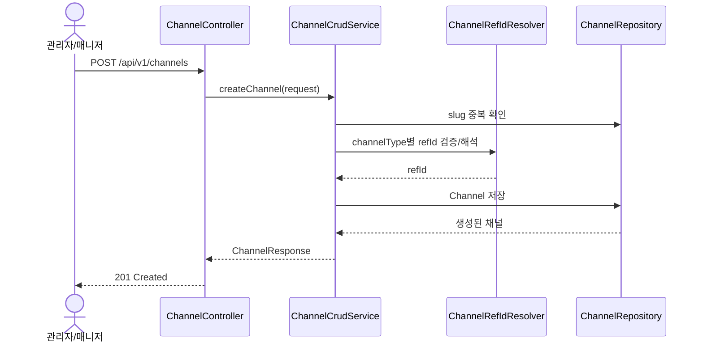
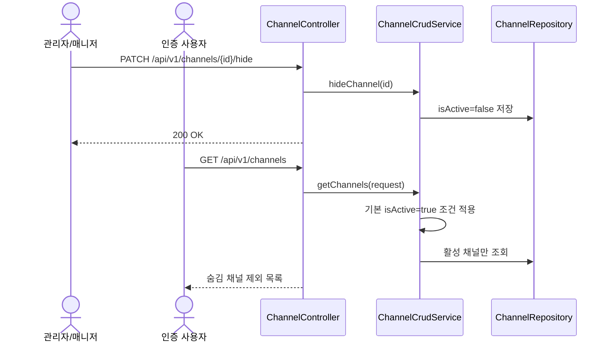

# Channel API

채널은 게시글이 소속되는 컨테이너입니다. 공지사항, 분반 게시판, 부서 게시판처럼 "게시판의 입구"를 만들고 운영 정책을 정하는 역할을 맡습니다.

이 문서는 `ChannelController`, `ChannelCrudService`, `ChannelListRequest`, 그리고 E2E 테스트(`ChannelCrudTest`, `ChannelLifecycleTest`) 기준으로 작성했습니다.

## 1. 역할과 범위

- 게시글이 소속될 채널을 생성, 조회, 수정, 숨김, 삭제합니다.
- 채널의 소속 범위는 `channelType`으로, 게시글 작성 권한은 `writerPolicy`로 결정합니다.
- 채널 자체는 게시글 내용을 관리하지 않습니다. 채널 내부 게시글 CRUD는 [Posts](./Posts.md)에서 다룹니다.

## 2. 핵심 규칙

### 2.1 `channelType`

| 값 | 의미 | 필요 참조값 |
|---|---|---|
| `ALL` | 전역 채널 | 없음 |
| `CLASSROOM` | 특정 분반 채널 | `classroomId` |
| `DEPARTMENT` | 특정 부서 채널 | `departmentId` |
| `CUSTOM` | 외부 연동/운영용 커스텀 채널 | `customRefId` |

타입과 맞지 않는 참조값을 보내거나, 필요한 참조값을 누락하면 400 오류가 반환됩니다.

### 2.2 `writerPolicy`

| 값 | 의미 |
|---|---|
| `ALL_AUTHENTICATED` | 로그인한 사용자 누구나 작성 가능 |
| `ADMIN_MANAGER_ONLY` | 관리자/매니저만 작성 가능 |
| `CLASSROOM_MANAGER_TEACHER_ONLY` | 해당 분반 과목에 배정된 교사만 작성 가능 |
| `DEPARTMENT_MEMBER_OR_ADMIN` | 해당 부서 소속 사용자 또는 관리자 작성 가능 |

### 2.3 기본 목록 정책

- `GET /api/v1/channels`는 기본적으로 `isActive=true` 조건이 적용됩니다.
- 즉, 숨김 채널(`isActive=false`)은 일반 목록 조회에서 자동 제외됩니다.
- 숨김 채널을 보려면 `?isActive=false`를 명시해야 합니다.

### 2.4 정렬 정책

- `sort`를 주지 않으면 `sortOrder ASC`, `id ASC`가 기본 정렬입니다.
- `sort`는 `필드명,방향` 형식을 세미콜론으로 이어서 전달합니다.
- 예: `sortOrder,ASC;lastPostedAt,DESC`
- 잘못된 형식 예: `sort=name`
- 잘못된 형식은 400(`VAL001` 또는 `VAL002`)으로 처리됩니다.

허용 필드:
- `id`
- `name`
- `slug`
- `sortOrder`
- `lastPostedAt`
- `createdAt`
- `updatedAt`

## 3. 권한 정책

| API | 권한 |
|---|---|
| 생성/수정/숨김/표시/삭제 | `ADMIN`, `MANAGER` |
| 목록/단건 조회 | 인증 사용자 |

## 4. 엔드포인트

## 4.1 채널 생성

- **URL**: `/api/v1/channels`
- **Method**: `POST`
- **Description**: 새로운 채널을 생성합니다.

### Request Body 예시

```json
{
  "name": "공지사항",
  "slug": "notice",
  "description": "기관 전체 운영 공지 채널",
  "channelType": "ALL",
  "writerPolicy": "ADMIN_MANAGER_ONLY",
  "isDefault": true,
  "isActive": true,
  "sortOrder": 0
}
```

### Side Effects

- `channels` 테이블에 새 레코드가 생성됩니다.
- `slug`는 삭제되지 않은 채널 기준으로 유니크해야 합니다.
- 생성 직후 일반 조회 목록에 포함될 수 있습니다.

### 주요 실패 케이스

| 상황 | HTTP | code |
|---|---|---|
| `CLASSROOM`인데 `classroomId` 없음 | 400 | `VAL003` |
| 잘못된 `channelType` | 400 | `VAL002` |
| 잘못된 `writerPolicy` | 400 | `VAL002` |
| 중복 `slug` | 409 | `BIZ-08-001` |
| 게스트 생성 시도 | 403 | `AUTHZ001` |

## 4.2 채널 목록 조회

- **URL**: `/api/v1/channels`
- **Method**: `GET`
- **Description**: 조건에 맞는 채널 목록을 조회합니다.

### Query Parameters

| 파라미터 | 설명 |
|---|---|
| `name` | 채널 이름 부분 검색 |
| `channelType` | `ALL`, `CLASSROOM`, `DEPARTMENT`, `CUSTOM` |
| `isActive` | 활성/숨김 채널 필터 |
| `isDefault` | 기본 채널 여부 필터 |
| `classroomId` | 특정 분반 채널 필터 |
| `departmentId` | 특정 부서 채널 필터 |
| `sort` | `필드명,방향` 형식의 정렬 조건 |

### 구현 기준 동작

- `classroomId`가 있으면 내부적으로 `CLASSROOM + refId=classroomId` 조건이 같이 들어갑니다.
- `departmentId`가 있으면 내부적으로 `DEPARTMENT + refId=departmentId` 조건이 같이 들어갑니다.
- 삭제된 채널은 항상 제외됩니다.

## 4.3 채널 단건 조회

- **URL**: `/api/v1/channels/{id}`
- **Method**: `GET`
- **Description**: 채널 상세를 조회합니다.

### 주요 실패 케이스

| 상황 | HTTP | code |
|---|---|---|
| 삭제된 채널 조회 | 404 | `RES-08-001` |
| 존재하지 않는 채널 조회 | 404 | `RES-08-001` |

## 4.4 채널 수정

- **URL**: `/api/v1/channels/{id}`
- **Method**: `PUT`
- **Description**: 전달한 필드만 반영해 채널을 수정합니다.

### Request Body 예시

```json
{
  "name": "운영 공지사항",
  "slug": "operation-notice",
  "description": "기관 전체 운영 변경 사항 안내 채널",
  "writerPolicy": "ALL_AUTHENTICATED",
  "isDefault": true,
  "sortOrder": 20
}
```

### Side Effects

- 채널 메타데이터가 즉시 갱신됩니다.
- `writerPolicy`, `isActive`, `sortOrder` 변경은 이후 게시글 작성/목록 경험에 직접 영향을 줍니다.

### 주요 실패 케이스

| 상황 | HTTP | code |
|---|---|---|
| 변경 필드 없음 | 400 | `VAL004` |
| 중복 `slug` | 409 | `BIZ-08-001` |
| 존재하지 않는 채널 수정 | 404 | `RES-08-001` |

## 4.5 채널 숨김

- **URL**: `/api/v1/channels/{id}/hide`
- **Method**: `PATCH`
- **Description**: 채널을 숨김 처리합니다.

### Side Effects

- `isActive=false`로 변경됩니다.
- 기본 목록 조회에서 제외됩니다.
- 삭제는 아니므로 `show`로 다시 복구할 수 있습니다.

## 4.6 채널 표시

- **URL**: `/api/v1/channels/{id}/show`
- **Method**: `PATCH`
- **Description**: 숨김 채널을 다시 활성화합니다.

### Side Effects

- `isActive=true`로 변경됩니다.
- 다시 기본 목록 조회에 포함됩니다.

## 4.7 채널 삭제

- **URL**: `/api/v1/channels/{id}`
- **Method**: `DELETE`
- **Description**: 채널을 소프트 삭제합니다.

### Side Effects

- 내부적으로 `isDeleted=true`, `isActive=false`로 처리됩니다.
- 이후 단건 조회와 일반 목록에서 제외됩니다.

## 5. 대표 시퀀스

### 5.1 채널 생성



### 5.2 채널 숨김과 기본 목록 제외



## 6. 테스트로 확인된 시나리오

- 관리자는 `ALL` 타입 공지 채널을 생성하고 단건 조회할 수 있습니다.
- `CLASSROOM` 채널 생성 시 `classroomId`가 없으면 400이 반환됩니다.
- 잘못된 `sort` 형식은 400으로 막힙니다.
- 숨김 채널은 기본 목록 조회에서 제외되고, `?isActive=false`로만 조회됩니다.
- 게스트는 채널 생성/수정/숨김/삭제를 할 수 없습니다.
