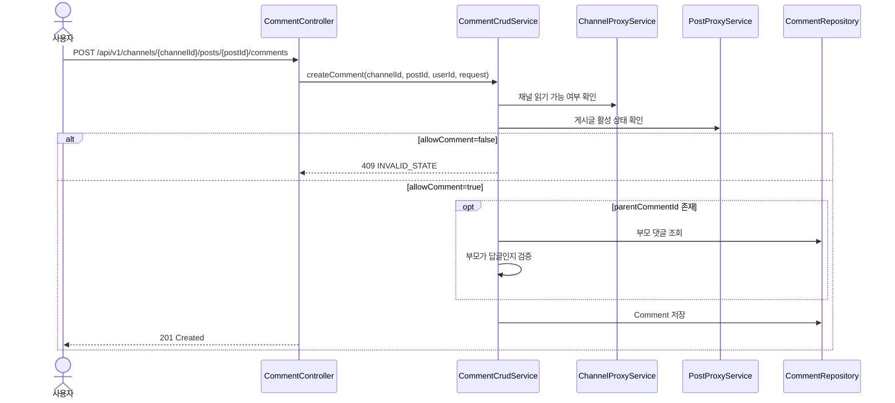
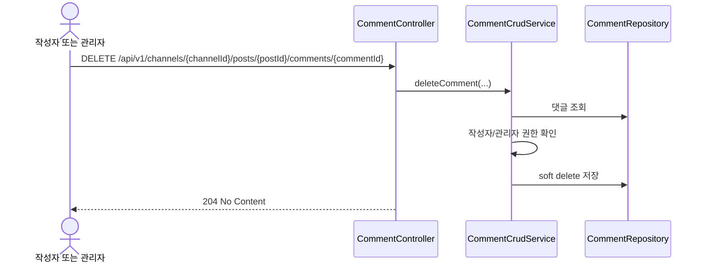

# Comment API

댓글은 게시글 하위 리소스입니다. 일반 댓글과 1단계 답글을 지원하며, 작성자 본인 또는 관리자 권한으로 소프트 삭제할 수 있습니다.

이 문서는 `CommentController`, `CommentCrudService`, `CreateCommentRequest`와 E2E 테스트(`CommentNestedResourceTest`, `CommentLifecycleTest`) 기준으로 작성했습니다.

## 1. 역할과 범위

- 특정 게시글 하위 댓글 생성
- 게시글별 댓글 목록 조회
- 댓글 소프트 삭제

별도 댓글 수정 API는 현재 제공하지 않습니다.

## 2. 핵심 규칙

### 2.1 댓글 깊이

- `parentCommentId`가 없으면 일반 댓글입니다.
- `parentCommentId`가 있으면 해당 댓글의 답글입니다.
- 답글의 답글, 즉 2단계 이상 중첩은 허용하지 않습니다.

### 2.2 게시글 상태 연계

- 댓글 생성 전 채널과 게시글이 모두 읽기 가능한 상태인지 검증합니다.
- `allowComment=false`인 게시글에는 댓글을 작성할 수 없습니다.

### 2.3 삭제 정책

- 댓글 삭제는 소프트 삭제입니다.
- 삭제된 댓글은 목록 조회에서 제외됩니다.
- 댓글 삭제가 게시글 조회수나 채널 `lastPostedAt`을 바꾸지는 않습니다.

## 3. 권한 정책

| API | 권한 |
|---|---|
| 생성/목록 조회 | 인증 사용자 |
| 삭제 | 작성자 본인 또는 `ADMIN`, `MANAGER` |

## 4. 엔드포인트

## 4.1 댓글 생성

- **URL**: `/api/v1/channels/{channelId}/posts/{postId}/comments`
- **Method**: `POST`
- **Description**: 댓글 또는 답글을 생성합니다.

### Request Body 예시

일반 댓글:

```json
{
  "content": "확인했습니다. 다음 주 일정도 같이 공지 부탁드립니다.",
  "parentCommentId": null
}
```

답글:

```json
{
  "content": "네, 다음 공지에 함께 반영하겠습니다.",
  "parentCommentId": 12
}
```

### Side Effects

- `comments` 테이블에 새 레코드가 생성됩니다.
- 채널의 `lastPostedAt`이나 게시글의 `viewCount`는 변경하지 않습니다.

### 주요 실패 케이스

| 상황 | HTTP | code |
|---|---|---|
| 댓글 비활성 게시글 | 409 | `BIZ004` |
| 답글의 답글 생성 | 400 | `VAL002` |
| 부모 댓글 없음 | 404 | `RES-10-001` |
| 게시글 없음 | 404 | `RES-09-001` |

## 4.2 댓글 목록 조회

- **URL**: `/api/v1/channels/{channelId}/posts/{postId}/comments`
- **Method**: `GET`
- **Description**: 특정 게시글의 댓글 목록을 조회합니다.

### 구현 기준 동작

- 삭제되지 않은 댓글만 조회합니다.
- 정렬은 `createdAt ASC`, `id ASC`입니다.
- 응답의 `parentCommentId`로 부모 댓글/답글 관계를 구분할 수 있습니다.

## 4.3 댓글 삭제

- **URL**: `/api/v1/channels/{channelId}/posts/{postId}/comments/{commentId}`
- **Method**: `DELETE`
- **Description**: 댓글을 소프트 삭제합니다.

### Side Effects

- 댓글은 삭제 상태가 되고 목록 조회에서 제외됩니다.

### 주요 실패 케이스

| 상황 | HTTP | code |
|---|---|---|
| 작성자 아님 | 403 | `AUTHZ001` |
| 댓글 없음 | 404 | `RES-10-001` |

## 5. 대표 시퀀스

### 5.1 댓글/답글 생성



### 5.2 댓글 삭제



## 6. 테스트로 확인된 시나리오

- 관리자는 댓글과 답글을 생성하고 목록에서 둘 다 조회할 수 있습니다.
- 댓글 비활성 게시글에는 댓글을 작성할 수 없습니다.
- 작성자는 자신의 댓글을 삭제할 수 있고 목록에서 사라집니다.
- 작성자가 아닌 일반 사용자는 댓글을 삭제할 수 없습니다.
- 관리자는 다른 사용자의 댓글도 삭제할 수 있습니다.
- 답글에 다시 답글을 달면 400이 반환됩니다.
