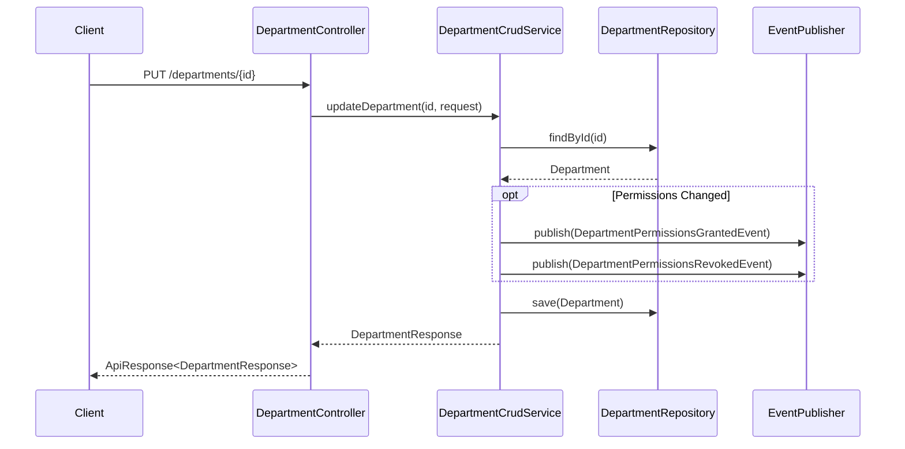

# Department API

## 1. 부서 목록 조회
- **URL**: `/api/v1/departments`
- **Method**: `GET`
- **Description**: 참여 가능한 부서 목록을 조회합니다.
- **Query Parameters**:
    - `page` (optional): 페이지 번호 (0-based)
    - `size` (optional): 페이지 크기
- **Response**: `ApiResponse<BasePageResponse<DepartmentResponse>>`

## 2. 부서 상세 조회
- **URL**: `/api/v1/departments/{id}`
- **Method**: `GET`
- **Description**: ID로 부서를 조회합니다.
- **Response**: `ApiResponse<DepartmentResponse>`

## 3. 부서 생성
- **URL**: `/api/v1/departments`
- **Method**: `POST`
- **Description**: 새로운 부서를 생성합니다.
- **Request Body**:
    ```json
    {
      "name": "Department Name",
      "description": "Description"
    }
    ```
- **Response**: `ApiResponse<DepartmentResponse>`

## 4. 부서 수정
- **URL**: `/api/v1/departments/{id}`
- **Method**: `PUT`
- **Description**: 부서 정보를 수정합니다.
- **Request Body**:
    ```json
    {
      "name": "Updated Name",
      "description": "Updated Description"
    }
    ```
- **Response**: `ApiResponse<DepartmentResponse>`

### Update Flow (with Events)


## 5. 부서 삭제
- **URL**: `/api/v1/departments/{id}`
- **Method**: `DELETE`
- **Description**: 부서를 삭제합니다.
- **Response**: `ApiResponse<Void>`
