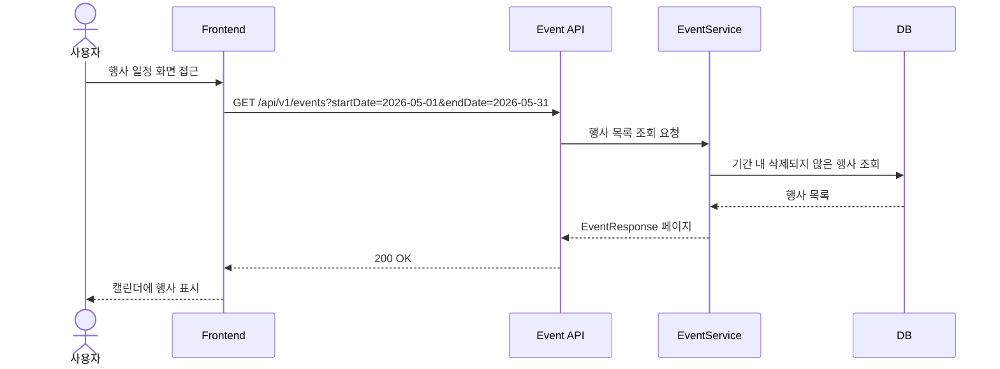
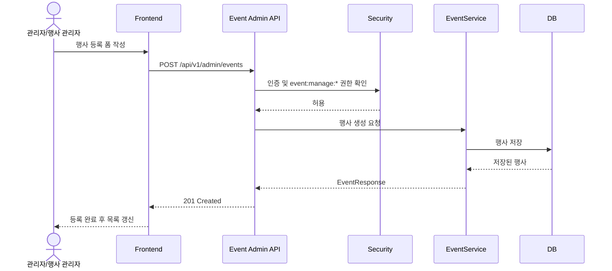
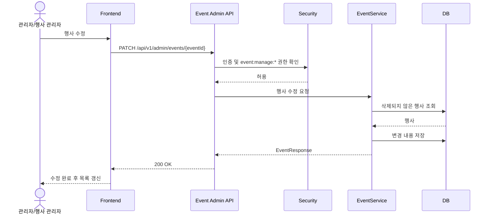
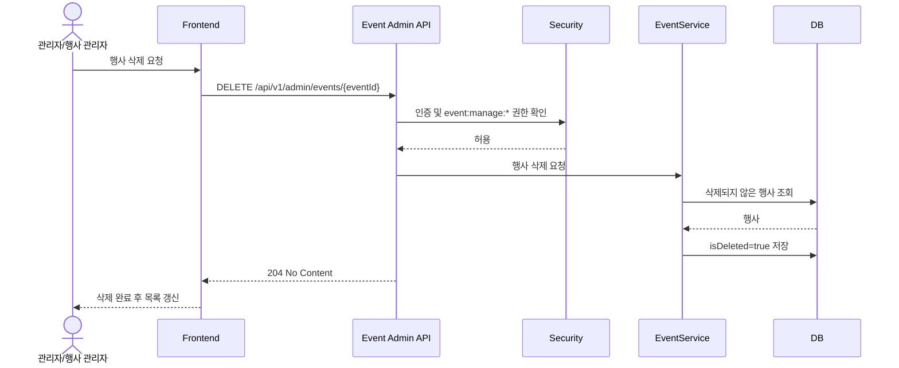

# Event API

행사는 캘린더에 표시되는 독립적인 일정 데이터입니다.
수업, 결석, 수업 교환과는 별개의 도메인으로 관리합니다.

행사 기록/사진 게시글과 행사 일정의 연결은 현재 구현 범위에 포함하지 않습니다.
행사 기록/사진은 기존 게시판 도메인을 활용하고, 추후 필요할 때 행사와 게시글 연결을 별도 확장합니다.

## 공통 정책

- 공개 Base URL: `/api/v1/events`
- 관리자 Base URL: `/api/v1/admin/events`
- 행사 조회는 인증 없이 접근할 수 있습니다.
- 행사 등록, 수정, 삭제는 `ADMIN` 또는 `event:manage:*` 권한이 필요합니다.
- 행사 날짜는 기간이 아니라 단일 날짜인 `eventDate`로 저장합니다.
- `thumbnailUrl`은 현재 MVP에 포함하지 않습니다.
- 생성자와 수정자는 모두 저장하지만, API 응답에는 마지막 수정자 정보만 노출합니다.
- 삭제는 물리 삭제가 아니라 `isDeleted=true`로 처리합니다.

## 데이터 모델

| 필드 | 타입 | 필수 | 설명 |
|---|---|---|---|
| `id` | number | Y | 행사 ID |
| `title` | string | Y | 행사 제목 |
| `description` | string | N | 행사 설명 |
| `eventDate` | string | Y | 행사 날짜, `yyyy-MM-dd` |
| `startTime` | string | N | 시작 시간, `HH:mm:ss` |
| `endTime` | string | N | 종료 시간, `HH:mm:ss` |
| `createdBy` | User | Y | 생성자. 내부 저장용 |
| `updatedBy` | User | Y | 마지막 수정자 |
| `isDeleted` | boolean | Y | 삭제 여부 |
| `createdAt` | string | Y | 생성 일시 |
| `updatedAt` | string | Y | 수정 일시 |

## EventResponse

```json
{
  "id": 1,
  "title": "문학의 밤",
  "description": "문학의 밤 행사에 대한 상세 설명입니다.",
  "eventDate": "2026-05-13",
  "startTime": "19:00:00",
  "endTime": "21:00:00",
  "lastModifiedById": 1,
  "lastModifiedByName": "관리자",
  "createdAt": "2026-05-01T10:00:00",
  "updatedAt": "2026-05-01T10:00:00"
}
```

## 1. 행사 목록 조회

- **URL**: `/api/v1/events`
- **Method**: `GET`
- **Auth**: 불필요
- **Description**: 행사 일정 목록을 페이지네이션으로 조회합니다.

### Query Parameters

| 이름 | 타입 | 필수 | 설명 |
|---|---|---|---|
| `startDate` | string | N | 조회 시작일, `yyyy-MM-dd` |
| `endDate` | string | N | 조회 종료일, `yyyy-MM-dd` |
| `page` | number | N | 페이지 번호, 기본값 0 |
| `size` | number | N | 페이지 크기, 기본값 20 |

### 조회 정책

- `startDate`, `endDate`가 모두 있으면 해당 기간의 행사를 조회합니다.
- `startDate`, `endDate`가 모두 없으면 전체 행사를 조회합니다.
- `startDate`, `endDate` 중 하나만 전달하면 `400 Bad Request`를 반환합니다.
- `startDate`가 `endDate`보다 늦으면 `400 Bad Request`를 반환합니다.
- 삭제된 행사는 조회되지 않습니다.
- 기본 정렬은 `eventDate ASC`, `startTime ASC`, `id ASC`입니다.

### Response Body

```json
{
  "content": [
    {
      "id": 1,
      "title": "문학의 밤",
      "description": "문학의 밤 행사에 대한 상세 설명입니다.",
      "eventDate": "2026-05-13",
      "startTime": "19:00:00",
      "endTime": "21:00:00",
      "lastModifiedById": 1,
      "lastModifiedByName": "관리자",
      "createdAt": "2026-05-01T10:00:00",
      "updatedAt": "2026-05-01T10:00:00"
    }
  ],
  "page": 0,
  "size": 20,
  "totalElements": 1,
  "totalPages": 1
}
```

## 2. 행사 상세 조회

- **URL**: `/api/v1/events/{eventId}`
- **Method**: `GET`
- **Auth**: 불필요
- **Description**: 행사 일정 상세 정보를 조회합니다.

### 조회 정책

- 삭제된 행사는 조회되지 않습니다.
- 존재하지 않거나 삭제된 행사는 `404 Not Found`를 반환합니다.

## 3. 행사 등록

- **URL**: `/api/v1/admin/events`
- **Method**: `POST`
- **Auth**: 필요
- **Roles**: `ADMIN` 또는 `event:manage:*`
- **Description**: 행사 일정을 등록합니다.

### Request Body

```json
{
  "title": "문학의 밤",
  "description": "문학의 밤 행사에 대한 상세 설명입니다.",
  "eventDate": "2026-05-13",
  "startTime": "19:00:00",
  "endTime": "21:00:00"
}
```

### 구현 기준 동작

- `title`은 필수입니다.
- `eventDate`는 필수입니다.
- `startTime`, `endTime`은 둘 다 없거나 둘 다 있어야 합니다.
- `startTime`, `endTime`이 모두 있으면 `endTime`은 `startTime`보다 빠를 수 없습니다.
- 생성자는 현재 로그인 사용자로 저장합니다.
- 생성 시 수정자도 현재 로그인 사용자로 저장합니다.

### Response

- `201 Created`
- 응답 구조는 `EventResponse` 단건입니다.

## 4. 행사 수정

- **URL**: `/api/v1/admin/events/{eventId}`
- **Method**: `PATCH`
- **Auth**: 필요
- **Roles**: `ADMIN` 또는 `event:manage:*`
- **Description**: 행사 일정을 부분 수정합니다.

### Request Body

```json
{
  "title": "문학의 밤",
  "description": "",
  "eventDate": "2026-05-13",
  "startTime": "19:30:00",
  "endTime": "21:30:00"
}
```

### 구현 기준 동작

- 전달한 필드만 수정합니다.
- `title`을 전달할 경우 공백일 수 없고 최대 100자입니다.
- `description`은 빈 문자열로 수정할 수 있습니다.
- `startTime`, `endTime`은 둘 다 없거나 둘 다 있어야 합니다.
- `startTime`, `endTime`이 모두 있으면 `endTime`은 `startTime`보다 빠를 수 없습니다.
- 수정자는 현재 로그인 사용자로 저장합니다.
- 삭제된 행사는 수정할 수 없습니다.

### Response

- `200 OK`
- 응답 구조는 `EventResponse` 단건입니다.

## 5. 행사 삭제

- **URL**: `/api/v1/admin/events/{eventId}`
- **Method**: `DELETE`
- **Auth**: 필요
- **Roles**: `ADMIN` 또는 `event:manage:*`
- **Description**: 행사 일정을 삭제합니다.

### Side Effects

- 물리 삭제하지 않고 `isDeleted=true`로 변경합니다.
- 수정자는 현재 로그인 사용자로 저장합니다.
- 삭제된 행사는 목록/상세 조회에서 제외됩니다.

### Response

- `204 No Content`

## 작동 흐름

### 행사 목록 조회



### 행사 등록



### 행사 수정



### 행사 삭제



## 프론트 구현 메모

- 캘린더 화면에서는 월의 시작일/종료일을 계산해 `startDate`, `endDate`로 행사 목록을 조회합니다.
- 수업 API와 행사 API를 각각 호출한 뒤 프론트에서 날짜 기준으로 병합합니다.
- 행사는 `eventDate` 기준으로 캘린더 셀에 배치합니다.
- 행사 일정 표시에는 이미지를 사용하지 않고 텍스트로 표시합니다.
- `startTime`, `endTime`이 모두 있으면 `19:00 - 21:00` 형식으로 표시합니다.
- `startTime`, `endTime`이 모두 없으면 시간 미정 또는 종일 행사처럼 표시할 수 있습니다.
- 행사 상세 모달은 목록 응답 데이터를 재사용하거나, 필요 시 상세 조회 API를 호출합니다.
- 등록, 수정, 삭제 성공 후 현재 조회 중인 기간의 행사 목록을 다시 조회합니다.
- 행사 기록/사진은 이번 API와 연결하지 않습니다. 필요한 경우 기존 게시판 API를 별도로 사용합니다.

## 대표 실패 케이스

| 상황 | HTTP Status |
|---|---|
| 존재하지 않는 행사 조회 | `404 Not Found` |
| 삭제된 행사 조회 | `404 Not Found` |
| 인증 없이 관리자 API 접근 | `401 Unauthorized` |
| 권한 없는 사용자가 관리자 API 접근 | `403 Forbidden` |
| 제목 누락 | `400 Bad Request` |
| 제목이 공백만으로 구성됨 | `400 Bad Request` |
| 행사 날짜 누락 | `400 Bad Request` |
| `startTime`, `endTime` 중 하나만 전달 | `400 Bad Request` |
| `endTime`이 `startTime`보다 빠름 | `400 Bad Request` |
| `startDate`, `endDate` 중 하나만 전달 | `400 Bad Request` |
| `startDate`가 `endDate`보다 늦음 | `400 Bad Request` |
