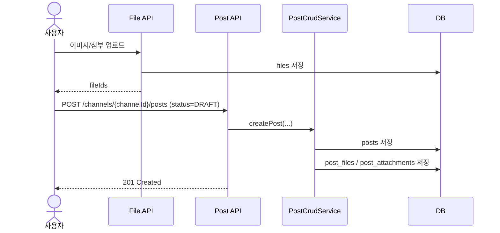
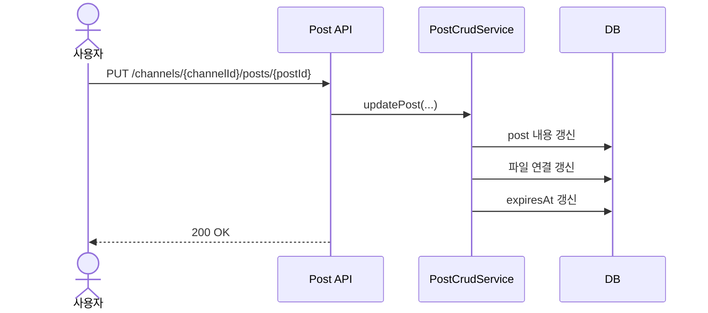
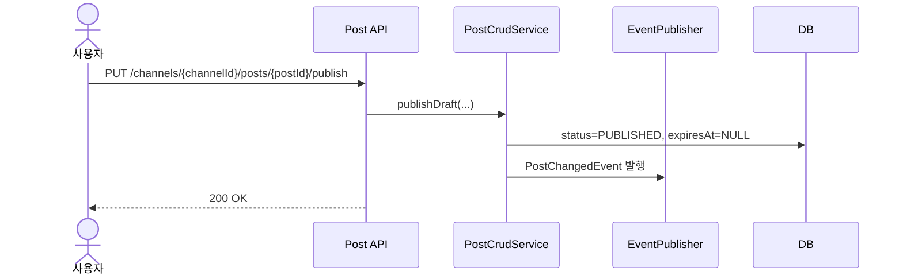
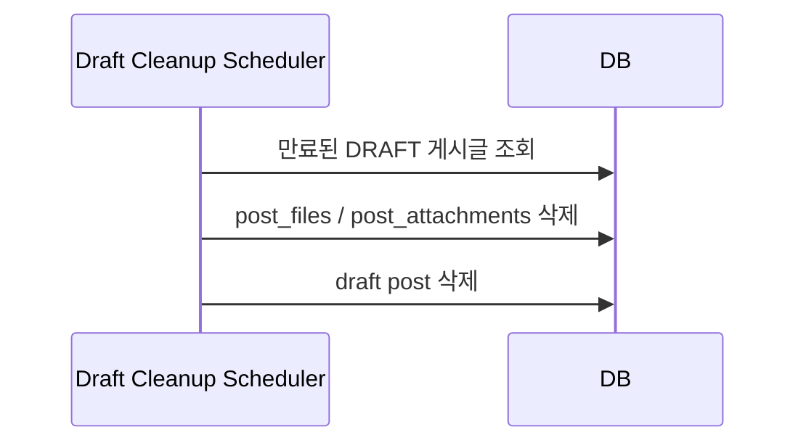

# Post API

게시글은 특정 채널에 귀속됩니다.  
이 문서는 변경안 기준으로 `post_type` 제거, `thumbnail_url` 추가, `DRAFT -> PUBLISHED` 흐름, 파일 연결 구조를 반영한 API 설계 문서입니다.

## 1. 역할과 범위

- 채널 하위 게시글 생성/조회/수정/삭제
- 초안 게시글 저장과 발행
- 게시글 이미지/첨부 연결
- 조회수 증가, 고정글, 댓글 허용, 썸네일 관리

## 2. 핵심 규칙

### 2.1 게시글 상태

| 값 | 의미 |
|---|---|
| `DRAFT` | 작성 중 초안 |
| `PUBLISHED` | 공개 게시 상태 |
| `ARCHIVED` | 보관 상태 |

규칙:

- 초안 저장은 `DRAFT`
- 작성 완료는 `PUBLISHED`
- 만료 정리 대상은 `DRAFT`만 해당

### 2.2 정렬 정책

채널 하위 목록과 통합 목록은 기본적으로 아래 순서를 따른다.

1. `isPinned DESC`
2. `createdAt DESC`
3. `id DESC`

### 2.3 조회수 정책

- 상세 조회만 `viewCount`를 증가시킨다.
- 목록 조회는 조회수를 증가시키지 않는다.

### 2.4 썸네일 정책

- `thumbnailUrl`은 nullable이다.
- 명시값이 있으면 그대로 저장한다.
- 명시값이 없으면 `null` 유지

### 2.5 파일 연결 정책

- 본문 이미지: `post_files`
- 첨부파일: `post_attachments`
- 파일 업로드는 `File API`에서 먼저 수행한다.
- 생성/수정 시 `imageFileIds`, `attachmentFileIds`를 받아 게시글과 연결한다.

### 2.6 초안 만료 정책

- `status=DRAFT` 게시글만 만료 시각을 가진다.
- 임시 저장이 다시 일어나면 `expiresAt`을 갱신한다.
- 만료된 `DRAFT`는 배치 정리 대상이다.

## 3. 권한 정책

### 3.1 생성 권한

- 채널의 `accessLevel`과 명시적 channel permission을 기준으로 판단한다.
- 기본적으로 `READ_WRITE` 이상 채널만 일반 작성 가능하다.
- 공지/이벤트/자료실은 기본 접근 수준이 낮아도 permission으로 작성 권한을 열 수 있다.

### 3.2 수정/삭제 권한

- 작성자 본인 또는 관리자/매니저

### 3.3 발행 권한

- 작성자 본인 또는 관리자/매니저

## 4. 엔드포인트

## 4.1 초안 또는 게시글 생성

- **URL**: `/api/v1/channels/{channelId}/posts`
- **Method**: `POST`

### Request Body 예시

```json
{
  "title": "행사 포스터 초안",
  "contentHtml": "<p></p>",
  "status": "DRAFT",
  "isPinned": false,
  "allowComment": true,
  "thumbnailUrl": null,
  "imageFileIds": ["550e8400-e29b-41d4-a716-446655440000"],
  "attachmentFileIds": ["550e8400-e29b-41d4-a716-446655440001"],
  "expiresInMinutes": 60
}
```

### 동작 규칙

- `status=PUBLISHED`면 즉시 게시글 생성
- `status=DRAFT`면 초안 게시글 생성
- 초안 생성 시 `expiresAt`을 함께 기록
- `imageFileIds`, `attachmentFileIds`가 있으면 즉시 매핑 생성

### Side Effects

- `posts` 저장
- `post_files`, `post_attachments` 저장
- 게시 상태가 `PUBLISHED`면 채널 `lastPostedAt` 갱신 이벤트 발행

## 4.2 채널 하위 게시글 목록 조회

- **URL**: `/api/v1/channels/{channelId}/posts`
- **Method**: `GET`

### Query Parameters

| 파라미터 | 설명 |
|---|---|
| `page` | 페이지 번호 |
| `size` | 페이지 크기 |
| `author` | 작성자 이름/아이디 부분 검색 |
| `title` | 제목 부분 검색 |
| `content` | 본문 검색 |
| `status` | `DRAFT`, `PUBLISHED`, `ARCHIVED` |
| `isPinned` | 상단 고정 여부 |

### 메모

- 일반 공개 화면은 보통 `status=PUBLISHED`만 사용
- 관리자 화면에서만 `DRAFT` 포함 조회를 허용하는 정책을 권장

## 4.3 채널 하위 게시글 상세 조회

- **URL**: `/api/v1/channels/{channelId}/posts/{postId}`
- **Method**: `GET`

### Side Effects

- 조회 성공 시 `viewCount` 1 증가

## 4.4 게시글 수정

- **URL**: `/api/v1/channels/{channelId}/posts/{postId}`
- **Method**: `PUT`

### Request Body 예시

```json
{
  "title": "행사 포스터 수정본",
  "contentHtml": "<p>수정된 본문</p>",
  "status": "DRAFT",
  "isPinned": false,
  "allowComment": true,
  "thumbnailUrl": "https://example.com/thumb.png",
  "imageFileIds": ["550e8400-e29b-41d4-a716-446655440000"],
  "attachmentFileIds": ["550e8400-e29b-41d4-a716-446655440001"]
}
```

### 동작 규칙

- 전달한 필드만 반영
- 파일 연결도 이 시점에 교체 또는 동기화 가능
- `status=DRAFT` 상태 수정이면 `expiresAt` 갱신 가능

## 4.5 초안 발행

- **URL**: `/api/v1/channels/{channelId}/posts/{postId}/publish`
- **Method**: `PUT`

### 동작 규칙

- 대상 게시글은 반드시 `DRAFT`
- 발행 시:
  - `status=PUBLISHED`
  - `expiresAt=NULL`
  - 채널 `lastPostedAt` 갱신 이벤트 발행

### Side Effects

- 게시글이 공개 상태가 된다
- 통합 게시판/채널 목록에서 노출 가능 상태가 된다

## 4.6 초안 만료 연장

- **URL**: `/api/v1/channels/{channelId}/posts/{postId}/draft-expiration`
- **Method**: `PUT`

### Request Body 예시

```json
{
  "expiresInMinutes": 60
}
```

### 동작 규칙

- 대상 게시글은 반드시 `DRAFT`
- `expiresAt=now + expiresInMinutes`

## 4.7 게시글 삭제

- **URL**: `/api/v1/channels/{channelId}/posts/{postId}`
- **Method**: `DELETE`

### Side Effects

- 게시글 soft delete
- 목록/상세에서 제외
- 채널 `lastPostedAt` 재계산 이벤트 발행

## 4.8 통합 게시글 목록 조회

- **URL**: `/api/v1/posts`
- **Method**: `GET`

### Query Parameters

| 파라미터 | 설명 |
|---|---|
| `page` | 페이지 번호 |
| `size` | 페이지 크기 |
| `author` | 작성자 검색 |
| `title` | 제목 검색 |
| `content` | 본문 검색 |
| `status` | 게시 상태 필터 |
| `channelId` | 특정 채널만 조회 |
| `channelType` | `NOTICE`, `EVENT`, `RESOURCE`, `CLASSROOM`, `DEPARTMENT`, `CUSTOM` |
| `classroomId` | 특정 분반 게시판만 조회 |
| `departmentId` | 특정 부서 게시판만 조회 |
| `isPinned` | 상단 고정 글만 조회 |

### 메모

- `postType` 필터는 제거
- 공지/이벤트/자료실 구분은 `channelType`으로 처리

## 5. 대표 시퀀스

### 5.1 초안 생성과 파일 연결



### 5.2 초안 수정과 만료 연장



### 5.3 초안 발행



### 5.4 만료된 초안 정리


