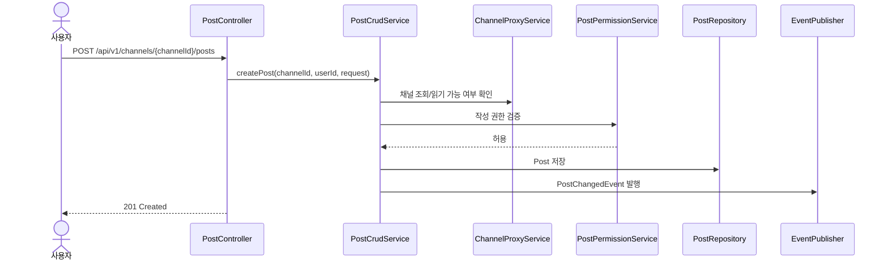
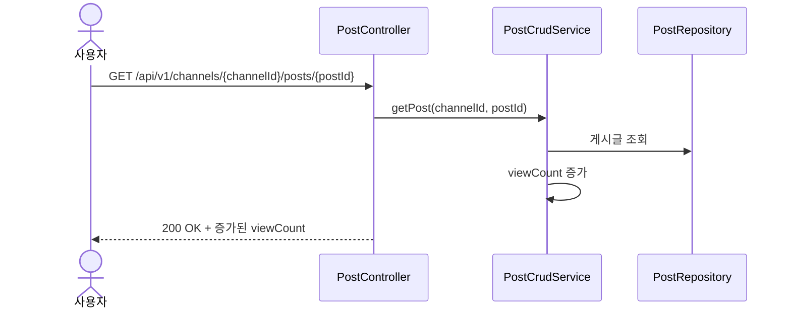
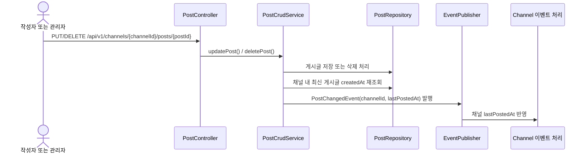

# Post API

게시글은 특정 채널에 귀속됩니다. 공지사항 채널, 분반 게시판, 부서 게시판 같은 채널 안에서 글을 생성/조회/수정/삭제하고, 별도로 여러 채널을 가로지르는 통합 게시판 조회도 제공합니다.

이 문서는 `PostController`, `PostBoardController`, `PostCrudService`, `PostPermissionService`, `PostSearchRequest`와 E2E 테스트(`PostNestedResourceTest`, `PostBoardQueryTest`, `PostLifecycleTest`) 기준으로 작성했습니다.

## 1. 역할과 범위

- 채널 하위 게시글 CRUD를 제공합니다.
- 전체 게시판, 공지 모아보기, 분반/부서 게시판 탭용 통합 조회를 제공합니다.
- 조회수 증가, 상단 고정, 댓글 허용 여부, 게시 상태를 관리합니다.

## 2. 핵심 규칙

### 2.1 게시글 유형과 상태

#### `postType`

| 값 | 의미 |
|---|---|
| `NOTICE` | 공지성 글 |
| `GENERAL` | 일반 글 |
| `EVENT` | 행사/이벤트성 글 |

#### `status`

| 값 | 의미 |
|---|---|
| `DRAFT` | 임시 상태 |
| `PUBLISHED` | 게시 상태 |
| `ARCHIVED` | 보관 상태 |

`status`를 생략하면 기본값은 `PUBLISHED`입니다.

### 2.2 정렬 정책

채널 하위 목록과 통합 목록 모두 아래 순서를 따릅니다.

1. `isPinned DESC`
2. `createdAt DESC`
3. `id DESC`

즉, 상단 고정 글이 먼저 나오고 그다음 최신 글 순으로 내려옵니다.

### 2.3 조회수 정책

- 상세 조회(`GET /channels/{channelId}/posts/{postId}`)만 `viewCount`를 1 증가시킵니다.
- 목록 조회는 조회수를 증가시키지 않습니다.

### 2.4 삭제 정책

- 게시글 삭제는 소프트 삭제입니다.
- 삭제된 게시글은 일반 목록과 상세 조회에서 제외됩니다.
- 삭제 시 채널의 `lastPostedAt`은 남아 있는 최신 게시글 기준으로 다시 계산됩니다.

## 3. 권한 정책

### 3.1 생성 권한

생성 권한은 채널의 `writerPolicy`를 따릅니다.

| 정책 | 생성 가능 사용자 |
|---|---|
| `ALL_AUTHENTICATED` | 로그인 사용자 |
| `ADMIN_MANAGER_ONLY` | 관리자/매니저 |
| `CLASSROOM_MANAGER_TEACHER_ONLY` | 해당 분반 과목 교사 |
| `DEPARTMENT_MEMBER_OR_ADMIN` | 해당 부서 소속 사용자 또는 관리자 |

### 3.2 수정/삭제 권한

- 작성자 본인 또는 `ADMIN`, `MANAGER`만 수정/삭제할 수 있습니다.
- 같은 채널에 접근할 수 있어도 작성자가 아니면 일반 사용자는 수정/삭제할 수 없습니다.

## 4. 엔드포인트

## 4.1 채널 하위 게시글 생성

- **URL**: `/api/v1/channels/{channelId}/posts`
- **Method**: `POST`
- **Description**: 특정 채널 하위에 새 게시글을 생성합니다.

### Request Body 예시

```json
{
  "title": "4월 운영 공지",
  "contentHtml": "<p>4월 3주차부터 수업 시작 시간이 30분 앞당겨집니다.</p>",
  "postType": "NOTICE",
  "status": "PUBLISHED",
  "isPinned": true,
  "allowComment": true
}
```

### Side Effects

- `posts` 테이블에 게시글이 생성됩니다.
- 해당 채널의 `lastPostedAt` 갱신 이벤트가 발행됩니다.

### 주요 실패 케이스

| 상황 | HTTP | code |
|---|---|---|
| 채널 없음 | 404 | `RES-08-001` |
| 게시글 유형 잘못됨 | 400 | `VAL002` |
| 게시글 상태 잘못됨 | 400 | `VAL002` |
| writerPolicy 위반 | 403 | `AUTHZ001` |

## 4.2 채널 하위 게시글 목록 조회

- **URL**: `/api/v1/channels/{channelId}/posts`
- **Method**: `GET`
- **Description**: 특정 채널 내부 게시글을 페이지네이션하여 조회합니다.

### Query Parameters

| 파라미터 | 설명 |
|---|---|
| `page` | 페이지 번호 |
| `size` | 페이지 크기 |
| `author` | 작성자 이름/아이디 부분 검색 |
| `title` | 제목 부분 검색 |
| `content` | 본문 검색 |
| `postType` | `NOTICE`, `GENERAL`, `EVENT` |
| `status` | `DRAFT`, `PUBLISHED`, `ARCHIVED` |
| `isPinned` | 상단 고정 여부 |

## 4.3 채널 하위 게시글 상세 조회

- **URL**: `/api/v1/channels/{channelId}/posts/{postId}`
- **Method**: `GET`
- **Description**: 게시글 상세를 조회합니다.

### Side Effects

- 조회 성공 시 `viewCount`가 1 증가합니다.

### 주요 실패 케이스

| 상황 | HTTP | code |
|---|---|---|
| 게시글 없음 | 404 | `RES-09-001` |
| 삭제된 게시글 | 404 | `RES-09-001` |
| 다른 채널의 게시글 ID 사용 | 404 | `RES-09-001` |

## 4.4 채널 하위 게시글 수정

- **URL**: `/api/v1/channels/{channelId}/posts/{postId}`
- **Method**: `PUT`
- **Description**: 게시글을 수정합니다.

### Request Body 예시

```json
{
  "title": "4월 운영 공지 수정본",
  "contentHtml": "<p>변경된 운영 일정 안내입니다.</p>",
  "postType": "NOTICE",
  "status": "PUBLISHED",
  "isPinned": true,
  "allowComment": false
}
```

### Side Effects

- 게시글 메타데이터와 본문이 즉시 갱신됩니다.
- 채널의 `lastPostedAt` 재계산 이벤트가 발행됩니다.

### 주요 실패 케이스

| 상황 | HTTP | code |
|---|---|---|
| 변경 필드 없음 | 400 | `VAL004` |
| 작성자 아님 | 403 | `AUTHZ001` |
| 게시글 없음 | 404 | `RES-09-001` |

## 4.5 채널 하위 게시글 삭제

- **URL**: `/api/v1/channels/{channelId}/posts/{postId}`
- **Method**: `DELETE`
- **Description**: 게시글을 소프트 삭제합니다.

### Side Effects

- 게시글이 삭제 상태가 됩니다.
- 목록/상세에서 제외됩니다.
- 채널의 `lastPostedAt`이 다시 계산됩니다.

## 4.6 통합 게시글 목록 조회

- **URL**: `/api/v1/posts`
- **Method**: `GET`
- **Description**: 여러 채널을 가로질러 게시글을 통합 조회합니다.

### Query Parameters

| 파라미터 | 설명 |
|---|---|
| `page` | 페이지 번호 |
| `size` | 페이지 크기 |
| `author` | 작성자 검색 |
| `title` | 제목 검색 |
| `content` | 본문 검색 |
| `postType` | 게시글 유형 필터 |
| `status` | 게시 상태 필터 |
| `channelId` | 특정 채널만 조회 |
| `channelType` | `ALL`, `CLASSROOM`, `DEPARTMENT`, `CUSTOM` |
| `classroomId` | 특정 분반 게시판만 조회 |
| `departmentId` | 특정 부서 게시판만 조회 |
| `isPinned` | 상단 고정 글만 조회 |

### 구현 기준 동작

- 활성 상태 채널과 삭제되지 않은 게시글만 대상으로 조회합니다.
- 응답에는 게시글 자체뿐 아니라 `channelName`, `channelType` 같은 보드 UI용 필드가 포함됩니다.

## 5. 대표 시퀀스

### 5.1 채널 하위 게시글 생성



### 5.2 게시글 상세 조회와 조회수 증가



### 5.3 게시글 수정/삭제 후 채널 최신 게시 시각 갱신



## 6. 테스트로 확인된 시나리오

- 관리자는 채널 하위 경로로 게시글을 생성하고 목록/단건 조회할 수 있습니다.
- 관리자 전용 공지 채널에서는 게스트가 게시글을 생성할 수 없습니다.
- 상세 조회할 때마다 `viewCount`가 1씩 증가합니다.
- 통합 게시판은 `postType`, `channelType`, `departmentId` 기준으로 필터링됩니다.
- 작성자는 자신의 게시글을 수정/삭제할 수 있습니다.
- 작성자가 아닌 일반 사용자는 수정/삭제할 수 없고, 관리자는 삭제할 수 있습니다.
