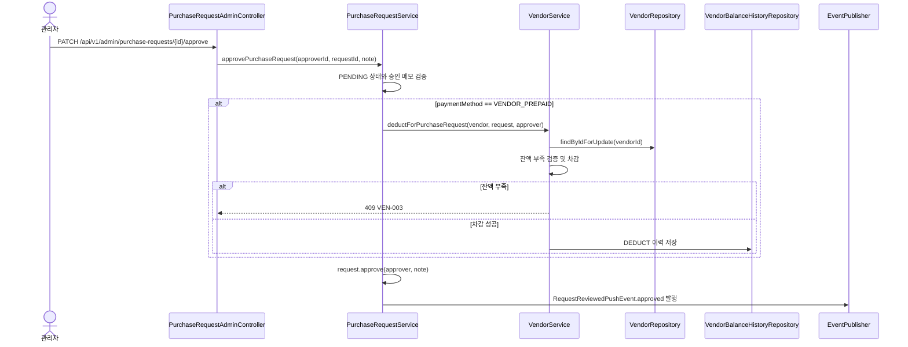
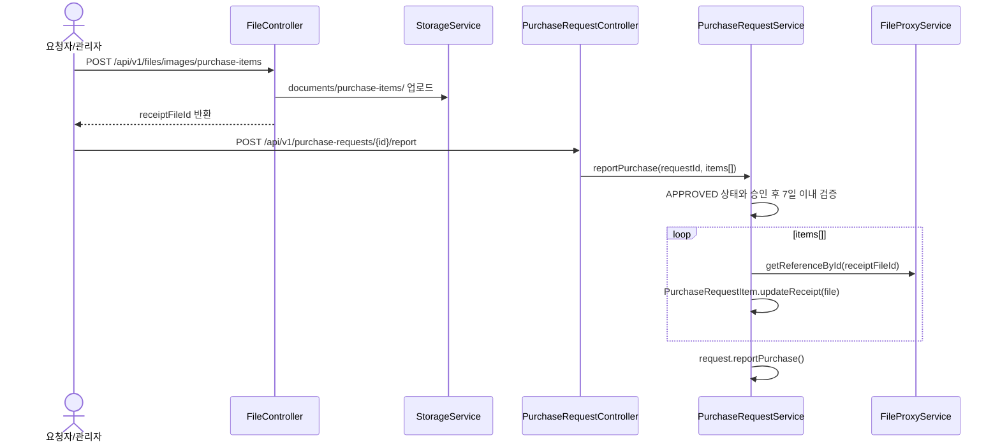
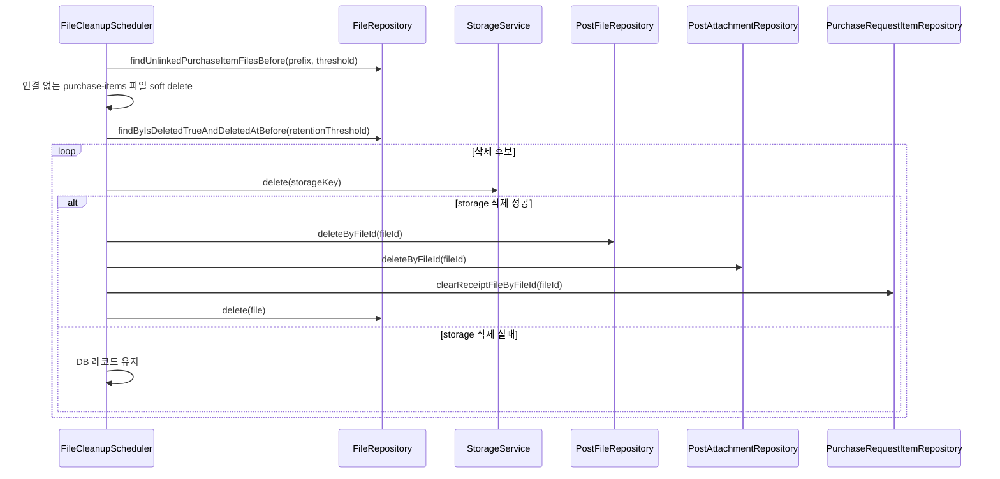

# Purchase Request API

구입 요청, 품목별 영수증, 거래처 선결제 흐름을 정리한 문서입니다.

이 문서는 `PurchaseRequestController`, `PurchaseRequestAdminController`, `VendorAdminController`, `FileController`, `PurchaseRequestService`, `VendorService`, `FileCleanupScheduler` 구현 기준으로 작성했습니다.

## 1. 역할과 범위

- 일반 사용자는 본인이 작성한 구입 요청을 생성, 조회, 삭제, 구매 완료 보고, 품목별 영수증 교체할 수 있습니다.
- 관리자 또는 `purchase-request:read:*` 권한자는 전체 구입 요청을 조회할 수 있습니다.
- 관리자 또는 `purchase-request:review:*` 권한자는 구입 요청을 승인/반려할 수 있습니다.
- 관리자 또는 `purchase-request:manage:*` 권한자는 처리 전 요청 삭제, 최종 결재 확인, 처리 후 품목별 영수증 교체를 수행할 수 있습니다.
- 거래처 생성/수정/삭제/충전은 관리자 또는 `vendor:manage:*` 권한자가 수행합니다.
- 거래처 상세/잔액 이력 조회는 관리자 또는 `vendor:read:*` 권한자가 수행합니다.

## 2. 핵심 규칙

### 2.1 구입 요청 상태

| 값 | 의미 |
|---|---|
| `PENDING` | 결재 신청 |
| `APPROVED` | 결재 승인 |
| `PURCHASED` | 구매 완료 보고 |
| `CONFIRMED` | 최종 결재 확인 |
| `REJECTED` | 반려 |

### 2.2 결제 방식

| 값 | 의미 |
|---|---|
| `NORMAL` | 일반 결제 |
| `VENDOR_PREPAID` | 거래처 선결제 잔액 차감 |

- `NORMAL` 요청에는 `vendorId`를 지정할 수 없습니다.
- `VENDOR_PREPAID` 요청에는 활성 거래처 `vendorId`가 필수입니다.
- `VENDOR_PREPAID` 승인 시 요청 총액만큼 거래처 잔액을 차감하고 `DEDUCT` 이력을 저장합니다.
- 거래처 잔액이 요청 총액보다 적으면 승인 요청은 `409 CONFLICT`로 실패하며 요청 상태와 거래처 잔액은 변경되지 않습니다.
- 거래처 잔액 차감은 같은 거래처에 대한 동시 승인 요청을 고려해 `PESSIMISTIC_WRITE` lock으로 거래처를 다시 조회한 뒤 수행합니다.

### 2.3 영수증 정책

- 영수증은 요청 단위가 아니라 품목 단위로만 관리합니다.
- 생성/수정 단계에서 `items[n].receiptFileId`로 품목별 영수증을 첨부할 수 있습니다.
- 구매 완료 보고 및 영수증 교체 API도 `items[].itemId`, `items[].receiptFileId`만 받습니다.
- 응답은 `items[].receiptFileId`, `items[].receiptFileUrl`을 반환합니다.
- 요청 단위 `receiptFileIds`, `receipts` 필드는 사용하지 않습니다.

### 2.4 임시 업로드 파일 정리

- 품목 영수증 이미지는 `POST /api/v1/files/images/purchase-items`로 먼저 업로드합니다.
- 업로드된 파일은 `documents/purchase-items/` 경로와 `files` 메타데이터로 저장됩니다.
- 파일이 `PurchaseRequestItem.receiptFile`에 연결되지 않은 상태로 `app.file.cleanup.temporary-retention-hours`를 초과하면 `FileCleanupScheduler`가 soft delete 처리합니다.
- soft delete 파일은 기존 파일 정리 정책에 따라 `app.file.cleanup.retention-days`가 지난 뒤 storage 삭제에 성공한 경우에만 DB에서 hard delete 됩니다.
- storage 삭제 실패 시 DB 레코드는 유지되어 다음 스케줄러 실행 때 재시도됩니다.

## 3. 대표 플로우

### 3.1 거래처 선결제 승인



### 3.2 품목별 영수증 업로드와 구매 완료 보고



### 3.3 미연동 품목 영수증 파일 정리



## 4. 주요 API

### 4.1 구입 요청 생성

- **URL**: `/api/v1/purchase-requests`
- **Method**: `POST`
- **권한**: 인증 사용자

```json
{
  "title": "교재 구입",
  "content": "수업에 필요한 교재를 구입합니다.",
  "classroomId": 1,
  "paymentMethod": "VENDOR_PREPAID",
  "vendorId": 1,
  "items": [
    {
      "name": "국어 교재",
      "reason": "수업 교재 부족",
      "price": 15000,
      "receiptFileId": "9e20d3e8-d4f2-42df-bf73-6dd97cc6fc2d"
    }
  ]
}
```

### 4.2 구입 요청 승인

- **URL**: `/api/v1/admin/purchase-requests/{requestId}/approve`
- **Method**: `PATCH`
- **권한**: `ADMIN` 또는 `purchase-request:review:*`

```json
{
  "note": "승인합니다."
}
```

### 4.3 구매 완료 보고

- **URL**: `/api/v1/purchase-requests/{requestId}/report`
- **Method**: `POST`
- **권한**: 인증 사용자 + 요청자 본인 조건

```json
{
  "items": [
    {
      "itemId": 10,
      "receiptFileId": "9e20d3e8-d4f2-42df-bf73-6dd97cc6fc2d"
    }
  ]
}
```

### 4.4 품목별 영수증 교체

| 대상 | URL | Method | 권한 |
|---|---|---|---|
| 사용자 | `/api/v1/purchase-requests/{requestId}/item-receipts` | `POST` | 인증 사용자 + 요청자 본인 조건 |
| 관리자 | `/api/v1/admin/purchase-requests/{requestId}/item-receipts` | `PATCH` | `ADMIN` 또는 `purchase-request:manage:*` |

### 4.5 거래처 관리

| 기능 | URL | Method | 권한 |
|---|---|---|---|
| 거래처 목록 | `/api/v1/admin/vendors` | `GET` | 인증 사용자 |
| 거래처 생성 | `/api/v1/admin/vendors` | `POST` | `ADMIN` 또는 `vendor:manage:*` |
| 거래처 상세 | `/api/v1/admin/vendors/{vendorId}` | `GET` | `ADMIN` 또는 `vendor:read:*` |
| 거래처 수정 | `/api/v1/admin/vendors/{vendorId}` | `PATCH` | `ADMIN` 또는 `vendor:manage:*` |
| 거래처 삭제 | `/api/v1/admin/vendors/{vendorId}` | `DELETE` | `ADMIN` 또는 `vendor:manage:*` |
| 거래처 충전 | `/api/v1/admin/vendors/{vendorId}/charges` | `POST` | `ADMIN` 또는 `vendor:manage:*` |
| 거래처 잔액 이력 | `/api/v1/admin/vendors/{vendorId}/histories` | `GET` | `ADMIN` 또는 `vendor:read:*` |

## 5. 주요 실패 케이스

| 상황 | HTTP | 코드 |
|---|---|---|
| 구입 요청 없음 | 404 | `PR-001` |
| 요청 접근 권한 없음 | 403 | `PR-002` |
| 이미 처리된 요청 승인/반려 | 409 | `PR-003` |
| 존재하지 않는 품목 보고 | 404 | `PR-004` |
| 승인 후 7일 초과 구매 보고 | 409 | `PR-005` |
| 결제 방식과 거래처 조합 오류 | 400 | `PR-007` |
| 거래처 없음 | 404 | `VEN-001` |
| 비활성 거래처 사용 | 409 | `VEN-002` |
| 거래처 잔액 부족 | 409 | `VEN-003` |

## 6. 사이드 이펙트

- `VENDOR_PREPAID` 승인 성공 시 거래처 잔액과 거래처 잔액 이력이 함께 변경됩니다.
- 승인 실패, 잔액 부족, 상태 오류가 발생하면 요청 상태와 거래처 잔액은 변경되지 않습니다.
- 구매 완료 보고 성공 시 요청 상태가 `PURCHASED`로 변경됩니다.
- 결재 확인 성공 시 요청 상태가 `CONFIRMED`로 변경됩니다.
- 품목별 영수증 교체는 요청 상태가 `APPROVED`, `PURCHASED`, `CONFIRMED`일 때만 허용됩니다. `PENDING`, `REJECTED` 상태에서는 변경할 수 없습니다.
- 미연동 품목 영수증 파일은 스케줄러에 의해 soft delete될 수 있으므로, 업로드 직후 생성/수정/보고 payload에 연결해야 합니다.
