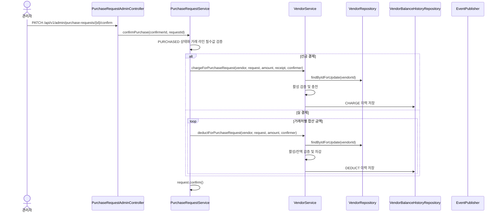
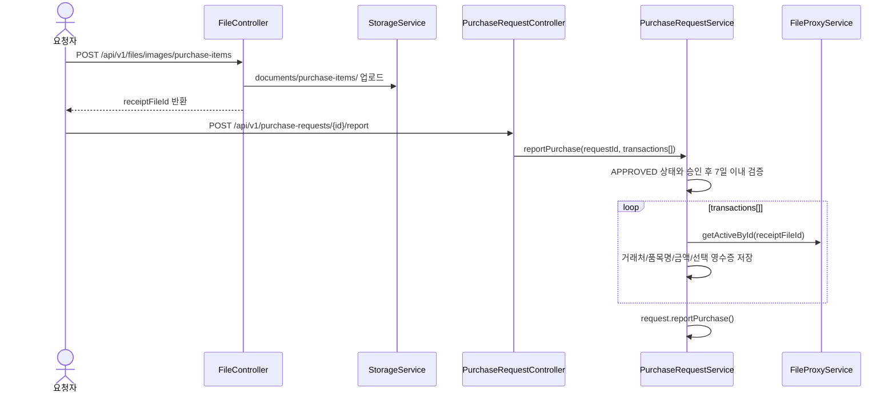
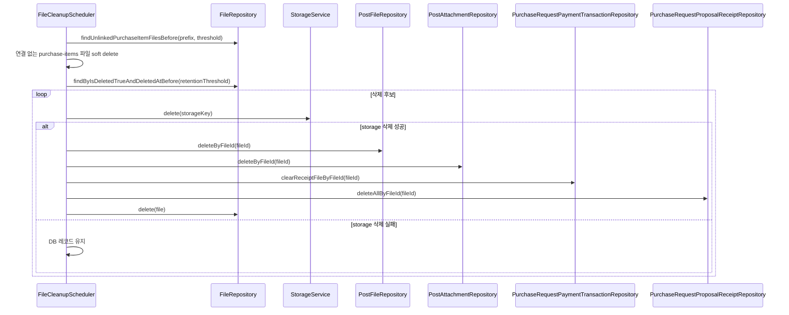

# Purchase Request API

구입 요청, 구매 완료 거래, 거래처 잔액 차감 흐름을 정리한 문서입니다.

이 문서는 `PurchaseRequestController`, `PurchaseRequestAdminController`, `VendorAdminController`, `FileController`, `PurchaseRequestService`, `VendorService`, `FileCleanupScheduler` 구현 기준으로 작성했습니다.

## 1. 역할과 범위

- 일반 사용자는 구입 요청 전체 목록과 상세를 조회할 수 있고, 본인이 작성한 요청을 수정·삭제·구매 완료 보고할 수 있습니다.
- 관리자 또는 `purchase-request:read:*` 권한자는 전체 구입 요청을 조회할 수 있습니다.
- 관리자 또는 `purchase-request:review:*` 권한자는 구입 요청을 승인/반려할 수 있습니다.
- 관리자 또는 `purchase-request:manage:*` 권한자는 처리 전 요청 삭제와 최종 결재 확인을 수행할 수 있습니다.
- 거래처 생성/수정/삭제/충전은 관리자 또는 `vendor:manage:*` 권한자가 수행합니다.
- 거래처 상세/잔액 이력 조회는 관리자 또는 `vendor:read:*` 권한자가 수행합니다.

## 2. 핵심 규칙

### 2.1 구입 요청 상태

| 값 | 의미 |
|---|---|
| `PENDING` | 결재 신청 |
| `APPROVED` | 결재 승인 |
| `PURCHASED` | 구매 완료 보고 |
| `CONFIRMED` | 최종 결재 확인 |
| `REJECTED` | 반려 |

### 2.2 결제 유형

| 값 | 의미 |
|---|---|
| `PREPAID` | 선금 결제 |
| `ACTUAL` | 실 결제 |

- 결제 유형은 결제 신청 단위의 `paymentType`으로 저장합니다.
- 하나의 결제 신청에는 `PREPAID`와 `ACTUAL` 품목을 혼합할 수 없습니다.
- `content`는 선택값이며 생략하거나 `null`로 전달할 수 있습니다.
- 요청 대상은 `classroomId`와 `departmentId` 중 정확히 하나를 지정합니다.
- 요청 생성 시 예상 금액, 거래처, 영수증은 받지 않습니다.
- 선금 결제는 신청의 모든 품목을 포함한 거래를 정확히 1건만 보고합니다.
- 실 결제는 신청 품목별로 거래를 정확히 1건씩 보고하며, 각 거래는 서로 다른 거래처를 선택할 수 있습니다.
- 선금 결제를 `CONFIRMED`로 전환하면 보고 금액만큼 거래처 잔액을 충전하고 `CHARGE` 이력을 저장합니다.
- 실 결제를 `CONFIRMED`로 전환하면 거래처별 총 결제 금액만큼 잔액을 차감하고 `DEDUCT` 이력을 저장합니다.
- 실 결제에서 거래처 잔액이 결제 금액보다 적으면 결재 확인 요청은 `409 CONFLICT`로 실패하며 요청 상태와 거래처 잔액은 변경되지 않습니다.
- 거래처 잔액 차감은 같은 거래처에 대한 동시 승인 요청을 고려해 `PESSIMISTIC_WRITE` lock으로 거래처를 다시 조회한 뒤 수행합니다.

### 2.3 영수증 정책

- 영수증은 구매 완료 거래 라인당 최대 1개를 첨부합니다.
- 선금 결제는 최종 결재 확인 시 활성 영수증이 필수이고, 실 결제의 영수증은 선택입니다.
- `paymentMethod`는 선금 결제 거래에서만 필수입니다. 실 결제에서 전달하더라도 서버는 저장하지 않습니다.
- 구매 완료 보고 API는 `transactions[].receiptFileId`를 받습니다.
- soft delete된 파일은 영수증으로 재연결할 수 없습니다.
- 품의서 DOCX에는 품의 단계와 구매 완료 거래에 연결된 영수증 이미지를 첨부하지 않습니다.
- 결의서 DOCX에는 활성 영수증 이미지를 문서 마지막에 영수증 1개당 1페이지로 첨부합니다.

### 2.4 임시 업로드 파일 정리

- 품목 영수증 이미지는 `POST /api/v1/files/images/purchase-items`로 먼저 업로드합니다.
- 업로드된 파일은 `documents/purchase-items/` 경로와 `files` 메타데이터로 저장됩니다.
- 파일이 구매 완료 거래 라인의 `receiptFile` 또는 활성 품의 단계 영수증에 연결되지 않은 상태로 `app.file.cleanup.temporary-retention-hours`를 초과하면 `FileCleanupScheduler`가 soft delete 처리합니다.
- soft delete 파일은 기존 파일 정리 정책에 따라 `app.file.cleanup.retention-days`가 지난 뒤 storage 삭제에 성공한 경우에만 DB에서 hard delete 됩니다.
- storage 삭제 실패 시 DB 레코드는 유지되어 다음 스케줄러 실행 때 재시도됩니다.

## 3. 대표 플로우

### 3.1 결재 확인 시 거래처 잔액 변경


```mermaid
sequenceDiagram
    actor Admin as 관리자
    participant API as PurchaseRequestAdminController
    participant PR as PurchaseRequestService
    participant VendorSvc as VendorService
    participant VendorRepo as VendorRepository
    participant HistoryRepo as VendorBalanceHistoryRepository
    participant Push as EventPublisher

    Admin->>API: PATCH /api/v1/admin/purchase-requests/{id}/confirm
    API->>PR: confirmPurchase(confirmerId, requestId)
    PR->>PR: PURCHASED 상태와 거래 라인 필수값 검증
    alt 선금 결제
        PR->>VendorSvc: chargeForPurchaseRequest(vendor, request, amount, receipt, confirmer)
        VendorSvc->>VendorRepo: findByIdForUpdate(vendorId)
        VendorSvc->>VendorSvc: 활성 검증 및 충전
        VendorSvc->>HistoryRepo: CHARGE 이력 저장
    else 실 결제
      loop 거래처별 합산 금액
        PR->>VendorSvc: deductForPurchaseRequest(vendor, request, amount, confirmer)
        VendorSvc->>VendorRepo: findByIdForUpdate(vendorId)
        VendorSvc->>VendorSvc: 활성/잔액 검증 및 차감
        VendorSvc->>HistoryRepo: DEDUCT 이력 저장
      end
    end
    PR->>PR: request.confirm()
```

### 3.2 영수증 업로드와 구매 완료 보고


```mermaid
sequenceDiagram
    actor User as 요청자
    participant FileAPI as FileController
    participant Storage as StorageService
    participant PRAPI as PurchaseRequestController
    participant PR as PurchaseRequestService
    participant FileProxy as FileProxyService

    User->>FileAPI: POST /api/v1/files/images/purchase-items
    FileAPI->>Storage: documents/purchase-items/ 업로드
    FileAPI-->>User: receiptFileId 반환
    User->>PRAPI: POST /api/v1/purchase-requests/{id}/report
    PRAPI->>PR: reportPurchase(requestId, transactions[])
    PR->>PR: APPROVED 상태와 승인 후 7일 이내 검증
    loop transactions[]
        PR->>FileProxy: getActiveById(receiptFileId)
        PR->>PR: 거래처/품목명/금액/선택 영수증 저장
    end
    PR->>PR: request.reportPurchase()
```

### 3.3 미연동 품목 영수증 파일 정리


```mermaid
sequenceDiagram
    participant Scheduler as FileCleanupScheduler
    participant FileRepo as FileRepository
    participant Storage as StorageService
    participant PostFile as PostFileRepository
    participant PostAttachment as PostAttachmentRepository
    participant TxRepo as PurchaseRequestPaymentTransactionRepository
    participant ProposalReceiptRepo as PurchaseRequestProposalReceiptRepository

    Scheduler->>FileRepo: findUnlinkedPurchaseItemFilesBefore(prefix, threshold)
    Scheduler->>Scheduler: 연결 없는 purchase-items 파일 soft delete
    Scheduler->>FileRepo: findByIsDeletedTrueAndDeletedAtBefore(retentionThreshold)
    loop 삭제 후보
        Scheduler->>Storage: delete(storageKey)
        alt storage 삭제 성공
            Scheduler->>PostFile: deleteByFileId(fileId)
            Scheduler->>PostAttachment: deleteByFileId(fileId)
            Scheduler->>TxRepo: clearReceiptFileByFileId(fileId)
            Scheduler->>ProposalReceiptRepo: deleteAllByFileId(fileId)
            Scheduler->>FileRepo: delete(file)
        else storage 삭제 실패
            Scheduler->>Scheduler: DB 레코드 유지
        end
    end
```

## 4. 주요 API

### 4.1 구입 요청 생성

- **URL**: `/api/v1/purchase-requests`
- **Method**: `POST`
- **권한**: `VOLUNTEER`, `MANAGER`, `ADMIN`

```json
{
  "title": "교재 구입",
  "content": "수업에 필요한 교재를 구입합니다.",
  "classroomId": 1,
  "paymentType": "PREPAID",
  "items": [
    {
      "name": "국어 교재",
      "reason": "수업 교재 부족",
      "quantity": 2
    }
  ]
}
```

### 4.2 구입 요청 목록 조회

구입 요청 목록 조회 API는 페이지 응답을 반환합니다. 프론트에서는 최상위 응답 객체의 `content`를 목록 데이터로 사용합니다.

#### 일반 목록 조회

- **URL**: `/api/v1/purchase-requests`
- **Method**: `GET`
- **권한**: `VOLUNTEER`, `MANAGER`, `ADMIN`

| 파라미터 | 타입 | 필수 | 설명 |
|---|---|---|---|
| `status` | `PurchaseRequestStatus` | N | 구입 요청 상태 필터. `PENDING`, `APPROVED`, `PURCHASED`, `CONFIRMED`, `REJECTED` |
| `paymentType` | `PurchasePaymentType` | N | 결제 유형 필터. `PREPAID`, `ACTUAL` |
| `mine` | boolean | N | `true`이면 로그인 사용자가 작성한 요청만 조회합니다. 기본값은 `false`입니다. |
| `keyword` | string | N | 제목, 분반명, 부서명, 작성자명 통합 검색어 |
| `classroomName` | string | N | 분반명 부분 검색어 |
| `departmentName` | string | N | 부서명 부분 검색어 |
| `requestedByName` | string | N | 작성자명 부분 검색어 |
| `page` | integer | N | 페이지 번호. 기본값은 `0`입니다. |
| `size` | integer | N | 페이지 크기. 기본값은 `10`, 최대값은 `100`입니다. |
| `sort` | string | N | 정렬 기준. 예: `createdAt,DESC`, `classroomName,ASC;createdAt,DESC` |

#### 관리자 전체 목록 조회

- **URL**: `/api/v1/admin/purchase-requests`
- **Method**: `GET`
- **권한**: `ADMIN` 또는 `purchase-request:read:*`

| 파라미터 | 타입 | 필수 | 설명 |
|---|---|---|---|
| `status` | `PurchaseRequestStatus` | N | 구입 요청 상태 필터. `PENDING`, `APPROVED`, `PURCHASED`, `CONFIRMED`, `REJECTED` |
| `paymentType` | `PurchasePaymentType` | N | 결제 유형 필터. `PREPAID`, `ACTUAL` |
| `keyword` | string | N | 제목, 분반명, 부서명, 작성자명 통합 검색어 |
| `classroomName` | string | N | 분반명 부분 검색어 |
| `departmentName` | string | N | 부서명 부분 검색어 |
| `requestedByName` | string | N | 작성자명 부분 검색어 |
| `page` | integer | N | 페이지 번호. 기본값은 `0`입니다. |
| `size` | integer | N | 페이지 크기. 기본값은 `10`, 최대값은 `100`입니다. |
| `sort` | string | N | 정렬 기준. 예: `createdAt,DESC`, `requestedByName,ASC;createdAt,DESC` |

#### 정렬 필드

| 필드 | 설명 |
|---|---|
| `id` | 구입 요청 ID |
| `title` | 제목 |
| `classroomName` | 분반명 |
| `departmentName` | 부서명 |
| `requestedByName` | 작성자명 |
| `totalPrice` | 구매 완료 보고 총액 |
| `status` | 상태 |
| `createdAt` | 생성일시 |
| `updatedAt` | 수정일시 |

`sort`를 생략하면 `createdAt,DESC;id,DESC` 기준으로 조회합니다.

#### 응답 예시

```json
{
  "content": [
    {
      "id": 1,
      "classroomId": 1,
      "classroomName": "벚꽃반",
      "departmentId": null,
      "departmentName": null,
      "requestedById": 2,
      "requestedByName": "홍길동",
      "title": "교재 구입",
      "paymentType": "PREPAID",
      "totalPrice": 100000,
      "status": "PURCHASED",
      "createdAt": "2026-06-30T10:00:00"
    }
  ],
  "page": 0,
  "size": 10,
  "totalElements": 1,
  "totalPages": 1
}
```

### 4.3 구입 요청 승인

- **URL**: `/api/v1/admin/purchase-requests/{requestId}/approve`
- **Method**: `PATCH`
- **권한**: `ADMIN` 또는 `purchase-request:review:*`

```json
{
  "note": "승인합니다."
}
```

### 4.4 구매 완료 보고

- **URL**: `/api/v1/purchase-requests/{requestId}/report`
- **Method**: `POST`
- **권한**: 인증 사용자 + 요청자 본인 조건

```json
{
  "transactions": [
    {
      "vendorId": 1,
      "itemNames": ["국어 교재", "복사용지"],
      "amount": 15000,
      "paymentMethod": "CARD",
      "receiptFileId": "9e20d3e8-d4f2-42df-bf73-6dd97cc6fc2d"
    }
  ]
}
```

`paymentMethod`는 선금 결제에서만 필수이며, 실 결제 요청에서는 생략합니다.

### 4.5 거래처 관리

| 기능 | URL | Method | 권한 |
|---|---|---|---|
| 거래처 목록 | `/api/v1/admin/vendors` | `GET` | 인증 사용자 |
| 거래처 생성 | `/api/v1/admin/vendors` | `POST` | `ADMIN` 또는 `vendor:manage:*` |
| 거래처 상세 | `/api/v1/admin/vendors/{vendorId}` | `GET` | `ADMIN` 또는 `vendor:read:*` |
| 거래처 수정 | `/api/v1/admin/vendors/{vendorId}` | `PATCH` | `ADMIN` 또는 `vendor:manage:*` |
| 거래처 삭제 | `/api/v1/admin/vendors/{vendorId}` | `DELETE` | `ADMIN` 또는 `vendor:manage:*` |
| 거래처 충전 | `/api/v1/admin/vendors/{vendorId}/charges` | `POST` | `ADMIN` 또는 `vendor:manage:*` |
| 거래처 잔액 이력 | `/api/v1/admin/vendors/{vendorId}/histories` | `GET` | `ADMIN` 또는 `vendor:read:*` |

### 4.6 품의 정보 저장 및 DOCX 생성

품의 정보 저장 API는 결제 유형을 제한하지 않으므로 `PREPAID`, `ACTUAL` 요청 모두 호출할 수 있습니다. 다만 프론트엔드는 결제 유형별 작성 템플릿을 분리하며, `ACTUAL` 요청에서는 품의 정보를 저장하지 않습니다. DOCX 출력은 `PREPAID` 요청에만 적용되며, 품의 정보를 먼저 저장한 뒤 별도의 요청 바디 없이 서버에 저장된 최신 정보로 문서를 생성합니다.

#### 품의 정보 저장

| 구분 | URL | Method | 권한 |
|---|---|---|---|
| 사용자 | `/api/v1/purchase-requests/{requestId}/proposal` | `PUT` | 최초 작성자 |
| 관리자 | `/api/v1/admin/purchase-requests/{requestId}/proposal` | `PUT` | `ADMIN` 또는 `purchase-request:manage:*` |

- 모든 필드는 중간 저장 시 선택값입니다.
- 요청 본문의 전체 상태로 교체하므로 수정할 때 현재 화면의 모든 품의 정보를 전달해야 합니다.
- `REJECTED`, `CONFIRMED` 상태에서는 품의 정보를 수정할 수 없습니다.
- 품의일자와 결제 통장을 저장하면 응답의 `proposalNumber`에 서버가 계산한 품의번호가 반환됩니다.

```json
{
  "proposalTitle": "7월 교재 구입",
  "resolutionTitle": "7월 교재 구입",
  "completionDate": "2026-07-30",
  "draftApprovals": [
    { "position": "총무", "name": "김담당" }
  ],
  "draftCooperations": [],
  "resolutionApprovals": [
    { "position": "교장", "name": "정해용" }
  ],
  "overview": "7월 교재 구입 비용을 지출하고자 합니다.",
  "policyProject": "성인문해교육 지원사업",
  "unitProject": "프로그램운영비",
  "detailProject": "교재 구입",
  "requestDepartmentId": 2,
  "proposalDate": "2026-07-25",
  "proposalAmount": 20000,
  "paymentAccount": "NATIONAL_SUBSIDY_04",
  "budget": {
    "itemCategory": "TEXTBOOK",
    "customItemCategory": null,
    "calculationDetail": "COMMERCIAL_TEXTBOOK",
    "customCalculationDetail": null
  },
  "items": [
    {
      "content": "국어 교재",
      "specification": "권",
      "quantity": 2,
      "estimatedUnitPrice": 10000
    }
  ]
}
```

#### 문서 출력 API

| 문서 | 사용자 URL | 관리자 URL | 생성 조건 |
|---|---|---|---|
| 품의서 | `/api/v1/purchase-requests/{requestId}/proposal-document` | `/api/v1/admin/purchase-requests/{requestId}/proposal-document` | `PREPAID`, `REJECTED`가 아닌 요청 |
| 결의서 | `/api/v1/purchase-requests/{requestId}/resolution-document` | `/api/v1/admin/purchase-requests/{requestId}/resolution-document` | `PREPAID`, `CONFIRMED`, 완료 요청일 저장 |

- **Method**: `POST`
- **요청 바디**: 없음
- **사용자 권한**: 최초 작성자
- **관리자 권한**: `ADMIN` 또는 `purchase-request:manage:*`
- **응답**: `application/vnd.openxmlformats-officedocument.wordprocessingml.document`
- **품의서 파일명**: `품의서-{품의서 제목}-{생성일}.docx`
- **결의서 파일명**: `결의서-{결의서 제목}-{생성일}.docx`

#### 문서 값 매핑

| 문서 위치 | 값 출처 |
|---|---|
| 품의서 제목 | `proposal.proposalTitle`, 없으면 구매 요청 `title` |
| 결의서 제목 | `proposal.resolutionTitle`, 없으면 구매 요청 `title` |
| 품의번호 | `proposal.proposalDate`, `proposal.paymentAccount`로 서버 계산 |
| 결의번호 | 품의번호의 첫 번째 `품`을 `결`로 변환 |
| 품의 개요 | `proposal.overview` |
| 정책·단위·세부 사업 | `proposal.policyProject`, `unitProject`, `detailProject` |
| 요구 부서 | `proposal.requestDepartmentName` |
| 예산내역 세부항목 | `proposal.budget.itemCategory` 또는 `customItemCategory` |
| 예산내역 산출내역 | `proposal.budget.calculationDetail` 또는 `customCalculationDetail` |
| 품목내역 | `proposal.items[]` |
| 품의서 결재·협조선 | `proposal.draftApprovals`, `proposal.draftCooperations` |
| 결의서 결재선 | `proposal.resolutionApprovals` |
| 지급 구분·거래처 | 구매 완료 거래 `transactions[]` |
| 품의서 영수증 | 첨부하지 않음 |
| 결의서 영수증 | 품의 단계와 구매 완료 거래에 연결된 활성 영수증을 1개당 1페이지로 첨부 |

문서 생성 전에 구입 요청 상세 조회 응답의 `proposal`과 `transactions`를 통해 저장된 값을 확인할 수 있습니다.

```http
GET /api/v1/purchase-requests/{requestId}
GET /api/v1/admin/purchase-requests/{requestId}
```

## 5. 주요 실패 케이스

| 상황 | HTTP | 코드 |
|---|---|---|
| 구입 요청 없음 | 404 | `PR-001` |
| 요청 접근 권한 없음 | 403 | `PR-002` |
| 이미 처리된 요청 승인/반려 | 409 | `PR-003` |
| 존재하지 않는 품목 보고 | 404 | `PR-004` |
| 승인 후 7일 초과 구매 보고 | 409 | `PR-005` |
| 현재 상태에서 처리할 수 없음 | 409 | `PR-006` |
| 결제 방식과 거래처 정보 오류 | 400 | `PR-007` |
| 지출증빙서류 템플릿 없음/읽기 실패 | 500 | `PR-008`, `PR-009` |
| 선금 결제가 아닌 구매 요청의 지출증빙서류 생성 | 409 | `PR-011` |
| 지출증빙서류 생성 실패 | 500 | `PR-012` |
| 지출증빙서류 영수증 파일 읽기 실패 | 500 | `PR-013` |
| 지원하지 않는 영수증 이미지 형식 | 409 | `PR-014` |
| 결제 유형과 거래·품목 구성 불일치 | 400 | `PR-016` |
| 선금 결제 최종 승인 영수증 누락 | 409 | `PR-017` |
| 현재 상태에서 품의 정보 수정 불가 | 409 | `PR-018` |
| 품의 단계 영수증 없음 | 404 | `PR-019` |
| 최종 확인에 필요한 품의 정보/필수값 누락 | 409 | `PR-020`, `PR-021` |
| 품의금액과 품목 예상 금액 합계 불일치 | 409 | `PR-022` |
| 품의금액과 실제 결제 금액 불일치 | 409 | `PR-023` |
| 현재 상태에서 품의서/결의서 생성 불가 | 409 | `PR-024`, `PR-025` |
| 결의서 완료 요청일 누락 | 409 | `PR-026` |
| 거래처 없음 | 404 | `VEN-001` |
| 비활성 거래처 사용 | 409 | `VEN-002` |
| 거래처 잔액 부족 | 409 | `VEN-003` |

## 6. 사이드 이펙트

- 결재 확인 성공 시 거래처 잔액과 거래처 잔액 이력이 함께 변경됩니다.
- 잔액 부족, 거래처 비활성, 상태 오류가 발생하면 요청 상태와 거래처 잔액은 변경되지 않습니다.
- 구매 완료 보고 성공 시 요청 상태가 `PURCHASED`로 변경됩니다.
- 결재 확인 성공 시 요청 상태가 `CONFIRMED`로 변경됩니다.
- 미연동 품목 영수증 파일은 스케줄러에 의해 soft delete될 수 있으므로, 업로드 직후 보고 payload에 연결해야 합니다.
