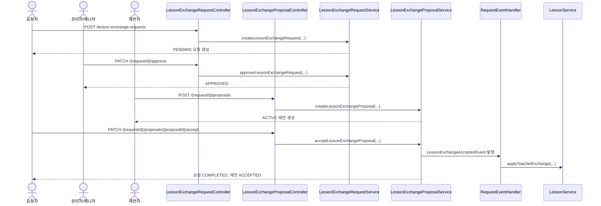
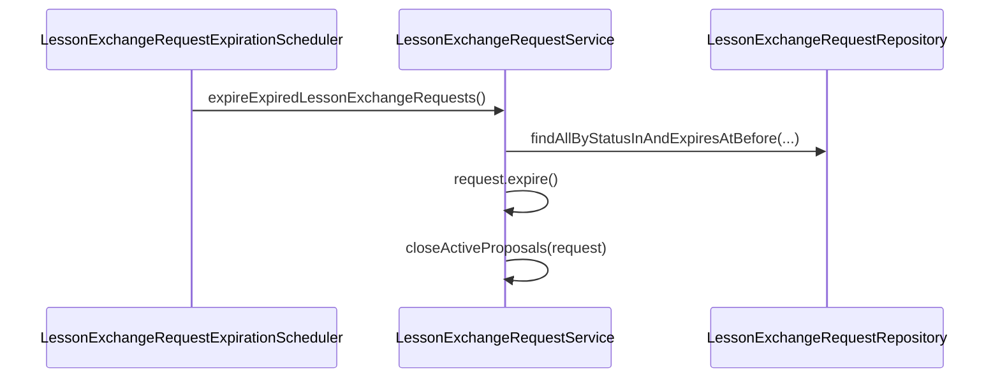

# Request API

요청 도메인의 결석 요청, 수업 교환 요청/제안 API를 정리한 문서입니다.

이 문서는 `AbsenceRequestController`, `LessonExchangeRequestController`, `LessonExchangeProposalController`, 각 서비스 구현, 그리고 요청/제안 E2E 테스트 기준으로 작성했습니다.

## 1. 역할과 범위

- 교사 이상 권한(`VOLUNTEER`, `MANAGER`, `ADMIN`) 사용자가 요청 기능에 접근할 수 있습니다.
- 결석 요청은 대상 수업의 담당 교사만 생성할 수 있습니다. 관리자/매니저도 담당 교사가 아니면 대리 생성할 수 없습니다.
- 봉사자가 자신의 수업에 대해 교환 요청을 생성, 수정, 취소합니다.
- 결석 요청은 관리자 또는 `absence-request:manage:*` 권한자가 승인/반려합니다.
- 수업 교환 요청은 관리자 또는 `lesson-exchange-request:manage:*` 권한자가 승인/반려합니다.
- 다른 봉사자가 승인된 요청에 교환 제안을 생성, 수정, 철회합니다.
- 요청자가 제안 하나를 수락하면 실제 lesson의 teacher가 변경됩니다.
- 만료 시각이 지난 요청은 스케줄러가 자동으로 `EXPIRED` 처리합니다.

## 2. 핵심 규칙

### 2.1 요청 상태

| 값 | 의미 |
|---|---|
| `PENDING` | 승인 대기 |
| `APPROVED` | 승인 완료 |
| `REJECTED` | 반려 완료 |
| `COMPLETED` | 제안 수락 후 교환 완료 |
| `EXPIRED` | 만료 시각 경과로 자동 종료 |
| `CANCELLED` | 요청자 취소 |

### 2.2 제안 상태

| 값 | 의미 |
|---|---|
| `ACTIVE` | 유효한 제안 |
| `WITHDRAWN` | 제안자 철회 |
| `ACCEPTED` | 요청자가 선택한 제안 |
| `CLOSED` | 다른 제안 수락 또는 요청 만료로 종료 |

### 2.3 하루 단위 교환 규칙

- 요청과 제안은 교시 범위를 입력받지 않습니다.
- 요청은 `lessonDate`에 해당하는 요청자 수업 전체를 하루 단위로 대상으로 삼습니다.
- 교환형 제안은 `lessonDate`에 해당하는 제안자 수업 전체를 하루 단위로 대상으로 삼습니다.
- 교환형 제안은 요청과 같은 날짜로 생성하거나 수정할 수 없습니다.

### 2.4 제안 타입 규칙

| 조건 | proposalType |
|---|---|
| `lessonDate` 있음 | `EXCHANGE` |
| `lessonDate` 없음 | `SUBSTITUTION` |

- `EXCHANGE`는 제안자가 자신의 다른 수업을 내놓는 교환형 제안입니다.
- `SUBSTITUTION`은 제안 수업 없이 요청 수업을 대신 맡는 대체형 제안입니다.

### 2.5 표시값 snapshot 정책

- 요청/제안 생성·수정 시 반 이름을 snapshot으로 저장합니다.
- 제안 수락 후 실제 lesson의 teacher가 변경되더라도 요청/제안 화면에 보이는 반 이름은 유지됩니다.
- `SUBSTITUTION` 제안은 제안 자체에 대응하는 교환 수업이 없으므로 `classroomName`을 저장/반환하지 않습니다.

### 2.6 수업 교환 기본 목록 조회 정책

- `GET /lesson-exchange-requests`
  - `status` 미지정 시 `CANCELLED` 제외
- `GET /lesson-exchange-requests/{requestId}/proposals`
  - `WITHDRAWN` 제외

### 2.7 수업 교환 자동 만료 정책

- `PENDING`, `APPROVED` 요청 중 `expiresAt`이 지난 요청은 스케줄러가 자동으로 `EXPIRED` 처리합니다.
- 만료된 요청에 달린 `ACTIVE` 제안은 함께 `CLOSED` 처리합니다.
- 수동 만료 API는 두지 않습니다.

## 3. 권한 정책

| API | 권한 |
|---|---|
| 결석 요청 생성 | `VOLUNTEER`, `MANAGER`, `ADMIN` + 대상 수업 담당 교사 조건 |
| 결석 요청 목록/상세 조회 | `VOLUNTEER`, `MANAGER`, `ADMIN`, `absence-request:read:*` |
| 결석 요청 전체 조회 | `ADMIN`, `absence-request:read:*` |
| 결석 요청 승인/반려 | `ADMIN`, `absence-request:manage:*` |
| 결석 요청 취소 | `VOLUNTEER`, `MANAGER`, `ADMIN` + 요청자 본인 조건 |
| 수업 교환 요청 생성/수정/취소 | 교사 이상 권한 + 요청자 본인 조건 |
| 수업 교환 요청 목록/상세 조회 | 교사 이상 권한 |
| 수업 교환 요청 승인/반려 | `ADMIN` 또는 `lesson-exchange-request:manage:*` |
| 제안 생성/수정/철회 | 교사 이상 권한 + 제안자 본인 조건 |
| 제안 목록 조회 | 교사 이상 권한 |
| 제안 수락 | 교사 이상 권한 + 요청자 본인 조건 |

## 4. 관리자 콘솔

### 4.1 수업 교환 요청 관리자 대시보드

- **URL**: `/admin/request/lesson-exchange`
- **Method**: `GET`
- **Description**: 관리자 콘솔에서 수업 교환 요청과 제안의 처리 현황을 조회합니다.

### 표시 항목

- 수업 교환 요청 상태별 건수
  - `PENDING`, `APPROVED`, `REJECTED`, `COMPLETED`, `EXPIRED`, `CANCELLED`
- 수업 교환 제안 상태별 건수
  - `ACTIVE`, `WITHDRAWN`, `ACCEPTED`, `CLOSED`
- 승인 검토가 필요한 `PENDING` 요청 목록
  - 오래된 요청부터 최대 10건
  - 요청 ID, 제목, 반 이름, 요청자, 수업일, 만료 시각, 제안 수, 상태, 생성일 표시

### 관리자 액션

| 화면 액션 | URL | Method | 권한 | 설명 |
|---|---|---|---|---|
| 수업 교환 요청 승인 | `/admin/request/lesson-exchange/{requestId}/approve` | `POST` | `ADMIN` 또는 `lesson-exchange-request:manage:*` | `PENDING` 요청을 `APPROVED`로 변경 |
| 수업 교환 요청 반려 | `/admin/request/lesson-exchange/{requestId}/reject` | `POST` | `ADMIN` 또는 `lesson-exchange-request:manage:*` | `PENDING` 요청을 `REJECTED`로 변경하고 반려 사유 저장 |

### 구현 기준 동작

- 관리자 콘솔 액션은 기존 `LessonExchangeRequestService`의 승인/반려 로직을 재사용합니다.
- 승인/반려 후 `/admin/request/lesson-exchange`로 리다이렉트하고 처리 결과 메시지를 표시합니다.
- 제안은 승인된 요청에 대해서만 생성할 수 있으므로, 관리자 대시보드의 검토 필요 목록은 제안 수가 0일 수 있습니다.

## 5. 결석 요청 API

## 5.1 결석 요청 생성

- **URL**: `/api/v1/absence-requests`
- **Method**: `POST`
- **Description**: 대상 수업의 담당 교사가 결석 요청을 생성합니다. `ADMIN`, `MANAGER` 권한이 있어도 담당 교사가 아니면 대리 생성할 수 없습니다.

### Request Body 예시

```json
{
  "lessonId": 1,
  "title": "개인 사정으로 결석합니다",
  "reason": "개인 사정으로 인한 결석"
}
```

### Response Body 예시

```json
{
  "id": 10,
  "lessonId": 1,
  "lessonDate": "2026-05-12",
  "requestedById": 3,
  "requestedByName": "홍길동",
  "title": "개인 사정으로 결석합니다",
  "reason": "개인 사정으로 인한 결석",
  "expiresAt": "2026-05-12T00:00:00",
  "status": "PENDING",
  "approvalAt": null,
  "approvalByName": null,
  "note": null,
  "createdAt": "2026-05-08T12:00:00"
}
```

### 구현 기준 동작

- 요청은 `PENDING` 상태로 생성됩니다.
- `expiresAt`은 입력받지 않고 대상 수업일의 00:00으로 자동 설정합니다.
- 같은 수업에 같은 요청자의 `PENDING` 또는 `APPROVED` 결석 요청이 있으면 중복 생성할 수 없습니다.
- `REJECTED`, `CANCELLED` 요청은 재요청을 막지 않습니다.
- 생성 시점에 이미 만료된 수업 당일 또는 과거 수업은 요청할 수 없습니다.

### 주요 실패 케이스

| 상황 | HTTP |
|---|---|
| 대상 수업 담당 교사가 아님 | 403 |
| 같은 수업에 진행 중인 결석 요청 존재 | 409 |
| 이미 만료된 수업에 대한 요청 | 400 |

## 5.2 결석 요청 목록 조회

- **URL**: `/api/v1/absence-requests`
- **Method**: `GET`
- **Description**: 결석 요청 목록을 페이지로 조회합니다.

### Query Parameters

| 파라미터 | 설명 |
|---|---|
| `status` | 특정 상태만 조회 |
| `page` | 페이지 번호, 기본값 0 |
| `size` | 페이지 크기, 기본값 10 |

### 조회 범위

- `ADMIN` 또는 `absence-request:read:*` 권한 사용자는 전체 결석 요청을 조회합니다.
- 그 외 `VOLUNTEER`, `MANAGER` 사용자는 본인이 요청한 결석 요청만 조회합니다.

### Response Body 예시

```json
{
  "content": [
    {
      "id": 10,
      "lessonId": 1,
      "lessonDate": "2026-05-12",
      "requestedById": 3,
      "requestedByName": "홍길동",
      "title": "개인 사정으로 결석합니다",
      "reason": "개인 사정으로 인한 결석",
      "expiresAt": "2026-05-12T00:00:00",
      "status": "PENDING",
      "approvalAt": null,
      "approvalByName": null,
      "note": null,
      "createdAt": "2026-05-08T12:00:00"
    }
  ],
  "page": 0,
  "size": 10,
  "totalElements": 1,
  "totalPages": 1
}
```

## 5.3 결석 요청 상세 조회

- **URL**: `/api/v1/absence-requests/{requestId}`
- **Method**: `GET`
- **Description**: 결석 요청 단건 상세를 조회합니다.

### 조회 범위

- `ADMIN` 또는 `absence-request:read:*` 권한 사용자는 모든 요청을 조회할 수 있습니다.
- 그 외 `VOLUNTEER`, `MANAGER` 사용자는 본인이 요청한 결석 요청만 조회할 수 있습니다.

## 5.4 결석 요청 승인

- **URL**: `/api/v1/absence-requests/{requestId}/approve`
- **Method**: `PATCH`
- **Description**: `ADMIN` 또는 `absence-request:manage:*` 권한 사용자가 `PENDING` 상태의 결석 요청을 승인합니다.

### Side Effects

- 요청 상태가 `APPROVED`로 변경됩니다.
- `approvalAt`, `approvalBy`가 기록됩니다.
- `AbsenceApprovedEvent`가 발행되고, 대상 수업의 `teacherAttendance`가 `EXCUSED`로 변경됩니다.
- 이미 `APPROVED`, `REJECTED`, `CANCELLED`, `EXPIRED` 상태인 요청은 재처리할 수 없습니다.

## 5.5 결석 요청 반려

- **URL**: `/api/v1/absence-requests/{requestId}/reject`
- **Method**: `PATCH`
- **Description**: `ADMIN` 또는 `absence-request:manage:*` 권한 사용자가 `PENDING` 상태의 결석 요청을 반려합니다.

### Request Body 예시

```json
{
  "note": "운영 일정과 충돌합니다."
}
```

### Side Effects

- 요청 상태가 `REJECTED`로 변경됩니다.
- `approvalAt`, `approvalBy`, `note`가 기록됩니다.
- 이미 `APPROVED`, `REJECTED`, `CANCELLED`, `EXPIRED` 상태인 요청은 재처리할 수 없습니다.

## 5.6 결석 요청 취소

- **URL**: `/api/v1/absence-requests/{requestId}`
- **Method**: `DELETE`
- **Description**: 요청자 본인이 `PENDING` 상태의 결석 요청을 취소합니다.

### Side Effects

- 요청을 물리 삭제하지 않고 상태를 `CANCELLED`로 변경합니다.
- 수업 출석 상태를 변경하지 않습니다.
- 본인 요청이 아니거나 이미 처리된 요청이면 취소할 수 없습니다.

## 5.7 결석 요청 자동 만료

- `PENDING` 상태의 결석 요청 중 `expiresAt`이 지난 요청은 스케줄러가 자동으로 `EXPIRED` 처리합니다.
- `expiresAt`은 수업 하루 전까지 처리를 유도하기 위해 대상 수업일의 00:00으로 자동 설정됩니다.
- 만료된 요청은 승인, 반려, 취소할 수 없습니다.

## 6. 수업 교환 요청 API

## 6.1 요청 생성

- **URL**: `/api/v1/lesson-exchange-requests`
- **Method**: `POST`
- **Description**: 교사 이상 권한 사용자가 본인이 담당하는 수업에 대해 수업 교환 요청을 생성합니다.

### Request Body 예시

```json
{
  "lessonDate": "2026-05-12",
  "title": "금요일 수업 교환 요청",
  "content": "개인 일정으로 인해 교환이 필요합니다.",
  "expiresAt": "2026-05-09T23:00:00"
}
```

### Side Effects

- 요청은 `PENDING` 상태로 생성됩니다.
- 요청 날짜의 수업에 대응하는 반 이름 snapshot이 함께 저장됩니다.

### 주요 실패 케이스

| 상황 | HTTP |
|---|---|
| 본인 수업이 아닌 날짜 | 403 |
| 이미 같은 날짜에 `PENDING`/`APPROVED` 요청 존재 | 409 |
| 교환 요청 가능 기간(현재+4일) 이전 수업 | 400 |
| 만료 시각 정책 위반 | 400 |

## 6.2 요청 목록 조회

- **URL**: `/api/v1/lesson-exchange-requests`
- **Method**: `GET`
- **Description**: 교사 이상 권한 사용자가 수업 교환 요청 목록을 조회합니다.

### Query Parameters

| 파라미터 | 설명 |
|---|---|
| `status` | 특정 상태만 조회 |
| `mine` | `true`면 본인 요청만 조회 |

## 6.3 요청 상세 조회

- **URL**: `/api/v1/lesson-exchange-requests/{requestId}`
- **Method**: `GET`
- **Description**: 교사 이상 권한 사용자가 수업 교환 요청 단건 상세를 조회합니다.

## 6.4 요청 수정

- **URL**: `/api/v1/lesson-exchange-requests/{requestId}`
- **Method**: `PATCH`
- **Description**: 교사 이상 권한의 요청자 본인이 `PENDING` 상태 요청을 수정합니다.

### 구현 기준 동작

- 요청 생성과 동일한 입력 정책을 사용합니다.
- 수정 후 반 이름 snapshot도 함께 갱신됩니다.
- 요청 날짜를 변경하면 변경된 날짜의 요청자 수업 전체를 하루 단위로 다시 검증합니다.

## 6.5 요청 취소

- **URL**: `/api/v1/lesson-exchange-requests/{requestId}/cancel`
- **Method**: `PATCH`
- **Description**: 교사 이상 권한의 요청자 본인이 `PENDING` 상태 요청을 취소합니다.

### Side Effects

- 요청 상태가 `CANCELLED`로 변경됩니다.
- `cancelledAt`이 기록됩니다.

## 6.6 요청 승인

- **URL**: `/api/v1/lesson-exchange-requests/{requestId}/approve`
- **Method**: `PATCH`
- **Description**: 관리자 또는 `lesson-exchange-request:manage:*` 권한 사용자가 `PENDING` 요청을 승인합니다.

### Side Effects

- 요청 상태가 `APPROVED`로 변경됩니다.
- `processedAt`, `processedBy`가 기록됩니다.

## 6.7 요청 반려

- **URL**: `/api/v1/lesson-exchange-requests/{requestId}/reject`
- **Method**: `PATCH`
- **Description**: 관리자 또는 `lesson-exchange-request:manage:*` 권한 사용자가 `PENDING` 요청을 반려합니다.

### Request Body 예시

```json
{
  "note": "운영 일정과 충돌합니다."
}
```

### Side Effects

- 요청 상태가 `REJECTED`로 변경됩니다.
- `processedAt`, `processedBy`, `rejectionNote`가 기록됩니다.

## 7. 수업 교환 제안 API

## 7.1 제안 생성

- **URL**: `/api/v1/lesson-exchange-requests/{requestId}/proposals`
- **Method**: `POST`
- **Description**: 교사 이상 권한 사용자가 승인된 요청에 대해 교환형 또는 대체형 제안을 생성합니다.

### 교환형 예시

```json
{
  "lessonDate": "2026-05-13",
  "content": "수요일 수업으로 교환 가능합니다."
}
```

### 대체형 예시

```json
{
  "content": "해당 수업을 대신 진행할 수 있습니다."
}
```

### 구현 기준 동작

- 같은 요청에 대해 동일 제안자는 `ACTIVE` 제안 1건만 가질 수 있습니다.
- `EXCHANGE` 제안은 요청 날짜와 같은 날짜로 생성할 수 없습니다.
- `EXCHANGE` 제안은 제안 날짜에 제안자의 수업이 있어야 하며, 해당 날짜 수업 전체가 교환 대상입니다.
- `SUBSTITUTION` 제안은 요청 수업 시간대에 제안자의 기존 수업이 충돌하면 생성할 수 없습니다.

## 7.2 제안 목록 조회

- **URL**: `/api/v1/lesson-exchange-requests/{requestId}/proposals`
- **Method**: `GET`
- **Description**: 교사 이상 권한 사용자가 특정 요청에 등록된 제안 목록을 최신순으로 조회합니다.

## 7.3 제안 수정

- **URL**: `/api/v1/lesson-exchange-requests/{requestId}/proposals/{proposalId}`
- **Method**: `PATCH`
- **Description**: 교사 이상 권한의 제안자 본인이 `ACTIVE` 제안을 수정합니다.

### 구현 기준 동작

- 생성과 동일한 입력 정책을 사용합니다.
- `EXCHANGE <-> SUBSTITUTION` 전환이 가능합니다.
- 교환형으로 수정될 때는 제안 날짜의 제안자 수업 전체를 기준으로 반 이름 snapshot을 다시 계산합니다.

## 7.4 제안 철회

- **URL**: `/api/v1/lesson-exchange-requests/{requestId}/proposals/{proposalId}/withdraw`
- **Method**: `PATCH`
- **Description**: 교사 이상 권한의 제안자 본인이 `ACTIVE` 제안을 철회합니다.

### Side Effects

- 제안 상태가 `WITHDRAWN`으로 변경됩니다.
- `withdrawnAt`이 기록됩니다.

## 7.5 제안 수락

- **URL**: `/api/v1/lesson-exchange-requests/{requestId}/proposals/{proposalId}/accept`
- **Method**: `PATCH`
- **Description**: 교사 이상 권한의 요청자가 `ACTIVE` 제안 하나를 수락합니다.

### Side Effects

- 요청 상태가 `COMPLETED`로 변경됩니다.
- 선택된 제안은 `ACCEPTED`
- 같은 요청의 나머지 `ACTIVE` 제안은 `CLOSED`
- 실제 lesson의 teacher 변경 이벤트가 발행됩니다.

### 구현 기준 동작

- `EXCHANGE`
  - 요청 날짜의 요청자 수업 전체 teacher를 제안자로 변경
  - 제안 날짜의 제안자 수업 전체 teacher를 요청자로 변경
- `SUBSTITUTION`
  - 요청 날짜의 요청자 수업 전체 teacher를 제안자로 변경

## 8. 대표 시퀀스

### 8.1 요청 생성 → 승인 → 제안 생성 → 수락



### 8.2 자동 만료


