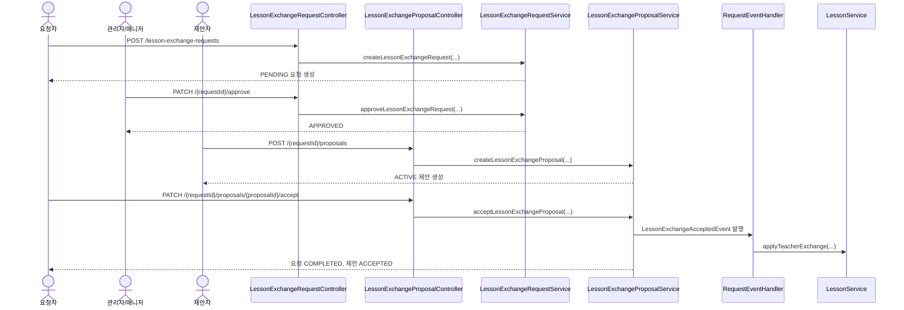
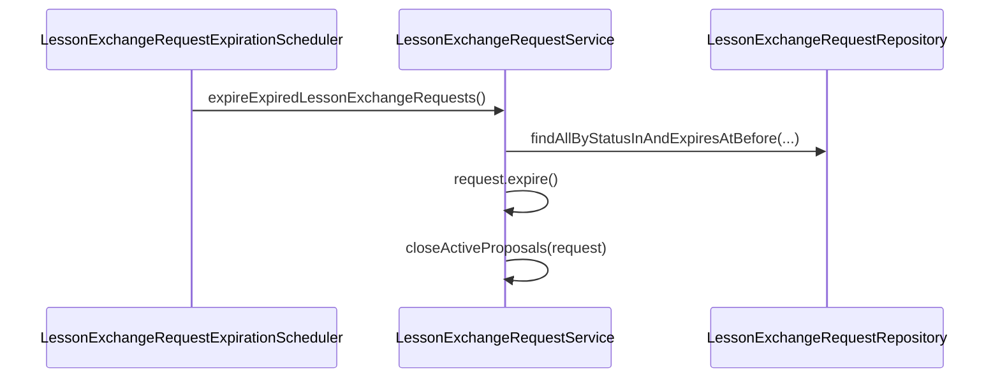

# Request API

요청 도메인 중 수업 교환 요청/제안 API를 정리한 문서입니다.

이 문서는 `LessonExchangeRequestController`, `LessonExchangeProposalController`, 각 서비스 구현, 그리고 요청/제안 E2E 테스트 기준으로 작성했습니다.

## 1. 역할과 범위

- 봉사자가 자신의 수업에 대해 교환 요청을 생성, 수정, 취소합니다.
- 관리자/매니저가 요청을 승인/반려합니다.
- 다른 봉사자가 승인된 요청에 교환 제안을 생성, 수정, 철회합니다.
- 요청자가 제안 하나를 수락하면 실제 lesson의 teacher가 변경됩니다.
- 만료 시각이 지난 요청은 스케줄러가 자동으로 `EXPIRED` 처리합니다.

## 2. 핵심 규칙

### 2.1 요청 상태

| 값 | 의미 |
|---|---|
| `PENDING` | 승인 대기 |
| `APPROVED` | 관리자/매니저 승인 완료 |
| `REJECTED` | 반려 완료 |
| `COMPLETED` | 제안 수락 후 교환 완료 |
| `EXPIRED` | 만료 시각 경과로 자동 종료 |
| `CANCELLED` | 요청자 취소 |

### 2.2 제안 상태

| 값 | 의미 |
|---|---|
| `ACTIVE` | 유효한 제안 |
| `WITHDRAWN` | 제안자 철회 |
| `ACCEPTED` | 요청자가 선택한 제안 |
| `CLOSED` | 다른 제안 수락 또는 요청 만료로 종료 |

### 2.3 교환 범위 규칙

- 요청은 `scope`를 직접 받지 않습니다.
- `startPeriod`, `endPeriod`가 모두 없으면 `FULL`
- 둘 다 있으면 `PARTIAL`
- 하나만 있거나 잘못된 범위면 400

제안도 동일한 교시 입력 규칙을 따릅니다.

### 2.4 제안 타입 규칙

| 조건 | proposalType |
|---|---|
| `lessonDate` 있음 | `EXCHANGE` |
| `lessonDate` 없음 | `SUBSTITUTION` |

- `EXCHANGE`는 제안자가 자신의 다른 수업을 내놓는 교환형 제안입니다.
- `SUBSTITUTION`은 제안 수업 없이 요청 수업을 대신 맡는 대체형 제안입니다.

### 2.5 표시값 snapshot 정책

- 요청/제안 생성·수정 시 반 이름을 snapshot으로 저장합니다.
- 제안 수락 후 실제 lesson의 teacher가 변경되더라도 요청/제안 화면에 보이는 반 이름은 유지됩니다.
- `SUBSTITUTION` 제안은 제안 자체에 대응하는 교환 수업이 없으므로 `classroomName`을 저장/반환하지 않습니다.

### 2.6 기본 목록 조회 정책

- `GET /lesson-exchange-requests`
  - `status` 미지정 시 `CANCELLED` 제외
- `GET /lesson-exchange-requests/{requestId}/proposals`
  - `WITHDRAWN` 제외

### 2.7 자동 만료 정책

- `PENDING`, `APPROVED` 요청 중 `expiresAt`이 지난 요청은 스케줄러가 자동으로 `EXPIRED` 처리합니다.
- 만료된 요청에 달린 `ACTIVE` 제안은 함께 `CLOSED` 처리합니다.
- 수동 만료 API는 두지 않습니다.

## 3. 권한 정책

| API | 권한 |
|---|---|
| 요청 생성/수정/취소 | 인증 사용자(요청자 본인 조건 추가) |
| 요청 목록/상세 조회 | 인증 사용자 |
| 요청 승인/반려 | `ADMIN`, `MANAGER` |
| 제안 생성/수정/철회 | 인증 사용자(제안자 본인 조건 추가) |
| 제안 목록 조회 | 인증 사용자 |
| 제안 수락 | 인증 사용자(요청자 본인 조건 추가) |

## 4. 수업 교환 요청 API

## 4.1 요청 생성

- **URL**: `/api/v1/lesson-exchange-requests`
- **Method**: `POST`
- **Description**: 본인이 담당하는 수업에 대해 수업 교환 요청을 생성합니다.

### Request Body 예시

```json
{
  "lessonDate": "2026-05-12",
  "title": "금요일 1교시 교환 요청",
  "content": "개인 일정으로 인해 교환이 필요합니다.",
  "startPeriod": 1,
  "endPeriod": 1,
  "expiresAt": "2026-05-09T23:00:00"
}
```

### Side Effects

- 요청은 `PENDING` 상태로 생성됩니다.
- 요청 범위에 대응하는 반 이름 snapshot이 함께 저장됩니다.

### 주요 실패 케이스

| 상황 | HTTP |
|---|---|
| 본인 수업이 아닌 날짜/교시 | 403 |
| 이미 같은 날짜 범위에 `PENDING`/`APPROVED` 요청 존재 | 409 |
| 교환 요청 가능 기간(현재+4일) 이전 수업 | 400 |
| 만료 시각 정책 위반 | 400 |

## 4.2 요청 목록 조회

- **URL**: `/api/v1/lesson-exchange-requests`
- **Method**: `GET`
- **Description**: 수업 교환 요청 목록을 조회합니다.

### Query Parameters

| 파라미터 | 설명 |
|---|---|
| `status` | 특정 상태만 조회 |
| `mine` | `true`면 본인 요청만 조회 |

## 4.3 요청 상세 조회

- **URL**: `/api/v1/lesson-exchange-requests/{requestId}`
- **Method**: `GET`
- **Description**: 수업 교환 요청 단건 상세를 조회합니다.

## 4.4 요청 수정

- **URL**: `/api/v1/lesson-exchange-requests/{requestId}`
- **Method**: `PATCH`
- **Description**: 요청자 본인이 `PENDING` 상태 요청을 수정합니다.

### 구현 기준 동작

- 요청 생성과 동일한 입력 정책을 사용합니다.
- 수정 후 반 이름 snapshot도 함께 갱신됩니다.
- `FULL -> PARTIAL`, `PARTIAL -> FULL`, `PARTIAL -> 다른 PARTIAL` 수정이 가능합니다.

## 4.5 요청 취소

- **URL**: `/api/v1/lesson-exchange-requests/{requestId}/cancel`
- **Method**: `PATCH`
- **Description**: 요청자 본인이 `PENDING` 상태 요청을 취소합니다.

### Side Effects

- 요청 상태가 `CANCELLED`로 변경됩니다.
- `cancelledAt`이 기록됩니다.

## 4.6 요청 승인

- **URL**: `/api/v1/lesson-exchange-requests/{requestId}/approve`
- **Method**: `PATCH`
- **Description**: 관리자/매니저가 `PENDING` 요청을 승인합니다.

### Side Effects

- 요청 상태가 `APPROVED`로 변경됩니다.
- `processedAt`, `processedBy`가 기록됩니다.

## 4.7 요청 반려

- **URL**: `/api/v1/lesson-exchange-requests/{requestId}/reject`
- **Method**: `PATCH`
- **Description**: 관리자/매니저가 `PENDING` 요청을 반려합니다.

### Request Body 예시

```json
{
  "note": "운영 일정과 충돌합니다."
}
```

### Side Effects

- 요청 상태가 `REJECTED`로 변경됩니다.
- `processedAt`, `processedBy`, `rejectionNote`가 기록됩니다.

## 5. 수업 교환 제안 API

## 5.1 제안 생성

- **URL**: `/api/v1/lesson-exchange-requests/{requestId}/proposals`
- **Method**: `POST`
- **Description**: 승인된 요청에 대해 교환형 또는 대체형 제안을 생성합니다.

### 교환형 예시

```json
{
  "lessonDate": "2026-05-13",
  "startPeriod": 2,
  "endPeriod": 2,
  "content": "수요일 2교시로 교환 가능합니다."
}
```

### 대체형 예시

```json
{
  "content": "해당 수업을 대신 진행할 수 있습니다."
}
```

### 구현 기준 동작

- 같은 요청에 대해 동일 제안자는 `ACTIVE` 제안 1건만 가질 수 있습니다.
- `EXCHANGE` 제안은 요청 수업과 시간대가 겹치면 생성할 수 없습니다.
- `SUBSTITUTION` 제안은 제안자의 기존 수업과 충돌하면 생성할 수 없습니다.

## 5.2 제안 목록 조회

- **URL**: `/api/v1/lesson-exchange-requests/{requestId}/proposals`
- **Method**: `GET`
- **Description**: 특정 요청에 등록된 제안 목록을 최신순으로 조회합니다.

## 5.3 제안 수정

- **URL**: `/api/v1/lesson-exchange-requests/{requestId}/proposals/{proposalId}`
- **Method**: `PATCH`
- **Description**: 제안자 본인이 `ACTIVE` 제안을 수정합니다.

### 구현 기준 동작

- 생성과 동일한 입력 정책을 사용합니다.
- `EXCHANGE <-> SUBSTITUTION` 전환이 가능합니다.
- 교환형으로 수정될 때만 반 이름 snapshot을 다시 계산합니다.

## 5.4 제안 철회

- **URL**: `/api/v1/lesson-exchange-requests/{requestId}/proposals/{proposalId}/withdraw`
- **Method**: `PATCH`
- **Description**: 제안자 본인이 `ACTIVE` 제안을 철회합니다.

### Side Effects

- 제안 상태가 `WITHDRAWN`으로 변경됩니다.
- `withdrawnAt`이 기록됩니다.

## 5.5 제안 수락

- **URL**: `/api/v1/lesson-exchange-requests/{requestId}/proposals/{proposalId}/accept`
- **Method**: `PATCH`
- **Description**: 요청자가 `ACTIVE` 제안 하나를 수락합니다.

### Side Effects

- 요청 상태가 `COMPLETED`로 변경됩니다.
- 선택된 제안은 `ACCEPTED`
- 같은 요청의 나머지 `ACTIVE` 제안은 `CLOSED`
- 실제 lesson의 teacher 변경 이벤트가 발행됩니다.

### 구현 기준 동작

- `EXCHANGE`
  - 요청 수업들의 teacher를 제안자로 변경
  - 제안 수업들의 teacher를 요청자로 변경
- `SUBSTITUTION`
  - 요청 수업들의 teacher를 제안자로 변경

## 6. 대표 시퀀스

### 6.1 요청 생성 → 승인 → 제안 생성 → 수락



### 6.2 자동 만료


