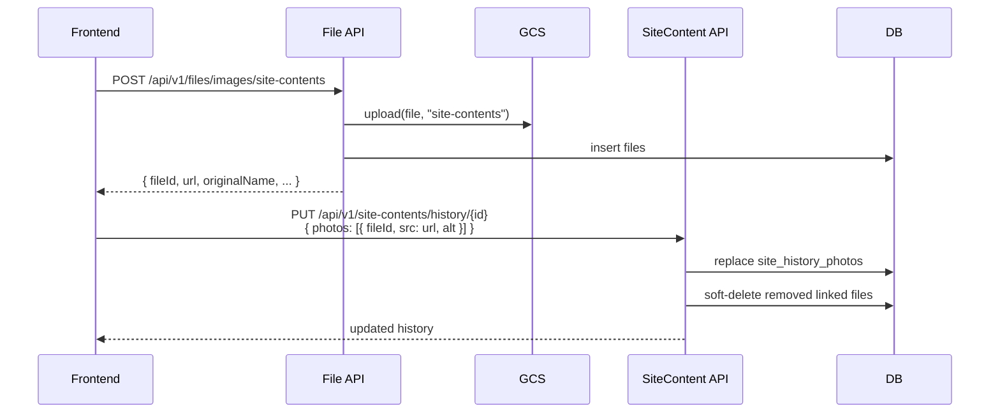
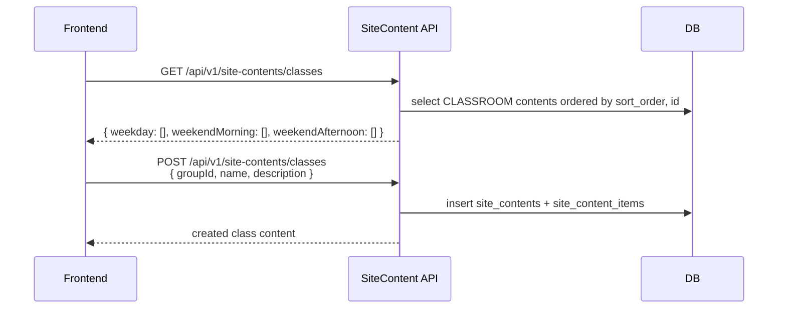
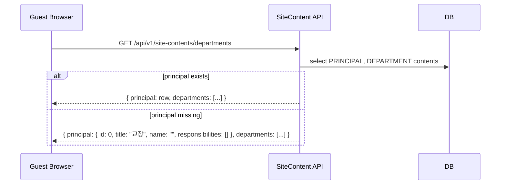

# Site Content API

기관 소개, 부서 소개, 반 소개처럼 공개 페이지에서 사용하는 정적 정보 API입니다.

## 리뷰 순서

1. SQL: `site_contents`, `site_content_items`, `site_histories`, `site_history_photos` 생성 및 초기 데이터 추가
2. 도메인 모델: 표시 콘텐츠와 연혁 콘텐츠를 기존 운영 도메인과 분리
3. DTO 계약: 프론트가 사용하는 필드만 REST 요청/응답에 노출
4. 서비스: principal 기본값, 반 그룹 매핑, 연혁 사진 전체 교체, 삭제 side effect 처리
5. REST API: 공개 조회와 ADMIN 쓰기 API 추가
6. 파일 업로드: 연혁 이미지용 GCS 업로드 API 추가
7. 관리자 화면: Thymeleaf에서 교장/부서/반/연혁 관리
8. 테스트: 공개 조회, 관리자 CRUD, 권한, 삭제 side effect E2E 검증

## 권한 정책

| API | 권한 |
|-----|------|
| `GET /api/v1/site-contents/history` | 비로그인 허용 |
| `GET /api/v1/site-contents/departments` | 비로그인 허용 |
| `GET /api/v1/site-contents/classes` | 비로그인 허용 |
| `POST/PUT/DELETE /api/v1/site-contents/**` | `ADMIN` |

관리자 Thymeleaf 화면은 `/admin/site-content/contents`, `/admin/site-content/history`에서 접근합니다.

## 프론트 연동 요약

| 화면 | 조회 API | 관리자 쓰기 API | 비고 |
|------|----------|-----------------|------|
| 연혁 | `GET /api/v1/site-contents/history` | `POST/PUT/DELETE /api/v1/site-contents/history` | `photos`는 배열 전체 교체 |
| 부서/교장 | `GET /api/v1/site-contents/departments` | `POST/PUT/DELETE /api/v1/site-contents/departments` | `principal`은 null로 반환하지 않음 |
| 반 정보 | `GET /api/v1/site-contents/classes` | `POST/PUT/DELETE /api/v1/site-contents/classes` | `groupId`는 camelCase |
| 연혁 이미지 | 없음 | `POST /api/v1/files/images/site-contents` | 응답 `fileId`, `url`을 `photos`에 저장 |

프론트 요청 DTO에는 `contentType`, `refId`, `sortOrder`를 보내지 않습니다. 해당 값은 내부 관리자 화면에서만 운영 보정용으로 관리합니다.

## 1. 연혁 조회

- **URL**: `/api/v1/site-contents/history`
- **Method**: `GET`
- **Authorization**: 없음
- **Response**: `200 OK`

```json
{
  "history": [
    {
      "id": 1,
      "title": "금정열린배움터 시작",
      "detail": "첫 수업을 시작했습니다.",
      "linkLabel": "소개",
      "linkHref": "https://example.com/history",
      "photos": [
        {
          "id": 1,
          "src": "https://example.com/photo.jpg",
          "alt": "첫 수업 사진"
        }
      ]
    }
  ]
}
```

## 2. 연혁 이미지 업로드

- **URL**: `/api/v1/files/images/site-contents`
- **Method**: `POST`
- **Content-Type**: `multipart/form-data`
- **Authorization**: 로그인 필요

연혁, 기관 소개처럼 공개 사이트 콘텐츠에서 사용할 이미지를 GCS에 업로드합니다. 응답의 `url`은 연혁 `photos[].src`에 저장하고, `fileId`는 삭제/교체 시 파일 정리를 위해 `photos[].fileId`로 함께 전달할 수 있습니다.

```json
{
  "fileId": "550e8400-e29b-41d4-a716-446655440000",
  "originalName": "history.png",
  "contentType": "image/png",
  "fileSize": 102400,
  "ext": "png",
  "url": "https://storage.googleapis.com/example-bucket/site-contents/history.png"
}
```

## 3. 연혁 관리

### 3.1. 생성

- **URL**: `/api/v1/site-contents/history`
- **Method**: `POST`
- **Authorization**: `ADMIN`

```json
{
  "title": "금정열린배움터 시작",
  "detail": "첫 수업을 시작했습니다.",
  "linkLabel": "소개",
  "linkHref": "https://example.com/history",
  "photos": [
    {
      "fileId": "550e8400-e29b-41d4-a716-446655440000",
      "src": "https://example.com/photo.jpg",
      "alt": "첫 수업 사진"
    }
  ]
}
```

### 3.2. 수정

- **URL**: `/api/v1/site-contents/history/{historyId}`
- **Method**: `PUT`
- **Authorization**: `ADMIN`

`photos`는 요청값 기준으로 전체 교체합니다. `photos: []`는 사진 전체 삭제입니다. 기존 사진을 유지하려면 조회 응답의 `photos[].id`를 그대로 보내면 연결된 파일 정보를 보존합니다. 새로 업로드한 사진은 업로드 응답의 `fileId`를 함께 보내야 삭제/교체 시 파일이 soft delete 됩니다.

수정 요청에서 사용하는 사진 원소:

```json
{
  "id": 1,
  "fileId": null,
  "src": "https://example.com/photo.jpg",
  "alt": "첫 수업 사진"
}
```

신규 사진은 `id` 없이 업로드 응답의 `fileId`를 전달합니다.

```json
{
  "fileId": "550e8400-e29b-41d4-a716-446655440000",
  "src": "https://storage.googleapis.com/example-bucket/site-contents/history.png",
  "alt": "행사 사진"
}
```

### 3.3. 삭제

- **URL**: `/api/v1/site-contents/history/{historyId}`
- **Method**: `DELETE`
- **Authorization**: `ADMIN`
- **Response**: `204 No Content`

연혁 삭제 시 연결된 사진 파일은 soft delete 처리되며, 기존 파일 정리 스케줄러가 보관 기간 이후 GCS 객체를 제거합니다.

### 3.4. 연혁 사진 side effect

| 상황 | 요청 | DB 처리 | GCS 처리 |
|------|------|---------|----------|
| 기존 사진 유지 | `photos[].id` 포함, `fileId` 없음 | 기존 `site_history_photos.file_id` 유지 | 없음 |
| 신규 사진 추가 | `photos[].fileId` 포함 | 새 `site_history_photos.file_id` 연결 | 없음 |
| 기존 사진 제거 | 기존 `photos[].id`를 요청에서 제외 | 연결된 `files.is_deleted = true` | 파일 정리 스케줄러가 보관 기간 후 삭제 |
| 연혁 삭제 | `DELETE /history/{id}` | 연결된 모든 `files.is_deleted = true` | 파일 정리 스케줄러가 보관 기간 후 삭제 |
| URL-only 사진 제거 | `fileId`가 없는 사진 제거 | photo row만 삭제 | 없음 |



## 4. 기관 부서 정보 조회

- **URL**: `/api/v1/site-contents/departments`
- **Method**: `GET`
- **Authorization**: 없음
- **Response**: `200 OK`

```json
{
  "principal": {
    "id": 1,
    "title": "교장",
    "name": "정해웅",
    "responsibilities": ["금정열린배움터의 전반적인 운영을 총괄"]
  },
  "departments": [
    {
      "id": 2,
      "title": "교무기획부",
      "name": null,
      "responsibilities": ["야학 행사 계획 및 교무 선생님 보조"]
    }
  ]
}
```

교장 데이터가 아직 없으면 프론트 렌더링 보호를 위해 다음 기본 객체를 반환합니다.

```json
{
  "principal": {
    "id": 0,
    "title": "교장",
    "name": "",
    "responsibilities": []
  },
  "departments": []
}
```

## 5. 기관 부서 정보 관리

### 5.1. 생성

- **URL**: `/api/v1/site-contents/departments`
- **Method**: `POST`
- **Authorization**: `ADMIN`

```json
{
  "title": "교육연구부",
  "name": null,
  "responsibilities": ["신입 선생님 면접", "각종 일지 관리"]
}
```

### 5.2. 수정

- **URL**: `/api/v1/site-contents/departments/{departmentInfoId}`
- **Method**: `PUT`
- **Authorization**: `ADMIN`

`name`은 null로 수정할 수 있고, `responsibilities`는 빈 배열로 전체 제거할 수 있습니다.

### 5.3. 삭제

- **URL**: `/api/v1/site-contents/departments/{departmentInfoId}`
- **Method**: `DELETE`
- **Authorization**: `ADMIN`
- **Response**: `204 No Content`

교장 콘텐츠는 프론트 렌더링 계약상 항상 필요하므로 REST API에서 삭제할 수 없습니다. 교장 표시 내용은 수정 API로 빈 값에 가깝게 조정합니다.

## 6. 기관 반 정보 조회

- **URL**: `/api/v1/site-contents/classes`
- **Method**: `GET`
- **Authorization**: 없음
- **Response**: `200 OK`

```json
{
  "weekday": [
    {
      "id": 1,
      "name": "벚꽃반",
      "description": ["평일 기초 학습반"]
    }
  ],
  "weekendMorning": [],
  "weekendAfternoon": []
}
```

## 7. 기관 반 정보 관리

### 7.1. 생성

- **URL**: `/api/v1/site-contents/classes`
- **Method**: `POST`
- **Authorization**: `ADMIN`

```json
{
  "name": "주말 오전반",
  "groupId": "weekendMorning",
  "description": ["주말 오전 시간대에 운영되는 반"]
}
```

`groupId` values:

- `weekday`
- `weekendMorning`
- `weekendAfternoon`



### 7.2. 수정

- **URL**: `/api/v1/site-contents/classes/{classInfoId}`
- **Method**: `PUT`
- **Authorization**: `ADMIN`

### 7.3. 삭제

- **URL**: `/api/v1/site-contents/classes/{classInfoId}`
- **Method**: `DELETE`
- **Authorization**: `ADMIN`
- **Response**: `204 No Content`

## 설계 메모

- 기존 운영용 `departments`, `classrooms` 테이블은 변경하지 않습니다.
- 기관 소개 페이지용 데이터는 `site_contents`, `site_content_items`에 저장합니다.
- 연혁 페이지용 데이터는 `site_histories`, `site_history_photos`에 저장합니다.
- `site_contents.ref_id`로 기존 `departments.id` 또는 `classrooms.id`를 느슨하게 연결할 수 있습니다.
- 교장 정보는 인증 Role이 아니라 `site_contents.content_type = PRINCIPAL` 표시 콘텐츠입니다.
- REST 관리자 요청 DTO는 프론트 폼 계약에 맞춰 `contentType`, `refId`, `sortOrder`를 받지 않습니다.
- 내부 관리자 Thymeleaf 화면에서는 운영 보정용으로 타입, ref, 정렬 값을 관리할 수 있습니다.
- 관리자 Thymeleaf 연혁 화면은 사이트 콘텐츠 이미지 업로드를 직접 지원합니다.
- 배열 필드는 null이 아니라 빈 배열로 반환합니다.

## 공개 조회 시퀀스


