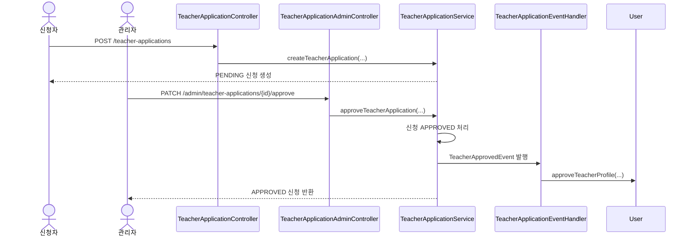

# Teacher Application API

교원 신청서는 GUEST 사용자가 교원 활동을 지원하기 위해 제출하는 신청 데이터입니다.
관리자는 신청서를 검토한 뒤 승인 또는 반려하며, 승인 시 교원 활동 기간과 실제 담당 과목을 함께 확정합니다.

## 공통 정책

- 일반 사용자 Base URL: `/api/v1/teacher-applications`
- 관리자 Base URL: `/api/v1/admin/teacher-applications`
- 교원 신청 제출은 `GUEST` 역할 사용자만 가능합니다.
- 한 사용자는 `PENDING` 신청을 1개만 가질 수 있습니다.
- `REJECTED`, `CANCELLED` 신청은 재신청을 막지 않습니다.
- 신청 시점의 개인정보를 snapshot으로 저장합니다.
- 선호 과목은 교사가 미배정된 활성 시간표 슬롯만 선택할 수 있습니다.
- 신청 화면은 미배정 시간표 후보를 조회한 뒤, 사용자가 선택한 후보의 `subjectIds` 중 대표 슬롯을 `preferredSubjectId`로 제출할 수 있습니다.
- 승인 시 관리자가 실제 배정 시간표 슬롯 목록을 지정하며, 선호 과목과 다른 활성 미배정 시간표도 지정할 수 있습니다.
- 승인 시 신청자의 사용자 ID는 유지되고, User 도메인 이벤트 처리로 교원 활동 정보가 등록됩니다.
- `User.classroomId`는 기본/소속 분반입니다. 기본 분반이 없을 때만 첫 배정 과목 분반으로 채웁니다.
- 실제 담당 분반은 `Subject.teacherId`로 연결된 활성 과목들의 분반으로 판단합니다.
- 승인 시 배정 과목 분반 채널 쓰기 권한을 추가하며, 기존 분반 권한은 제거하지 않습니다.

## 상태

| 값 | 의미 |
|---|---|
| `PENDING` | 검토 대기 |
| `APPROVED` | 승인 완료 |
| `REJECTED` | 반려 완료 |
| `CANCELLED` | 신청자 취소 |

## TeacherApplicationResponse

```json
{
  "id": 1,
  "applicantId": 5,
  "applicantName": "홍길동",
  "applicantPhoneNumber": "010-0000-0000",
  "applicantEmail": "hong@example.com",
  "birthDate": "1999-03-15",
  "address": "부산광역시 금정구",
  "educationAndMajor": "부산대학교 국어국문학과 졸업",
  "preferredSubjectId": 3,
  "preferredSubjectName": "국어",
  "preferredClassroomName": "국화반",
  "preferredDayOfWeek": "FRIDAY",
  "preferredStartTime": "19:00:00",
  "preferredEndTime": "22:00:00",
  "assignedSubjects": [],
  "assignedClassroomId": null,
  "assignedClassroomName": null,
  "assignedDayOfWeek": null,
  "assignedStartTime": null,
  "assignedEndTime": null,
  "motivation": "지원 동기",
  "desiredTeacherImage": "희망하는 교사상",
  "meaningOfSharing": "나눔의 의미",
  "status": "PENDING",
  "reviewedAt": null,
  "reviewedByName": null,
  "reviewNote": null,
  "createdAt": "2026-05-20T10:00:00",
  "updatedAt": "2026-05-20T10:00:00"
}
```

## 신청 가능 시간표 조회

- **URL**: `/api/v1/teacher-applications/available-schedules`
- **Method**: `GET`
- **Auth**: 필요
- **Description**: 교원 신청 화면에서 선택할 수 있는 교사 미배정 시간표 후보를 조회합니다.

같은 분반, 요일, 운영기간의 미배정 Subject 슬롯을 하나의 시간표 후보로 묶어 반환합니다. 보통 하루 1과목이면 `subjectIds`가 1개이고, 같은 날 2과목이면 2개입니다.

### Response Body

```json
[
  {
    "scheduleKey": "1:FRIDAY:2026-03-01:2026-06-30",
    "classroomId": 1,
    "classroomName": "벚꽃반",
    "dayOfWeek": "FRIDAY",
    "startAt": "2026-03-01",
    "endAt": "2026-06-30",
    "startTime": "19:00:00",
    "endTime": "20:50:00",
    "subjectIds": [100, 101],
    "subjects": [
      {
        "subjectId": 100,
        "subjectName": "국어",
        "period": 1,
        "startTime": "19:00:00",
        "endTime": "20:00:00"
      },
      {
        "subjectId": 101,
        "subjectName": "수학",
        "period": 2,
        "startTime": "20:10:00",
        "endTime": "20:50:00"
      }
    ]
  }
]
```

신청서 제출의 `preferredSubjectId`에는 사용자가 선택한 시간표 후보의 `subjectIds` 중 하나를 전달합니다. 관리자는 승인 시 같은 후보의 `subjectIds` 전체를 `assignedSubjectIds`로 사용할 수 있습니다.

### Dev 초기 데이터 확인 기준

`dev` 초기 데이터에는 프론트 연동 확인용 교원 신청/시간표 샘플이 포함되어 있습니다.

| 계정 | 비밀번호 | 상태 | 확인 포인트 |
|------|----------|------|-------------|
| `applicant01@test.com` | `teacher01` | `GUEST`, PENDING 신청 보유 | 관리자 신청 목록에서 승인 대기 신청 확인 |
| `approved-teacher01@test.com` | `teacher01` | `VOLUNTEER`, 승인 신청 보유 | `/api/v1/subjects/me`, 사용자 상세의 배정 시간표 확인 |
| `rejected-applicant01@test.com` | `teacher01` | `GUEST`, REJECTED 신청 보유 | 반려 상태 신청 응답 확인 |
| `cancelled-applicant01@test.com` | `teacher01` | `GUEST`, CANCELLED 신청 보유 | 취소 상태 신청 응답 확인 |

초기 미배정 시간표 후보:

- 국화반 목요일 1~2교시: `subjectIds = [6, 7]`
- 주말 스마트폰반 토요일: `subjectIds = [8]`

초기 승인 배정 시간표:

- 개나리반 금요일 1~2교시: `subjectIds = [9, 10]`
- `teacher_schedule_assignments`로 승인 신청 `id=2`와 연결되어 있습니다.

함께 확인할 수 있는 dev 운영 데이터:

- 벚꽃반 월요일 1~2교시 배정 시간표: `subjectIds = [4, 5]`, `teacher01@test.com`
- 2026년 9월 4일, 9월 7일, 9월 11일, 9월 14일 Lesson/DailySchedule 샘플
- DailySchedule별 교사 출석과 학생 출석부 샘플
- 2026년 6월 이후 이벤트 샘플: 신입 교원 오리엔테이션, 9월 개강 준비 회의, 추석 연휴 휴강 안내

## 1. 교원 신청서 제출

- **URL**: `/api/v1/teacher-applications`
- **Method**: `POST`
- **Auth**: 필요
- **Roles**: `GUEST`
- **Description**: 로그인한 GUEST 사용자가 교원 신청서를 제출합니다.

### Request Body

```json
{
  "birthDate": "1999-03-15",
  "phoneNumber": "010-0000-0000",
  "email": "hong@example.com",
  "address": "부산광역시 금정구",
  "educationAndMajor": "부산대학교 국어국문학과 졸업",
  "preferredSubjectId": 3,
  "motivation": "지원 동기",
  "desiredTeacherImage": "희망하는 교사상",
  "meaningOfSharing": "나눔의 의미"
}
```

### 구현 기준 동작

- 신청자 이름은 현재 User 이름으로 snapshot 저장합니다.
- 연락처, 이메일, 생년월일, 주소, 학력/전공은 신청서에 snapshot 저장합니다.
- 같은 사용자의 `PENDING` 신청이 이미 있으면 생성할 수 없습니다.
- 선호 과목이 비활성 과목이거나 담당 교사가 이미 있으면 생성할 수 없습니다.

## 2. 내 교원 신청 조회

- **URL**: `/api/v1/teacher-applications/me`
- **Method**: `GET`
- **Auth**: 필요
- **Description**: 현재 로그인 사용자의 최신 신청 1건을 조회합니다.

### 조회 정책

- `PENDING`, `APPROVED`, `REJECTED` 중 최신 1건을 반환합니다.
- `CANCELLED` 신청은 반환하지 않습니다.
- 신청이 없으면 `404`가 아니라 `exists=false`를 반환합니다.

### Response Body

```json
{
  "exists": true,
  "application": {
    "id": 1,
    "status": "PENDING"
  }
}
```

신청이 없는 경우:

```json
{
  "exists": false,
  "application": null
}
```

## 3. 교원 신청 수정

- **URL**: `/api/v1/teacher-applications/{applicationId}`
- **Method**: `PATCH`
- **Auth**: 필요
- **Description**: 신청자 본인이 `PENDING` 상태의 신청서를 수정합니다.

### Request Body

제출 요청과 동일한 전체 신청서 필드를 전달합니다.

```json
{
  "birthDate": "1999-03-15",
  "phoneNumber": "010-1111-2222",
  "email": "hong.updated@example.com",
  "address": "부산광역시 금정구",
  "educationAndMajor": "부산대학교 국어국문학과 졸업",
  "preferredSubjectId": 4,
  "motivation": "수정된 지원 동기",
  "desiredTeacherImage": "수정된 교사상",
  "meaningOfSharing": "수정된 나눔의 의미"
}
```

### 구현 기준 동작

- 요청자가 신청자가 아니면 수정할 수 없습니다.
- `PENDING` 상태가 아니면 수정할 수 없습니다.
- 수정 시에도 선호 과목은 교사가 미배정된 활성 과목이어야 합니다.

## 4. 교원 신청 취소

- **URL**: `/api/v1/teacher-applications/{applicationId}`
- **Method**: `DELETE`
- **Auth**: 필요
- **Description**: 신청자 본인이 `PENDING` 상태의 신청서를 취소합니다.

### Side Effects

- 물리 삭제하지 않고 상태를 `CANCELLED`로 변경합니다.
- 취소된 신청은 내 신청 조회에서 제외됩니다.
- 취소 후 재신청할 수 있습니다.

## 5. 관리자 교원 신청 목록 조회

- **URL**: `/api/v1/admin/teacher-applications`
- **Method**: `GET`
- **Auth**: 필요
- **Roles**: `ADMIN` 또는 `teacher-application:read:*`
- **Description**: 교원 신청 목록을 페이지네이션으로 조회합니다.

### Query Parameters

| 이름 | 타입 | 필수 | 설명 |
|---|---|---|---|
| status | string | N | `PENDING`, `APPROVED`, `REJECTED`, `CANCELLED` |
| keyword | string | N | 신청자 이름, 이메일, 연락처 검색 |
| page | number | N | 페이지 번호, 기본값 0 |
| size | number | N | 페이지 크기, 기본값 10 |

### 정렬

- 최신순 고정 정렬입니다.
- `createdAt DESC`, `id DESC` 순서로 조회합니다.

## 6. 관리자 교원 신청 상세 조회

- **URL**: `/api/v1/admin/teacher-applications/{applicationId}`
- **Method**: `GET`
- **Auth**: 필요
- **Roles**: `ADMIN` 또는 `teacher-application:read:*`
- **Description**: 관리자 권한으로 교원 신청 상세 정보를 조회합니다.

## 7. 관리자 교원 신청 승인

- **URL**: `/api/v1/admin/teacher-applications/{applicationId}/approve`
- **Method**: `PATCH`
- **Auth**: 필요
- **Roles**: `ADMIN` 또는 `teacher-application:manage:*`
- **Description**: `PENDING` 신청을 승인하고 교원 활동 정보를 확정합니다.

### Request Body

```json
{
  "assignedSubjectIds": [3, 4],
  "teacherStartAt": "2026-06-01",
  "teacherEndAt": "2026-12-31",
  "note": "면접 후 승인"
}
```

`note`는 선택 값입니다.
`assignedSubjectIds`는 실제 배정할 시간표 과목 ID 목록입니다. 같은 분반, 요일, 운영기간의 하루 시간표 슬롯만 함께 지정할 수 있습니다. 하루에 한 과목만 맡는 경우에는 1개만 전달하고, 같은 날 2과목을 맡는 경우에는 2개를 전달합니다.

### Side Effects

- 신청 상태를 `APPROVED`로 변경합니다.
- `teacher_schedule_assignments`에 실제 배정 시간표 과목 목록과 신청 승인 출처를 기록합니다.
- `reviewedAt`, `reviewedBy`, `reviewNote`를 기록합니다.
- 신청자가 승인 시점에도 `GUEST`인지 확인합니다.
- `TeacherApprovedEvent`를 발행합니다.
- User 도메인 이벤트 핸들러가 신청자의 `approveTeacherProfile()`을 호출합니다.
- 신청자 역할이 `VOLUNTEER`로 승격됩니다.
- 신청자의 교원 활동 시작일, 종료일이 저장됩니다.
- 신청자의 기본 분반이 없으면 배정 시간표 분반을 기본 분반으로 저장합니다. 이미 있으면 변경하지 않습니다.
- 배정 시간표 과목들의 담당 교사를 신청자로 변경하고, 미래 Lesson 생성/변경 사이드 이펙트를 함께 처리합니다.
- 배정 시간표 분반 채널 쓰기 권한이 추가됩니다.
- 채널 권한 부여는 시간표 배정 서비스에서만 처리합니다.
- 승인/배정 중 실패하면 신청 상태, 사용자 role, 권한, 과목 배정, Lesson 변경은 모두 롤백됩니다.

## 8. 관리자 교원 신청 반려

- **URL**: `/api/v1/admin/teacher-applications/{applicationId}/reject`
- **Method**: `PATCH`
- **Auth**: 필요
- **Roles**: `ADMIN` 또는 `teacher-application:manage:*`
- **Description**: `PENDING` 신청을 반려합니다.

### Request Body

```json
{
  "note": "면접 일정 미참석"
}
```

`note`는 필수입니다.

### Side Effects

- 신청 상태를 `REJECTED`로 변경합니다.
- `reviewedAt`, `reviewedBy`, `reviewNote`를 기록합니다.
- 신청자 역할은 변경하지 않습니다.
- 반려 후 재신청할 수 있습니다.

## 대표 실패 케이스

| 상황 | HTTP Status |
|---|---|
| 인증 없이 접근 | `401 Unauthorized` |
| 권한 없는 사용자가 관리자 API 접근 | `403 Forbidden` |
| GUEST가 아닌 사용자가 신청서 제출 | `403 Forbidden` |
| 승인 시 신청자가 더 이상 GUEST가 아님 | `403 Forbidden` |
| 존재하지 않는 신청서 | `404 Not Found` |
| 승인 시 존재하지 않는 배정 과목 | `404 Not Found` |
| 이미 PENDING 신청이 있음 | `409 Conflict` |
| PENDING이 아닌 신청 수정/취소/승인/반려 | `409 Conflict` |
| 선호 과목 또는 승인 배정 과목이 비활성 또는 이미 교사 배정됨 | `400 Bad Request` |
| 승인 요청의 교원 활동 종료일이 시작일보다 빠름 | `400 Bad Request` |
| 승인 배정 과정에서 미래 Lesson 자동 변경이 불가능함 | `409 Conflict` |

## 대표 시퀀스


