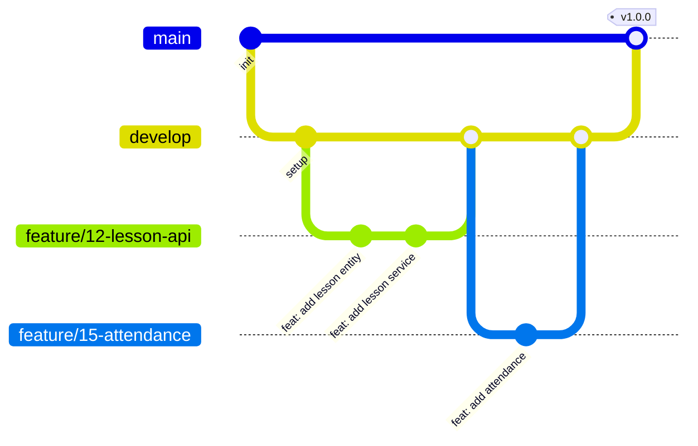

# 개발 컨벤션

## 1. 커밋 메시지

[Conventional Commits](https://www.conventionalcommits.org/) 형식을 따릅니다.

### 1.1 형식

```
<type>(<scope>): <subject>

<body>

<footer>
```

### 1.2 Type

| Type | 설명 |
|------|------|
| `feat` | 새로운 기능 추가 |
| `fix` | 버그 수정 |
| `docs` | 문서 수정 |
| `style` | 코드 포맷팅 (기능 변경 없음) |
| `refactor` | 코드 리팩토링 |
| `test` | 테스트 추가/수정 |
| `chore` | 빌드, 설정 파일 수정 |

### 1.3 Scope (도메인)

| Scope | 설명 |
|-------|------|
| `user` | 사용자 도메인 |
| `lesson` | 수업 도메인 |
| `subject` | 과목 도메인 |
| `student` | 학생 도메인 |
| `classroom` | 분반 도메인 |
| `request` | 요청 도메인 (결석/교환/구입) |
| `auth` | 인증/인가 |
| `global` | 전역 설정, 공통 모듈 |

### 1.4 예시

```
feat(lesson): 수업 캘린더 조회 API 추가

- GET /api/v1/lessons/my 엔드포인트 구현
- 월별 조회 기능 추가

Closes #12
```

```
fix(auth): 로그인 시 세션 만료 오류 수정

세션 타임아웃 설정이 누락되어 발생한 문제 해결

Fixes #25
```

```
refactor(global): 공통 응답 형식 리팩토링

ApiResponse 클래스 구조 개선

Related to #30
```

---

## 2. 브랜치 전략

### 2.1 브랜치 구조

```
main
 └── develop
      ├── feature/{issue-number}-{feature-name}
      ├── fix/{issue-number}-{bug-description}
      └── hotfix/{issue-number}-{description}
```

### 2.2 브랜치 설명

| 브랜치 | 용도 |
|--------|------|
| `main` | 프로덕션 배포 브랜치 |
| `develop` | 개발 통합 브랜치 |
| `feature/*` | 새 기능 개발 |
| `fix/*` | 버그 수정 |
| `hotfix/*` | 긴급 프로덕션 수정 |

### 2.3 예시

```
feature/12-lesson-calendar-api
feature/15-student-attendance
fix/25-session-timeout
fix/28-null-pointer-exception
hotfix/30-login-error
```

### 2.4 워크플로우



---

## 3. 코드 스타일

### 3.1 기본 규칙

| 항목 | 규칙 |
|------|------|
| 스타일 가이드 | Google Java Style Guide |
| 들여쓰기 | 4 spaces |
| 최대 줄 길이 | 120자 |

### 3.2 네이밍 규칙

| 대상 | 규칙 | 예시 |
|------|------|------|
| 클래스 | PascalCase | `UserService`, `LessonController` |
| 메서드/변수 | camelCase | `getUserById`, `lessonList` |
| 상수 | UPPER_SNAKE_CASE | `MAX_PAGE_SIZE`, `DEFAULT_TIMEOUT` |
| 패키지 | lowercase | `org.geumjeong.learning.domain.user` |

### 3.3 클래스 구조

```java
public class UserService {

    // 1. 상수
    private static final int MAX_RETRY = 3;

    // 2. 필드
    private final UserRepository userRepository;

    // 3. 생성자
    public UserService(UserRepository userRepository) {
        this.userRepository = userRepository;
    }

    // 4. public 메서드
    public User findById(Long id) { ... }

    // 5. private 메서드
    private void validate(User user) { ... }
}
```

### 3.4 패키지 구조 규칙

```
domain/{도메인명}/
├── controller/    # @RestController
├── service/       # @Service
├── repository/    # @Repository
├── entity/        # @Entity
├── dto/           # Request/Response DTO
└── event/         # 도메인 이벤트
```

---

## 4. 관련 템플릿

- [PR 템플릿](./pr_template.md)
- [Issue 템플릿 - Feature](./issue_feature_template.md)
- [Issue 템플릿 - Fix](./issue_bug_template.md)

### 4.1 Issue 제목 규칙

이슈 제목은 다음 형식을 사용합니다.

```
[FEAT] 새 기능 요약
[FIX] 수정 사항 요약
```
