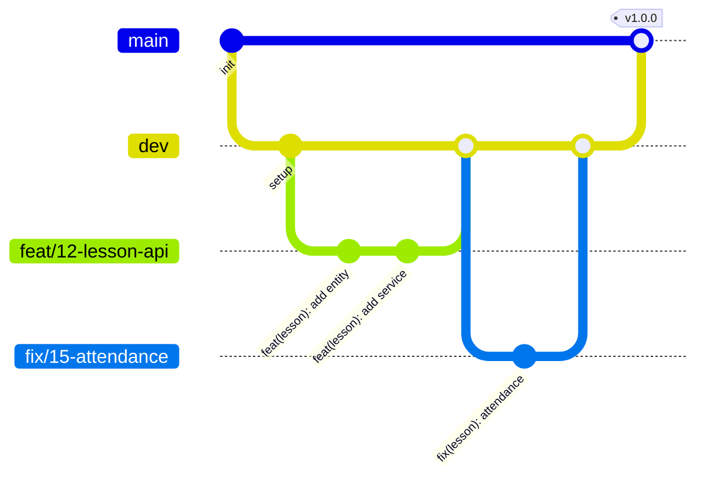

# 개발 컨벤션

## 1. 커밋 메시지

[Conventional Commits](https://www.conventionalcommits.org/) 형식을 따릅니다.

### 1.1 형식

```
<type>(<scope>): <subject>

<body>

<footer>
```

### 1.2 Type

| Type | 설명 |
|------|------|
| `feat` | 새로운 기능 추가 |
| `fix` | 버그 수정 |
| `docs` | 문서 수정 |
| `style` | 코드 포맷팅 (기능 변경 없음) |
| `refactor` | 코드 리팩토링 |
| `test` | 테스트 추가/수정 |
| `chore` | 빌드, 설정 파일 수정 |

### 1.3 Scope (도메인)

도메인 폴더 이름을 하이픈으로 바꿔 씁니다 (`purchase_request` → `purchase-request`).

| Scope | 설명 |
|-------|------|
| `request` | 결석/교환 요청 도메인 |
| `purchase-request` | 결제 신청·품의·결의 도메인 |
| `user` | 사용자 도메인 |
| `daily-schedule` | 일정/수업일지 도메인 |
| `subject` | 과목 도메인 |
| `lesson` | 수업 도메인 |
| `student` | 학생 도메인 |
| `classroom` | 분반 도메인 |
| `auth` | 인증/인가 |
| `global` | 전역 설정, 공통 모듈 |
| `seed` | 개발용 시드 데이터 |

표에 없는 도메인을 건드리면 같은 규칙으로 새 scope를 씁니다.

### 1.4 예시

```
feat(lesson): 수업 캘린더 조회 API 추가

- GET /api/v1/lessons/my 엔드포인트 구현
- 월별 조회 기능 추가

Closes #12
```

```
fix(auth): 로그인 시 세션 만료 오류 수정

세션 타임아웃 설정이 누락되어 발생한 문제 해결

Fixes #25
```

```
refactor(global): 공통 예외 처리 구조 개선

도메인별 ErrorCode 변환 로직을 전역 advice로 통합

Related to #30
```

---

## 2. 브랜치 전략

### 2.1 브랜치 구조

```
main
 └── dev
      ├── feat/{issue-number}-{slug}
      ├── fix/{issue-number}-{slug}
      └── docs/{issue-number}-{slug}

main
 └── hotfix/{slug}
```

### 2.2 브랜치 설명

| 브랜치 | 용도 | base |
|--------|------|------|
| `main` | 프로덕션 배포 브랜치 | - |
| `dev` | 개발 통합 브랜치 | `main` |
| `feat/*` | 새 기능 개발 (`[FEAT]` 이슈) | `dev` |
| `fix/*` | 버그 수정 (`[FIX]` 이슈) | `dev` |
| `docs/*` | 문서만 고칠 때 | `dev` |
| `hotfix/*` | 긴급 프로덕션 수정 | `main` |

기능 브랜치 접두사는 **`feat/`**입니다. 오래된 브랜치에 `feature/`가 남아 있지만
새로 만들 때는 쓰지 않습니다.

### 2.3 예시

```
feat/217-daily-schedule-query-optimization
feat/211-purchase-request-department-selection
fix/213-purchase-request-target-selection
docs/184-v0-0-1-release-notes
hotfix/prod-health-retry
```

`{slug}`는 영문 소문자와 하이픈이고, 이슈 폴더 이름의 뒷부분과 같은 것을 씁니다
(`docs/issues/217-daily-schedule-query-optimization/`).

### 2.4 워크플로우


```mermaid
gitGraph
    commit id: "init"
    branch dev
    checkout dev
    commit id: "setup"
    branch feat/12-lesson-api
    checkout feat/12-lesson-api
    commit id: "feat(lesson): add entity"
    commit id: "feat(lesson): add service"
    checkout dev
    merge feat/12-lesson-api
    branch fix/15-attendance
    checkout fix/15-attendance
    commit id: "fix(lesson): attendance"
    checkout dev
    merge fix/15-attendance
    checkout main
    merge dev tag: "v1.0.0"
```

---

## 3. 코드 스타일

### 3.1 기본 규칙

| 항목 | 규칙 |
|------|------|
| 스타일 가이드 | Google Java Style Guide |
| 들여쓰기 | 4 spaces |
| 최대 줄 길이 | 120자 |

### 3.2 네이밍 규칙

| 대상 | 규칙 | 예시 |
|------|------|------|
| 클래스 | PascalCase | `UserService`, `LessonController` |
| 메서드/변수 | camelCase | `getUserById`, `lessonList` |
| 상수 | UPPER_SNAKE_CASE | `MAX_PAGE_SIZE`, `DEFAULT_TIMEOUT` |
| 패키지 | lowercase | `org.geumjeong.learning.domain.user` |

### 3.3 클래스 구조

```java
public class UserService {

    // 1. 상수
    private static final int MAX_RETRY = 3;

    // 2. 필드
    private final UserRepository userRepository;

    // 3. 생성자
    public UserService(UserRepository userRepository) {
        this.userRepository = userRepository;
    }

    // 4. public 메서드
    public User findById(Long id) { ... }

    // 5. private 메서드
    private void validate(User user) { ... }
}
```

### 3.4 패키지 구조 규칙

API 표면은 버전 폴더(`v1/`) 안에 둡니다. 그 밖은 도메인 루트에 둡니다.

```
domain/{도메인명}/
├── entity/        # @Entity
├── repository/    # @Repository
├── service/       # @Service (*ProxyService 포함)
├── exception/     # 도메인 예외, *ErrorCode
├── enums/         # Enum (필요시)
├── event/         # 도메인 이벤트 (필요시)
└── v1/
    ├── controller/    # @RestController
    ├── validation/    # 커스텀 Validation (필요시)
    └── dto/
        ├── request/
        └── response/
```

---

## 4. 관련 템플릿

- [PR 템플릿](./pr_template.md)
- [Issue 템플릿 - Feature](./issue_feature_template.md)
- [Issue 템플릿 - Fix](./issue_bug_template.md)

### 4.1 Issue 제목·라벨 규칙

이슈 제목은 다음 형식을 사용합니다.

```
[FEAT] 새 기능 요약     라벨: enhancement
[FIX] 수정 사항 요약     라벨: bug
```

`blank_issues_enabled: false`라 빈 이슈는 만들 수 없습니다. 템플릿의 절 이름을
그대로 지킵니다.

### 4.2 PR 규칙

- **PR 제목은 이슈 제목을 그대로 씁니다.**
- base는 `dev`입니다 (`hotfix/*`만 `main`).
- PR에는 라벨을 달지 않습니다. 분류는 이슈가 갖습니다.
- 본문 절 일곱을 유지합니다 — 개요 · 변경 유형 · 변경 내용 · 관련 이슈 ·
  스크린샷 (선택) · 체크리스트 · 리뷰어에게.
- 체크리스트는 **실제로 한 것만** 체크합니다. 빈칸이 정보입니다.
