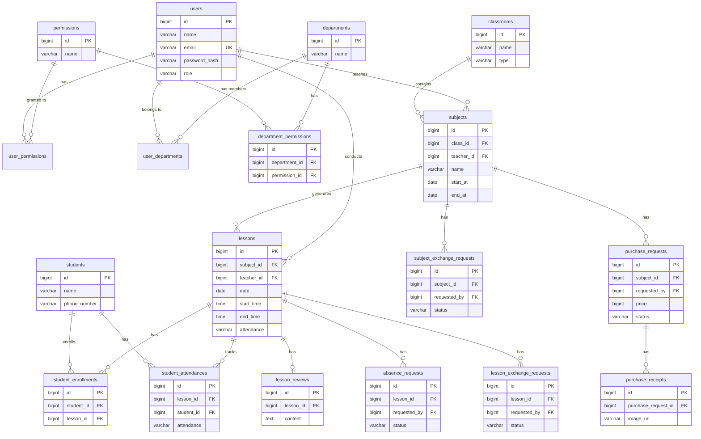

# 데이터 모델 설계 명세서

## 1. 개요

### 1.1 목적
- 프로젝트의 데이터 구조와 관계를 정의
- 데이터베이스 설계의 기초 자료 제공
- 개발팀 간 데이터 구조 공유 및 일관성 확보

### 1.2 범위
- 비즈니스 요구사항에 따른 엔티티 정의
- 엔티티 간 관계 설정
- 데이터 유형 및 제약조건 명시

### 1.3 참조 문서
- [PRD (Product Requirements Document)](./prd.md)
- [API 명세서](./api_spec.md)
- [기술 명세서](./tech_spec.md)

## 2. 데이터 모델 아키텍처

### 2.1 엔티티 관계 요약

#### 1:N 관계

| 부모 엔티티 | 자식 엔티티 | FK 필드 | 설명 |
|-------------|-------------|---------|------|
| Classrooms | Subjects | class_id | 분반별 과목 |
| Subjects | Lessons | subject_id | 과목별 수업 |
| Users | Subjects | teacher_id | 봉사자가 담당하는 과목 |
| Users | Lessons | teacher_id | 봉사자가 진행하는 수업 |
| Lessons | Student Attendances | lesson_id | 수업별 학생 출석 |
| Lessons | Lesson Reviews | lesson_id | 수업별 수업 일지 |
| Lessons | Absence Requests | lesson_id | 수업별 결석 요청 |
| Lessons | Lesson Exchange Requests | lesson_id | 수업별 교환 요청 |
| Subjects | Subject Exchange Requests | subject_id | 과목별 교환 요청 |
| Subjects | Purchase Requests | subject_id | 과목별 기자재 구입 요청 |
| Purchase Requests | Purchase Receipts | purchase_request_id | 구입 요청별 영수증 |
| Users | 각종 요청들 | requested_by | 요청자 |
| Users | 각종 요청들 | approval_by | 승인자 |
| Students | Student Attendances | student_id | 학생별 출석 기록 |

#### N:M 관계

| 엔티티 A | 엔티티 B | 조인 테이블 | 설명 |
|----------|----------|-------------|------|
| Users | Permissions | user_permissions | 사용자별 권한 부여 |
| Users | Departments | user_departments | 사용자별 담당 부서 |
| Departments | Permissions | department_permissions | 부서별 권한 관리 |
| Students | Lessons | student_enrollments | 학생 수업 등록 |

### 2.2 ERD 다이어그램

## 3. 엔티티 정의

### 3.1 사용자 (Users)

손모음 플랫폼 서비스를 관리 혹은 이용하는 사용자입니다.

| 필드명 | 데이터 타입 | 제약조건 | 설명 |
|--------|-------------|----------|------|
| id | BIGINT | PRIMARY KEY, AUTO_INCREMENT | 사용자 고유 ID |
| name | VARCHAR(50) | NOT NULL | 사용자 실명 |
| email | VARCHAR(255) | UNIQUE, NOT NULL | 이메일 주소 |
| password_hash | VARCHAR(255) | NOT NULL | 암호화된 비밀번호 |
| phone_number | VARCHAR(20) | NULL | 전화번호 |
| profile_image_url | VARCHAR(500) | NULL | 프로필 이미지 URL |
| role | VARCHAR(20) | NOT NULL, DEFAULT 'VOLUNTEER' | 역할 (VOLUNTEER, ADMIN) |
| description | TEXT | NULL | 추가 정보 |
| created_at | TIMESTAMP | NOT NULL, DEFAULT CURRENT_TIMESTAMP | 생성일시 |
| updated_at | TIMESTAMP | NOT NULL, DEFAULT CURRENT_TIMESTAMP ON UPDATE | 수정일시 |

### 3.2 부서 (departments)

사용자의 권한을 관리하는 엔티티입니다. 관리자가 할당된 부서를 관리합니다.

| 필드명 | 데이터 타입 | 제약조건 | 설명 |
|--------|-------------|----------|------|
| id | BIGINT | PRIMARY KEY, AUTO_INCREMENT | 엔티티 고유 ID |
| name | VARCHAR(50) | NOT NULL | 부서 이름 |
| description | TEXT | NULL | 추가 정보 |
| created_at | TIMESTAMP | NOT NULL, DEFAULT CURRENT_TIMESTAMP | 생성일시 |
| updated_at | TIMESTAMP | NOT NULL, DEFAULT CURRENT_TIMESTAMP ON UPDATE | 수정일시 |

### 3.3 권한 (Permissions)

사용자 및 부서의 권한을 관리하는 엔티티입니다. 각 도메인별 수정 권한을 정의합니다.
예) SUPER_ADMIN, MANAGE_USERS, MANAGE_DEPARTMENTS, MANAGE_CLASSROOMS ...

현재 구현에서는 PermissionType Enum으로 관리되며, 각 권한은 고유 ID를 가집니다.

| 필드명 | 데이터 타입 | 제약조건 | 설명 |
|--------|-------------|----------|------|
| id | BIGINT | PRIMARY KEY | 권한 고유 ID (Enum에서 정의) |
| name | VARCHAR(50) | NOT NULL | 권한 이름 (PermissionType) |
| description | TEXT | NULL | 추가 정보 |
| created_at | TIMESTAMP | NOT NULL, DEFAULT CURRENT_TIMESTAMP | 생성일시 |
| updated_at | TIMESTAMP | NOT NULL, DEFAULT CURRENT_TIMESTAMP ON UPDATE | 수정일시 |

### 3.3.1 권한 (User Permissions)

사용자별 권한을 관리하는 엔티티입니다.

| 필드명 | 데이터 타입 | 제약조건 | 설명 |
|--------|-------------|----------|------|
| id | BIGINT | PRIMARY KEY, AUTO_INCREMENT | 엔티티 고유 ID |
| user_id | BIGINT | FOREIGN KEY, NOT NULL | 사용자 ID |
| permission_id | BIGINT | FOREIGN KEY, NOT NULL | 권한 ID (Enum) |
| granter_type | VARCHAR(20) | DEFAULT 'USER' | 권한 부여 출처 (USER: 수동, SYSTEM: 자동/부서) |
| created_at | TIMESTAMP | NOT NULL, DEFAULT CURRENT_TIMESTAMP | 생성일시 |
| updated_at | TIMESTAMP | NOT NULL, DEFAULT CURRENT_TIMESTAMP ON UPDATE | 수정일시 |

> **참고**: 권한의 논리적 중복은 `(user_id, permission_id)`로 판단합니다. 즉, 동일한 사용자에게 동일한 권한이 중복 저장되지 않도록 애플리케이션 레벨에서 `equals/hashCode`가 설계되어 있습니다. `granter_type`은 이 권한이 시스템(부서 등)에 의해 부여되었는지, 관리자가 수동으로 부여했는지를 구분하는 메타데이터입니다.

### 3.3.2 부서 권한 조인 테이블 (department_permissions)

부서와 권한의 다대다 관계를 관리하는 조인 테이블입니다.

| 필드명 | 데이터 타입 | 제약조건 | 설명 |
|--------|-------------|----------|------|
| id | BIGINT | PRIMARY KEY, AUTO_INCREMENT | 엔티티 고유 ID |
| department_id | BIGINT | FOREIGN KEY, NOT NULL | 부서 ID |
| permission_id | BIGINT | FOREIGN KEY, NOT NULL | 권한 ID |
| created_at | TIMESTAMP | NOT NULL, DEFAULT CURRENT_TIMESTAMP | 생성일시 |
| updated_at | TIMESTAMP | NOT NULL, DEFAULT CURRENT_TIMESTAMP ON UPDATE | 수정일시 |

### 3.4 분반(classrooms)

분반을 관리하는 엔티티입니다. 관리자가 추가 및 수정을 관리합니다.

| 필드명 | 데이터 타입 | 제약조건 | 설명 |
|--------|-------------|----------|------|
| id | BIGINT | PRIMARY KEY, AUTO_INCREMENT | 엔티티 고유 ID |
| name | VARCHAR(50) | NOT NULL | 분반 이름 |
| type | VARCHAR(20) | NOT NULL | 주중반, 주말반 등 |
| description | TEXT | NULL | 추가 정보 |
| created_at | TIMESTAMP | NOT NULL, DEFAULT CURRENT_TIMESTAMP | 생성일시 |
| updated_at | TIMESTAMP | NOT NULL, DEFAULT CURRENT_TIMESTAMP ON UPDATE | 수정일시 |

### 3.5 학생 (students)

학생을 관리하는 엔티티입니다. 현재로서는 관리자가 추가 및 등록을 관리합니다.

| 필드명 | 데이터 타입 | 제약조건 | 설명 |
|--------|-------------|----------|------|
| id | BIGINT | PRIMARY KEY, AUTO_INCREMENT | 엔티티 고유 ID |
| name | VARCHAR(50) | NOT NULL | 학생 이름 |
| phone_number | VARCHAR(20) | NULL | 학생 전화번호 |
| description | TEXT | NULL | 추가 정보 |
| created_at | TIMESTAMP | NOT NULL, DEFAULT CURRENT_TIMESTAMP | 생성일시 |
| updated_at | TIMESTAMP | NOT NULL, DEFAULT CURRENT_TIMESTAMP ON UPDATE | 수정일시 |

### 3.6 과목(subjects)

학생이 수업할 과목입니다. 학생과 봉사에 대한 협의 후 관리자가 추가 및 수정을 관리합니다.

| 필드명 | 데이터 타입 | 제약조건 | 설명 |
|--------|-------------|----------|------|
| id | BIGINT | PRIMARY KEY, AUTO_INCREMENT | 엔티티 고유 ID |
| class_id | BIGINT | FOREIGN KEY | 분반 ID |
| teacher_id | BIGINT | FOREIGN KEY | 선생님 ID |
| start_at | DATE | NOT NULL | 과목 시작일 |
| end_at | DATE | NOT NULL | 과목 종료일 |
| times | INT | NOT NULL | 과목 횟수 |
| day_of_week | VARCHAR(20) | NOT NULL | 요일 |
| start_time | TIME | NOT NULL | 시작 시간 |
| end_time | TIME | NOT NULL | 종료 시간 |
| period | INT | NOT NULL | 수업 시간 |
| name | VARCHAR(50) | NOT NULL | 과목 이름 |
| description | TEXT | NULL | 추가 정보 |
| created_at | TIMESTAMP | NOT NULL, DEFAULT CURRENT_TIMESTAMP | 생성일시 |
| updated_at | TIMESTAMP | NOT NULL, DEFAULT CURRENT_TIMESTAMP ON UPDATE | 수정일시 |

### 3.7 수업 (lessons)

수업을 관리하는 엔티티입니다. 봉사자가 관리자와 협의하여 수업을 생성할 때, 시작일, 요일, 횟수, 시간 등을 기반으로 자동 생성됩니다. 수업이 생성된 후에는 수업에 등록된 학생들에게 자동으로 수업 출석을 생성합니다. 
이 수업은 캘린더 뷰 형태로 일별 / 월별로 조회할 수 있습니다. 

| 필드명 | 데이터 타입 | 제약조건 | 설명 |
|--------|-------------|----------|------|
| id | BIGINT | PRIMARY KEY, AUTO_INCREMENT | 엔티티 고유 ID |
| subject_id | BIGINT | FOREIGN KEY | 과목 ID |
| teacher_id | BIGINT | FOREIGN KEY | 선생님 ID |
| date | DATE | NOT NULL | 수업 날짜 |
| start_time | TIME | NOT NULL | 수업 시작 시간 |
| end_time | TIME | NOT NULL | 수업 종료 시간 |
| attendance | VARCHAR(20) | NOT NULL | 교사(봉사자)의 출석 여부 |
| created_at | TIMESTAMP | NOT NULL, DEFAULT CURRENT_TIMESTAMP | 생성일시 |
| updated_at | TIMESTAMP | NOT NULL, DEFAULT CURRENT_TIMESTAMP ON UPDATE | 수정일시 |

### 3.8 학생 등록 (student_enrollments)

학생이 수업에 등록하는 엔티티입니다. 수업이 생성된 뒤 학생은 원하는 수업을 등록할 수 있습니다.

| 필드명 | 데이터 타입 | 제약조건 | 설명 |
|--------|-------------|----------|------|
| id | BIGINT | PRIMARY KEY, AUTO_INCREMENT | 엔티티 고유 ID |
| student_id | BIGINT | FOREIGN KEY | 학생 ID |
| lesson_id | BIGINT | FOREIGN KEY | 수업 ID |
| created_at | TIMESTAMP | NOT NULL, DEFAULT CURRENT_TIMESTAMP | 생성일시 |
| updated_at | TIMESTAMP | NOT NULL, DEFAULT CURRENT_TIMESTAMP ON UPDATE | 수정일시 |

### 3.9 학생 출석 (student_attendances)

학생의 출석을 관리하는 엔티티입니다. 수업이 생성된 뒤 등록된 학생에 대해 자동 생성되어 출석을 관리합니다.

| 필드명 | 데이터 타입 | 제약조건 | 설명 |
|--------|-------------|----------|------|
| id | BIGINT | PRIMARY KEY, AUTO_INCREMENT | 엔티티 고유 ID |
| lesson_id | BIGINT | FOREIGN KEY | 수업 ID |
| student_id | BIGINT | FOREIGN KEY | 학생 ID |
| attendance | VARCHAR(20) | NOT NULL | 학생의 출석 여부 |
| created_at | TIMESTAMP | NOT NULL, DEFAULT CURRENT_TIMESTAMP | 생성일시 |
| updated_at | TIMESTAMP | NOT NULL, DEFAULT CURRENT_TIMESTAMP ON UPDATE | 수정일시 |

### 3.10 수업 일지 (lesson_reviews) 

수업 일지를 관리하는 엔티티입니다. 봉사자가 매 수업이 끝난 뒤 특이사항등을 기재한 수업 일지를 작성합니다.

| 필드명 | 데이터 타입 | 제약조건 | 설명 |
|--------|-------------|----------|------|
| id | BIGINT | PRIMARY KEY, AUTO_INCREMENT | 엔티티 고유 ID |
| lesson_id | BIGINT | FOREIGN KEY | 수업 ID |
| content | TEXT | NOT NULL | 수업 일지 내용 |
| created_at | TIMESTAMP | NOT NULL, DEFAULT CURRENT_TIMESTAMP | 생성일시 |
| updated_at | TIMESTAMP | NOT NULL, DEFAULT CURRENT_TIMESTAMP ON UPDATE | 수정일시 |

### 3.11 결석 요청 (absence_requests)

교사(봉사자)는 수업에 부득이하게 결석할 때 이를 요청하기 위해 사용하는 엔티티입니다.

| 필드명 | 데이터 타입 | 제약조건 | 설명 |
|--------|-------------|----------|------|
| id | BIGINT | PRIMARY KEY, AUTO_INCREMENT | 엔티티 고유 ID |
| lesson_id | BIGINT | FOREIGN KEY | 수업 ID |
| requested_by | BIGINT | FOREIGN KEY | 결석 요청자 ID |
| reason | TEXT | NOT NULL | 결석 이유 |
| status | VARCHAR(20) | NOT NULL | 결석 요청 상태 |
| approval_at | TIMESTAMP | NULL | 결석 요청 승인일시 |
| approval_by | BIGINT | FOREIGN KEY | 결석 요청 승인자 ID |
| note | TEXT | NULL | 추가 정보(관리자가 기입) |
| created_at | TIMESTAMP | NOT NULL, DEFAULT CURRENT_TIMESTAMP | 생성일시 |
| updated_at | TIMESTAMP | NOT NULL, DEFAULT CURRENT_TIMESTAMP ON UPDATE | 수정일시 |

### 3.12 수업 교환 요청 (lesson_exchange_requests)

교사(봉사자)는 수업을 교환할 때 이를 요청하기 위해 사용하는 엔티티입니다.

| 필드명 | 데이터 타입 | 제약조건 | 설명 |
|--------|-------------|----------|------|
| id | BIGINT | PRIMARY KEY, AUTO_INCREMENT | 엔티티 고유 ID |
| lesson_id | BIGINT | FOREIGN KEY | 수업 ID |
| requested_by | BIGINT | FOREIGN KEY | 수업 교환 요청자 ID |
| title | VARCHAR(255) | NOT NULL | 수업 교환 요청 제목 |
| content | TEXT | NOT NULL | 수업 교환 요청 내용 |
| status | VARCHAR(20) | NOT NULL | 수업 교환 요청 상태 |
| approval_at | TIMESTAMP | NULL | 수업 교환 요청 승인일시 |
| approval_by | BIGINT | FOREIGN KEY | 수업 교환 요청 승인자 ID |
| note | TEXT | NULL | 추가 정보(관리자가 기입) |
| created_at | TIMESTAMP | NOT NULL, DEFAULT CURRENT_TIMESTAMP | 생성일시 |
| updated_at | TIMESTAMP | NOT NULL, DEFAULT CURRENT_TIMESTAMP ON UPDATE | 수정일시 |

### 3.13 과목 교환 요청 (subject_exchange_requests)

교사(봉사자)가 과목을 교환할 때 이를 요청하기 위해 사용하는 엔티티입니다. 과목 교환 시에는 
해당 일자 이후의 수업이 모두 교환되어야 합니다.

| 필드명 | 데이터 타입 | 제약조건 | 설명 |
|--------|-------------|----------|------|
| id | BIGINT | PRIMARY KEY, AUTO_INCREMENT | 엔티티 고유 ID |
| subject_id | BIGINT | FOREIGN KEY | 과목 ID |
| requested_by | BIGINT | FOREIGN KEY | 과목 교환 요청자 ID |
| title | VARCHAR(255) | NOT NULL | 과목 교환 요청 제목 |
| content | TEXT | NOT NULL | 과목 교환 요청 내용 |
| status | VARCHAR(20) | NOT NULL | 과목 교환 요청 상태 |
| approval_at | TIMESTAMP | NULL | 과목 교환 요청 승인일시 |
| approval_by | BIGINT | FOREIGN KEY | 과목 교환 요청 승인자 ID |
| note | TEXT | NULL | 추가 정보(관리자가 기입) |
| created_at | TIMESTAMP | NOT NULL, DEFAULT CURRENT_TIMESTAMP | 생성일시 |
| updated_at | TIMESTAMP | NOT NULL, DEFAULT CURRENT_TIMESTAMP ON UPDATE | 수정일시 |

### 3.14 기자재 구입 요청 (purchase_requests)

봉사자 혹은 관리자가 수업에 필요한 기자재를 구입하기 위해 사용하는 엔티티입니다. 

| 필드명 | 데이터 타입 | 제약조건 | 설명 |
|--------|-------------|----------|------|
| id | BIGINT | PRIMARY KEY, AUTO_INCREMENT | 엔티티 고유 ID |
| subject_id | BIGINT | FOREIGN KEY | 과목 ID |
| requested_by | BIGINT | FOREIGN KEY | 기자재 구입 요청자 ID |
| title | VARCHAR(255) | NOT NULL | 기자재 구입 요청 제목 |
| content | TEXT | NOT NULL | 기자재 구입 요청 내용 |
| price | BIGINT | NOT NULL | 기자재 구입 요청 가격 |
| status | VARCHAR(20) | NOT NULL | 기자재 구입 요청 상태 |
| approval_at | TIMESTAMP | NULL | 기자재 구입 요청 승인일시 |
| approval_by | BIGINT | FOREIGN KEY | 기자재 구입 요청 승인자 ID |
| note | TEXT | NULL | 추가 정보(관리자가 기입) |
| created_at | TIMESTAMP | NOT NULL, DEFAULT CURRENT_TIMESTAMP | 생성일시 |
| updated_at | TIMESTAMP | NOT NULL, DEFAULT CURRENT_TIMESTAMP ON UPDATE | 수정일시 |

### 3.15 기자재 영수증 (purchase_receipts)

봉사자 혹은 관리자가 수업에 필요한 기자재를 구입한 후 이를 영수증으로 기록하기 위해 사용하는 엔티티입니다. 물품 구입 후 영수증을 이미지로 첨부하여 기록합니다. 이는 s3에 저장됩니다.

| 필드명 | 데이터 타입 | 제약조건 | 설명 |
|--------|-------------|----------|------|
| id | BIGINT | PRIMARY KEY, AUTO_INCREMENT | 엔티티 고유 ID |
| purchase_request_id | BIGINT | FOREIGN KEY | 기자재 구입 요청 ID |
| image_url | VARCHAR(255) | NOT NULL | 영수증 이미지 URL |
| created_at | TIMESTAMP | NOT NULL, DEFAULT CURRENT_TIMESTAMP | 생성일시 |
| updated_at | TIMESTAMP | NOT NULL, DEFAULT CURRENT_TIMESTAMP ON UPDATE | 수정일시 |
