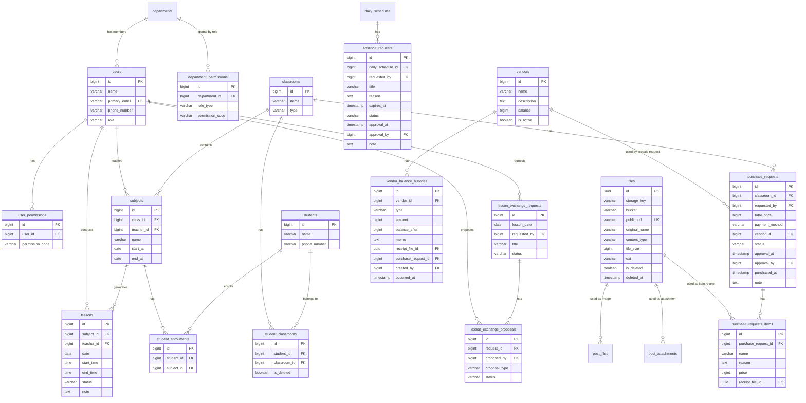

# 데이터 모델 설계 명세서

## 1. 개요

### 1.1 목적
- 프로젝트의 데이터 구조와 관계를 정의
- 데이터베이스 설계의 기초 자료 제공
- 개발팀 간 데이터 구조 공유 및 일관성 확보

### 1.2 범위
- 비즈니스 요구사항에 따른 엔티티 정의
- 엔티티 간 관계 설정
- 데이터 유형 및 제약조건 명시

### 1.3 참조 문서
- [PRD (Product Requirements Document)](./prd.md)
- [API 흐름 문서](./api-spec/api_spec.md)
- [도메인별 API 문서](./api/README.md)
- [기술 명세서](./tech_spec.md)
- [에러 코드 문서](./error_codes.md)

## 2. 데이터 모델 아키텍처

### 2.1 엔티티 관계 요약

#### 1:N 관계

| 부모 엔티티 | 자식 엔티티 | FK 필드 | 설명 |
|-------------|-------------|---------|------|
| Users | User Roles | user_id | 사용자별 역할 |
| Classrooms | Subjects | class_id | 분반별 과목 |
| Subjects | Lessons | subject_id | 과목별 수업 |
| Users | Subjects | teacher_id | 봉사자가 담당하는 과목 |
| Users | Lessons | teacher_id | 봉사자가 진행하는 수업 |
| Daily Schedules | Absence Requests | daily_schedule_id | 하루 일정별 결석 요청 |
| Lesson Exchange Requests | Lesson Exchange Proposals | request_id | 교환 요청별 제안 |
| Classrooms | Purchase Requests | classroom_id | 분반별 기자재 구입 요청 |
| Purchase Requests | Purchase Request Items | purchase_request_id | 구입 요청별 품목 |
| Vendors | Purchase Requests | vendor_id | 거래처 선결제 구입 요청 |
| Vendors | Vendor Balance Histories | vendor_id | 거래처 충전/차감 이력 |
| Users | 각종 요청들 | requested_by | 요청자 |
| Users | 각종 요청들 | approval_by | 승인자 |
| Files | Post Files | file_id | 게시글 이미지 파일 |
| Files | Post Attachments | file_id | 게시글 첨부 파일 |
| Files | Purchase Request Items | receipt_file_id | 품목별 기자재 구입 영수증 파일 |

#### N:M 관계

| 엔티티 A | 엔티티 B | 조인 테이블 | 설명 |
|----------|----------|-------------|------|
| Students | Classrooms | student_classrooms | 학생 분반 소속 |
| Students | Subjects | student_enrollments | 학생 과목 등록 |

### 2.2 ERD 다이어그램

## 3. 엔티티 정의

### 3.1 사용자 (Users)

금정야학 플랫폼 서비스를 관리 혹은 이용하는 사용자입니다.

| 필드명 | 데이터 타입 | 제약조건 | 설명 |
|--------|-------------|----------|------|
| id | BIGINT | PRIMARY KEY, AUTO_INCREMENT | 사용자 고유 ID |
| username | VARCHAR(50) | UNIQUE, NOT NULL | 사용자 아이디 (로그인용) |
| name | VARCHAR(50) | NOT NULL | 사용자 실명 |
| email | VARCHAR(100) | UNIQUE, NULL | 이메일 주소 |
| gmail | VARCHAR(100) | UNIQUE, NULL | Gmail 주소 (OAuth) |
| password_hash | VARCHAR(512) | NULL | 암호화된 비밀번호 |
| phone_number | VARCHAR(20) | NULL | 전화번호 |
| client_id | VARCHAR(512) | NULL | OAuth Client ID |
| created_at | TIMESTAMP | NOT NULL, DEFAULT CURRENT_TIMESTAMP | 생성일시 |
| updated_at | TIMESTAMP | NOT NULL, DEFAULT CURRENT_TIMESTAMP ON UPDATE | 수정일시 |

### 3.2 역할 (RoleType)

사용자의 기본 역할은 `users.role` 컬럼에 저장되며, `RoleType` Enum으로 관리됩니다.

**역할 목록:**
- `ADMIN`: 관리자
- `MANAGER`: 매니저
- `VOLUNTEER`: 봉사자
- `GUEST`: 게스트

**Spring Security 권한 매핑:**
- 모든 역할은 `ROLE_` prefix를 가진 권한으로 매핑됩니다.
- 예: `ADMIN` -> `ROLE_ADMIN`, `MANAGER` -> `ROLE_MANAGER`, `VOLUNTEER` -> `ROLE_VOLUNTEER`

### 3.3 사용자 직접 권한 (user_permissions)

역할 및 부서 권한 외에 사용자별로 수동 부여한 예외 권한을 관리하는 테이블입니다.
ADMIN이 특정 사용자에게 직접 권한을 부여해야 할 때 사용하며, 사용자 상세 응답에서는 `source=MANUAL`로 표시됩니다.

| 필드명 | 데이터 타입 | 제약조건 | 설명 |
|--------|-------------|----------|------|
| id | BIGINT | PRIMARY KEY, AUTO_INCREMENT | 엔티티 고유 ID |
| user_id | BIGINT | FOREIGN KEY, NOT NULL | 사용자 ID |
| permission_code | VARCHAR(100) | NOT NULL | 권한 코드 |
| created_at | TIMESTAMP | NOT NULL, DEFAULT CURRENT_TIMESTAMP | 생성일시 |
| updated_at | TIMESTAMP | NOT NULL, DEFAULT CURRENT_TIMESTAMP ON UPDATE | 수정일시 |

### 3.4 부서 직책별 권한 (department_permissions)

부서와 부서 내 직책에 따라 자동 적용되는 권한을 관리하는 테이블입니다.

| 필드명 | 데이터 타입 | 제약조건 | 설명 |
|--------|-------------|----------|------|
| id | BIGINT | PRIMARY KEY, AUTO_INCREMENT | 엔티티 고유 ID |
| department_id | BIGINT | FOREIGN KEY, NOT NULL | 부서 ID |
| role_type | VARCHAR(20) | NOT NULL | 부서 직책 유형 (`MEMBER`, `MANAGER`) |
| permission_code | VARCHAR(100) | NOT NULL | 권한 코드 |
| created_at | TIMESTAMP | NOT NULL, DEFAULT CURRENT_TIMESTAMP | 생성일시 |
| updated_at | TIMESTAMP | NOT NULL, DEFAULT CURRENT_TIMESTAMP ON UPDATE | 수정일시 |

**정책:**
- 같은 부서, 같은 직책, 같은 권한 코드는 중복 저장할 수 없습니다.
- `role_type=MEMBER` 권한은 해당 부서 소속 `VOLUNTEER`, `MANAGER`에게 적용됩니다.
- `role_type=MANAGER` 권한은 해당 부서 소속 `MANAGER`에게 추가 적용됩니다.
- 사용자 상세 응답에서는 `source=MEMBER` 또는 `source=MANAGER`로 표시됩니다.

### 3.5 분반(classrooms)

분반을 관리하는 엔티티입니다. 관리자가 추가 및 수정을 관리합니다.

| 필드명 | 데이터 타입 | 제약조건 | 설명 |
|--------|-------------|----------|------|
| id | BIGINT | PRIMARY KEY, AUTO_INCREMENT | 엔티티 고유 ID |
| name | VARCHAR(50) | NOT NULL | 분반 이름 |
| type | VARCHAR(20) | NOT NULL | 주중반, 주말반 등 |
| description | TEXT | NULL | 추가 정보 |
| created_at | TIMESTAMP | NOT NULL, DEFAULT CURRENT_TIMESTAMP | 생성일시 |
| updated_at | TIMESTAMP | NOT NULL, DEFAULT CURRENT_TIMESTAMP ON UPDATE | 수정일시 |

### 3.6 학생 (students)

학생을 관리하는 엔티티입니다. 현재로서는 관리자가 추가 및 등록을 관리합니다. 학생은 `student_classrooms`를 통해 하나 이상의 분반에 소속될 수 있습니다.

| 필드명 | 데이터 타입 | 제약조건 | 설명 |
|--------|-------------|----------|------|
| id | BIGINT | PRIMARY KEY, AUTO_INCREMENT | 엔티티 고유 ID |
| name | VARCHAR(50) | NOT NULL | 학생 이름 |
| phone_number | VARCHAR(20) | NULL | 학생 전화번호 |
| description | TEXT | NULL | 추가 정보 |
| created_at | TIMESTAMP | NOT NULL, DEFAULT CURRENT_TIMESTAMP | 생성일시 |
| updated_at | TIMESTAMP | NOT NULL, DEFAULT CURRENT_TIMESTAMP ON UPDATE | 수정일시 |

### 3.7 학생 분반 소속 (student_classrooms)

학생과 분반의 소속 관계를 관리하는 엔티티입니다. 같은 학생-분반 조합은 하나의 행으로 관리하며, 삭제 시 `is_deleted`를 사용하는 soft delete 방식을 따릅니다.

| 필드명 | 데이터 타입 | 제약조건 | 설명 |
|--------|-------------|----------|------|
| id | BIGINT | PRIMARY KEY, AUTO_INCREMENT | 엔티티 고유 ID |
| student_id | BIGINT | FOREIGN KEY, NOT NULL | 학생 ID |
| classroom_id | BIGINT | FOREIGN KEY, NOT NULL | 분반 ID |
| is_deleted | BOOLEAN | NOT NULL, DEFAULT FALSE | 삭제 여부 |
| created_at | TIMESTAMP | NOT NULL, DEFAULT CURRENT_TIMESTAMP | 생성일시 |
| updated_at | TIMESTAMP | NOT NULL, DEFAULT CURRENT_TIMESTAMP ON UPDATE | 수정일시 |

### 3.8 과목(subjects)

학생이 수업할 과목입니다. 학생과 봉사에 대한 협의 후 관리자가 추가 및 수정을 관리합니다.

| 필드명 | 데이터 타입 | 제약조건 | 설명 |
|--------|-------------|----------|------|
| id | BIGINT | PRIMARY KEY, AUTO_INCREMENT | 엔티티 고유 ID |
| class_id | BIGINT | FOREIGN KEY | 분반 ID |
| teacher_id | BIGINT | FOREIGN KEY | 선생님 ID |
| start_at | DATE | NOT NULL | 과목 시작일 |
| end_at | DATE | NOT NULL | 과목 종료일 |
| day_of_week | VARCHAR(20) | NOT NULL | 요일 |
| start_time | TIME | NOT NULL | 시작 시간 |
| end_time | TIME | NOT NULL | 종료 시간 |
| period | INT | NOT NULL | 수업 시간 |
| name | VARCHAR(50) | NOT NULL | 과목 이름 |
| description | TEXT | NULL | 추가 정보 |
| created_at | TIMESTAMP | NOT NULL, DEFAULT CURRENT_TIMESTAMP | 생성일시 |
| updated_at | TIMESTAMP | NOT NULL, DEFAULT CURRENT_TIMESTAMP ON UPDATE | 수정일시 |

### 3.9 수업 (lessons)

수업을 관리하는 엔티티입니다. 봉사자가 관리자와 협의하여 수업을 생성할 때, 시작일, 종료일, 요일, 시간 등을 기반으로 자동 생성됩니다.
이 수업은 캘린더 뷰 형태로 일별 / 월별로 조회할 수 있습니다. 

| 필드명 | 데이터 타입 | 제약조건 | 설명 |
|--------|-------------|----------|------|
| id | BIGINT | PRIMARY KEY, AUTO_INCREMENT | 엔티티 고유 ID |
| subject_id | BIGINT | FOREIGN KEY | 과목 ID |
| teacher_id | BIGINT | FOREIGN KEY | 선생님 ID |
| date | DATE | NOT NULL | 수업 날짜 |
| start_time | TIME | NOT NULL | 수업 시작 시간 |
| end_time | TIME | NOT NULL | 수업 종료 시간 |
| status | VARCHAR(20) | NOT NULL | 수업 상태 |
| note | TEXT | NULL | DailySchedule 수업 일지에서 저장한 교시별 수업 내용 |
| created_at | TIMESTAMP | NOT NULL, DEFAULT CURRENT_TIMESTAMP | 생성일시 |
| updated_at | TIMESTAMP | NOT NULL, DEFAULT CURRENT_TIMESTAMP ON UPDATE | 수정일시 |

### 3.10 학생 과목 등록 (student_enrollments)

학생이 과목에 등록하는 엔티티입니다. 등록된 학생은 해당 과목이 속한 분반의 DailySchedule 학생 출석부 초기화 대상이 됩니다.

| 필드명 | 데이터 타입 | 제약조건 | 설명 |
|--------|-------------|----------|------|
| id | BIGINT | PRIMARY KEY, AUTO_INCREMENT | 엔티티 고유 ID |
| student_id | BIGINT | FOREIGN KEY | 학생 ID |
| subject_id | BIGINT | FOREIGN KEY | 과목 ID |
| enrollment_request_id | BIGINT | FOREIGN KEY, NULL | 등록 요청 ID |
| status | VARCHAR(20) | NOT NULL | 등록 상태 |
| enrolled_at | TIMESTAMP | NOT NULL | 등록 시각 |
| withdrawn_at | TIMESTAMP | NULL | 철회 시각 |
| created_at | TIMESTAMP | NOT NULL, DEFAULT CURRENT_TIMESTAMP | 생성일시 |
| updated_at | TIMESTAMP | NOT NULL, DEFAULT CURRENT_TIMESTAMP ON UPDATE | 수정일시 |

### 3.11 결석 요청 (absence_requests)

교사(봉사자)는 하루 일정에 부득이하게 결석할 때 이를 요청하기 위해 사용하는 엔티티입니다.

| 필드명 | 데이터 타입 | 제약조건 | 설명 |
|--------|-------------|----------|------|
| id | BIGINT | PRIMARY KEY, AUTO_INCREMENT | 엔티티 고유 ID |
| daily_schedule_id | BIGINT | FOREIGN KEY | 하루 일정 ID |
| requested_by | BIGINT | FOREIGN KEY | 결석 요청자 ID |
| title | VARCHAR(255) | NOT NULL | 결석 요청 제목 |
| reason | TEXT | NOT NULL | 결석 이유 |
| expires_at | TIMESTAMP | NOT NULL | 결석 요청 만료 시각. 대상 하루 일정 수업일의 00:00으로 자동 설정 |
| status | VARCHAR(20) | NOT NULL | 결석 요청 상태 |
| approval_at | TIMESTAMP | NULL | 결석 요청 승인일시 |
| approval_by | BIGINT | FOREIGN KEY | 결석 요청 승인자 ID |
| note | TEXT | NULL | 추가 정보(관리자가 기입) |
| created_at | TIMESTAMP | NOT NULL, DEFAULT CURRENT_TIMESTAMP | 생성일시 |
| updated_at | TIMESTAMP | NOT NULL, DEFAULT CURRENT_TIMESTAMP ON UPDATE | 수정일시 |

**상태 규칙:**
- `PENDING` → `APPROVED`, `REJECTED`, `CANCELLED`, `EXPIRED`
- `APPROVED`, `REJECTED`, `CANCELLED`, `EXPIRED` 상태는 재처리할 수 없음

**정책:**
- 요청자는 대상 하루 일정의 담당 교사여야 함. 관리자/매니저도 담당 교사가 아니면 대리 생성할 수 없음
- 같은 하루 일정과 같은 요청자 기준으로 `PENDING`, `APPROVED` 요청이 있으면 중복 생성 불가
- `REJECTED`, `CANCELLED` 요청은 재요청 가능
- 취소는 물리 삭제가 아니라 `CANCELLED` 상태 변경이며 요청자 본인만 가능
- 만료 시각이 지난 `PENDING` 요청은 스케줄러가 `EXPIRED`로 변경함

### 3.12 수업 교환 요청 (lesson_exchange_requests)

교사(봉사자)는 특정 날짜의 자신의 수업 전체에 대해 하루 단위 수업 교환을 요청할 때 사용하는 엔티티입니다.
현재 수업 교환 요청은 `lesson_date`와 요청자 기준 활성 Lesson 목록으로 대상을 계산합니다. 장기적으로는 DailySchedule 기반 전환을 검토할 수 있지만, 현 구현에서는 제안 수락 시 실제 교시별 Lesson 담당 교사를 변경해야 하므로 Lesson 기반 구조를 유지합니다.

| 필드명 | 데이터 타입 | 제약조건 | 설명 |
|--------|-------------|----------|------|
| id | BIGINT | PRIMARY KEY, AUTO_INCREMENT | 엔티티 고유 ID |
| lesson_date | DATE | NOT NULL | 교환 대상 수업 날짜 |
| requested_by | BIGINT | FOREIGN KEY | 수업 교환 요청자 ID |
| title | VARCHAR(255) | NOT NULL | 수업 교환 요청 제목 |
| classroom_name_snapshot | VARCHAR(255) | NOT NULL | 생성/수정 시점 반 이름 snapshot |
| content | TEXT | NOT NULL | 수업 교환 요청 내용 |
| status | VARCHAR(20) | NOT NULL | 수업 교환 요청 상태 |
| expires_at | TIMESTAMP | NOT NULL | 제안 가능 만료 시각 |
| processed_at | TIMESTAMP | NULL | 승인/반려 처리 시각 |
| processed_by | BIGINT | FOREIGN KEY | 승인/반려 처리자 ID |
| completed_at | TIMESTAMP | NULL | 제안 수락 완료 시각 |
| cancelled_at | TIMESTAMP | NULL | 요청 취소 시각 |
| rejection_note | TEXT | NULL | 반려 사유 |
| created_at | TIMESTAMP | NOT NULL, DEFAULT CURRENT_TIMESTAMP | 생성일시 |
| updated_at | TIMESTAMP | NOT NULL, DEFAULT CURRENT_TIMESTAMP ON UPDATE | 수정일시 |

**상태 규칙:**
- `PENDING` → `APPROVED`, `REJECTED`, `CANCELLED`, `EXPIRED`
- `APPROVED` → `COMPLETED`, `EXPIRED`

### 3.12.1 수업 교환 제안 (lesson_exchange_proposals)

승인된 수업 교환 요청에 대해 다른 봉사자가 교환형 또는 대체형 제안을 등록할 때 사용하는 엔티티입니다.

| 필드명 | 데이터 타입 | 제약조건 | 설명 |
|--------|-------------|----------|------|
| id | BIGINT | PRIMARY KEY, AUTO_INCREMENT | 엔티티 고유 ID |
| request_id | BIGINT | FOREIGN KEY, NOT NULL | 대상 수업 교환 요청 ID |
| proposed_by | BIGINT | FOREIGN KEY, NOT NULL | 제안자 ID |
| proposal_type | VARCHAR(20) | NOT NULL | 제안 타입 (`EXCHANGE`, `SUBSTITUTION`) |
| lesson_date | DATE | NULL | 교환형 제안 수업 날짜 (`SUBSTITUTION`이면 NULL) |
| content | TEXT | NOT NULL | 제안 내용 |
| classroom_name_snapshot | VARCHAR(255) | NULL | 교환형 제안의 반 이름 snapshot |
| status | VARCHAR(20) | NOT NULL | 제안 상태 |
| accepted_at | TIMESTAMP | NULL | 제안 수락 시각 |
| withdrawn_at | TIMESTAMP | NULL | 제안 철회 시각 |
| closed_at | TIMESTAMP | NULL | 제안 종료 시각 |
| created_at | TIMESTAMP | NOT NULL, DEFAULT CURRENT_TIMESTAMP | 생성일시 |
| updated_at | TIMESTAMP | NOT NULL, DEFAULT CURRENT_TIMESTAMP ON UPDATE | 수정일시 |

**상태 규칙:**
- `ACTIVE` → `WITHDRAWN`, `ACCEPTED`, `CLOSED`

### 3.13 거래처 (vendors)

거래처 선결제 방식에서 사용할 거래처와 현재 잔액을 관리하는 엔티티입니다.

| 필드명 | 데이터 타입 | 제약조건 | 설명 |
|--------|-------------|----------|------|
| id | BIGINT | PRIMARY KEY, AUTO_INCREMENT | 거래처 고유 ID |
| name | VARCHAR(255) | NOT NULL | 거래처명 |
| description | TEXT | NULL | 거래처 설명 |
| balance | BIGINT | NOT NULL, DEFAULT 0 | 현재 선결제 잔액 |
| is_active | BOOLEAN | NOT NULL, DEFAULT TRUE | 사용 가능 여부 |
| is_deleted | BOOLEAN | NOT NULL, DEFAULT FALSE | 삭제 여부 |
| deleted_at | TIMESTAMP | NULL | 삭제 시각 |
| created_at | TIMESTAMP | NOT NULL, DEFAULT CURRENT_TIMESTAMP | 생성일시 |
| updated_at | TIMESTAMP | NOT NULL, DEFAULT CURRENT_TIMESTAMP ON UPDATE | 수정일시 |

### 3.14 기자재 구입 요청 (purchase_requests)

봉사자 혹은 관리자가 수업에 필요한 기자재를 구입하기 위해 사용하는 엔티티입니다. 최초 요청에는 예상 금액을 저장하지 않고, 구매 완료 보고 거래 라인의 금액 합산으로 총액을 계산합니다.

| 필드명 | 데이터 타입 | 제약조건 | 설명 |
|--------|-------------|----------|------|
| id | BIGINT | PRIMARY KEY, AUTO_INCREMENT | 엔티티 고유 ID |
| classroom_id | BIGINT | FOREIGN KEY, NOT NULL | 분반 ID |
| requested_by | BIGINT | FOREIGN KEY, NOT NULL | 기자재 구입 요청자 ID |
| title | VARCHAR(255) | NOT NULL | 기자재 구입 요청 제목 |
| content | TEXT | NOT NULL | 기자재 구입 요청 내용 |
| total_price | BIGINT | NOT NULL | 구매 완료 거래 금액 합산 총액 |
| status | VARCHAR(20) | NOT NULL | 기자재 구입 요청 상태 |
| approval_at | TIMESTAMP | NULL | 기자재 구입 요청 승인일시 |
| approval_by | BIGINT | FOREIGN KEY | 기자재 구입 요청 승인자 ID |
| purchased_at | TIMESTAMP | NULL | 구매 완료 보고 시각 |
| note | TEXT | NULL | 추가 정보(관리자가 기입) |
| created_at | TIMESTAMP | NOT NULL, DEFAULT CURRENT_TIMESTAMP | 생성일시 |
| updated_at | TIMESTAMP | NOT NULL, DEFAULT CURRENT_TIMESTAMP ON UPDATE | 수정일시 |

**상태 규칙:**
- `PENDING` → `APPROVED` 또는 `REJECTED`
- `APPROVED` → `PURCHASED`
- `PURCHASED` → `CONFIRMED`

**결재 확인 규칙:**
- 구매 완료 거래 라인에 거래처, 품목명, 양수 결제 금액이 있어야 `CONFIRMED` 전환이 가능합니다.
- `CONFIRMED` 전환 시 거래처별 총 결제 금액을 차감하고 `vendor_balance_histories`에 `DEDUCT` 이력을 저장합니다.
- 거래처 잔액 부족, 비활성, 삭제 상태이면 결재 확인은 실패하며 요청 상태와 거래처 잔액은 변경되지 않습니다.

### 3.15 기자재 구입 요청 품목 (purchase_requests_items)

구입 요청의 신청 품목을 관리하는 엔티티입니다.

| 필드명 | 데이터 타입 | 제약조건 | 설명 |
|--------|-------------|----------|------|
| id | BIGINT | PRIMARY KEY, AUTO_INCREMENT | 품목 고유 ID |
| purchase_request_id | BIGINT | FOREIGN KEY, NOT NULL | 기자재 구입 요청 ID |
| name | VARCHAR(255) | NOT NULL | 품명 |
| reason | TEXT | NULL | 구입 사유 |
| quantity | INTEGER | NOT NULL | 개수 |
| payment_type | VARCHAR(20) | NOT NULL | 결제 유형 (`PREPAID`, `ACTUAL`) |
| created_at | TIMESTAMP | NOT NULL, DEFAULT CURRENT_TIMESTAMP | 생성일시 |
| updated_at | TIMESTAMP | NOT NULL, DEFAULT CURRENT_TIMESTAMP ON UPDATE | 수정일시 |

### 3.15.1 구매 완료 거래 (purchase_request_payment_transactions)

구매 완료 보고 단계에서 거래처별 실제 결제 금액과 선택 영수증을 관리하는 엔티티입니다. 한 거래 라인에는 여러 품목명을 연결할 수 있습니다.

| 필드명 | 데이터 타입 | 제약조건 | 설명 |
|--------|-------------|----------|------|
| id | BIGINT | PRIMARY KEY, AUTO_INCREMENT | 거래 라인 ID |
| purchase_request_id | BIGINT | FOREIGN KEY, NOT NULL | 기자재 구입 요청 ID |
| vendor_id | BIGINT | FOREIGN KEY, NOT NULL | 거래처 ID |
| amount | BIGINT | NOT NULL | 총 결제 금액 |
| receipt_file_id | UUID | FOREIGN KEY, NULL | 영수증 파일 ID |

### 3.16 거래처 잔액 이력 (vendor_balance_histories)

거래처 충전과 결재 확인 차감을 기록하는 엔티티입니다.

| 필드명 | 데이터 타입 | 제약조건 | 설명 |
|--------|-------------|----------|------|
| id | BIGINT | PRIMARY KEY, AUTO_INCREMENT | 이력 고유 ID |
| vendor_id | BIGINT | FOREIGN KEY, NOT NULL | 거래처 ID |
| type | VARCHAR(20) | NOT NULL | 이력 타입 (`CHARGE`, `DEDUCT`) |
| amount | BIGINT | NOT NULL | 충전/차감 금액 |
| balance_after | BIGINT | NOT NULL | 처리 후 잔액 |
| memo | TEXT | NULL | 메모 |
| receipt_file_id | UUID | FOREIGN KEY, NULL | 충전 영수증 파일 ID |
| purchase_request_id | BIGINT | FOREIGN KEY, NULL | 차감과 연결된 구입 요청 ID |
| created_by | BIGINT | FOREIGN KEY, NOT NULL | 처리자 ID |
| occurred_at | TIMESTAMP | NOT NULL | 발생 시각 |
| is_deleted | BOOLEAN | NOT NULL, DEFAULT FALSE | 삭제 여부 |
| deleted_at | TIMESTAMP | NULL | 삭제 시각 |
| created_at | TIMESTAMP | NOT NULL, DEFAULT CURRENT_TIMESTAMP | 생성일시 |
| updated_at | TIMESTAMP | NOT NULL, DEFAULT CURRENT_TIMESTAMP ON UPDATE | 수정일시 |

### 3.17 파일 메타데이터 (files)

업로드된 이미지와 첨부파일의 저장소 위치 및 메타데이터를 관리하는 엔티티입니다.

| 필드명 | 데이터 타입 | 제약조건 | 설명 |
|--------|-------------|----------|------|
| id | UUID | PRIMARY KEY | 파일 고유 ID |
| storage_key | VARCHAR(500) | NOT NULL | 스토리지 내부 객체 경로 |
| bucket | VARCHAR(100) | NOT NULL | 스토리지 버킷 이름 |
| public_url | VARCHAR(1000) | UNIQUE, NOT NULL | 공개 접근 URL |
| original_name | VARCHAR(255) | NULL | 원본 파일명 |
| content_type | VARCHAR(100) | NOT NULL | MIME 타입 |
| file_size | BIGINT | NULL | 파일 크기 |
| ext | VARCHAR(20) | NOT NULL | 파일 확장자 |
| is_deleted | BOOLEAN | NOT NULL, DEFAULT FALSE | Soft delete 여부 |
| deleted_at | TIMESTAMP | NULL | Soft delete 처리 시각 |
| created_at | TIMESTAMP | NOT NULL, DEFAULT CURRENT_TIMESTAMP | 생성일시 |
| updated_at | TIMESTAMP | NOT NULL, DEFAULT CURRENT_TIMESTAMP ON UPDATE | 수정일시 |

**정책:**
- 파일 삭제 요청 시 즉시 DB 레코드를 제거하지 않고 `is_deleted = true`, `deleted_at = now()`로 표시합니다.
- 파일 정리 스케줄러는 보관 기간이 지난 soft deleted 파일을 스토리지와 DB에서 최종 삭제합니다.
- `documents/purchase-items/` 경로의 영수증 파일이 일정 시간 동안 어떤 구매 완료 거래의 `receipt_file_id`에도 연결되지 않으면 스케줄러가 soft delete 처리합니다.
- hard delete는 storage 삭제에 성공한 파일에만 수행합니다. storage 삭제 실패 시 DB 레코드를 유지해 다음 주기에 재시도합니다.
