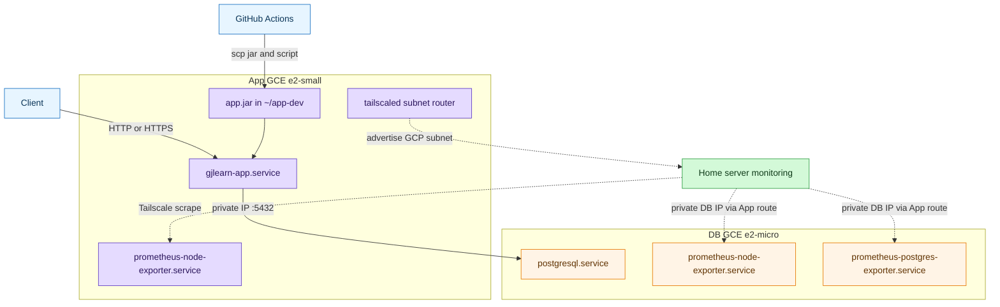

# GCE 분리 배포와 PostgreSQL/Flyway 운영

## 목표 구성



Spring Boot 애플리케이션과 PostgreSQL을 서로 다른 GCE 인스턴스에서 실행한다. 운영 GCE에서는 Docker/Compose를 사용하지 않고, 앱은 jar를 systemd로 실행하며 DB와 exporter는 apt 패키지와 systemd로 실행한다. 운영/모니터링/CI 접근은 App VM Tailscale IP 또는 MagicDNS를 기준으로 하며, DB는 App VM이 advertise한 GCP subnet route 뒤의 private IP로만 접근한다.

## 배포 파일

- 앱 서버: `build/libs/*.jar`, `scripts/gcp/05_app/01_install-app-service.sh`, `~/app-dev/.env`
- DB 서버: `scripts/gcp/04_db/01_install-db-service.sh`, `~/db-dev/.env`
- 로컬 개발/검증: 기존 `docker-compose*.yml` 유지

## 환경 변수

앱 서버 `~/app-dev/.env`의 필수 DB 접속 변수:

- `POSTGRES_HOST`: DB 서버 private IP 또는 내부 DNS
- `POSTGRES_PORT`: 기본 `5432`
- `POSTGRES_DB`
- `POSTGRES_USER`
- `POSTGRES_PASSWORD`
- `POSTGRES_OPTIONS`
- `FLYWAY_ENABLED`
- `FLYWAY_BASELINE_ON_MIGRATE`: 신규 운영 DB는 `false`
- `ADMIN_BOOTSTRAP_ENABLED`
- `ADMIN_EMAIL`
- `ADMIN_PASSWORD`: 최초 관리자 생성 후 제거 가능

DB 서버 `~/db-dev/.env`의 필수 실행 변수:

- `POSTGRES_DB`
- `POSTGRES_USER`
- `POSTGRES_PASSWORD`
- `DB_PORT`: 기본 `5432`
- `DB_LISTEN_ADDRESS`: 기본 `*`
- `APP_DB_CIDR`: DB 접속을 허용할 앱 서버 CIDR. App VM VPC private IP `/32`를 넣는다.
- `POSTGRES_EXPORTER_PORT`: 기본 `9187`

`DB_LISTEN_ADDRESS=*`로 두더라도 GCE firewall에서 `5432`를 public으로 열지 않는다. App VM은 VPC private IP로 DB에 접근하며, 홈서버는 App VM subnet route를 통해 DB private IP의 exporter만 scrape한다.

## 배포 절차

```mermaid
flowchart LR
    Infra["Provision App and DB GCE"] --> Tailnet["Join App to Tailscale"]
    Tailnet --> Env["Render app and db env"]
    Env --> DbInstall["Install DB service"]
    DbInstall --> JarBuild["Build bootJar"]
    JarBuild --> AppInstall["Install App service"]
    AppInstall --> Flyway["Flyway migrate"]
    Flyway --> Bootstrap["Admin bootstrap"]
    Bootstrap --> Verify["Health and metrics checks"]

    classDef infra fill:#e7f5ff,stroke:#1971c2,color:#0b3558
    classDef runtime fill:#e5dbff,stroke:#5f3dc4,color:#2b165c
    classDef data fill:#fff4e6,stroke:#e67700,color:#5f3200
    classDef done fill:#d3f9d8,stroke:#2f9e44,color:#103b1a
    class Infra,Tailnet infra
    class Env,JarBuild,AppInstall runtime
    class DbInstall,Flyway,Bootstrap data
    class Verify done
```



1. GCE `e2-small` 앱 인스턴스와 `e2-micro` DB 인스턴스를 같은 VPC/리전에 생성한다.
2. `scripts/gcp/01_infra/01_provision-gcp.sh`가 startup script로 Java, PostgreSQL client, node-exporter 기본 패키지와 `~/app-dev`, `~/db-dev` 디렉터리를 준비한다.
3. App VM에서 `sudo tailscale up --advertise-routes=<gcp-subnet-cidr>`로 홈서버와 같은 tailnet에 붙이고, Tailscale admin console에서 subnet route를 승인한다.
4. `scripts/gcp/03_env_render/00_render-server-env.sh <env> app > scripts/gcp/00_env/<env>.app.env`, `scripts/gcp/03_env_render/00_render-server-env.sh <env> db > scripts/gcp/00_env/<env>.db.env`를 생성하고 비밀번호/secret 값을 채운다.
5. DB 인스턴스에 `scripts/gcp/00_env/<env>.db.env`와 `scripts/gcp/04_db/01_install-db-service.sh`를 복사하고 실행한다.
6. 앱 서버 `~/app-dev/.env`의 `POSTGRES_HOST`를 DB VPC private IP로 설정한다. 렌더 스크립트 기본값은 DB VPC private IP이므로 `<env>.db.env`의 `APP_DB_CIDR`도 App VM VPC private IP `/32`인지 확인한다.
7. `./gradlew bootJar -x test`로 jar를 만든다.
8. 앱 인스턴스에 jar와 `scripts/gcp/05_app/01_install-app-service.sh`를 복사하고 실행한다.
9. 앱 로그에서 DB 연결, Flyway 실행, 관리자 bootstrap 결과를 확인한다.
10. 최초 관리자 생성 후 `ADMIN_PASSWORD`를 `.env`에서 제거하고 앱을 재시작해도 된다.

DB 서버 예시:

```bash
scripts/gcp/03_env_render/00_render-server-env.sh scripts/gcp/00_env/prod.env db > scripts/gcp/00_env/prod.db.env
# scripts/gcp/00_env/prod.db.env에서 POSTGRES_PASSWORD, APP_DB_CIDR 확인

gcloud compute scp scripts/gcp/04_db/01_install-db-service.sh scripts/gcp/00_env/prod.db.env \
  "$DB_INSTANCE_NAME:~/db-dev/" \
  --project "$PROJECT_ID" \
  --zone "$ZONE" \
  --tunnel-through-iap

gcloud compute ssh "$DB_INSTANCE_NAME" \
  --project "$PROJECT_ID" \
  --zone "$ZONE" \
  --tunnel-through-iap \
  --command "cd ~/db-dev && mv prod.db.env .env && chmod +x 01_install-db-service.sh && ./01_install-db-service.sh"
```

앱 서버 예시:

```bash
scripts/gcp/03_env_render/00_render-server-env.sh scripts/gcp/00_env/prod.env app > scripts/gcp/00_env/prod.app.env
# scripts/gcp/00_env/prod.app.env에서 POSTGRES_PASSWORD, JWT_SECRET, JWE_SECRET, OAuth/Firebase 값을 채움
./gradlew bootJar -x test

gcloud compute scp scripts/gcp/00_env/prod.app.env scripts/gcp/05_app/01_install-app-service.sh build/libs/*.jar \
  "$APP_INSTANCE_NAME:~/app-dev/" \
  --project "$PROJECT_ID" \
  --zone "$ZONE"

gcloud compute ssh "$APP_INSTANCE_NAME" \
  --project "$PROJECT_ID" \
  --zone "$ZONE" \
  --command "cd ~/app-dev && mv *.jar app.jar && mv prod.app.env .env && chmod +x 01_install-app-service.sh && ./01_install-app-service.sh"
```

## 운영 확인

앱 서버:

```bash
sudo systemctl status gjlearn-app --no-pager
sudo journalctl -u gjlearn-app -n 200 --no-pager
curl -fsS http://127.0.0.1:9090/actuator/prometheus >/dev/null
curl -fsS http://127.0.0.1:9100/metrics >/dev/null
```

DB 서버:

```bash
sudo systemctl status postgresql --no-pager
sudo systemctl status prometheus-node-exporter --no-pager
sudo systemctl status prometheus-postgres-exporter --no-pager
sudo -u postgres psql -d "$POSTGRES_DB" -c 'select 1;'
curl -fsS http://127.0.0.1:9100/metrics >/dev/null
curl -fsS http://127.0.0.1:9187/metrics >/dev/null
```

## 방화벽 기준

- 외부 공개: 앱 서버의 HTTP/HTTPS 또는 앱 포트만 허용한다.
- Tailscale: `udp:41641`은 App VM에만 public 허용한다.
- DB 포트: `tcp:5432`는 public internet에 열지 않는다. App VM VPC private IP에서만 접근시킨다.
- 모니터링 포트: `8080`, `9100`, `9187`은 public internet에 직접 열지 않는다. 홈서버 Prometheus가 App subnet route로 scrape한다.
- SSH: 최초 설정/비상 접근은 운영자 IP 또는 IAP로 제한하고, CI/CD는 SSH key 기반 SCP/SSH를 사용한다.

DB 방화벽 예시:

```bash
gcloud compute firewall-rules create allow-app-to-postgres \
  --network=default \
  --allow=tcp:5432 \
  --source-ranges=APP_SERVER_PRIVATE_IP/32 \
  --target-tags=db-server
```

## Flyway 운영 원칙

- 마이그레이션 파일은 `src/main/resources/db/migration` 아래에 둔다.
- 파일명은 `V{version}__{description}.sql` 형식을 사용한다.
- 한번 공유 브랜치에 반영된 마이그레이션 파일은 수정하지 않고 새 버전 파일을 추가한다.
- 운영 프로필은 JPA `ddl-auto=validate`를 사용하고, 스키마 생성/변경은 Flyway가 담당한다.
- 테스트 프로필은 기존 H2 초기화 흐름을 유지하기 위해 Flyway를 비활성화한다.
- `spring.sql.init`은 운영에서 비활성화한다.
- `flyway.clean`은 운영에서 비활성화한다.
- `FLYWAY_BASELINE_ON_MIGRATE=true`는 기존 스키마를 Flyway로 편입하는 일회성 작업에만 사용한다.

## 백업과 복구

DB 서버에서 수동 백업:

```bash
sudo -u postgres pg_dump "$POSTGRES_DB" > backup.sql
```

복구:

```bash
sudo -u postgres psql "$POSTGRES_DB" < backup.sql
```

운영에서는 최소 1일 1회 백업을 VM 외부 저장소에 보관한다.

## 장애 대응

앱의 DB 연결 실패 시:

1. 앱 서버 `.env`의 `POSTGRES_HOST`, `POSTGRES_PORT`, 계정 값을 확인한다.
2. 앱 서버에서 `nc -vz "$POSTGRES_HOST" "$POSTGRES_PORT"`로 네트워크 접근을 확인한다.
3. DB 서버 `APP_DB_CIDR`/`pg_hba.conf`가 App VM VPC private IP `/32`를 허용하는지 확인한다. PostgreSQL 로그의 `no pg_hba.conf entry for host "..."`에 찍힌 IP를 그대로 `/32`로 허용한다.
4. DB 서버에서 `sudo journalctl -u postgresql -n 200 --no-pager`로 PostgreSQL 로그를 확인한다.

Flyway 실패 시:

1. 앱 서버에서 `sudo journalctl -u gjlearn-app -n 200 --no-pager`로 실패한 버전과 SQL 에러를 확인한다.
2. DB 백업이 있으면 복구 가능 여부를 먼저 판단한다.
3. 이미 적용된 마이그레이션 파일을 수정하지 않고, 실패 원인을 해결하는 새 마이그레이션을 작성한다.
4. 초기 배포처럼 데이터가 없는 환경이면 DB 삭제/재생성이 가능하지만, 운영 데이터가 있으면 데이터 디렉터리 삭제를 금지한다.
