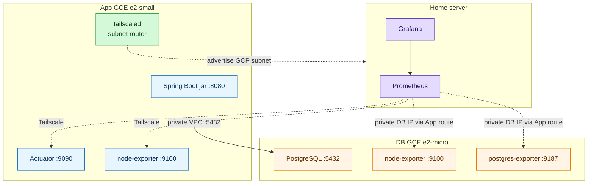

# Tailscale 기반 배포/모니터링 연동

이 문서는 홈서버 Prometheus/Grafana와 GCE App/DB 서버를 Tailscale로 연결하는 기준 절차다. 현재 구조는 App VM만 tailnet에 붙이고, DB VM은 App VM이 advertise한 GCP subnet route 뒤의 private VM으로 둔다.

전체 배포 순서와 릴리스 흐름은 [deploy runbook](./deploy.md)을 기준으로 한다.

## 목표 구조



public internet에 직접 열어야 하는 것은 App VM의 Tailscale direct path용 `41641/udp`뿐이다. `8080`, `9100`, `9187`, `5432`는 public internet에 열지 않는다.

`tailscale status` 확인 결과 GJLearn 서버 노드는 `gjlearn-dev-app`, `gjlearn-prod-app`뿐이며 DB 노드는 없다. `gjlearn-prod-app`은 `10.146.0.0/20`을 primary route로 advertise한다.

## 1. App VM Tailscale 인증

App VM에서 Tailscale을 인증하고 GCP subnet CIDR을 advertise한다. DB VM에는 Tailscale을 설치하거나 인증하지 않는다.

```bash
printf 'net.ipv4.ip_forward = 1\n' | sudo tee /etc/sysctl.d/99-gjlearn-tailscale-router.conf
sudo sysctl --system
sudo tailscale up \
  --advertise-tags=tag:gjlearn-prod-app,tag:gjlearn-app,tag:prod \
  --advertise-routes=10.146.0.0/20 \
  --accept-dns=false
```

`--advertise-routes`는 Tailscale admin console에서 승인해야 실제 route가 활성화된다. 확인:

```bash
tailscale status
tailscale status --json | jq '.Peer[] | select(.HostName=="gjlearn-prod-app") | {HostName, TailscaleIPs, PrimaryRoutes}'
```

MagicDNS를 사용할 경우 App VM hostname만 확인한다.

```bash
tailscale status --json | jq -r '.Peer[] | select(.HostName=="gjlearn-prod-app") | .DNSName'
```

## 2. 홈서버 Prometheus 설정

Backend repo의 `infra/monitoring`은 편집/독립 실행용 mirror이고, 홈서버 운영 경로는 `/home/min/Infra/monitoring`이다.

```text
infra/monitoring/prometheus/targets/gjlearn/dev/app-actuator.yml
infra/monitoring/prometheus/targets/gjlearn/dev/node-exporter.yml
infra/monitoring/prometheus/targets/gjlearn/dev/postgres-exporter.yml
```

App target은 App Tailscale hostname/IP를 쓴다. DB target은 DB private IP를 쓴다.

```text
gjlearn-prod-app.<tailnet>.ts.net:9090
gjlearn-prod-app.<tailnet>.ts.net:9100
<DB_PRIVATE_IP>:9100
<DB_PRIVATE_IP>:9187
```

홈서버 Prometheus reload:

```bash
/home/min/Infra/monitoring/scripts/restart.sh
```

## 3. GCP firewall 기준

| 포트 | 소스 | 대상 | 용도 |
|------|------|------|------|
| `41641/udp` | `0.0.0.0/0` | App VM | Tailscale WireGuard direct path |
| `22/tcp` | 관리자 IP 또는 IAP | App/DB VM | 최초 설정/비상 접근 |
| `5432/tcp` | App network tag | DB VM | App에서 PostgreSQL 접근 |

열지 않는 포트:

| 포트 | 이유 |
|------|------|
| `9100` | App route를 통해서만 scrape |
| `9187` | App route를 통해서만 scrape |
| `5432` | App VM private 경로에서만 DB 접근 |

## 4. DB 접속 범위

DB 서버의 `~/db-dev/.env`는 `APP_DB_CIDR`을 App VM VPC private IP `/32`로 둔다. App subnet route를 통해 홈서버가 DB private IP로 접근하더라도 DB 입장에서는 App VM을 통해 들어오는 경로다.

```env
APP_DB_CIDR=10.x.x.x/32
```

변경 후 DB 서버에서 재실행:

```bash
cd ~/db-dev
./01_install-db-service.sh
```

## 5. 연결 확인

홈서버에서:

```bash
curl -fsS http://gjlearn-prod-app.<tailnet>.ts.net:9090/actuator/health
curl -fsS http://gjlearn-prod-app.<tailnet>.ts.net:9100/metrics >/dev/null
curl -fsS http://<DB_PRIVATE_IP>:9100/metrics >/dev/null
curl -fsS http://<DB_PRIVATE_IP>:9187/metrics >/dev/null
```

App VM에서 DB 확인:

```bash
nc -vz <DB_PRIVATE_IP> 5432
```

문제가 생기면 먼저 홈서버에서 `tailscale status`로 App route가 primary로 잡혔는지 확인한다.
