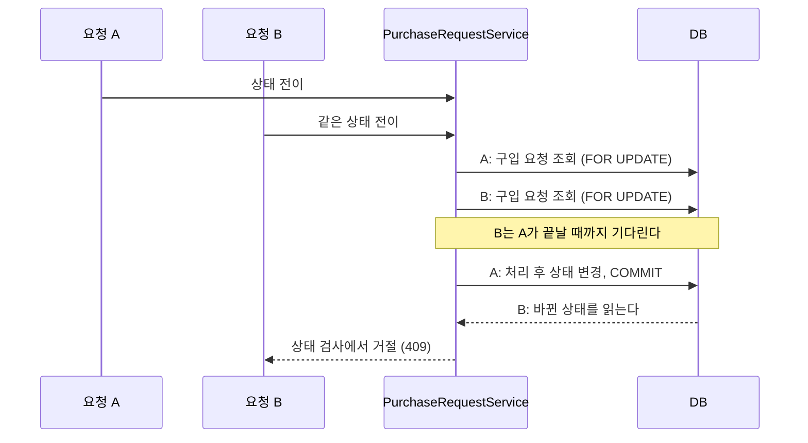
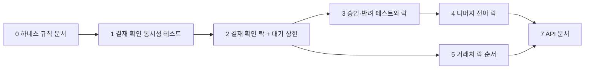

# 구입 요청 상태 전이에 동시성 제어 추가

- 이슈: #225
- 브랜치: `fix/225-purchase-request-concurrency`
- 기준 브랜치: `dev`

## 무엇을 바꾸나

구입 요청의 상태를 바꾸는 서비스 메서드가 구입 요청 행을 **비관적 쓰기 락**으로 읽게 한다.
같은 요청에 대한 전이가 겹치면 나중 요청은 락을 기다렸다가, 먼저 처리된 결과를 읽고
기존 상태 검사에서 거절된다.



## 정한 것

| 항목 | 결정 | 이유 |
|---|---|---|
| 잠금 방식 | 비관적 락 (`PESSIMISTIC_WRITE`) | `VendorRepository.findByIdForUpdate`, `DepartmentRepository.findByIdForUpdate`와 같은 방식이다. 스키마가 안 바뀐다 |
| 전이 한 건의 상한 | 트랜잭션 제한 시간 5초 | 아래 「실패 경로」 |
| 스키마 변경 | 없음 | Flyway 마이그레이션과 `init_scheme.sql` 수정이 없다 |
| 동시성 테스트 환경 | 기존 H2 E2E | `UserUpdateTest`의 부서장 동시 생성 테스트가 같은 락을 H2에서 검증하고 있다 |
| 도메인 경계 | `purchase_request` 안에서 바꾼다. 예외 변환만 `common/advice` | 새 Proxy 메서드나 이벤트가 없다 |
| 권한 | 바뀌지 않는다 | 새 엔드포인트가 없다 |
| 락 순서 | 구입 요청 → 거래처(ID 오름차순) | 모든 전이가 같은 순서로 잡는다 |

### 버린 대안

| 대안 | 왜 버렸나 |
|---|---|
| `@Version` 낙관적 락 | 컬럼 추가 마이그레이션이 필요하다. 결재 확인은 거래처 잔액을 먼저 바꾸므로, 충돌을 커밋 때 알면 이미 한 일을 되돌려야 한다 |
| 조건부 `UPDATE ... WHERE status = ?` | 전이마다 쿼리를 따로 써야 하고, 엔티티의 변경 감지와 섞이면 읽기 어렵다 |
| 락 힌트(`jakarta.persistence.lock.timeout`) | Hibernate 6.6의 PostgreSQL 방언은 `NOWAIT` 외의 값을 SQL로 옮기지 않는다. 운영 DB에서 듣지 않는 설정이다 |

## 실패 경로

| 상황 | 어디서 처리하나 | 돌려주는 것 |
|---|---|---|
| 같은 전이가 겹친다 | 나중 요청이 락을 얻은 뒤 서비스의 기존 상태 검사 | 승인·반려·삭제는 `409 PR-003`, 나머지는 `409 PR-006` |
| DB가 락을 내주지 않는다 (DB의 락 대기 제한 초과 · 교착) | `GlobalExceptionHandler`가 `PessimisticLockingFailureException`을 변환 | `409 BIZ005` "다른 요청이 처리 중입니다" |
| 전이가 5초 안에 안 끝난다 | `@Transactional(timeout = 5)`가 질의를 끊고 트랜잭션을 되돌린다 | `500 SYS001` |
| 거래처 잔액이 부족하다 | 기존 동작 그대로. 트랜잭션이 되돌아가고 구입 요청 상태는 안 바뀐다 | 기존 `409` |

**대기 상한 5초의 근거.** 전이 하나는 질의 몇 개라 정상일 때 1초 안에 끝난다. 5초를
넘겼다면 앞 요청이 멈춘 것이고, 그동안 나중 요청은 DB 연결을 쥐고 있다(운영 풀 최대
10개). 5초 뒤에는 연결을 놓는다.

**시간 초과를 409로 바꾸지 않는다.** 처음 계획은 질의·트랜잭션 시간 초과도 `BIZ005`로
바꿨다. codex 리뷰 1회차가 짚었다 — 락을 바로 얻고도 뒤의 조회가 느려 5초를 넘기면
DB 지연이 「다른 요청이 처리 중」으로 나간다. 시간 초과만 보고는 락 대기였는지 알 수
없으므로 서버 오류로 남긴다.

DB마다 다르게 보인다.

| DB | 다른 트랜잭션이 행을 오래 잡고 있을 때 | 응답 |
|---|---|---|
| H2 (테스트) | H2의 기본 락 대기 시간(1초)이 끊는다. `PessimisticLockingFailureException` | `409 BIZ005` |
| PostgreSQL (운영) | 락 대기에 제한이 없어 5초 뒤 트랜잭션 제한 시간이 끊는다. `QueryTimeoutException` | `500 SYS001` |
| PostgreSQL (운영), 교착 | DB가 한쪽을 끊는다. `CannotAcquireLockException` | `409 BIZ005` |

**테스트와 운영이 같은 상황에서 다른 응답을 낸다.** 운영에서도 `409`가 나가게 하려면
PostgreSQL 연결에 `lock_timeout`을 걸어야 한다(`connection-init-sql`). 모든 락에 걸리는
설정이라 이 이슈에서 정하지 않고 아래 「안 하는 것」에 둔다.

## 질의

| 누가 | 어떤 조건으로 | 몇 행을 읽나 | 얼마나 자주 |
|---|---|---|---|
| 상태 전이 9개 메서드 | 기본 키 + `is_deleted = false`, `FOR UPDATE` | 1행 | 사용자가 버튼을 누를 때 |

기본 키 조회라 새 인덱스가 없다. 조회 전용 경로(목록, 상세, 문서 생성)는 락을 걸지
않으므로 읽기가 전이 때문에 막히지 않는다.

## 작업 순서



## 작업

작업 하나가 커밋 하나다. 각 작업은 실패하는 테스트를 먼저 쓴다.

### 0. 하네스 규칙 문서

- 파일: `harness/v2/2026-08-08/rules/` (새 폴더, 5개), `workflows/work-an-issue.md`,
  `workflows/land-a-pr.md`, `codex-review-prompt.md`, `README.md`
- 이 이슈에서 찾은 결함이 규칙의 근거라 같은 PR에 싣는다. 코드 변경과 커밋을 나눈다
- 끝난 기준: 문서 안의 상대 링크가 모두 열린다. `verify.sh` 통과
- 커밋: `docs(global): 하네스에 계획·수정·테스트·diff 점검 규칙 추가 (#225)`

### 1. 결재 확인 동시성 테스트 (실패 확인)

- 파일: `src/test/java/geumjeongyahak/e2e/request/purchase/PurchaseRequestConcurrencyTest.java` (새 파일)
- `RequestBaseTest`를 상속한다. 동시 호출은 `UserUpdateTest`의 `CountDownLatch` 두 개 방식을 따른다
- 검증
  - 실 결제: 결재 확인을 두 스레드로 동시에 호출하면 응답이 `200`과 `409`이고, 거래처 잔액이 1회만 줄고, 잔액 이력이 1건이다
  - 선금 결제: 같은 조건에서 잔액이 1회만 늘고 이력이 1건이다
- 끝난 기준: `./gradlew test --tests '*PurchaseRequestConcurrencyTest*'`가 **실패한다**
- 커밋: `test(purchase-request): 결재 확인 동시 요청 검증 추가 (#225)`

### 2. 결재 확인에 락과 대기 상한 적용

- 파일
  - `domain/purchase_request/repository/PurchaseRequestRepository.java`: `findByIdForUpdate` 추가
  - `domain/purchase_request/service/PurchaseRequestService.java`: 사설 `findByIdForUpdate` 추가, `confirmPurchase`가 사용, `@Transactional(timeout = 5)`
  - `common/exception/CommonErrorCode.java`: `RESOURCE_BUSY(409, "BIZ005")` 추가
  - `common/advice/GlobalExceptionHandler.java`: 락 획득 실패(`PessimisticLockingFailureException`)를 `BIZ005`로 변환
- 검증 추가: 구입 요청 행의 락을 얻지 못하면 결재 확인은 `409 BIZ005`이고 잔액이 안 변한다
- 끝난 기준: 작업 1의 테스트와 위 테스트가 통과한다
- 커밋: `fix(purchase-request): 결재 확인 시 구입 요청 행 잠금 (#225)`

### 3. 승인·반려 동시성 테스트와 락 적용

- 파일: 작업 1의 테스트 파일, `PurchaseRequestService.java`
- 검증
  - 승인 두 건을 동시에 호출하면 응답이 `200`과 `409`이고 `RequestReviewedPushEvent`가 1회만 발행된다
  - 승인과 반려를 동시에 호출하면 하나만 성공하고, 저장된 상태와 사유가 성공한 요청의 것이다
- 이벤트 횟수는 테스트 전용 `@TestConfiguration`의 `@EventListener`로 센다
- 끝난 기준: 락 적용 전 실패, 적용 후 통과
- 커밋: `fix(purchase-request): 승인·반려 시 구입 요청 행 잠금 (#225)`

### 4. 나머지 전이에 락 적용 (Should)

- 파일: `PurchaseRequestService.java`, `PurchaseRequestProposalService.java`, 작업 1의 테스트 파일
- 대상
  - `reportPurchase`, `updateItemReceipts`, `deletePurchaseRequest`, `updatePurchaseRequest`
  - `PurchaseRequestProposalService`의 `saveProposal`, `attachReceipt`, `deleteReceipt`
- 고치기 전에 `findByIdAndIsDeletedFalse`의 호출자를 전부 찾아 쓰기 경로와 읽기 경로를 가른다
- 검증: 구매 완료 보고 두 건을 동시에 호출하면 하나만 성공하고 거래 라인이 1벌이다. 삭제와 승인을 동시에 호출하면 하나만 성공한다
- 끝난 기준: 위 테스트가 락 적용 전 실패, 적용 후 통과
- 커밋: `fix(purchase-request): 구매 보고·수정·삭제·품의 저장 시 구입 요청 행 잠금 (#225)`

### 5. 거래처 락 순서 고정

- 파일: `domain/purchase_request/entity/PurchaseRequest.java`, `PurchaseRequestService.java` (`confirmPurchase`),
  `src/test/java/geumjeongyahak/unit/purchase_request/PurchaseRequestEntityTest.java`
- 실 결제는 거래처별 금액을 `HashMap`으로 모아 순회한다. 순회 순서가 정해져 있지 않아, 서로 다른 구입 요청 두 건이 같은 거래처 둘을 반대 순서로 잠그면 교착이 날 수 있다
- 거래처별 합계를 거래처 ID 오름차순으로 내놓는 메서드를 엔티티에 두고 서비스가 그 순서로 잠근다.
  서비스에 두면 대역 여섯을 세워야 순서 하나를 볼 수 있어서 엔티티에 둔다
- 끝난 기준: 거래처 다섯을 섞어 넣은 요청의 합계가 ID 오름차순으로 나오고, 같은 거래처의 금액이 합쳐짐을 단위 테스트가 확인한다
- 커밋: `fix(purchase-request): 결재 확인 시 거래처 잠금 순서 고정 (#225)`

### 6. 서비스 단위 테스트 — 하지 않는다

구현 중에 계획을 고쳤다. 전이마다 허용되지 않은 상태에서의 거절은 기존 E2E가 이미 덮고 있다.

| 전이 | 거절을 확인하는 기존 테스트 |
|---|---|
| 승인 · 반려 · 삭제 · 수정 | `PurchaseRequestStatusTest` (재승인 409, 처리된 요청 반려·삭제 409, APPROVED 수정 409) |
| 결재 확인 · 거래 수정 | `PurchaseRequestStatusTest` (PURCHASED 아님 409, CONFIRMED 거래 수정 409) |
| 품의 저장 · 영수증 첨부·삭제 | `PurchaseRequestProposalTest` (CONFIRMED 409) |
| 구매 완료 보고 | 이번에 더한 `PurchaseRequestConcurrencyTest` (겹친 보고 409) |

같은 갈래를 대역으로 한 번 더 덮으면 하나가 깨질 때 둘이 같이 깨질 뿐이다.

### 7. 문서

- 파일: `docs/api/PurchaseRequests.md`, `docs/error_codes.md`
- 상태 전이 API에 "같은 요청에 대한 전이가 겹치면 하나만 성공하고 나머지는 409"와 `BIZ005`를 적는다
- 끝난 기준: 문서에 적은 응답 코드가 테스트가 확인하는 값과 같다
- 커밋: `docs(purchase-request): 상태 전이 동시 요청 동작 명세 추가 (#225)`

## 확인 방법

```bash
./gradlew test --tests '*PurchaseRequestConcurrencyTest*'
./gradlew test --tests '*PurchaseRequest*'
scripts/harness/verify.sh
```

## 안 하는 것

- 기존 데이터의 조사와 보정
- `vendor_balance_histories` 유니크 제약 추가
- 엔티티(`PurchaseRequest`)에 상태 검사를 넣는 것. 지금은 서비스가 검사하고, 옮기면 예외 종류가 바뀐다
- 거래처·부서의 기존 락에 대기 상한을 넣는 것. 이 이슈의 범위 밖이다
- PostgreSQL 연결에 `lock_timeout`을 거는 것. 락 대기 초과를 운영에서도 `409`로 내려면 필요하지만 모든 질의에 걸리는 설정이라 따로 정한다

## 위험

| 위험 | 대응 |
|---|---|
| 대기 상한이 PostgreSQL에서 기대대로 끊기는지 테스트로 확인하지 못한다 | 테스트는 H2에서 락 획득 실패 경로만 확인한다. dev 배포 뒤 수동으로 한 번 확인한다 |
| 동시성 테스트가 간헐적으로 실패 | 두 스레드가 준비된 뒤 동시에 출발시킨다. 새 테스트를 10회 반복 실행해 확인한다 |
| `BIZ005` 변환이 다른 도메인의 락 실패에도 적용된다 | 의도한 것이다. 거래처·부서 락이 실패해도 지금은 500이 나간다 |
| 락을 잡은 채 응답 조립에서 거래처 전체를 조회 | 기존 동작이다. #230에서 다룬다 |
