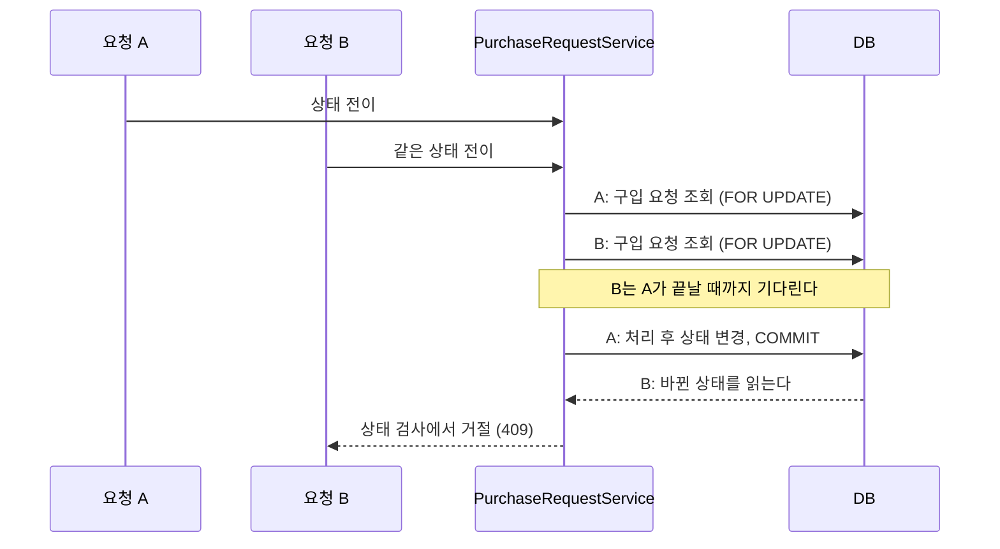

# 구입 요청 상태 전이에 동시성 제어 추가

- 이슈: #225
- 브랜치: `fix/225-purchase-request-concurrency`
- 기준 브랜치: `dev`

## 무엇을 바꾸나

구입 요청을 바꾸는 서비스 메서드가 구입 요청 행을 **비관적 쓰기 락**으로 읽는다.
같은 요청에 대한 요청이 겹치면 나중 요청은 락을 기다렸다가, 먼저 처리된 결과를 읽고
**기존 상태 검사**에서 거절된다. 상태 검사 코드는 안 바꾼다.



## 바뀌는 코드

운영 코드는 파일 여섯이다. 새 클래스는 없다.

| 파일 | 무엇 |
|---|---|
| `PurchaseRequestRepository` | `findForUpdateByIdAndIsDeletedFalse` — 파생 쿼리에 `@Lock` |
| `PurchaseRequestService` | 쓰기 메서드 일곱이 위 조회를 쓴다. 읽기 메서드는 그대로다 |
| `PurchaseRequestProposalService` | 쓰기 메서드 셋이 위 조회를 쓴다 |
| `VendorService` | 거래처 여럿을 차감할 때 ID 오름차순으로 잠근다 |
| `CommonErrorCode` | `RESOURCE_BUSY(409, "BIZ005")` |
| `GlobalExceptionHandler` | `PessimisticLockingFailureException` → `BIZ005` |

## 정한 것

| 항목 | 결정 | 이유 |
|---|---|---|
| 잠금 방식 | 비관적 락 (`PESSIMISTIC_WRITE`) | 거래처 · 부서가 이미 쓰는 방식이다. 스키마가 안 바뀐다 |
| 락 조회를 쓰는 법 | Spring Data 파생 쿼리 + `@Lock` | JPQL 문자열이 필요 없다 |
| 스키마 변경 | 없음 | 마이그레이션이 없다 |
| 도메인 경계 | `purchase_request` 안에서 바꾼다. 거래처 잠금 순서는 `vendor`가 정한다 | 새 Proxy 메서드나 이벤트가 없다 |
| 권한 | 바뀌지 않는다 | 새 엔드포인트가 없다 |
| 락 순서 | 구입 요청 → 거래처(ID 오름차순) | 순서가 요청마다 다르면 교착이 난다 |
| 락 대기 상한 | PostgreSQL `lock_timeout` 3초, `DB_LOCK_TIMEOUT_MS`로 바꿀 수 있다 | 코드가 아니라 연결 설정이라 예외 갈래가 늘지 않는다. 넘기면 락 실패로 올라와 `409 BIZ005`를 탄다 |

### 버린 대안

| 대안 | 왜 버렸나 |
|---|---|
| `@Version` 낙관적 락 | 컬럼 추가 마이그레이션이 필요하다. 결재 확인은 거래처 잔액을 먼저 바꾸므로, 충돌을 커밋 때 알면 이미 한 일을 되돌려야 한다 |
| 조건부 `UPDATE ... WHERE status = ?` | 전이마다 쿼리를 따로 써야 한다 |
| DB 이름 락 (PostgreSQL advisory lock) | 행 락이 같은 일을 하고 트랜잭션이 끝나면 저절로 풀린다. 이름 락은 PostgreSQL 전용 SQL이라 H2 테스트가 못 돈다 |
| 분산 락 (Redis 등) | 앱 서버가 한 대이고 Redis가 없다 |
| 큐로 순서대로 처리 | 응답이 「처리됨」에서 「접수됨」으로 바뀐다. API 계약이 달라진다 |

### 만들었다가 걷어낸 것

구현 중에 넣었다가 뺐다. 다시 넣자는 말이 나오면 여기를 먼저 본다.

| 무엇 | 왜 뺐나 |
|---|---|
| 전이 한 건의 제한 시간 5초 (`@Transactional(timeout)`) | 버그를 고치는 데 필요 없었다. 넣자 시간 초과 예외가 셋(`QueryTimeoutException` · `TransactionTimedOutException` · `JpaSystemException`)으로 갈렸고, 같은 상황에서 H2는 `409`, PostgreSQL은 `503`이 나왔다 |
| 시간 초과 응답 `503 SYS006` | 제한 시간 때문에 생긴 것이다 |
| 구입 요청 전용 락 실패 코드 `PR-027` | 전역 처리기의 `BIZ005`와 같은 일을 했다 |
| 락 조회 전용 클래스와 트랜잭션 애너테이션 | 서비스에 원래 있던 조회 메서드를 바꾸는 것으로 충분하다 |
| 락 조회가 쓰기 트랜잭션 안인지 확인하는 코드 | 트랜잭션 밖이면 Spring이, 읽기 전용이면 PostgreSQL이 이미 거절한다 |

## 실패 경로

| 상황 | 어디서 처리하나 | 돌려주는 것 |
|---|---|---|
| 같은 전이가 겹친다 | 나중 요청이 락을 얻은 뒤 서비스의 기존 상태 검사 | 승인·반려·삭제는 `409 PR-003`, 나머지는 `409 PR-006` |
| 삭제가 먼저 끝났다 | 락 있는 조회가 삭제된 행을 못 찾는다 | `404 PR-001` |
| 락을 3초 안에 못 얻는다 · 교착 | PostgreSQL `lock_timeout`이 끊고 `GlobalExceptionHandler`가 받는다 | `409 BIZ005` |
| 거래처 잔액이 부족하다 | 기존 동작 그대로. 트랜잭션이 되돌아간다 | 기존 `409` |

로그에는 예외 종류만 남긴다. DB가 예외 메시지에 잠긴 행의 내용을 실어 보내기도 한다
(H2에서 확인).

## 락 대기 상한

`application-dev.yml` · `application-prod.yml`의 Hikari 설정에 둔다.

```yaml
connection-init-sql: SET lock_timeout = ${DB_LOCK_TIMEOUT_MS:3000}
```

| 확인 | 결과 (PostgreSQL 18) |
|---|---|
| Hibernate 속성 `jakarta.persistence.lock.timeout` | 효과 없다. 10초를 그대로 기다렸다 |
| 연결 초기화 SQL `SET lock_timeout = 3000` | 3.3초 뒤 `409 BIZ005`. 동시성 테스트 12개 통과 |

- **모든 락에 걸린다.** 구입 요청만이 아니라 거래처 · 부서 락과 일반 `UPDATE`가 행을 기다리는 경우도 3초 뒤 `409 BIZ005`다
- **Flyway 마이그레이션도 같은 연결을 쓴다.** 테이블 락을 3초 넘게 기다리는 마이그레이션은 실패한다. 배포가 멈춘 채 기다리는 것보다 낫다고 봤다. 필요하면 배포 때만 `DB_LOCK_TIMEOUT_MS=0`으로 끈다
- 테스트(H2)는 `application-test.yml`의 `LOCK_TIMEOUT=1000`이 같은 일을 한다

## 질의

| 누가 | 어떤 조건으로 | 몇 행을 읽나 | 얼마나 자주 |
|---|---|---|---|
| 쓰기 메서드 열 | 기본 키 + `is_deleted = false`, `FOR UPDATE` | 1행 | 사용자가 버튼을 누를 때 |

기본 키 조회라 새 인덱스가 없다. 조회 · 문서 생성 · 재확인 요청은 락을 걸지 않는다.

## 테스트

| 층 | 파일 | 무엇 |
|---|---|---|
| E2E | `PurchaseRequestConcurrencyTest` | 겹친 요청 열 갈래, 락을 못 얻은 경우 둘 |
| 단위 | `VendorServiceDeductOrderTest` | 거래처를 ID 오름차순으로 잠근다 |

허용되지 않은 상태에서의 거절은 기존 E2E(`PurchaseRequestStatusTest` ·
`PurchaseRequestProposalTest`)가 이미 덮고 있어 더하지 않았다.

| 확인 | 결과 |
|---|---|
| 고치기 전에 새 테스트가 실패하는가 | 실패한다. 결재 확인이 겹치면 둘 다 `200`, 잔액이 두 번 바뀌고 이력이 2건이었다 |
| 고치기 전 서비스 코드로 돌리면 | 열둘 중 아홉에서 열이 실패한다. 통과하는 둘은 락을 못 얻는 경우로, 락이 아니라 예외 변환을 본다 |
| 반복 실행 | 20회 모두 통과 |
| 실제 PostgreSQL 18 (`lock_timeout=3000`) | 3회 모두 통과 |
| 실제 PostgreSQL 18 (기본 설정) | 겹친 요청 열은 통과. 락을 못 얻는 둘은 상한이 없어 기다렸다가 정상 처리된다 |

쓰기 메서드 열 중 동시성 테스트가 없는 것은 품의 저장(`saveProposal`) 하나다. 품의 저장과
결재 확인은 어느 쪽이 먼저여도 둘 다 성공할 수 있어, 바깥에서 순서를 가릴 방법이 없다.
확인된 뒤의 품의 저장이 거절되는 것은 기존 `PurchaseRequestProposalTest`가 본다.

## 확인 방법

```bash
./gradlew test --tests '*PurchaseRequestConcurrencyTest*'
./gradlew test --tests '*PurchaseRequest*' --tests '*Vendor*'
scripts/harness/verify.sh
```

## 안 하는 것

- 기존 데이터의 조사와 보정
- `vendor_balance_histories` 유니크 제약 추가
- 거래처 · 부서의 락 조회를 파생 쿼리로 바꾸는 것
- 테스트 준비 코드(거래처 생성 · 구매 보고)를 공용으로 올리는 것

## 위험

| 위험 | 대응 |
|---|---|
| `BIZ005` 변환이 다른 도메인의 락 실패에도 적용된다 | 의도한 것이다. 지금까지는 `500`이었다 |
| 락을 못 얻는 테스트가 H2의 락 대기 시간에 기댄다 | `application-test.yml`에 `LOCK_TIMEOUT=1000`으로 드러냈다 |
| 락을 잡은 채 응답 조립에서 거래처 전체를 조회 | 기존 동작이다. #230에서 다룬다 |
