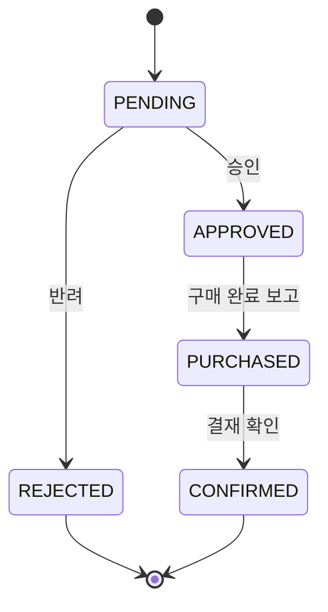

# [FIX] 구입 요청 상태 전이에 동시성 제어 추가

- 이슈: #225 (https://github.com/Geumjeongyahak/Backend/issues/225)
- 작성일: 2026-09-28
- 상태: 설계 전. 아래 「미정」이 정해져야 구현 계획을 쓸 수 있다

## 버그 설명

**한 줄 요약**: 구입 요청의 상태를 바꾸는 작업(승인, 반려, 구매 완료 보고, 결재 확인)에 동시성 제어가 없습니다.

상태 전이는 "현재 상태 확인 → 처리 → 상태 변경" 순서로 진행합니다. 같은 요청에 대한 작업이 겹치면 상태 확인이 제 역할을 하지 못합니다.

거래처 쪽에는 이미 잠금이 있습니다. 구입 요청 쪽에도 같은 수준의 보호가 필요합니다.

## 재현 방법

1. 같은 구입 요청에 대해 같은 상태 전이를 겹치게 실행하는 통합 테스트를 작성한다.
2. 처리 결과가 1회만 반영됐는지 확인한다.

구체적인 절차는 비공개 설계 문서에 있습니다.

## 예상 동작

- 같은 요청에 대한 상태 전이는 겹쳐 들어와도 한 번만 처리된다.
- 나중에 처리된 요청은 상태 오류로 거절된다.

## 실제 동작

- 상태 전이에 잠금이나 버전 검사가 없다.

## 스크린샷 / 로그

실행으로 재현하지 않았습니다. 코드 검토로 확인했습니다.

## 환경 정보

- OS: 무관
- Java 버전: 21
- Spring Boot 버전: 3.5.13
- 브라우저 (프론트 관련 시): 해당 없음

## 추가 정보

### Must

- [ ] 같은 구입 요청에 대한 결재 확인이 겹쳐도 처리 결과가 1회만 반영된다
- [ ] 나중에 처리된 요청은 `INVALID_STATUS`로 거절된다
- [ ] 승인 또는 반려가 겹쳐도 알림 이벤트가 1회만 발행된다

### Should

- [ ] 구매 완료 보고, 영수증 수정, 삭제에도 같은 보호를 적용한다

### 테스트 계획 (TDD)

실패하는 테스트를 먼저 쓰고, 통과하도록 고칩니다.

| 종류 | 검증할 것 |
|---|---|
| 단위 | 구입 요청이 허용되지 않은 상태에서 전이를 거절한다 |
| 단위 | 거래처 잔액 계산과 잔액 부족 예외 |
| 통합 | 두 스레드가 같은 전이를 동시에 호출하면 결과가 1회만 반영된다 |
| 통합 | 결제 유형별로 위 검증을 반복한다 |
| E2E | 같은 전이를 연속 두 번 호출하면 두 번째가 거절된다 |

동시성 통합 테스트는 PostgreSQL에서 돌려야 잠금 동작이 실제와 같습니다.

### Out of scope

- 기존 데이터의 조사와 보정
- 프론트의 버튼 중복 클릭 방지

### 미정

- 잠금 방식: 비관적 락, `@Version` 낙관적 락, 조건부 `UPDATE` 중 선택. 거래처 쪽이 이미 비관적 락을 쓰고 있어 같은 방식이 가장 적게 바뀐다
- 동시성 테스트용 PostgreSQL 환경을 어떻게 띄울지
