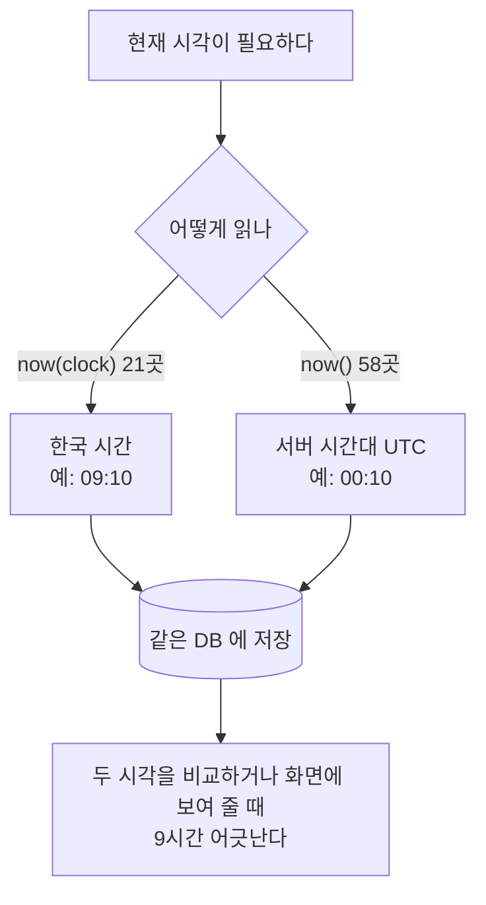

# [FIX] 서버 시간대와 애플리케이션 시간대 불일치로 시각이 섞여 저장됨

- 이슈: #226 (https://github.com/Geumjeongyahak/Backend/issues/226)
- 작성일: 2026-09-28
- 상태: 설계 전. 아래 「미정」이 정해져야 구현 계획을 쓸 수 있다

## 버그 설명

**한 줄 요약**: 서버는 UTC로 돌고 있는데 코드 일부만 한국 시간을 씁니다. 그래서 DB에 한국 시간과 UTC가 섞여 저장됩니다.

현재 시각을 읽는 방법이 두 가지로 나뉘어 있습니다.

| 방법 | 기준 | 쓰는 곳 |
|---|---|---|
| `LocalDateTime.now(clock)` | 한국 시간 (`AppConfig.java:16`) | 21곳 |
| `LocalDateTime.now()`, `LocalDate.now()` | 서버 시간대 (dev는 UTC) | 58곳 |



### 어떤 문제가 생기나

**시각이 섞인다.** 결석 요청의 만료 시각은 한국 시간으로 계산합니다. 승인 시각(`AbsenceRequest.java:76`)은 서버 시간대로 기록합니다. 같은 행 안에서 9시간 차이가 납니다.

**날짜가 하루 밀린다.** `LocalDate.now()`는 한국 시간 00시부터 09시 사이에 어제 날짜를 돌려줍니다.

| 위치 | 하는 일 |
|---|---|
| `SubjectService.java:210`, `:299`, `:368` | "오늘 이후 수업" 판단 |
| `AdminDashboardService.java:41` | 대시보드의 오늘 기준 |
| `DailyScheduleAdminViewService.java:189` | 관리자 일정 화면의 기본 주간 |
| `PurchaseRequestService.java:282` | 구매 보고 7일 기한 판단 |
| `FileCleanupScheduler.java:39` | 삭제 파일 보존 기간 판단 |

**자동 기록 시각도 서버 시간대다.** `createdAt`, `updatedAt`은 JPA가 서버 시간대로 채웁니다.

## 재현 방법

1. dev 서버 로그에서 만료 처리 로그를 조회한다.
2. 한 줄 안에서 로그 시각과 `expiredAt`을 비교한다.
3. 시간대 없이 현재 시각을 읽는 곳을 센다.

```bash
grep -rnE "Local(Date|DateTime|Time)\.now\(\)" --include='*.java' src/main/java | wc -l
```

## 예상 동작

- 애플리케이션이 읽는 현재 시각은 서버가 어디에 있든 한국 시간이다.
- DB에 저장되는 시각은 모두 같은 기준이다.

## 실제 동작

- 코드 위치에 따라 한국 시간과 UTC가 섞인다.
- dev 서버에서 두 시각이 항상 9시간 다르다.

## 스크린샷 / 로그

**dev 서버 로그: 같은 순간의 두 시각**

```
2026-09-26 00:10:00.047 INFO  g.d.r.s.LessonExchangeRequestService
  - 수업 교환 요청 자동 만료 처리 완료 (count=1, expiredAt=2026-09-26T09:10:00.001586124)
```

| 로그가 찍힌 시각 (서버) | 같은 줄의 `expiredAt` (한국 시간) | 차이 |
|---|---|---|
| 2026-09-26 00:10:00 | 2026-09-26 09:10:00 | 9시간 |
| 2026-09-18 15:00:00 | 2026-09-19 00:00:00 | 9시간, 날짜도 다름 |
| 2026-09-15 10:10:00 | 2026-09-15 19:10:00 | 9시간 |

```
AppConfig.java:16                       Clock.system(ZoneId.of("Asia/Seoul"))
01_install-app-service.sh:336           ExecStart=/usr/bin/java -Dserver.port=... -jar ...
                                        (시간대 지정 없음)
GeumjeongyahakApiApplication.java:11    @EnableJpaAuditing (시각 제공자 지정 없음)
```

prod 서버의 시간대는 확인하지 못했습니다. 같은 설치 스크립트를 쓰면 prod도 같습니다.

## 환경 정보

- OS: dev 서버, 시간대 UTC
- Java 버전: 21
- Spring Boot 버전: 3.5.13
- 브라우저 (프론트 관련 시): 해당 없음

## 추가 정보

### Must

- [ ] 서버 시간대가 UTC여도 애플리케이션이 읽는 현재 시각과 오늘 날짜가 한국 시간이다
- [ ] `createdAt`, `updatedAt`이 한국 시간으로 기록된다
- [ ] `src/main/java`에 시간대 없이 `now()`를 부르는 곳이 남지 않는다
- [ ] 위 규칙을 어기는 코드가 새로 들어오면 테스트가 실패한다

### Should

- [ ] 로그에 찍히는 시각도 한국 시간으로 맞춘다
- [ ] 개발 규칙 문서에 현재 시각을 읽는 방법을 적는다

### 테스트 계획 (TDD)

| 종류 | 검증할 것 |
|---|---|
| 단위 | 고정한 `Clock`으로 엔티티의 시각 기록 메서드가 기대한 값을 남긴다 (승인, 반려, 삭제, 구독 등) |
| 단위 | 한국 시간 00시부터 09시 사이에 "오늘" 판단이 한국 날짜 기준이다 (과목, 대시보드, 관리자 일정) |
| 단위 | 구매 보고 7일 기한과 파일 보존 기간 판단이 한국 시간 기준이다 |
| 통합 | JVM 기본 시간대를 UTC로 두고 저장한 엔티티의 `createdAt`이 한국 시간이다 |
| 통합 | 결석 요청의 만료 시각과 승인 시각이 같은 기준이다 |
| 구조 | `src/main/java`에 인자 없는 `LocalDate.now()`, `LocalDateTime.now()`, `LocalTime.now()` 호출이 없다 |
| E2E | 기존 요청 만료, 구매 보고 기한 시나리오가 통과한다 (회귀) |

### Out of scope

- 컬럼 타입을 시간대 포함 타입으로 바꾸는 것
- API 응답에 시간대 정보를 넣는 것
- 서버 운영체제의 시간대 변경

### 미정

- **해결 방식**: 아래 둘 중 하나를 골라야 합니다

| 방식 | 장점 | 단점 |
|---|---|---|
| 서비스 실행 명령에 `-Duser.timezone=Asia/Seoul` 추가 | 한 줄로 58곳이 모두 해결된다 | 설정이 빠진 환경에서 다시 어긋난다 |
| 58곳을 모두 `now(clock)`으로 바꾸기 | 환경과 상관없이 맞고 테스트하기 쉽다 | 엔티티가 `Clock`을 받도록 바꿔야 해서 변경이 크다 |

- **이미 저장된 데이터**: dev DB에는 UTC로 기록된 시각이 섞여 있습니다. 보정할지, 어느 컬럼이 대상인지 정하지 않았습니다. prod에 데이터가 있다면 같은 확인이 필요합니다
