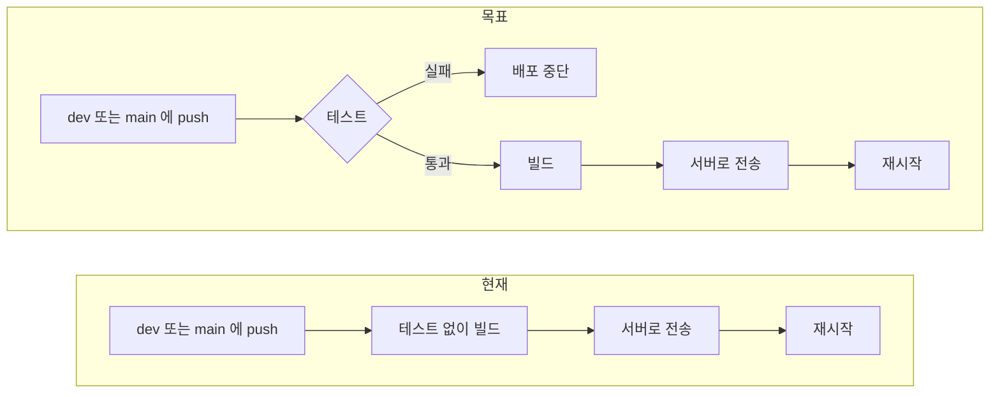
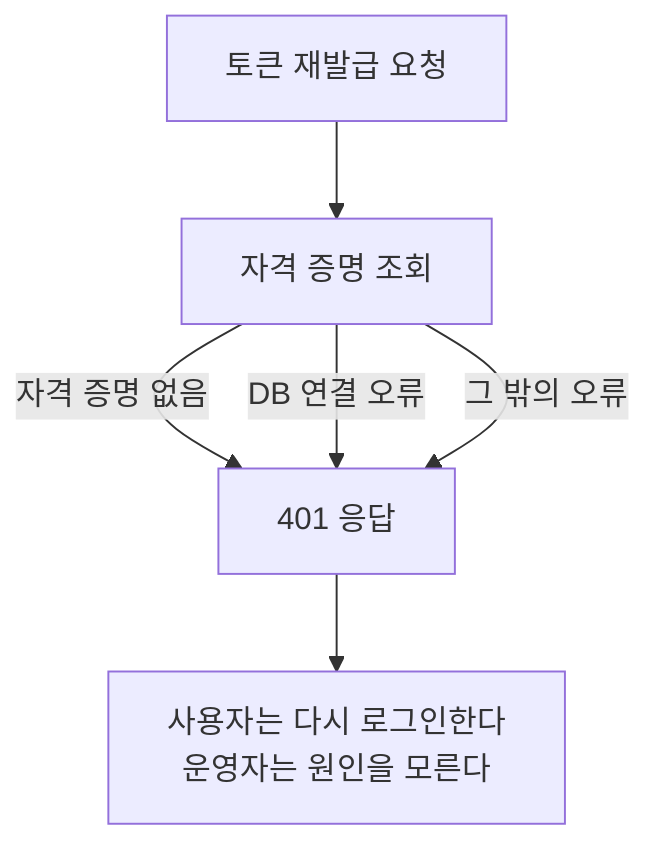

# [FIX] 배포 워크플로의 테스트 생략과 예외 로그의 원인 누락

- 이슈: #227 (https://github.com/Geumjeongyahak/Backend/issues/227)
- 작성일: 2026-09-28
- 상태: 설계 전. 아래 「미정」이 정해져야 구현 계획을 쓸 수 있다

## 버그 설명

**한 줄 요약**: 테스트가 깨져도 배포가 되고, 문제가 생겨도 로그만으로는 어디서 났는지 알 수 없습니다.

문제는 세 가지입니다.

### 1. 배포할 때 테스트를 돌리지 않는다

테스트가 1,088개 있지만 배포 워크플로는 `-x test`로 테스트를 건너뜁니다. PR에 대해 도는 워크플로도 없습니다.



### 2. 예외 로그에 "어디서, 누가"가 없다

dev 서버 경고 로그의 절반 이상이 접근 거부입니다. 그런데 로그에 요청 경로와 사용자가 없어 어느 API에서 났는지 알 수 없습니다.

```
2026-09-22 23:39:34.708 WARN [http-nio-8080-exec-58] [trace_id= span_id=]
  g.c.advice.GlobalExceptionHandler - AccessDeniedException 발생 - Access Denied
```

`trace_id`와 `span_id` 자리는 있지만 항상 비어 있습니다. 값을 채우는 코드가 없습니다.

### 3. 토큰 재발급이 실패 원인을 버린다

```java
// LocalAuthService.java:155
try {
    credential = userCredentialService.getById(credentialId);
} catch (Exception e) {
    log.warn("토큰 재발급 실패 - 자격 증명 조회 실패: credentialId={}", credentialId);
    throw new InvalidRefreshTokenException();
}
```

모든 예외를 잡아서 "유효하지 않은 토큰"(401)으로 바꿉니다. DB 연결이 끊긴 것 같은 서버 장애도 401이 되고, 원인은 로그에 남지 않습니다.



## 재현 방법

1. 테스트 하나를 실패하게 바꿔 `dev`에 push한다. 배포가 그대로 진행되는지 확인한다.
2. 권한 없는 API를 호출한 뒤 서버 로그에서 어느 API였는지 찾아본다.
3. DB 연결을 끊은 상태에서 토큰 재발급 API를 호출하고 응답 코드와 로그를 확인한다.

## 예상 동작

- 테스트가 실패하면 배포가 중단된다.
- 예외 로그에 HTTP 메서드, 요청 경로, 사용자 ID가 남는다.
- 자격 증명이 없을 때만 401을 돌려준다. 서버 장애는 5xx로 응답하고 원인을 로그에 남긴다.

## 실제 동작

- 테스트 결과와 상관없이 배포된다.
- 예외 로그에 예외 이름과 메시지만 남는다.
- 모든 예외가 401이 되고 로그에는 `credentialId`만 남는다.

## 스크린샷 / 로그

```
.github/workflows/deploy-dev.yml:27     run: ./gradlew bootJar -x test
.github/workflows/deploy-prod.yml:27    run: ./gradlew bootJar -x test
GlobalExceptionHandler.java:123         log.warn("AccessDeniedException 발생 - {}", ex.getMessage())
LocalAuthService.java:157               catch (Exception e)
```

로컬에서 `./gradlew test`는 4분 9초 걸렸고 1,088개가 모두 통과했습니다.

## 환경 정보

- OS: GitHub Actions `ubuntu-latest`
- Java 버전: 21
- Spring Boot 버전: 3.5.13
- 브라우저 (프론트 관련 시): 해당 없음

## 추가 정보

### Must

- [ ] 두 배포 워크플로가 빌드 전에 테스트를 실행하고, 실패하면 배포 단계로 넘어가지 않는다
- [ ] `GlobalExceptionHandler`의 모든 로그에 HTTP 메서드, 요청 경로, 사용자 ID(로그인한 경우)를 남긴다
- [ ] 토큰 재발급에서 자격 증명이 없는 경우만 `InvalidRefreshTokenException`으로 바꾼다
- [ ] 그 밖의 예외는 그대로 전달되어 5xx로 응답하고 스택트레이스가 기록된다

### Should

- [ ] `dev`와 `main` 대상 PR에서 테스트를 실행하는 워크플로를 추가한다
- [ ] 요청마다 고유 ID를 만들어 로그의 `trace_id` 자리에 채운다

### 테스트 계획 (TDD)

| 종류 | 검증할 것 |
|---|---|
| 단위 | 토큰 재발급에서 자격 증명이 없으면 `InvalidRefreshTokenException`이 난다 |
| 단위 | 토큰 재발급에서 저장소가 `DataAccessException`을 던지면 그대로 전달된다 |
| 단위 | `GlobalExceptionHandler`가 각 예외 종류에 대해 경로와 사용자 ID를 로그에 남긴다 |
| 통합 | 권한 없는 API를 호출하면 로그 한 줄에 메서드, 경로, 사용자 ID가 있다 |
| 통합 | 로그인하지 않은 요청은 사용자 ID 없이 경로만 남는다 |
| E2E | 토큰 재발급의 기존 성공, 만료, 위조 시나리오가 그대로 통과한다 (회귀) |
| 워크플로 | 실패하는 테스트가 있는 브랜치에서 배포 단계가 실행되지 않는다 |

### Out of scope

- 배포 경로 이름 변경. prod 워크플로도 `~/app-dev`에 배포하지만 설치 스크립트 기본값과 같고, dev와 prod는 서버가 달라 충돌하지 않는다
- 테스트 실행 시간 단축
- 접근 거부와 Refresh Token 오류의 원인 수정. 이 이슈로 로그에 경로가 남은 뒤에 따로 분석한다
- 분산 추적 도구 도입

### 미정

- 테스트가 4분가량 걸려 배포 시간이 그만큼 늘어납니다. 배포 워크플로에서 돌릴지, PR 워크플로에서만 돌리고 브랜치 보호로 막을지 정하지 않았습니다
- 로그에 사용자 ID를 남기는 것이 개인정보 처리 방침과 맞는지 확인이 필요합니다
