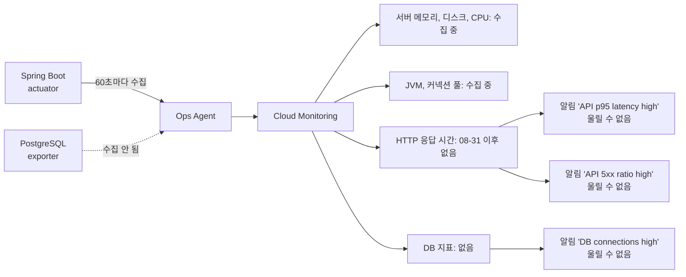

# [FIX] HTTP 응답 시간과 DB 지표가 Cloud Monitoring에 수집되지 않음

- 이슈: #228 (https://github.com/Geumjeongyahak/Backend/issues/228)
- 작성일: 2026-09-28
- 상태: 설계 전. 아래 「미정」이 정해져야 구현 계획을 쓸 수 있다

## 버그 설명

**한 줄 요약**: API가 얼마나 느린지(p95)와 DB 상태를 볼 수 없습니다. 관련 알림도 울릴 수 없는 상태입니다.

서버 상태 지표는 들어오고 있지만, 응답 시간 지표는 2026-08-31 이후 끊겼고 DB 지표는 한 번도 들어온 적이 없습니다.



**왜 중요한가**: 목록 조회 성능 개선이나 병목 제거를 해도, 고치기 전과 후를 비교할 숫자가 없습니다.

## 재현 방법

1. Cloud Monitoring에서 지표별로 최근 7일 데이터를 조회한다.
2. 알림 정책 목록과 각 정책이 쓰는 지표를 확인한다.

조회 명령은 비공개 설계 문서에 있습니다.

## 예상 동작

- HTTP 응답 시간 지표가 60초마다 들어오고, 경로별 p95를 볼 수 있다.
- DB 연결 수 같은 PostgreSQL 지표가 들어온다.
- 위 지표를 쓰는 알림 정책이 실제로 동작한다.

## 실제 동작

측정일 2026-09-28.

| 지표 | 마지막 수집 (UTC) | 상태 |
|---|---|---|
| `up` | 09-28 07:21 | 수집 중 |
| `hikaricp_connections` | 09-28 07:21 | 수집 중 |
| `jvm_memory_used_bytes` | 09-28 07:21 | 수집 중 |
| 서버 메모리, 디스크, CPU (`agent.googleapis.com`) | 최근 2시간 내 | 수집 중 |
| `http_server_requests_seconds` (`quantile=0.95`) | 08-31 08:09 | 28일째 없음 |
| `http_server_requests_seconds_count` | 08-31 08:09 | 28일째 없음 |
| `http_server_requests_seconds` (히스토그램) | 없음 | 지표가 등록된 적 없음 |
| `pg_stat_database_numbackends` | 없음 | 지표가 등록된 적 없음 |

알림 정책은 9개가 모두 켜져 있습니다. 그중 4개는 들어오지 않는 지표를 조건으로 씁니다.

| 알림 정책 | 조건에 쓰는 지표 | 상태 |
|---|---|---|
| API p95 latency high | 응답 시간 요약 지표의 `quantile` 라벨 | 지표 없음. 울릴 수 없음 |
| API 5xx ratio high | `http_server_requests_seconds_count` | 지표 없음. 울릴 수 없음 |
| DB connections high | `pg_stat_database_numbackends` | 지표 없음. 울릴 수 없음 |
| PostgreSQL down | `pg_up` | 지표가 없으면 참이 되는 조건. 계속 울리고 있을 수 있음 (확인 못함) |

p95 정책은 요약 지표의 `quantile` 라벨을 씁니다. 애플리케이션은 지금 히스토그램 방식이라 이 라벨을 내보내지 않습니다. 지표가 다시 들어와도 조건식을 함께 고쳐야 합니다.

이 4개 정책은 현재 `00_configure-cloud-monitoring.sh`가 만드는 정책(서버 중단, 디스크, 로그)에 없습니다. 스크립트 밖에서 만들어진 것으로 보입니다.

## 스크린샷 / 로그

```
application.yml:36-41                 percentiles-histogram: http.server.requests: true
01_install-app-service.sh:146         regex: 'up|http_server_requests_seconds_(count|bucket)|hikaricp_connections|...'
                                      (_sum 은 남기지 않음)
00_configure-cloud-monitoring.sh      알림 정책 9개 생성
```

응답 시간 지표가 끊긴 08-31은 `dev`에 마지막 배포가 있던 날입니다(PR #224 병합, 08:07 UTC). 끊긴 시각은 08:09 UTC입니다.

## 환경 정보

- OS: dev 서버 (앱 1대, DB 1대)
- Java 버전: 21
- Spring Boot 버전: 3.5.13
- 브라우저 (프론트 관련 시): 해당 없음

## 추가 정보

### Must

- [ ] HTTP 응답 시간 지표가 Cloud Monitoring에 60초마다 들어온다
- [ ] 경로별 p95 응답 시간을 조회할 수 있다
- [ ] PostgreSQL 지표가 Cloud Monitoring에 들어온다
- [ ] 알림 정책 9개가 모두 실제로 들어오는 지표를 조건으로 쓴다

### Should

- [ ] 배포 뒤 지표가 계속 들어오는지 확인하는 단계를 배포 스크립트에 넣는다
- [ ] 대시보드에 경로별 p95와 요청 수를 추가한다

### 테스트 계획 (TDD)

| 종류 | 검증할 것 |
|---|---|
| 스크립트 | `scripts/gcp/tests/observability-config-test.sh`에서 생성된 Ops Agent 설정이 응답 시간 지표의 `_count`, `_sum`, `_bucket`을 모두 남긴다 |
| 스크립트 | 생성된 설정에 PostgreSQL 수집 대상이 있다 |
| 스크립트 | 알림 정책이 쓰는 지표 이름이 수집 설정에 있는 지표와 일치한다 |
| 통합 | 로컬에서 `/actuator/prometheus`를 호출하면 `http_server_requests_seconds_bucket`이 나온다 |
| 수동 | dev 배포 30분 뒤 위 재현 방법의 조회에서 모든 지표가 1 이상이다 |

### Out of scope

- prod 환경의 지표 구성
- 분산 추적 도입
- 지표 보존 기간 변경

### 미정

- **끊긴 원인을 확인하지 못했습니다.** 가능성은 두 가지입니다
  - 08-31 배포로 지표 형식이 요약(`summary`)에서 히스토그램으로 바뀌었는데, 수집 설정이 `_sum`을 버려 히스토그램이 완성되지 않는다
  - 배포 때 Ops Agent 설정이 다시 만들어지면서 수집 대상이 바뀌었다
- 원인 확인에는 dev 서버에서 actuator 출력과 Ops Agent 로그를 봐야 합니다
- DB 서버에 `postgres_exporter`가 설치돼 있는지 확인하지 못했습니다
