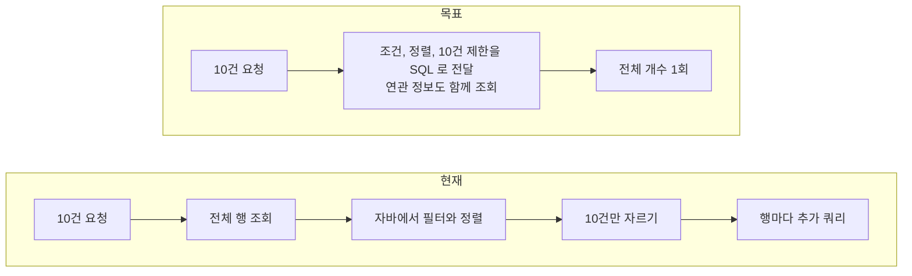

# [FIX] 목록 조회의 메모리 페이징과 N+1 쿼리 제거

- 이슈: #229 (https://github.com/Geumjeongyahak/Backend/issues/229)
- 작성일: 2026-09-28
- 상태: 설계 전. 아래 「미정」이 정해져야 구현 계획을 쓸 수 있다

## 버그 설명

**한 줄 요약**: 목록 화면이 10건을 보여 주려고 테이블 전체를 읽고, 일부는 행마다 쿼리를 한 번씩 더 보냅니다.

문제는 두 가지입니다.

**1. 메모리 페이징**: DB에서 전체를 읽어 온 뒤 자바 코드로 필터, 정렬, 자르기를 합니다. 데이터가 쌓일수록 느려집니다.

**2. N+1 쿼리**: 목록 1번 조회 뒤에, 각 행의 연관 정보(분반, 작성자 등)를 읽으려고 행 수만큼 쿼리를 더 보냅니다.



### 메모리 페이징 대상 (8곳)

| 대상 | 위치 | 읽는 범위 | 증가 속도 |
|---|---|---|---|
| 수업일지 목록 (일반 API) | `DailyScheduleService.java:237` | 하루 일정 전체 | 빠름 |
| 관리자 수업 목록 | `LessonAdminViewService.java:25` | 수업 전체 | 가장 빠름 |
| 관리자 게시글 목록 | `PostAdminViewService.java:56` | 게시글 전체 (삭제된 글, 본문 포함) | 빠름 |
| 관리자 하루 일정 목록 | `DailyScheduleAdminViewService.java:49` | 기간 제한 없음 | 빠름 |
| 관리자 사용자 목록 | `UserAdminViewService.java:39` | 사용자 전체 | 느림 |
| 관리자 학생 목록 | `StudentAdminViewService.java:35` | 학생 전체 | 느림 |
| 관리자 행사 목록 | `EventAdminViewService.java:36` | 행사 전체 | 느림 |
| 관리자 채널 목록 | `ChannelAdminViewService.java:33` | 채널 전체 | 거의 고정 |

### N+1 대상 (7곳)

| 대상 | 위치 | 쿼리 수 |
|---|---|---|
| 학생 목록 | `StudentService.java:59` | 1 + 학생 수 (실측) |
| 관리자 사용자 목록 | `UserAdminViewService.java:50` | 1 + 사용자 수 |
| 결석 요청 목록 | `AbsenceRequestService.java:89` | 2 + 최대 4 × 페이지 크기 |
| 구입 요청 목록 | `PurchaseRequestService.java:157` | 2 + 최대 3 × 페이지 크기 |
| 거래처 잔액 이력 | `VendorService.java:90` | 1 + 행 수 (페이징 없음) |
| 부서 관리자 목록 | `DepartmentAdminViewService.java:36` | 1 + 2 × 부서 수 |
| 교원 신청 "내 신청" 조회 | `TeacherApplicationRepository.java:41` | 신청 전체를 읽고 1건만 사용 |

## 재현 방법

1. SQL 로그를 켜고 학생 목록 테스트를 실행한다.

```bash
LOG_LEVEL_SQL=DEBUG ./gradlew test --tests 'geumjeongyahak.e2e.student.StudentListReadTest'
```

2. `build/test-results/test/TEST-geumjeongyahak.e2e.student.StudentListReadTest.xml`에서 `from student_classrooms` 조회 횟수를 센다.
3. 관리자 수업 목록을 날짜 필터와 함께 열고, 실행된 SQL에 날짜 조건과 `LIMIT`이 있는지 본다.

## 예상 동작

- 목록은 페이지 크기만큼만 DB에서 읽는다.
- 필터와 정렬은 SQL에서 처리한다.
- 쿼리 수는 행 수와 상관없이 일정하다.

## 실제 동작

- 필터를 걸어도 SQL에는 조건이 없고 전체를 읽는다.
- 학생 5명을 조회하는 데 쿼리 8개가 실행된다.
- dev 서버에 Hibernate 메모리 페이징 경고가 30일간 8건 기록됐다.

## 스크린샷 / 로그

**학생 목록 조회 1회의 SQL (실측, 학생 5명)**

```
[1] select ... from students where not(is_deleted) ... order by name
    -- 학생 목록 조회 완료 - 총 5명
[2] select ... from student_classrooms where student_id=?
[3] select ... from classrooms where id=?
[4] select ... from student_classrooms where student_id=?
[5] select ... from student_classrooms where student_id=?
[6] select ... from student_classrooms where student_id=?
[7] select ... from student_classrooms where student_id=?
[8] select ... from classrooms where id=?
```

**dev 서버의 Hibernate 경고**

```
2026-09-18 02:42:27.909 WARN org.hibernate.orm.query - HHH90003004:
  firstResult/maxResults specified with collection fetch; applying in memory
```

학생 목록 외의 쿼리 수는 코드에서 센 값이고 실측하지 않았습니다.

## 환경 정보

- OS: 무관
- Java 버전: 21
- Spring Boot 버전: 3.5.13
- 브라우저 (프론트 관련 시): 해당 없음

## 추가 정보

### Must

- [ ] 관리자 수업 목록이 날짜 조건과 페이지 크기를 SQL로 전달한다
- [ ] 관리자 게시글 목록이 삭제 여부, 채널, 상태 조건과 페이지 크기를 SQL로 전달한다
- [ ] 수업일지 목록이 검색 조건과 페이지 크기를 SQL로 전달한다
- [ ] 관리자 하루 일정 목록에 일반 API와 같은 42일 기간 상한을 적용한다
- [ ] 학생 목록의 쿼리 수가 학생 수와 상관없이 일정하다

### Should

- [ ] 관리자 사용자, 학생, 행사, 채널 목록을 DB 페이징으로 바꾼다
- [ ] 결석 요청, 구입 요청 목록과 거래처 잔액 이력의 연관 정보를 한 번에 조회한다
- [ ] 거래처 잔액 이력에 페이징을 추가한다
- [ ] 부서 관리자 목록의 인원 수와 권한을 부서 수와 상관없이 일정한 쿼리 수로 조회한다
- [ ] 교원 신청 "내 신청" 조회에서 Hibernate 메모리 페이징 경고가 나지 않는다
- [ ] 아래 인덱스를 새 마이그레이션으로 추가한다

| 테이블 | 인덱스 | 쓰는 곳 |
|---|---|---|
| `daily_schedules` | `(lesson_date)`, `(teacher_id, lesson_date)` | 기간 목록, 내 일정, 봉사 시간 집계 |
| `events` | `(event_date, start_time, id)` | 행사 목록 정렬 |
| `absence_requests`, `lesson_exchange_requests` | `(status, expires_at)` | 매분 도는 만료 스케줄러 |
| `lesson_exchange_proposals` | `(request_id)` | 제안 목록, 제안 수 집계 |
| `vendor_balance_histories` | `(vendor_id, occurred_at)` | 거래처 이력 조회 |
| `posts` | `(channel_id, is_pinned, created_at, id)` | 게시글 목록 정렬 |

### 테스트 계획 (TDD)

쿼리 수를 세는 테스트를 먼저 쓰고, 지금 코드에서 실패하는 것을 확인한 뒤 고칩니다.

| 종류 | 검증할 것 |
|---|---|
| 단위 | 각 검색 조건이 올바른 `Specification`을 만든다 (날짜 범위, 채널, 상태, 키워드) |
| 단위 | 관리자 하루 일정 목록이 42일을 넘는 기간을 거절한다 |
| 통합 | 학생 5명과 50명일 때 학생 목록의 쿼리 수가 같다 |
| 통합 | 관리자 수업, 게시글, 수업일지 목록에서 실행된 SQL에 조건과 개수 제한이 있다 |
| 통합 | 결석 요청, 구입 요청 목록의 쿼리 수가 페이지 크기와 상관없이 일정하다 |
| 통합 | 페이지 번호, 크기, 정렬, 전체 개수가 기존 응답과 같다 |
| E2E | 기존 목록 API와 관리자 화면의 응답이 바뀌지 않는다 (회귀) |

쿼리 수는 Hibernate `Statistics`로 셉니다.

### Out of scope

- `default_batch_fetch_size` 전역 설정 도입
- 본문 검색(`LIKE '%키워드%'`)을 위한 전문 검색 인덱스
- 인증 요청당 쿼리 수 (#221에서 다룬다)
- 관리자 화면의 모양이나 정렬 옵션 변경

### 미정

- 관리자 수업 목록에서 날짜를 지정하지 않았을 때의 기본 조회 기간
- 수업일지 목록의 "일지 작성 여부" 조건을 SQL로 옮기는 방법. 지금은 연결된 수업의 메모를 자바에서 검사합니다
- 범위가 넓어 PR을 Must와 Should로 나눌지 여부
