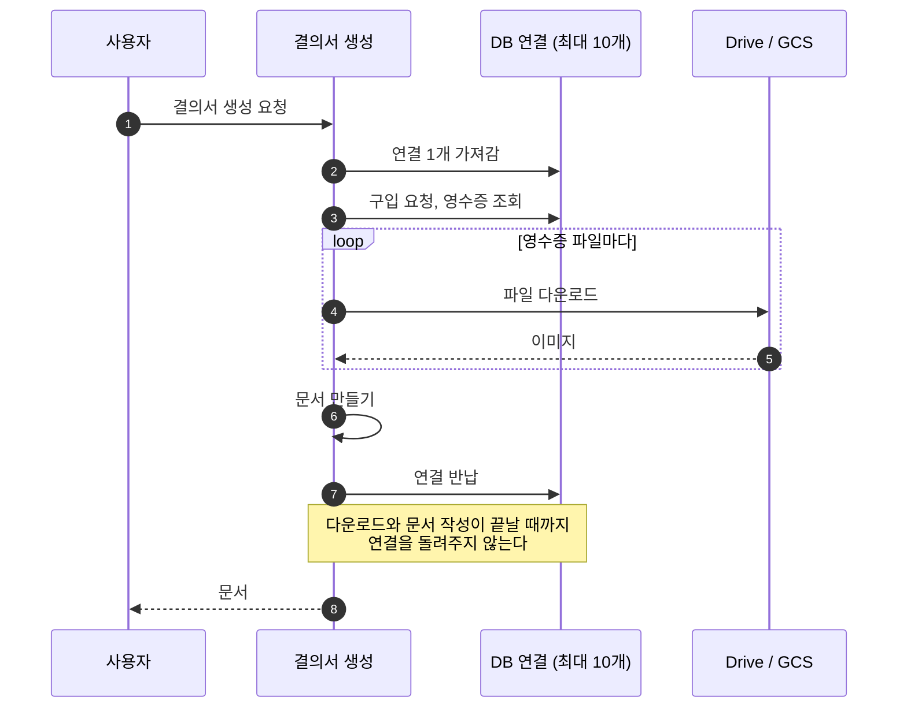
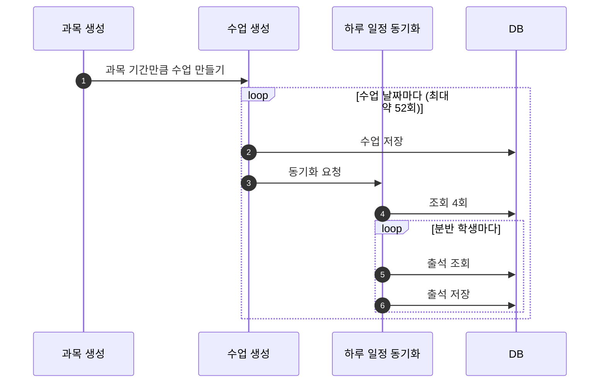

# [FIX] 트랜잭션 안 외부 호출과 반복 쿼리로 인한 병목 제거

- 이슈: #230 (https://github.com/Geumjeongyahak/Backend/issues/230)
- 작성일: 2026-09-28
- 상태: 설계 전. 아래 「미정」이 정해져야 구현 계획을 쓸 수 있다

## 버그 설명

**한 줄 요약**: DB 연결을 잡은 채로 느린 작업을 하거나, 같은 쿼리를 수백 번 반복하는 곳이 있습니다.

서버가 동시에 쓸 수 있는 DB 연결은 최대 10개입니다(`application-prod.yml:8`). 느린 작업 몇 개가 연결을 오래 잡으면 로그인 같은 다른 기능까지 기다리게 됩니다.

문제는 세 가지입니다.

### 1. DB 연결을 잡은 채 외부 시스템을 호출한다



| 대상 | 위치 | 연결을 잡고 하는 일 |
|---|---|---|
| 결의서 생성 | `ExpenseDocumentService.java:118` | 영수증 다운로드, 문서 작성 |
| 프로필 이미지 업로드 | `ImageUploadService.java:46` | 원격 저장소 업로드 |
| 첨부파일 업로드 | `AttachmentUploadService.java:38` | 원격 저장소 업로드 |
| 파일 정리 스케줄러 | `FileCleanupScheduler.java:35` | 파일마다 원격 삭제 |
| 인증 메일 발송 | `EmailVerificationService.java:148` | 메일 서버로 발송 |
| Push 알림 발송 | `PushNotificationService.java:25` | FCM 호출 |

메일 설정에는 시간 제한이 없습니다. 메일 서버가 응답하지 않으면 발송이 끝나지 않습니다.

### 2. 과목을 만들 때 같은 쿼리를 수백 번 반복한다



20주 과목에 학생 15명이면 쿼리가 약 700개입니다. 코드에서 센 값이고 실측하지 않았습니다.

### 3. 조회수 증가 방식

게시글을 열 때마다 "조회수 읽기 → 1 더하기 → 글 전체 저장"을 합니다.

- 동시에 열면 증가분이 사라집니다.
- 조회만 했는데 본문을 포함한 전체 컬럼을 다시 저장합니다.
- 조회만 했는데 수정 시각(`updated_at`)이 바뀝니다.

구입 요청 상세 응답도 비슷합니다. 승인, 반려, 확인을 할 때마다 응답을 만들면서 거래처 전체를 조회합니다(`PurchaseRequestService.java:483`).

## 재현 방법

1. 영수증이 여러 장 붙은 구입 요청의 결의서를 동시에 10건 넘게 요청한다.
2. 그동안 로그인 API를 호출해 응답 시간을 잰다.
3. SQL 로그를 켜고 과목을 하나 생성해 실행된 쿼리 수를 센다.
4. 같은 게시글을 동시에 여러 번 조회한 뒤 조회수 증가량과 `updated_at`을 확인한다.

## 예상 동작

- 외부 호출이 느려도 DB 연결은 조회와 저장에 필요한 동안만 잡는다.
- 메일 서버가 응답하지 않으면 정해진 시간 뒤에 실패한다.
- 과목 생성 시 같은 (분반, 날짜)의 동기화는 1회이고, 출석은 한꺼번에 조회하고 저장한다.
- 조회수는 조회한 횟수만큼 늘고 수정 시각은 바뀌지 않는다.

## 실제 동작

- 외부 호출이 끝날 때까지 DB 연결을 돌려주지 않는다.
- 메일 발송에 시간 제한이 없다.
- 과목 생성 시 수업 수 × 학생 수만큼 쿼리가 나간다.
- 조회할 때마다 글 전체를 저장하고, 동시 조회 시 조회수가 덜 오른다.

## 스크린샷 / 로그

**실행으로 재현하지 않았습니다.** 코드를 읽어 확인한 문제입니다. dev 서버 로그에는 연결 대기나 시간 초과 경고가 없습니다. dev는 데이터와 사용자가 적어 아직 증상이 없는 것으로 보입니다.

```
ExpenseDocumentService.java:118,443   트랜잭션 안에서 다운로드 반복
ImageUploadService.java:46            트랜잭션 안에서 업로드
FileCleanupScheduler.java:35          묶음으로 나누지만 트랜잭션은 하나
PushNotificationService.java:25       트랜잭션 안에서 FCM 호출
LessonService.java:258                반복문 안에서 저장과 동기화 요청
DailyScheduleService.java:974         학생마다 조회와 저장
Post.java:175                         this.viewCount++
application.yml:8-18                  메일 시간 제한 설정 없음
```

## 환경 정보

- OS: 무관
- Java 버전: 21
- Spring Boot 버전: 3.5.13
- 브라우저 (프론트 관련 시): 해당 없음

## 추가 정보

### Must

- [ ] 결의서 생성에서 영수증 다운로드와 문서 작성이 트랜잭션 밖에서 실행된다
- [ ] 메일 설정에 `connectiontimeout`, `timeout`, `writetimeout`을 추가한다
- [ ] 출석 초기화가 출석을 1회 조회하고 없는 학생만 한꺼번에 저장한다
- [ ] 과목 생성, 교사 배정, 일정 변경 시 같은 (분반, 날짜)의 동기화가 1회만 실행된다
- [ ] 게시글과 회의록의 조회수 증가가 `SET view_count = view_count + 1` 한 문장으로 실행된다

### Should

- [ ] 프로필 이미지와 첨부파일 업로드가 트랜잭션 밖에서 실행된다
- [ ] 파일 정리 스케줄러가 묶음마다 트랜잭션을 나눈다
- [ ] 인증 메일과 비밀번호 재설정 메일을 커밋 뒤에 발송한다
- [ ] Push 발송에서 FCM 호출이 트랜잭션 밖에서 실행된다
- [ ] 구입 요청 상세 응답이 거래처 전체를 조회하지 않는다

### 테스트 계획 (TDD)

| 종류 | 검증할 것 |
|---|---|
| 단위 | 출석 초기화가 이미 있는 학생은 건너뛰고 없는 학생만 만든다 |
| 단위 | 동기화 대상 (분반, 날짜)가 중복 없이 모인다 |
| 단위 | 결의서의 자료 조회 단계와 문서 작성 단계가 따로 호출된다 |
| 통합 | 결의서 생성 중 다운로드가 실행될 때 열린 트랜잭션이 없다 |
| 통합 | 20주 과목 생성 시 쿼리 수가 정해진 상한 아래다 |
| 통합 | 같은 게시글을 동시에 N번 조회하면 조회수가 정확히 N 증가하고 `updated_at`은 그대로다 |
| 통합 | 메일 서버가 응답하지 않을 때 정해진 시간 안에 실패한다 |
| 통합 | 업로드는 성공하고 저장이 실패했을 때의 동작 (아래 미정 항목 결정 뒤) |
| E2E | 과목 생성, 결의서 생성, 게시글 조회의 기존 응답이 바뀌지 않는다 (회귀) |

### Out of scope

- DB 연결 최대 개수 조정
- 문서 생성을 작업 큐로 옮기는 것
- 같은 사용자의 반복 조회를 조회수에서 빼는 것

### 미정

- 업로드를 트랜잭션 밖으로 빼면, 업로드는 됐는데 저장이 실패했을 때 원격에 파일이 남습니다. 이 파일을 어떻게 지울지 정하지 않았습니다
- 메일 시간 제한 값
- 쿼리 수 상한을 몇으로 둘지
