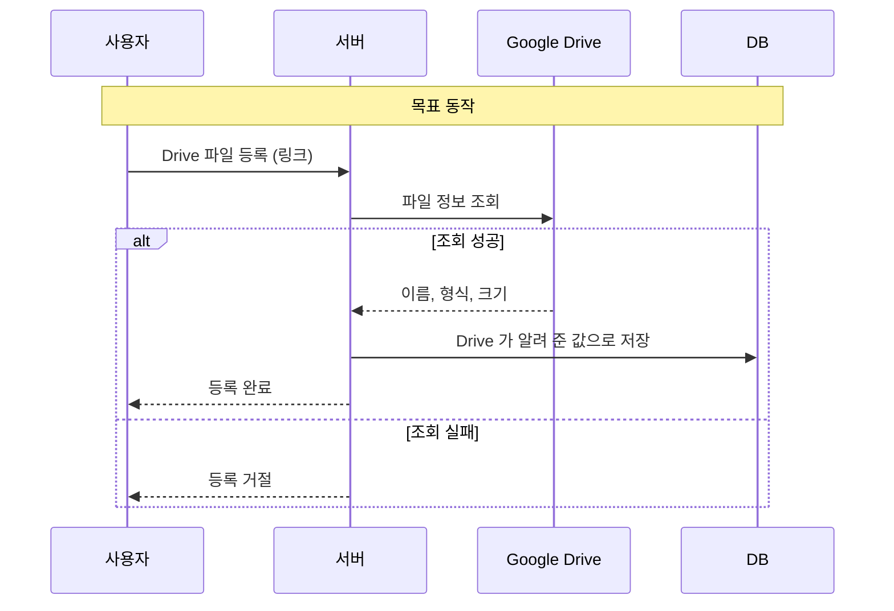

# [FIX] Drive 파일 등록 시 서버가 파일 정보를 직접 확인하도록 변경

- 이슈: #231 (https://github.com/Geumjeongyahak/Backend/issues/231)
- 작성일: 2026-09-28
- 상태: 설계 전. 아래 「미정」이 정해져야 구현 계획을 쓸 수 있다

## 버그 설명

**한 줄 요약**: Drive 파일을 등록할 때 파일 이름, 형식, 크기를 서버가 직접 확인하지 않고 요청 값을 그대로 저장합니다.

처음 설계에서는 백엔드에 Drive 클라이언트가 없어 이렇게 만들었습니다. 그 뒤에 서버 쪽 Drive 클라이언트가 추가되어, 지금은 서버에서 직접 확인할 수 있습니다.

## 재현 방법

1. Drive 파일 등록 API에 실제 파일과 다른 이름이나 형식을 넣어 요청한다.
2. 저장된 값을 확인한다.

## 예상 동작

- 파일 정보는 Drive가 알려 주는 값으로 저장된다.
- 서버가 확인할 수 없는 파일은 등록이 거절된다.
- 이미 등록된 파일의 정보는 다시 등록해도 요청 값으로 바뀌지 않는다.

## 실제 동작

- 파일 정보가 요청 값 그대로 저장된다.

## 스크린샷 / 로그

실행으로 재현하지 않았습니다. 코드 검토로 확인했습니다.

## 환경 정보

- OS: 무관
- Java 버전: 21
- Spring Boot 버전: 3.5.13
- 브라우저 (프론트 관련 시): 해당 없음

## 추가 정보

### Must

- [ ] 등록할 때 서버가 Drive에 파일을 조회하고, 조회할 수 없으면 등록을 거절한다
- [ ] 파일 이름, 형식, 크기를 Drive 조회 결과로 저장한다
- [ ] 이미 등록된 링크를 다시 등록해도 기존 정보가 요청 값으로 바뀌지 않는다

### Should

- [ ] 파일이 조직 공유 드라이브에 있는지 확인한다
- [ ] API 설명을 바뀐 동작에 맞게 고친다

### 테스트 계획 (TDD)

| 종류 | 검증할 것 |
|---|---|
| 단위 | 링크에서 파일 ID를 뽑는 로직 (정상 형식, 잘못된 형식) |
| 단위 | Drive 조회가 실패하면 등록이 거절된다 (Drive 클라이언트는 대역 사용) |
| 단위 | 저장되는 값이 요청 값이 아니라 Drive 조회 결과다 |
| 통합 | 이미 등록된 링크를 다시 등록해도 기존 행이 그대로다 |
| E2E | 확인할 수 없는 링크를 등록하면 400을 돌려준다 |
| E2E | 정상 등록 후 게시글 첨부까지의 기존 흐름이 통과한다 (회귀) |

### Out of scope

- 이미 등록된 Drive 파일의 재검증
- 프론트의 업로드 방식 변경
- 서버를 거치는 업로드 경로

### 미정

- 서버의 Drive 계정이 사용자가 직접 올린 파일을 조회할 수 있는지 확인이 필요하다. 조회할 수 없다면 조직 공유 드라이브에 올린 파일만 허용하는 방식으로 바꿔야 한다
- 요청에서 이름, 형식, 크기 항목을 없앨지 남기고 무시할지. 없애면 프론트와의 약속이 바뀐다
