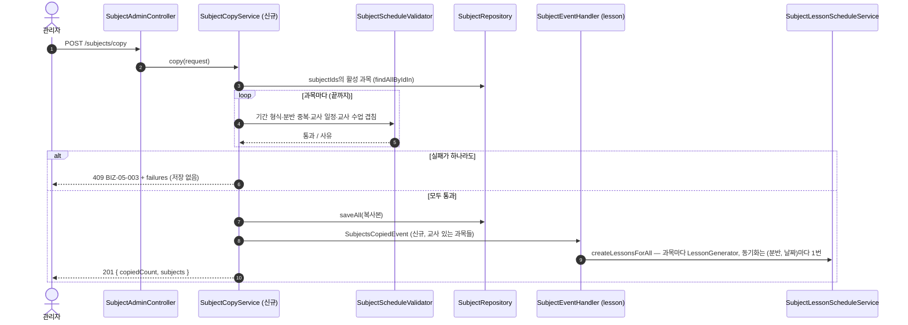

# 한 기간의 시간표(과목 전체)를 새 기간으로 한 번에 복사한다

이슈: #242 [FEAT] 시간표 기간 복사 API 추가
요청: Frontend #212 3번(«다음 달로 복사»)이 이 API를 쓴다. 실패한 과목(분반·요일·교시)과 이유를 응답에 담아 확인 창에 보여준다.

## 왜

과목은 기간을 갖고, 기간이 겹치지 않으면 같은 칸에 여러 개 둘 수 있다(`SubjectScheduleValidator.validateSubjectDuplicate`).
없는 것은 «새 기간으로 한꺼번에 만들기»다. 2026-09-30 관리자는 이게 없어 기존 과목의 기간을 고쳤고 9월 시간표가 사라졌다(#240·#241).
프론트에서 과목마다 `POST /subjects`를 부르면 100건 넘는 호출 중 하나만 실패해도 일부만 반영되므로, 서버가 한 트랜잭션으로 한다.

## API

```
POST /api/v1/subjects/copy                 권한: hasRole('ADMIN') or hasAuthority('subject:write:*')  (과목 생성과 같음)
{ "subjectIds": [57, 58, 59], "startAt": "2026-11-01", "endAt": "2026-11-30" }
```

- 원본: **프론트가 보낸 과목 id 목록** (사용자 결정 2026-10-01 — 처음 계획의 `sourceDate`는 그 날짜에 걸친 과목을 서버가 골라
  월 중간에 끝나거나 시작하는 과목이 섞일 수 있었다. id로 받으면 화면에 보이는 것만 복사하고, 칸 하나만 복사도 된다.
  교사 일괄 배정이 이미 `subjectIds`를 받는다)
- URL: 레포가 상태 행위를 동사 하위 경로로 쓴다(`/approve` · `/cancel` · `/accept` · `/check-out`). 새 과목을 만드니 `POST`
- 복사: 분반 · 요일 · 교시 · 과목명 · 시작/종료 시간 · 담당 교사 · 설명을 그대로, 기간만 새 값
- 담당 교사가 있으면 새 기간의 수업을 만든다(과목 생성과 같은 규칙: `max(오늘, startAt)`부터)

응답

| 결과 | 상태 | 본문 |
|---|---|---|
| 성공 | 201 | `{ copiedCount, subjects: SubjectDetailResponse[] }` |
| 과목 하나라도 실패 | 409 `BIZ-05-003` | ProblemDetail + `failures: [{ sourceSubjectId, classroomId, classroomName, dayOfWeek, period, subjectName, reason }]` — **아무것도 저장하지 않는다** |
| `subjectIds` 비어 있음 · 중복 · 200개 초과 | 400 (`@NotEmpty` · `@Size(max = 200)` + 서비스 중복 검사) | |
| 없거나 비활성인 과목 id | 400 `VAL-05-002` «복사할 수 없는 과목: [id…]» | |
| 기간 형식 (`startAt > endAt`, 365일 초과) | 400 | 과목 생성과 같은 검증 |
| 새 기간이 원본 과목 기간과 겹침 | 409 실패 목록 (사유 «원본과 기간이 겹침») | 옮기기·덮어쓰기를 하지 않는다 |

실패 사유는 모든 과목을 끝까지 검사해 모은다(첫 실패에서 멈추지 않는다) — 확인 창에 한 번에 보여주려고.

| 사유 | 판정 (기존 검증 재사용) |
|---|---|
| 같은 분반·요일에 새 기간과 날짜·시간이 겹치는 과목이 이미 있음 (중복 복사 포함) | `validateSubjectDuplicate` |
| 담당 교사가 새 기간에 다른 하루치 일정을 맡고 있음 (#199) | `validateTeacherScheduleAssignable`(새 기간 기준) |
| 담당 교사의 기존 수업과 시간이 겹침 | `LessonProxyService.existsTeacherConflictForSubjectSchedule` (반열린 구간, #240) |

검증 메서드는 예외를 던지는 모양이라, 복사에서는 과목마다 `try { 검증 } catch (BusinessException e) { 실패 목록에 사유 추가 }`로 모은다.
새 검증 규칙은 만들지 않는다 — 과목 생성과 판정이 갈리지 않게. 복사는 «과목 생성 + 교사 배정»이라, 교사가 있는 과목에는
교사 배정 규칙(#199 하루치 일정 하나, 교사 수업 겹침)도 건다. 과목 생성 API(`createSubject`)는 교사를 함께 지정해도 #199를
보지 않는데, 이것은 기존 동작의 빈틈이라 이번에 바꾸지 않는다(codex 2회차 지적 반려, PR `리뷰어에게`).

## 설계



- **`SubjectCopyService` (subject 도메인, 신규)**: 원본 조회 → 과목마다 검증·사유 수집 → 저장 → 이벤트. `SubjectService`(372줄)에 넣지 않는다
- **이벤트 하나로 묶는다 (`SubjectsCopiedEvent`, 신규)**: 과목마다 `SubjectCreatedEvent`를 내면 같은 (분반, 날짜)를 교시 수만큼 동기화한다
  (#240의 남은 상한). 복사본 목록을 한 이벤트로 넘기고 lesson 쪽에서 모두 만든 뒤 `DailyScheduleSyncPublisher.publishFor`로 한 번 발행한다.
  수신자는 기존과 같이 `BEFORE_COMMIT` — 수업 생성이 실패하면 과목 저장도 롤백된다
- 도메인 경계: subject → lesson은 이벤트, 교사 수업 겹침 조회는 `LessonProxyService`. 새 Repository 주입 없음
- 시각은 `Clock` 빈 (#241과 같음)
- 스키마 변경 없음 → Flyway 없음 (분배해 둔 V12는 쓰지 않는다)

## 실패 경로

| 상황 | 처리 |
|---|---|
| 과목 하나라도 검증 실패 | 409 + 실패 목록, 저장 없음 |
| 저장·수업 생성 중 예외 | 트랜잭션 전체 롤백, 전역 처리기 응답 |
| 같은 요청을 두 번 보냄 | 두 번째는 모든 칸이 «이미 과목이 있음»으로 409 (중복 검사가 막는다) |
| 두 관리자가 동시에 같은 복사 | 둘 다 검증을 통과하면 중복 과목이 생길 수 있다. 과목 생성 API도 지금 같은 한계다. 막지 않는다 — 월 1회 관리자 작업이고, 생기면 중복 검사가 다음 수정에서 잡는다. PR `리뷰어에게`에 적는다 |
| 원본에 교사 없는 과목 | 교사 없이 복사, 수업은 안 만든다 |

## 질의

| 누가 | 조건 | 행 | 빈도 |
|---|---|---|---|
| 원본 조회 | `id IN (subjectIds)` | 최대 200 (한 달치 ≈ 120) | 복사 1회 |
| 과목마다 분반 중복 검사 | 분반 + 요일 + 기간 겹침 | 칸당 수 건 | 과목 수만큼 (≈120). 관리자 월 1회 작업이라 묶지 않는다 |
| 과목마다 교사 일정·수업 겹침 | 교사 + 기간 / 교사 + 날짜 IN | 수 건 | 교사 있는 과목 수만큼 |
| 수업 생성·동기화 | 과목마다 수업 saveAll, (분반, 날짜)마다 동기화 1번 | 한 달 ≈ 450 수업 | 복사 1회 |

판정용 측정: E2E에서 30과목 복사 1회의 조회 문 수를 세어 `review.md`에 남기고, 동기화가 (분반, 날짜)마다 한 번인지 단언한다.

## 작업

1. 실패하는 E2E 먼저 — `e2e/subject/SubjectCopyTest` (날짜는 미래 기준, `2099` 학기)
   - 성공: 원본 3칸(교사 있음 2, 없음 1) → 201, 새 과목 3, 새 기간 수업 수 = 요일 수 × 교사 있는 과목, 원본 과목·수업 그대로
   - 실패 수집: 새 기간에 이미 과목이 있는 칸 1 + 교사 수업 겹침 1 → 409 `BIZ-05-003`, `failures` 2건(분반·요일·교시·사유), 저장 0건
   - 두 번 보내면 두 번째 409
   - `subjectIds` 비어 있음·중복·없는 id·비활성 id 400, `startAt > endAt` 400, 365일 초과 400
   - 일부만 복사: 3칸 중 1칸 id만 보내면 그 칸만 복사
   - 권한: `subject:write:*` 201, VOLUNTEER 403
   - 맞닿은 교시(#240)는 실패로 보지 않음
2. 단위: 실패 사유 수집(검증 예외 → 사유 한 줄), id 검증(중복·없음·비활성)
3. 구현: `SubjectCopyRequest`/`SubjectCopyResponse`/`SubjectCopyFailure` record, `SubjectCopyService`, `SubjectCopyConflictException`(failures를 ProblemDetail 속성으로 — 전역 처리기에 한 갈래), `SubjectsCopiedEvent` + 수신, `SubjectLessonScheduleService.createLessonsForAll`
4. 질의 수 측정 테스트 (위 «판정용 측정»)
5. 35 규칙 1차 검증 → 커버리지 · PostgreSQL 18 → codex

## 안 하는 것

- 미리보기(dry-run) API: 프론트는 원본 칸 수를 이미 가진 목록으로 셀 수 있다. 실패 사유는 409 응답이 준다
- 분반·요일 일부만 복사: 이슈 범위 밖
- 동시 복사 잠금: 위 실패 경로 참고
