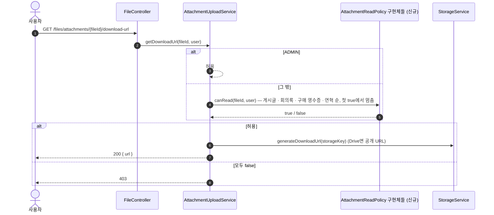
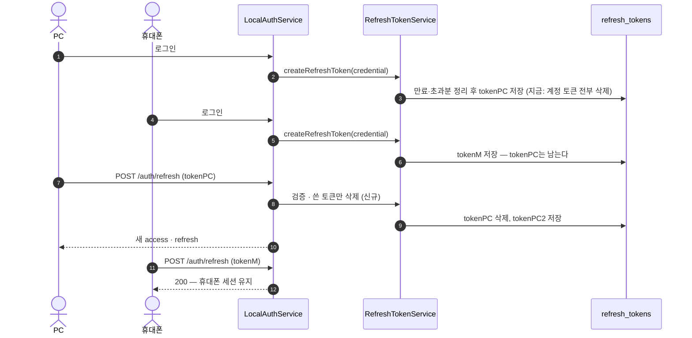

# 수업 목록 상태·첨부 다운로드 권한·연혁 사진 파일·기기별 세션·잘못된 정렬을 고친다

이슈: #244 [FIX] 수업·첨부·인증 API 오동작 수정
범위: 이슈의 1·3·4·5·6번. 2번(`assignTeacher`가 교사 그대로여도 검증)은 같은 메서드를 고치는 #241로 옮겼다(이슈 본문 «담당 조정»).

## 1. 수업 목록에 `status`가 없다

`LessonSummaryResponse`에 `LessonStatus status`를 더한다. `LessonDetailResponse`에는 이미 있다.
목록 질의는 바꾸지 않는다 — 취소 수업도 그대로 내려주고 프론트가 `status`로 거른다(관리자 화면은 취소 수업도 봐야 한다).

- 응답 필드 추가라 기존 클라이언트는 깨지지 않는다
- 테스트: `e2e/lesson` — 상태를 CANCELED로 바꾼 수업이 `GET /lessons`·`GET /lessons/me`에 `status: CANCELED`로 나온다

## 3. 첨부 다운로드 권한

지금 `AttachmentUploadService.canDownload`는 «ADMIN이거나, 게시된 글에 붙고 그 채널을 읽을 수 있음»만 허용한다. 그래서
회의록·구매 영수증 첨부와 임시저장 글 첨부는 올린 사람도 403이다. `files` 테이블에는 올린 사람 컬럼이 없어서,
**그 파일이 붙은 리소스를 읽을 수 있으면 받을 수 있다**로 판단한다.

| 파일이 붙는 곳 | 지금 그 리소스의 열람 규칙 | 첨부 다운로드 |
|---|---|---|
| `post_attachments`, `post_files` | 게시글: 게시됨 + 채널 `read` / 임시저장: 작성자(`PostAccessChecker`) | 같은 규칙 |
| `meeting_record_attachments` | `hasAnyRole('ADMIN','MANAGER','VOLUNTEER')` (`MeetingRecordController.STAFF_ONLY`) | 같은 규칙 |
| `purchase_request_proposal_receipts`, `purchase_request_payment_transactions.receipt_file_id`, `vendor_balance_histories.receipt_file_id` | 교사 이상 (`PurchaseRequestController.TEACHER_OR_HIGHER_ACCESS`, 상세 조회에 소유자 검사 없음) | 같은 규칙 |
| `site_history_photos` | 공개 사이트 연혁 | 누구나 |

이슈의 «행사 첨부»는 `events`에 파일 연관이 없다(스키마 확인). 행사 공지는 게시글 첨부로 덮인다.

### 설계 — 리소스 도메인이 자기 규칙을 내놓는다

file 도메인에 인터페이스 하나를 둔다.

```java
// domain/file/service/access/AttachmentReadPolicy.java
public interface AttachmentReadPolicy {
    /** 이 파일이 내 리소스에 붙어 있고, 그 리소스를 user가 읽을 수 있으면 true */
    boolean canRead(UUID fileId, CustomUserDetails user);
}
```

post · meeting_record · purchase_request · sitecontent가 각자 구현체(`@Component`)를 둔다. 자기 Repository로 «이 파일이 내 리소스에
붙어 있나»를 보고, 자기 열람 규칙을 적용한다. `AttachmentUploadService.canDownload`는 `ADMIN || policies.anyMatch(...)`만 한다.

- **도메인 경계가 지금보다 나아진다.** 지금은 file 서비스가 post의 `PostAttachmentRepository`를 직접 주입한다(경계 위반).
  바꾸면 file → 다른 도메인 의존이 없어지고, 각 도메인이 file의 인터페이스를 구현한다(이미 `File` 엔티티를 쓰는 방향과 같다)
- 새 첨부 위치가 생기면 그 도메인에 구현체 하나를 더한다. file 서비스는 안 바뀐다
- 역할 문자열은 각 컨트롤러의 상수와 같은 값을 쓴다. 구현체에 «이 규칙은 `XxxController`의 `@PreAuthorize`와 같아야 한다» 주석



질의: 구현체마다 `exists`/조회 1번, 최대 4번. 첫 true에서 멈춘다(`anyMatch`). 다운로드 URL 발급 1회당이라 부담 없음.

- 테스트(E2E, `e2e/file`): VOLUNTEER가 ① 회의록 첨부 200 ② 본인 임시저장 글 첨부 200 ③ 남의 임시저장 글 첨부 403 ④ 구매 영수증 200,
  GUEST가 ⑤ 회의록 첨부 403 ⑥ 구매 영수증 403, ⑦ 어디에도 안 붙은 파일은 ADMIN만 200, 기존 게시글 첨부 테스트 유지
- 단위: `AttachmentUploadService` — 정책 중 하나라도 true면 허용, 모두 false면 `AccessDeniedException`

## 4. 연혁 사진 파일이 정리되지 않는다

`SiteHistoryService.resolvePhotoFile`은 `fileId`가 없으면(새 사진) 파일을 연결하지 않는다. 그래서 수정·삭제 때
`markRemovedFilesDeleted`가 그 파일을 모른다. 프론트가 `fileId`를 안 보내는 것은 Frontend #213에서 고치지만,
**백엔드는 `fileId`가 없어도 `src`(업로드 응답의 공개 URL)로 파일을 찾아 연결한다.** 이미 올라간 연혁도 다음 수정 때 연결된다.

- `FileRepository.findFirstByPublicUrlAndIsDeletedFalse(String)` 추가 (지금은 Drive 전용 `findByPublicUrlAndIsGoogleDriveTrue`뿐)
- `fileId` → 기존 사진 id → `src`로 찾기 순서. 못 찾으면 지금처럼 파일 없이 둔다(외부 이미지 URL)
- 질의: 새 사진마다 `files.public_url` 조회 1번. 연혁 사진은 한 번에 수 장이다. `public_url` 인덱스는 없다 —
  `files`는 수천 행이고 관리자 연혁 저장 때만 돈다. 인덱스는 더하지 않는다
- 테스트(E2E, `e2e/sitecontent`): `fileId` 없이 업로드 URL만 보낸 사진을 지우면 그 파일이 soft delete된다

## 5. 다른 기기에서 로그인하면 세션이 끊긴다

`RefreshTokenService.createRefreshToken`이 새 토큰을 만들기 전에 `deleteByCredentialId`로 그 계정의 토큰을 전부 지운다.

- 로그인: 다른 토큰을 지우지 않는다. 대신 **계정당 살아 있는 토큰을 최근 5개까지만** 남긴다(만료된 것과 가장 오래된 것부터 지움)
  — 토큰이 끝없이 쌓이지 않게. `ponytail:` 상한 주석
- 재발급(`LocalAuthService.refreshToken`): **쓴 토큰만** 지우고 새 토큰을 준다(회전). 지금은 전부 지워서 회전이 «모든 기기 로그아웃»이었다
- 로그아웃(그 토큰만)·전체 로그아웃·사용자 비활성화(전부)는 지금 그대로
- 스키마 변경 없음 (`refresh_tokens`는 이미 계정당 여러 행이 가능한 구조)



실패 경로:

| 상황 | 처리 |
|---|---|
| 같은 refresh 토큰으로 두 요청이 동시에 재발급 | 둘 다 검증을 통과하면 둘 다 새 토큰을 받는다. 먼저 끝난 쪽이 옛 토큰을 지우고 나중 쪽의 삭제는 없는 행이라 아무 일도 없다. 막지 않는다 — 프론트가 재발급을 한 번만 보내고(Frontend #213), 결과도 «토큰 하나 더»라 해가 없다 |
| 지워진 토큰으로 재발급 | 지금처럼 401 `AUTH004` |
| 6번째 기기 로그인 | 가장 오래된 기기의 토큰이 지워져 그 기기는 다음 재발급 때 다시 로그인 |

- 테스트(E2E, `e2e/auth`): ① 같은 계정으로 두 번 로그인하면 두 refresh 토큰이 모두 재발급된다 ② 재발급에 쓴 토큰은 다시 못 쓴다(401)
  ③ 다른 기기 토큰은 남는다 ④ 6번 로그인하면 첫 토큰만 무효 ⑤ 전체 로그아웃 뒤 모두 무효
- Google 로그인(`GoogleAuthService.issueToken`)도 같은 `createRefreshToken`을 거치므로 함께 고쳐진다

## 6. `sort=field`면 500

`BasePaginationRequest.toSortOrders`가 `parts[1]`을 무조건 읽는다. 방향이 빠지면 `ArrayIndexOutOfBoundsException` → 500,
방향이 `ASC`/`DESC`가 아니면 조용히 무시한다.

- 방향이 없으면 `ASC`로 본다(Spring 기본 `sort` 관례와 같다). 방향이 틀리면 400 `BadRequestException`
- 없는 필드(`sort=foo,asc`)는 질의 때 `PropertyReferenceException` → 지금 500. 전역 처리기에서 400으로 바꾼다
- 호출자: `BasePaginationRequest`를 상속하는 요청 11개 중 `toSortOrders`를 쓰는 셋(`ChannelListRequest`, `ClassroomPaginationRequest`,
  `PurchaseRequestListRequest`). 공통 메서드 한 곳만 고친다
- 테스트: 단위 — `sort=createdAt` → ASC 한 개, `sort=createdAt,up` → 400, 빈 값 → 빈 목록. E2E — `GET /classrooms?sort=createdAt` 200, `sort=nope,asc` 400

## 공통

- 스키마·Flyway 없음. 권한(`@PreAuthorize`) 변경 없음 — 다운로드 엔드포인트는 지금처럼 인증만 요구하고, 판단은 서비스가 한다
- 커밋: 항목마다 test → fix 순서 (`test(lesson)`·`fix(lesson)`, `fix(file)`, `fix(sitecontent)`, `fix(auth)`, `fix(global)`)
- 검증: 바뀐 클래스 JaCoCo 줄·분기 표를 `review.md`에, 바뀐 E2E를 임시 PostgreSQL 18에서 한 번 더
- 마지막에 codex 리뷰(여러 도메인에 걸침)

## 안 하는 것

- 2번 → #241
- 비밀번호 변경 시 다른 기기 토큰 무효화: 지금도 안 한다. 필요하면 별 이슈
- 만료 토큰 일괄 정리 스케줄러(`deleteExpiredRefreshTokens`는 호출자가 없다): 로그인 때 계정별로 정리하므로 이번에는 안 둔다
