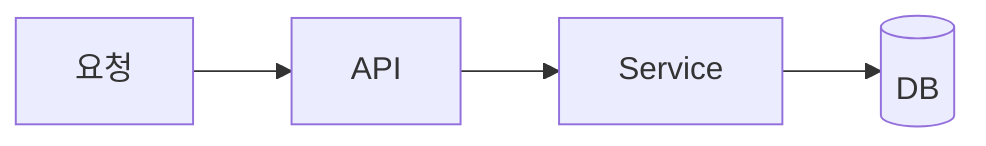

# Harness Startup Words

이 문서는 금정야학 백엔드에서 기능 요청을 하네스 흐름에 태우기 위한 시동어 규칙이다. 목표는 사용자가 짧게 `/plan` 또는 `implement(/goal)`을 말해도 agent가 기존 issue/PR 양식, 코드 컨벤션, 검증/PR handoff를 자동으로 따라가게 하는 것이다.

## 시동어 요약

| 시동어 | 목적 | 산출물 | 금지 |
| --- | --- | --- | --- |
| `/plan <요청>` | 기능 요청을 GitHub issue 수준으로 구체화 | issue draft, scope, acceptance, verification | 코드 수정, branch 생성, commit |
| `/plan --issue <번호>` | 기존 issue를 구현 가능한 task packet으로 분해 | branch명 제안, task packet, PR draft skeleton | 코드 수정, commit |
| `implement /goal <요청>` | 이미 충분히 구체화된 요청을 하네스에 맞게 구현 | issue 확인/생성, branch, 구현, 검증, commit/PR handoff | 양식 없는 임의 PR, 검증 없는 완료 주장 |
| `implement --issue <번호>` | 기존 issue를 기준으로 구현 시작 | `prepare-feature-task.sh`, `run-task.sh`, tests, PR body | issue 요구사항 무시, 자동 merge/deploy |
| `/goal <한 문장 목표>` | 구현 agent에게 넘길 목표 문장 | Goal 섹션/branch slug seed | 단독 실행 없음. `/plan` 또는 `implement`와 함께 사용 |

## `/plan` 규칙

사용자가 `/plan`으로 시작하면 implementation을 시작하지 않고 요구사항을 issue/PR-ready spec으로 만든다.

### 입력 예시

```text
/plan 교학 회의록 첨부파일 업로드 기능
```

```text
/plan --issue 161
```

### 수행 절차

1. 기존 `.github/ISSUE_TEMPLATE`, 최근 issue, 최근 PR을 확인한다.
2. 유사 도메인 코드와 문서를 search/read로 확인한다.
3. 기본 issue 구조인 기능 설명, 배경, 상세 요구사항, 참고 자료, 추가 정보를 채운다.
4. 구현 범위를 `Must / Should / Out of scope`로 나눈다.
5. API/domain/data 흐름이 복잡하면 보조 Mermaid 초안을 작성한다.
6. 사용자가 승인하면 GitHub issue 생성 또는 기존 issue 보강으로 넘어간다.

### `/plan` 출력 템플릿

```markdown
# Plan: <기능명>

## Issue draft

## 기능 설명

## 배경

## 상세 요구사항
- [ ] ...

## 참고 자료
- API 명세:
- 기존 코드:
- 관련 PR/Issue:

## 추가 정보

## Implementation slices
1. Domain/API contract
2. Persistence/schema
3. Service/controller behavior
4. Tests/docs

## Optional Mermaid draft



## Verification gates
- `git diff --check`
- focused Gradle tests
- `scripts/harness/verify.sh`
```

## `implement /goal` 규칙

사용자가 `implement`, `implement /goal`, 또는 `implement --issue`로 시작하면 하네스 구현 모드로 들어간다.

### 입력 예시

```text
implement /goal 교학 회의록 첨부파일 업로드 기능을 구현하고 PR까지 준비해줘
```

```text
implement --issue 161
```

### 수행 절차

1. `gh auth status`, `git status --short --branch`, remote/base branch를 확인한다.
2. issue가 없으면 `/plan` 산출물을 바탕으로 issue draft를 만들고 사용자 승인 후 `gh issue create`를 실행한다.
3. issue가 있으면 다음을 실행한다.

```bash
scripts/harness/prepare-feature-task.sh --issue <번호>
scripts/harness/run-task.sh --dry-run harness/tasks/issue-<번호>-feature-task.md
```

4. 구현 전 유사 코드/문서/테스트를 읽는다.
5. `feature/<issue-number>-<short-topic>` branch에서 최소 변경을 구현한다.
6. focused test → `scripts/harness/verify.sh` 순서로 검증한다.
7. 작은 논리 단위로 stage/commit한다.
8. PR body에는 최근 PR 양식에 맞춰 `개요`, `변경 유형`, `변경 내용`, `관련 이슈`, `스크린샷 (선택)`, `체크리스트`, `리뷰어에게`, `검증`을 채운다.
9. `gh pr create` 결과 URL을 확인하고 보고한다.

## Agent routing policy

- Hermes: `/plan` 구체화, GitHub issue/PR lifecycle, 최종 검증, 사용자 보고.
- Codex: repo-local implementation/review turn. `run-task.sh`가 만든 prompt와 task packet을 따른다.
- Reviewer: Mermaid가 실제 변경과 맞는지, 검증 command가 실제 출력 기반인지 확인한다.

## PR Mermaid 작성 기준

- API 동작 추가/변경: `sequenceDiagram` 우선.
- DB relation 추가/변경: `erDiagram` 추가.
- 상태 전이/권한 흐름: `stateDiagram-v2` 또는 `flowchart` 사용.
- diagram node에는 placeholder(`TODO`, `DomainService`, `NEW_ENTITY`)를 남기지 않는다.
- diagram은 PR 설명용이며 코드와 다른 speculative component를 넣지 않는다.

## Completion contract

하네스 구현 모드의 완료 보고는 다음 증거를 포함해야 한다.

- issue 번호와 URL
- branch 이름
- commit SHA 또는 commit이 blocked된 이유
- PR URL 또는 PR 생성이 blocked된 이유
- 실행한 검증 명령과 exit code
- 남은 blocker/risk
